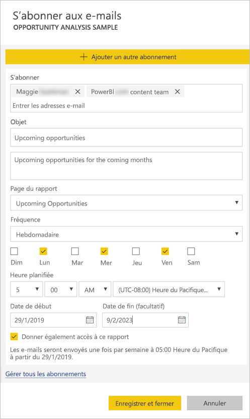
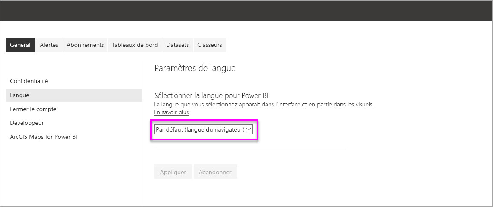
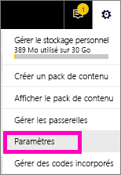
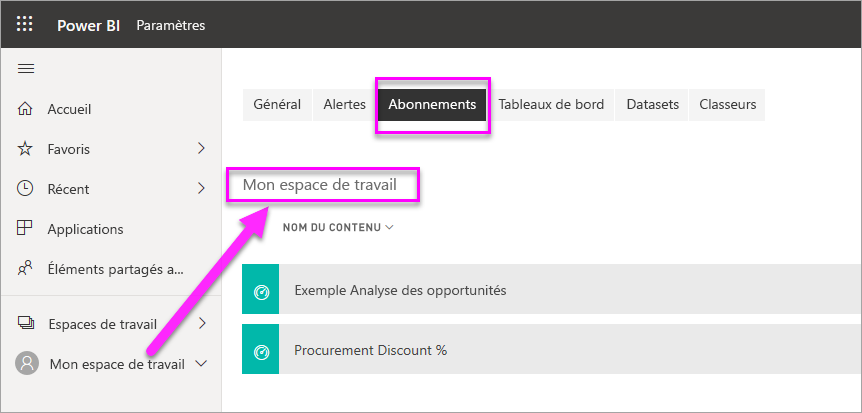

# Vous abonner vous et d’autres utilisateurs à des rapports et tableaux de bord dans le service Power BI

Vous pouvez vous abonner vous et vos collègues aux pages de rapport, tableaux de bord et rapports paginés qui vous intéressent le plus. Power BI envoie un instantané dans votre boîte de réception. Vous indiquez à Power BI la fréquence à laquelle vous voulez recevoir les e-mails : une fois par jour, une fois par semaine ou après l’actualisation des données initiales.  Si vous choisissez quotidien ou hebdomadaire, vous pouvez choisir l’heure d’exécution de l’abonnement.  Vous pouvez définir jusqu’à 24 abonnements différents en tout par jour, pour chaque page de rapport et tableau de bord.

 

Vous pouvez uniquement créer des abonnements dans le service Power BI. Vous recevez un e-mail avec un instantané de la page de rapport ou du tableau de bord ainsi qu’un lien pour ouvrir le rapport ou le tableau de bord. Sur les appareils mobiles où des applications Power BI sont installées, la sélection de ce lien lance l’application Power BI au lieu d’ouvrir le rapport ou le tableau de bord sur le site web Power BI.

## Configuration requise

- La **création** d’un abonnement est une fonctionnalité Power BI Pro.
- Vous n’avez pas besoin de modifier les autorisations sur le contenu (tableau de bord ou rapport) pour créer un abonnement pour vous-même, mais vous devez avoir les autorisations de modification pour en créer un pour quelqu’un d’autre. 

## S’abonner à un tableau de bord, une page de rapport ou un rapport paginé

Que vous vous abonniez à un tableau de bord, un rapport ou un rapport paginé, le processus est le même. Le même bouton vous permet de vous abonner aux rapports et aux tableaux de bord du service Power BI.

L’abonnement aux rapports paginés est un peu différent. Consultez [Vous abonner vous et d’autres utilisateurs à un rapport paginé dans le service Power BI](paginated-reports-subscriptions.md) pour plus d’informations.
 
.

1. Ouvrez le tableau de bord ou le rapport.
2. Dans la barre de menus supérieure, sélectionnez **S’abonner** ou l’icône en forme d’enveloppe .
   
   

3. Utilisez le curseur jaune pour activer ou désactiver l’abonnement.  La définition du curseur sur **Désactivé** ne supprime pas l’abonnement. Pour supprimer l’abonnement, sélectionnez l’icône Corbeille.

4. Votre adresse e-mail se trouve déjà dans la zone **S’abonner**. Vous pouvez ajouter d’autres adresses e-mail à l’abonnement, mais uniquement dans le même domaine. Si le rapport ou le tableau de bord est hébergé dans une [capacité Premium](service-premium-what-is.md), vous pouvez abonner d’autres adresses e-mail individuelles et alias de groupe. Si le rapport ou le tableau de bord n’est pas hébergé dans une capacité Premium, vous pouvez abonner d’autres utilisateurs, mais ils doivent eux aussi avoir une licence Power BI Pro. Consultez [Considérations et résolution des problèmes](#considerations-and-troubleshooting) ci-dessous pour plus d’informations. 

5. Renseignez les détails de l’e-mail : **Objet** et **Message**. 

5. Sélectionnez une **Fréquence** pour votre abonnement : **Quotidien**, **Hebdomadaire** ou **Après l’actualisation des données (quotidien)** .  Pour recevoir l’e-mail d’abonnement certains jours uniquement, sélectionnez **Hebdomadaire** et choisissez les jours auxquels vous voulez le recevoir.  Par exemple, si vous voulez recevoir l’e-mail d’abonnement seulement les jours ouvrés, sélectionnez **Hebdomadaire** et décochez les cases **Sam** et **Dim**.  

6. Si vous choisissez **Quotidien** ou **Hebdomadaire**, vous pouvez également choisir une **Heure planifiée** pour l’abonnement.  Vous pouvez choisir une exécution à une heure pile ou 15, 30 ou 45 minutes après.  Sélectionnez le matin (AM) ou l’après-midi/le soir (PM). Vous pouvez également spécifier le fuseau horaire.

7. Par défaut, la date de début de votre abonnement est la date de sa création. Vous pouvez sélectionner une date de fin. Si vous ne définissez pas de date de fin, la date de fin est automatiquement un an après la date de début. Vous pouvez la remplacer par n’importe quelle date dans le futur (jusqu’à l’année 9999) à tout moment avant la fin de l’abonnement. Quand un abonnement atteint une date de fin, il s’arrête jusqu’à ce que vous le réactiviez. Vous recevez des notifications avant la date de fin planifiée pour savoir si vous voulez la prolonger.    

    Dans la capture d’écran ci-dessous, vous voyez que quand vous vous abonnez à un rapport, vous vous abonnez en fait à une *page* de rapport.  Pour vous abonner à plusieurs pages d’un rapport, sélectionnez **Ajouter un autre abonnement** et sélectionnez une autre page. 
      
     

7. Sélectionnez **Enregistrer et fermer**. Les abonnés reçoivent un e-mail et un instantané du tableau de bord ou de la page de rapport à la fréquence et à l’heure que vous avez sélectionnées. Vous pouvez créer jusqu’à 24 abonnements en tout par rapport ou tableau de bord, et vous pouvez fournir des destinataires, des heures et des fréquences différents pour chaque abonnement.  Tous les abonnements définis sur **Après l’actualisation des données** pour votre tableau de bord ou rapport envoient un e-mail seulement après la première actualisation planifiée.   
      
   > [!TIP]
   > Vous souhaitez envoyer l’e-mail d’un abonnement dès maintenant, ou ultérieurement à la demande ? Sélectionnez **Exécuter maintenant** pour les abonnements pour le tableau de bord ou le rapport que vous souhaitez envoyer. Vous voyez une notification indiquant qu’un e-mail est envoyé à tous les utilisateurs de cet abonnement.  Vous pouvez effectuer cette opération aussi souvent que vous le souhaitez. En effet, elle n’est pas comptabilisée dans la limite des 24 exécutions d’abonnement planifiées par jour et par rapport ou tableau de bord. Cette opération ne déclenche PAS l’actualisation des données dans le jeu de données sous-jacent. 
   > 
   > 
   
## Langue des e-mails

L’e-mail et l’instantané utilisent la langue définie dans les paramètres de Power BI (voir [Langues et pays/régions pris en charge par Power BI](supported-languages-countries-regions.md)). Si aucune langue n’est définie, Power BI sélectionnera celle des paramètres régionaux du navigateur. Pour voir ou définir vos préférences de langue, sélectionnez l’icône de roue dentée  > **Paramètres > Général > Langue**. 

## Gérer vos abonnements
Seule la personne qui a créé l’abonnement peut le gérer.  L’écran de gestion des abonnements est accessible de 2 façons.  La première méthode consiste à sélectionner **Gérer tous les abonnements** dans la boîte de dialogue **S’abonner aux e-mails** (voir les captures d’écran ci-dessous et l’étape 4 ci-dessus). La deuxième consiste à sélectionner l’icône de roue dentée Power BI  dans la barre de menus supérieure et à choisir **Paramètres**.

Les abonnements particuliers affichés dépendent de l’espace de travail actuellement actif.  Pour afficher tous les abonnements à la fois pour tous les espaces de travail, vérifiez que **Mon espace de travail** est actif. Pour comprendre le fonctionnement des espaces de travail, consultez [Espaces de travail dans Power BI](service-create-workspaces.md).

Un abonnement se termine si la licence Pro expire, si le propriétaire supprime le tableau de bord ou le rapport, ou si le compte d’utilisateur utilisé pour créer l’abonnement est supprimé.

## Considérations et résolution des problèmes

* Les tableaux de bord comportant plus de 25 vignettes épinglées, ou 4 pages de rapport dynamique épinglées, risquent de ne pas s’afficher entièrement dans les e-mails d’abonnement envoyés aux utilisateurs.  Les abonnements aux tableaux de bord avec un nombre de vignettes supérieur ne sont pas bloqués. Toutefois, ils ne seront pas pris en charge si vous rencontrez des problèmes. Vous devez donc réduire leur nombre de vignettes dans la limite de prise en charge.
* Cette heure correspond au moment où la tâche d’abonnement commence. Dans certains scénarios, la remise de l’e-mail dans votre boîte de réception peut prendre plusieurs minutes.
* Dans de rares occasions, la remise des abonnements par e-mail à leurs destinataires peut prendre plus de quinze minutes. Si cela se produit, nous vous recommandons d’exécuter l’actualisation de vos données et votre abonnement par e-mail à des moments différents pour garantir une remise en temps voulu. Si le problème persiste, contactez le support Power BI.
* Pour les abonnements par e-mail aux tableaux de bord, si la sécurité au niveau des lignes (SNL) est appliquée à des vignettes, elles ne s’affichent pas.  
* Pour les abonnements par e-mail aux rapports, si le jeu de données utilise SNL, vous pouvez créer un abonnement pour vous-même. Vous ne pouvez pas abonner d’autres utilisateurs à un rapport auquel la sécurité au niveau des lignes (SNL) est appliquée.
* Les abonnements aux pages de rapports sont liés au nom de la page de rapport. Si vous vous abonnez à une page de rapport et que vous la renommez, vous devez recréer votre abonnement.
* Votre organisation peut configurer certains paramètres dans Azure Active Directory, pour limiter la possibilité d’utiliser des abonnements par messagerie électronique dans Power BI.  Vous pouvez limiter, entre autres, l’authentification multifacteur ou les restrictions de plage IP pour l’accès aux ressources.
* Actuellement, les abonnements aux e-mails des rapports/tableaux de bord utilisant des jeux de données à connexion active ne sont pas pris en charge quand vous abonnez des utilisateurs autres que vous-même.
* Les abonnements aux e-mails ne prennent pas en charge la plupart des [visuels personnalisés](power-bi-custom-visuals.md).  La seule exception est celle des éléments visuels personnalisés qui ont été [certifiés](power-bi-custom-visuals-certified.md).  
* Actuellement, les abonnements aux e-mails ne prennent pas en charge les visuels personnalisés alimentés par R.  
* Les abonnements aux e-mails sont envoyés avec l’état par défaut des filtres et des segments du rapport. Si vous changez les valeurs par défaut après l’abonnement, les changements ne s’affichent pas dans l’e-mail.    
* Pour les abonnements aux tableaux de bord en particulier, certains types de vignettes ne sont pas encore pris en charge,  notamment les vignettes de streaming, vidéo, de contenu web personnalisé.     
* Si vous partagez un tableau de bord avec un collègue extérieur à votre locataire, vous ne pouvez pas créer d’abonnement pour lui. Par conséquent, si vous êtes aaron@xyz.com, vous pouvez partager avec anyone@ABC.com, mais vous ne pouvez pas encore abonner anyone@ABC.com et il ne peut pas s’abonner au contenu partagé.      
* Power BI suspend automatiquement l’actualisation des jeux de données associés à des tableaux de bord et rapports qui n’ont pas été consultés depuis plus de 2 mois.  Toutefois, si vous ajoutez un abonnement à un rapport ou tableau de bord, il n’est pas suspendu même si le rapport ou tableau de bord n’est pas consulté.    
* Si vous ne recevez pas les e-mails d’abonnement, vérifiez que votre nom d’utilisateur principal (UPN) est en mesure d’en recevoir. [L’équipe Power BI travaille sur l’assouplissement de cette exigence](https://community.powerbi.com/t5/Issues/No-Mail-from-Cloud-Service/idc-p/205918#M10163). Tenez-vous informé. 
* Si votre tableau de bord ou rapport est dans une capacité Premium, vous pouvez utiliser des alias de messagerie de groupe pour les abonnements, au lieu d’abonner vos collègues à une seule adresse e-mail à la fois. Les alias sont basés sur l’annuaire Active Directory actuel. 

## Étapes suivantes

- [Vous abonner vous et d’autres utilisateurs à un rapport paginé dans le service Power BI](paginated-reports-subscriptions.md)
- D’autres questions ? [Essayez d’interroger la communauté Power BI](http://community.powerbi.com/)    
- [Lire le billet de blog](https://powerbi.microsoft.com/blog/introducing-dashboard-email-subscriptions-a-360-degree-view-of-your-business-in-your-inbox-every-day/)
