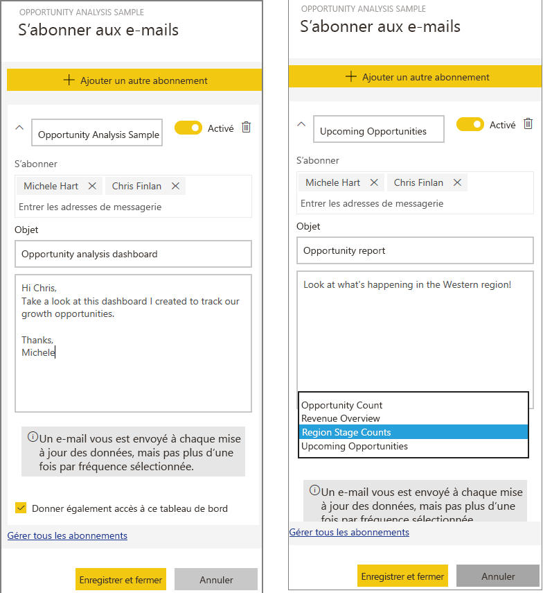
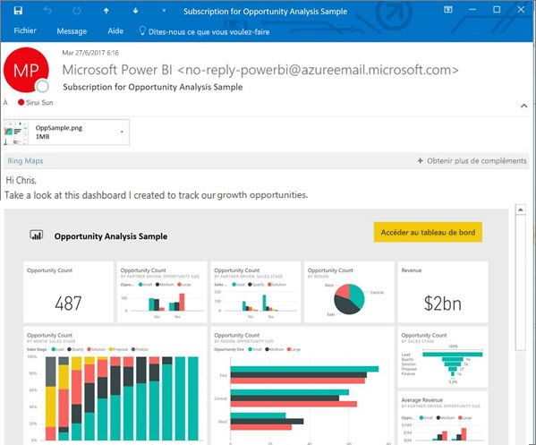
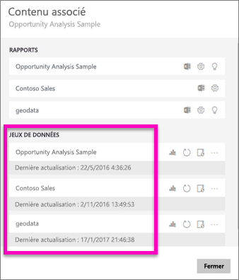

# S’abonner à un rapport ou un tableau de bord du service Power BI (app.powerbi.com)
Vous pouvez à présent connaître encore plus facilement l’état de vos rapports et tableaux de bord les plus importants. Abonnez-vous et abonnez vos collègues aux pages de rapport et tableaux de bord qui vous intéressent le plus pour que Power BI envoie un instantané dans votre boîte de réception. Indiquez à Power BI la fréquence à laquelle vous souhaitez recevoir des e-mails : de une fois par jour à une fois par semaine. 

L’e-mail et l’instantané utiliseront la langue définie dans les paramètres de Power BI (cf. [Langues et pays/régions pris en charge par Power BI](supported-languages-countries-regions.md)). Si aucune langue n’est définie, Power BI sélectionnera celle des paramètres régionaux du navigateur. Pour voir ou définir vos préférences de langue, sélectionnez l’icône de roue dentée  > **Paramètres > Général > Langue**. 

Les abonnements peuvent être créés uniquement dans le service Power BI. L’e-mail que vous recevez inclut un lien « accéder au rapport ou tableau de bord ». Sur les appareils mobiles sur lesquels les applications Power BI sont installées, la sélection de ce lien lance l’application (par opposition à l’action par défaut qui ouvre le rapport ou le tableau de bord sur le site web Power BI).

## Configuration requise
- La **création** d’un abonnement est une fonctionnalité Power BI Pro et vous devez avoir des autorisations de modification de contenu (tableau de bord ou rapport) pour créer cet abonnement. 
- Comme les e-mails d’inscription sont envoyés uniquement quand un jeu de données est mis à jour ou actualisé, les abonnements ne fonctionnent pas sur les jeux de données qui ne se mettent pas à jour ni ne s’actualisent.

## S’abonner à un tableau de bord ou une page de rapport
Que vous vous abonniez à un tableau de bord ou un rapport, le processus est très similaire. Le même bouton permet de vous abonner (vous et d’autres) aux rapports et tableaux de bord du service Power BI.
 
.

1. Ouvrez le tableau de bord ou le rapport.
2. Dans la barre de menus supérieure, sélectionnez **S’abonner** ou l’icône en forme d’enveloppe .
   
   

3. Utilisez le curseur jaune pour activer ou désactiver l’abonnement.  Lorsque vous définissez le curseur sur la position Désactivé, cela ne supprime pas l’abonnement. Pour supprimer l’abonnement, sélectionnez l’icône Corbeille.

4. Renseignez les détails de l’e-mail. Votre e-mail est prérempli, mais vous pouvez en ajouter d’autres à l’abonnement. Vous pouvez ajouter uniquement des adresses e-mail du même domaine (consultez **Considérations et résolution de problèmes** ci-dessous pour plus d’informations). Si le rapport ou le tableau de bord est hébergé dans une [capacité Premium](service-premium.md), vous pouvez abonner d’autres utilisateurs en utilisant des adresses e-mail individuelles et des alias de groupe. Si le rapport ou le tableau de bord n’est pas hébergé dans une capacité Premium, vous pouvez toujours abonner d’autres utilisateurs en utilisant leurs adresses e-mail individuelles, mais ils doivent eux aussi avoir une licence Power BI Pro.

    Les captures d’écran ci-dessous montrent que, quand vous vous abonnez à un rapport, vous vous abonnez en fait à une *page* de rapport.  Pour vous abonner à plusieurs pages d’un rapport, sélectionnez **Ajouter un autre abonnement** et sélectionnez une autre page. 
      
   

5. Sélectionnez **Enregistrer et fermer** pour enregistrer l’abonnement. Les abonnés reçoivent un e-mail avec un instantané du tableau de bord ou de la page de rapport chaque fois que les jeux de données sous-jacents changent. Si le tableau de bord ou le rapport s’actualise plusieurs fois par jour, l’e-mail est envoyé uniquement après la première actualisation.  
   
   
   
   > [!TIP]
   > Vous voulez voir l’e-mail tout de suite ? Déclenchez l’envoi d’un e-mail en actualisant l’un des jeux de données associés au tableau de bord ou le jeu de données associé au rapport. (si vous n’êtes pas autorisé à modifier le jeu de données, vous devez demander à une personne disposant des autorisations nécessaires d’effectuer cette tâche pour vous). Pour identifier les jeux de données utilisés, sélectionnez l’icône **Voir les éléments associés**  afin d’ouvrir le **Contenu associé**, puis sélectionnez l’icône d’actualisation. 
   > 
   > 
   
   

## Détermination de la planification de l’envoi des e-mails
Le tableau suivant décrit la fréquence à laquelle vous recevez un e-mail. Tout dépend de la méthode de connexion du jeu de données sur lequel le rapport ou tableau de bord est basé (DirectQuery, connexion active, importation dans Power BI ou fichier Excel dans OneDrive ou SharePoint Online) et des options d’abonnement disponibles et activées (quotidien, hebdomadaire ou aucun).

|  | **DirectQuery** | **Connexion active** | **Actualisation planifiée (importation)** | **Fichier Excel dans OneDrive/SharePoint Online** |
| --- | --- | --- | --- | --- |
| **À quelle fréquence le rapport/tableau de bord est-il actualisé ?** |Toutes les 15 minutes |Toutes les 15 minutes, Power BI vérifie si le jeu de données a changé : si c’est le cas, le rapport est actualisé. |L’utilisateur sélectionne Aucun, Quotidien ou Hebdomadaire. L’option Quotidien peut correspondre à une fréquence de 8 fois par jour. L’option Hebdomadaire correspond en fait à une planification hebdomadaire que l’utilisateur crée et pour laquelle il définit l’actualisation (de une fois par semaine à tous les jours). |Une fois par heure |
| **Quel degré de contrôle a l’utilisateur sur la planification des e-mails d’abonnement ?** |Les options sont les suivantes : quotidienne ou hebdomadaire |Aucune option : l’utilisateur reçoit un e-mail si le rapport est actualisé, mais pas plus d’une fois par jour. |Si la planification de l’actualisation est quotidienne, les options sont Quotidienne ou Hebdomadaire.  Si la planification de l’actualisation est hebdomadaire, la seule option est Hebdomadaire. |Aucune option : l’utilisateur reçoit un e-mail dès que le jeu de données est mis à jour, mais pas plus d’une fois par jour. |

## Gérer vos abonnements
Seule la personne qui a créé l’abonnement peut le gérer.  L’écran de gestion des abonnements est accessible de 2 façons.  La première méthode consiste à sélectionner **Gérer tous les abonnements** dans la boîte de dialogue **S’abonner aux e-mails** (voir les captures d’écran ci-dessous et l’étape 4 ci-dessus). La deuxième consiste à sélectionner l’icône de roue dentée Power BI  dans la barre de menus supérieure et à choisir **Paramètres**.

Les abonnements particuliers affichés dépendent de l’espace de travail actuellement actif.  Pour afficher tous les abonnements à la fois pour tous les espaces de travail, vérifiez que **Mon espace de travail** est actif. Pour comprendre le fonctionnement des espaces de travail, consultez [Espaces de travail dans Power BI](service-create-distribute-apps.md).

Un abonnement se termine si la licence Pro expire, si le tableau de bord ou le rapport est supprimé par le propriétaire ou si le compte d’utilisateur qui a servi à créer l’abonnement est supprimé.

## Considérations et résolution des problèmes
* Les abonnements aux pages de rapports sont liés au nom de la page de rapport. Si vous vous abonnez à une page de rapport et que vous la renommez, vous devez recréer votre abonnement.
* Pour les abonnements aux e-mails sur les jeux de données de la connexion active, vous recevez uniquement des e-mails lorsque les données changent. Par conséquent, si une actualisation se produit, mais que les données ne sont pas modifiées, Power BI ne vous envoie pas d’e-mail.
* Les abonnements aux courriers ne prennent pas en charge la plupart des [visuels personnalisés](power-bi-custom-visuals.md).  La seule exception est celle des éléments visuels personnalisés qui ont été [certifiés](power-bi-custom-visuals-certified.md).  
* Si toutes les vignettes ont la sécurité au niveau des lignes (SNL) appliquée, elles ne s’affichent pas.
* Les abonnements aux e-mails sont envoyés avec l’état par défaut des filtres et des segments du rapport. Le changement des valeurs par défaut avant l’abonnement ne sont pas montrés dans l’e-mail.    
* Les abonnements par courrier ne sont pas encore pris en charge sur les pages de rapport créées par la fonctionnalité de connexion active au service de Power BI Desktop.    
* Pour les abonnements aux tableaux de bord en particulier, certains types de vignettes ne sont pas encore pris en charge,  notamment les vignettes de streaming, vidéo, de contenu web personnalisé.     
* Si vous partagez un tableau de bord avec un collègue extérieur à votre locataire, vous ne pouvez pas créer d’abonnement pour ce collègue. Par conséquent, si vous êtes aaron@xyz.com, vous pouvez partager avec anyone@ABC.com, mais vous ne pouvez pas encore vous abonner à anyone@ABC.com et il ne peut pas s’abonner au contenu partagé.      
* S’il s’agit d’abonnements à des tableaux de bord ou rapports incluant de très grandes images, l’abonnement peut échouer en raison de la limite de taille de la messagerie.    
* Power BI interrompt automatiquement l’actualisation des jeux de données associés aux tableaux de bord et rapports qui n’ont pas été consultés depuis plus de 2 mois.  Toutefois, si vous ajoutez un abonnement à un rapport ou un tableau de bord, il n’est pas interrompu même si le rapport ou tableau de bord n’est pas consulté.    
* Si vous ne recevez pas les courriers d’abonnement, vérifiez que votre nom d’utilisateur principal (UPN) est en mesure d’en recevoir. [L’équipe Power BI travaille sur l’assouplissement de cette exigence](https://community.powerbi.com/t5/Issues/No-Mail-from-Cloud-Service/idc-p/205918#M10163). Tenez-vous informé. 
* Si votre tableau de bord ou rapport est dans une capacité Premium, vous pouvez utiliser des alias de messagerie de groupe pour les abonnements, au lieu d’abonner vos collègues à une seule adresse e-mail à la fois. Les alias sont basés sur l’annuaire Active Directory actuel. 

## Étapes suivantes
* D’autres questions ? [Essayez d’interroger la communauté Power BI](http://community.powerbi.com/)    
* [Lire le billet de blog](https://powerbi.microsoft.com/blog/introducing-dashboard-email-subscriptions-a-360-degree-view-of-your-business-in-your-inbox-every-day/)

