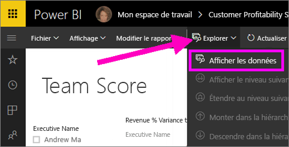
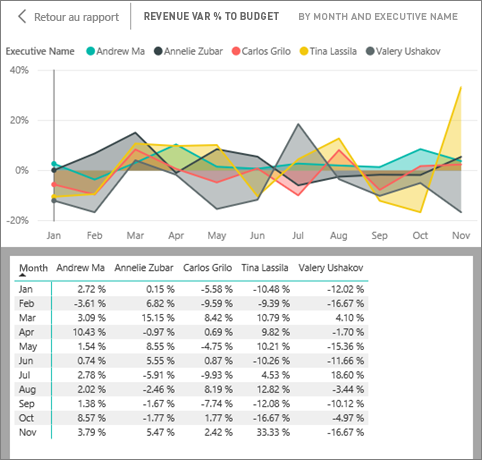
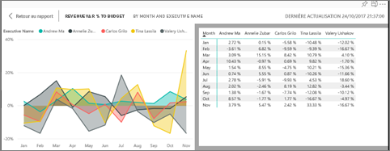
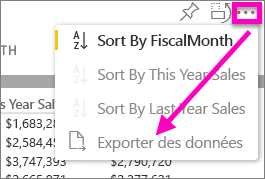

# Afficher les données utilisées pour créer la visualisation
## Afficher les données
Une visualisation Power BI est construite à l’aide des données de vos jeux de données. Si vous voulez voir les calculs sous-jacents, Power BI vous permet d’*afficher* les données utilisées pour créer le visuel. Lorsque vous sélectionnez **Afficher les données**, Power BI affiche les données sous (ou à côté de) la visualisation.

Vous pouvez également exporter les données utilisées pour créer la visualisation au format .xlsx ou .csv et les afficher dans Excel. Pour plus d’informations, consultez [Exporter des données à partir des visualisations Power BI](power-bi-visualization-export-data.md).

> [!NOTE]
> Les options *Afficher les données* et *Exporter les données* sont disponibles dans le service Power BI et dans Power BI Desktop. Toutefois, Power BI Desktop offre un niveau de détails supplémentaire. [*Afficher les enregistrements* affiche les lignes réelles du jeu de données](desktop-see-data-see-records.md).
> 
> 

## Utiliser *Afficher les données* dans le service Power BI
1. Dans le service Power BI, ouvrez un rapport en [mode Lecture ou en mode Édition](service-reading-view-and-editing-view.md) et sélectionnez un visuel.  Dans Power BI Desktop, ouvrez la vue Rapport.
2. Pour afficher les données sous-jacentes de l’élément visuel, sélectionnez **Explorer** > **Afficher les données**.
   
   
3. Par défaut, les données s’affichent sous l’élément visuel.
   
   
4. Pour modifier l’orientation, sélectionnez la disposition verticale  dans l’angle supérieur droit de la visualisation.
   
   
5. Pour exporter les données vers un fichier .csv, sélectionnez les points de suspension, puis choisissez **Exporter des données**.
   
    
   
    Pour plus d’informations sur l’exportation des données vers Excel, voir [Exporter les données de visualisations Power BI](power-bi-visualization-export-data.md).
6. Pour masquer les données, désélectionnez **Explorer** > **Afficher les données**.

### Étapes suivantes
[Exporter des données à partir des visualisations Power BI](power-bi-visualization-export-data.md)    
[Visualisations dans des rapports Power BI](visuals/power-bi-report-visualizations.md)    
[Rapports Power BI](service-reports.md)    
[Power BI – Concepts de base](service-basic-concepts.md)    
D’autres questions ? [Posez vos questions à la communauté Power BI](http://community.powerbi.com/)

