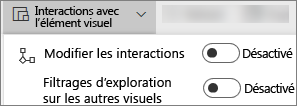
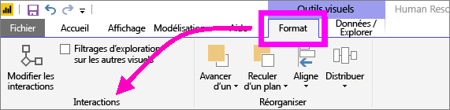
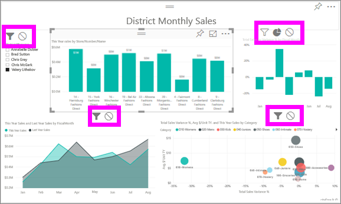

# Interactions avec les visualisations dans un rapport Power BI
Si vous avez des autorisations de modification sur un rapport, vous pouvez utiliser des **interactions entre visuels** pour changer l’impact entre les visualisations d’une page de rapport. 

Par défaut, vous pouvez utiliser les visualisations d’une page de rapport pour appliquer un filtrage croisé et une sélection croisée sur les autres visualisations de la page.
Par exemple, si vous sélectionnez un état sur une visualisation de carte, l’histogramme est sélectionné et le graphique en courbes est filtré pour afficher uniquement les données qui s’appliquent à cet état.
Consultez [À propos du filtrage et de la sélection](power-bi-reports-filters-and-highlighting.md). Et si vous avez une visualisation qui prend en charge l’[exploration](power-bi-visualization-drill-down.md), par défaut, l’exploration d’une visualisation n’a aucun impact sur les autres visualisations de la page de rapport. Vous pouvez toutefois remplacer ces deux comportements par défaut et définir des interactions pour chaque visualisation.

Cet article vous explique comment utiliser des **interactions entre visuels** dans le service Power BI, le [mode Edition](service-interact-with-a-report-in-editing-view.md) et Power BI Desktop. Si un rapport a été partagé avec vous, vous ne pouvez pas changer les paramètres d’interaction entre visuels.

> [!NOTE]
> Les termes *filtrage croisé* et *sélection croisée* permettent de distinguer le comportement décrit ici de celui qui résulte de l’utilisation du volet **Filtres** pour filtrer et sélectionner des visualisations.  
> 
> 

<iframe width="560" height="315" src="https://www.youtube.com/embed/N_xYsCbyHPw?list=PL1N57mwBHtN0JFoKSR0n-tBkUJHeMP2cP" frameborder="0" allowfullscreen></iframe>

1. Sélectionnez une visualisation pour l’activer.  
2. Afficher les options **Interactions entre les visuels**.
    - Dans le service Power BI, sélectionnez le menu déroulant dans la barre de menus du rapport.

       

    - Dans Desktop, sélectionnez **Format > Interactions**.

        

3. Pour activer les commandes d’interaction entre visualisations, sélectionnez **Modifier les interactions**. Power BI ajoute les icônes de filtrage croisé et de sélection croisée à toutes les autres visualisations de la page de rapport.
   
    
3. Déterminez l’impact de la visualisation sélectionnée sur les autres visualisations.  Répétez éventuellement cette opération pour toutes les autres visualisations de la page de rapport.
   
   * Si le filtrage croisé doit être appliqué à la visualisation, sélectionnez l’icône **filtre**.
   * Si la sélection croisée doit être appliquée à la visualisation, sélectionnez l’icône **sélection**.
   * Si elle n’a aucun impact, sélectionnez l’icône **aucun impact** .

4. Pour activer les commandes d’exploration, sélectionnez **Filtrages d’exploration sur les autres visuels**.  Maintenant, quand vous explorez une visualisation, les autres visualisations de la page de rapport changent pour refléter votre sélection d’exploration actuelle. 

   

### Étapes suivantes
[Utilisation des filtres de rapport](power-bi-how-to-report-filter.md)

[Filtres et sélection dans les rapports](power-bi-reports-filters-and-highlighting.md)

[Power BI – Concepts de base](service-basic-concepts.md)

D’autres questions ? [Posez vos questions à la communauté Power BI](http://community.powerbi.com/)

