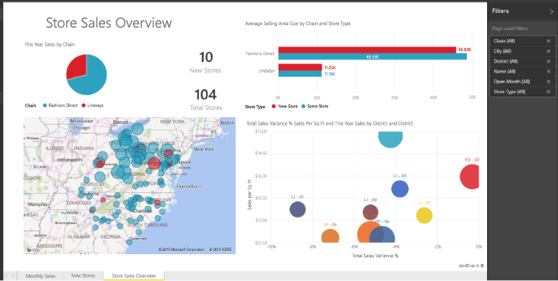

# Rapports dans Power BI
## Qu’est-ce qu’un rapport Power BI ?
Un ***rapport*** Power BI est un affichage sous plusieurs angles d’un jeu de données, comportant des visualisations de différentes observations et informations.  Un rapport peut comprendre une seule visualisation ou des pages remplies de visualisations. Selon votre fonction principale, vous pouvez être quelqu’un qui *crée* des rapports et/ou qui *consomme* ou utilise des rapports.

Ce rapport comporte 3 pages (ou onglets). Nous affichons actuellement la page Store Sales Overview (Vue d’ensemble des ventes du magasin). Cette page comprend 6 visualisations et un titre. Les visualisations peuvent être *épinglées* à des tableaux de bord et, quand une visualisation épinglée est sélectionnée, elle ouvre le rapport à partir duquel elle a été épinglée.

Si vous êtes novice dans Power BI, vous pouvez obtenir de bonnes bases en lisant [Power BI – Concepts de base](service-basic-concepts.md).

Les rapports sont une caractéristique du service Power BI et de Power BI Desktop. L’expérience d’utilisation des rapports est presque identique. Pour les applications mobiles, vous ne pouvez pas créer de rapports mais vous pouvez [afficher, partager et annoter des rapports](mobile-reports-in-the-mobile-apps.md).

## Avantages des rapports
Les rapports sont basés sur un seul jeu de données. Les visualisations dans un rapport représentent chacune une pépite d’informations. Par ailleurs, les visualisations ne sont pas statiques. Vous pouvez ajouter et supprimer des données, modifier les types de visualisations et appliquer des filtres et segments à mesure que vous explorez les données pour découvrir des informations et trouver des réponses. Plus encore qu’un tableau de bord, un rapport est hautement interactif et personnalisable, et les visualisations s’actualisent à mesure que les données sous-jacentes changent.

## Tableaux de bord et rapports
Les [tableaux de bord](service-dashboards.md) sont souvent confondus avec les rapports, car il s’agit également de canevas remplis de visualisations. Mais il existe quelques différences majeures.  

| **Fonctionnalité** | **Tableaux de bord** | **Rapports** |
| --- | --- | --- |
| Pages |Une seule page |Une ou plusieurs pages |
| Sources de données |Un ou plusieurs rapports et un ou plusieurs jeux de données par tableau de bord |Un seul jeu de données par rapport |
| Disponible dans Power BI Desktop |Non |Oui, possibilité de créer et afficher des rapports dans Desktop |
| Épinglage |Possibilité d’épingler des visualisations existantes (vignettes) uniquement à partir du tableau de bord actuel à vos autres tableaux de bord. |Possibilité d’épingler des visualisations (sous forme de vignettes) à l’un de vos tableaux de bord. Possibilité d’épingler des pages entières de rapport à l’un de vos tableaux de bord. |
| S’abonner |Impossible de s’abonner à un tableau de bord |Possibilité de s’abonner à des pages de rapport |
| Filtrage |Impossible de filtrer ou découper |Différentes manières de filtrer, mettre en surbrillance et découper |
| Définir des alertes |Possibilité de créer des alertes pour vous envoyer un e-mail lorsque certaines conditions sont remplies |Non |
| Fonctionnalité |Possibilité de définir un tableau de bord comme votre tableau de bord « par défaut » |Impossible de créer un rapport par défaut |
| Requêtes en langage naturel |Disponible à partir du tableau de bord |Non disponible à partir de rapports |
| Possibilité de modifier le type de visualisation |Non. En fait, si le propriétaire d’un rapport change le type de visualisation dans le rapport, la visualisation épinglée sur le tableau de bord ne se met pas à jour |Oui |
| Possibilité d’afficher les tables et les champs sous-jacents d’un jeu de données |Non. Possibilité d’exporter les données, mais pas de voir les tables et les champs dans le tableau de bord. |Oui. Possibilité de voir les tables d’un jeu de données ainsi que les champs et les valeurs. |
| Possibilité de créer des visualisations |Limité à l’ajout de widgets au tableau de bord avec « Ajouter une vignette » |Possibilité de créer de nombreux d’éléments visuels de type différent, d’ajouter des éléments visuels personnalisés, de modifier des éléments visuels et bien plus encore avec les autorisations de modification |
| Personnalisation |Possibilité d’effectuer des opérations avec les visualisations (vignettes) : déplacement et réorganisation, redimensionnement, ajout de liens, attribution d’un nouveau nom, suppression, affichage plein écran, etc. Mais les données et les visualisations proprement dites sont en lecture seule. |En mode Lecture, vous pouvez publier, incorporer, filtrer, exporter, télécharger en tant que .pbix, afficher le contenu associé, générer des codes de QR, analyser dans Excel et bien plus encore.  En mode Édition, vous pouvez effectuer tout ce qui a été indiqué jusqu’ici et bien plus encore. |

## ***Créateurs*** de rapports et ***consommateurs*** de rapports
Selon votre rôle, vous pouvez une personne qui crée des rapports à votre usage personnel ou pour les partager avec des collègues. Vous souhaitez apprendre à créer et à partager des rapports. Ou bien, vous pouvez être une personne recevant des rapports d’autres personnes. Vous souhaitez apprendre à comprendre les rapports et à interagir avec ceux-ci.

Voici quelques rubriques, par rôle, qui vous aideront à démarrer.

### Si vous devez créer et partager des rapports
* Commencez par une [présentation du service Power BI](service-basic-concepts.md) afin de savoir où trouver les rapports et les outils de rapport.
* Suivez la présentation de l’[éditeur de rapport](service-the-report-editor-take-a-tour.md).
* Découvrez comment [créer un rapport à partir d’un jeu de données](service-report-create-new.md).
* [Découvrez comment utiliser une visualisation, une page et des filtres de niveau rapport](power-bi-how-to-report-filter.md).
* Découvrez les différentes manières de [partager un rapport avec des collègues](service-share-dashboards.md).

### Si vous devez recevoir et utiliser des rapports
* Commencez par une [présentation du service Power BI](service-basic-concepts.md) afin de savoir où trouver les rapports et les outils de rapport.
* Découvrez comment [ouvrir un rapport](service-report-open.md) et toutes les interactions disponibles en [Mode Lecture](service-reading-view-and-editing-view.md).
* Familiarisez-vous avec les rapports en suivant la présentation de l’un de nos [exemples](sample-tutorial-connect-to-the-samples.md).  
* Vous n’avez plus besoin d’un rapport ? Vous pouvez le [supprimer](service-delete.md).
* Pour afficher le jeu de données que le rapport utilise et les tableaux de bord ayant des vignettes épinglées à partir du rapport, [affichez le contenu associé](service-related-content.md).

> [!TIP]
> Si vous n’avez pas trouvé ici ce que vous cherchiez, utilisez la Table des matières à gauche pour parcourir toutes les rubriques relatives aux *rapports*.
> 
> 

## Étapes suivantes
[Prise en main de Power BI](service-get-started.md) 

[Power BI – Concepts de base](service-basic-concepts.md)

D’autres questions ? [Posez vos questions à la communauté Power BI](http://community.powerbi.com/)

