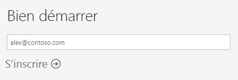
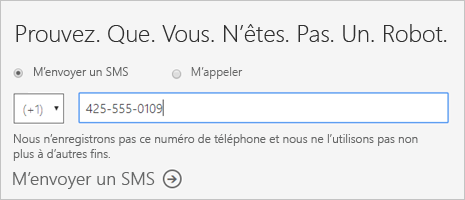
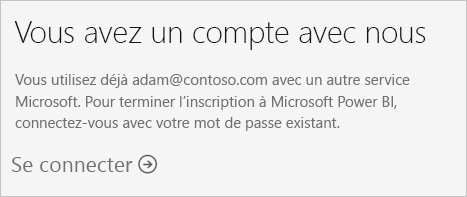
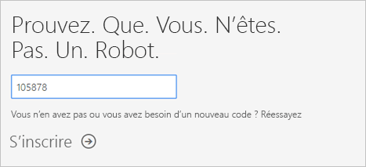
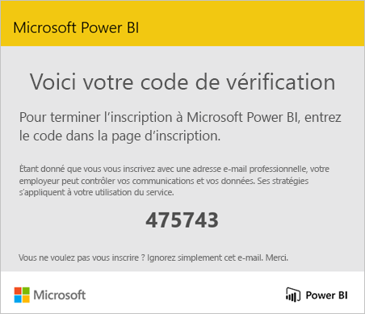
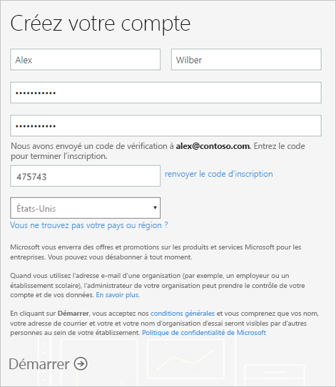
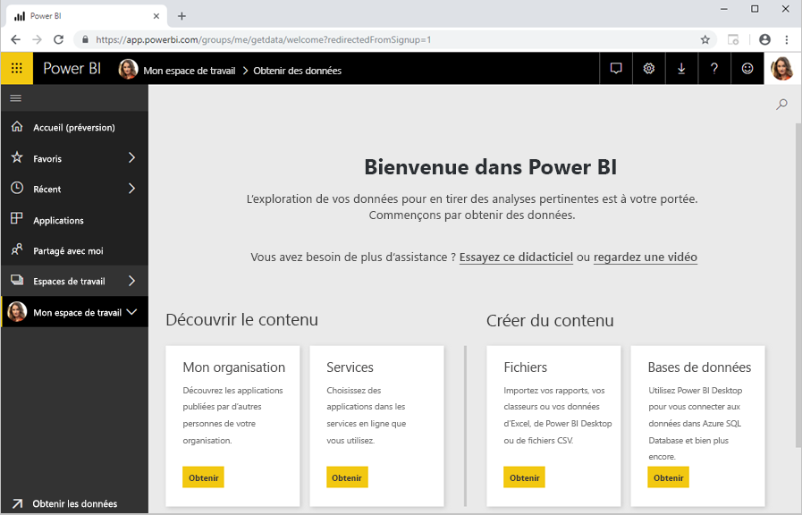

# Inscription individuelle à Power BI

Power BI peut servir aussi bien d’outil de rapport et de visualisation personnel que de moteur d’analytique et de décision pour des projets de groupe, des divisions ou des grandes entreprises. Cet article explique comment s’inscrire à un essai Power BI en tant qu’individu. Si vous êtes administrateur Power BI, consultez [Gestion des licences Power BI dans votre organisation](service-admin-licensing-organization.md).

## Adresses e-mail prises en charge

Avant de commencer le processus d’inscription, il est important de comprendre les types d’adresses e-mail que vous pouvez utiliser dans Power BI :

* L’inscription à Power BI nécessite l’utilisation d’une adresse e-mail professionnelle ou scolaire. Vous ne pouvez pas vous inscrire avec des adresses e-mail fournies par des services de messagerie de consommateur ou par des fournisseurs de télécommunication. Cela inclut outlook.com, hotmail.com, gmail.com et autres.

* Une fois que vous êtes connecté, vous pouvez [inviter des utilisateurs invités](https://docs.microsoft.com/azure/active-directory/active-directory-b2b-what-is-azure-ad-b2b) à voir votre contenu Power BI avec n’importe quelle adresse e-mail, notamment des comptes personnels.

* Vous pouvez vous inscrire à Power BI avec des adresses .gov ou .mil, mais celles-ci nécessitent un processus différent. Pour plus d’informations, consultez [Inscrire votre organisation US Government au service Power BI](service-govus-signup.md).

## S’inscrire à un essai

Effectuez les étapes suivantes pour vous inscrire à un essai Power BI Pro. Consultez la section suivante, [Expiration de l’essai](#trial-expiration), pour comprendre les options qui vous sont offertes quand cet essai arrive à expiration.

1. Accédez à la [page d’inscription](https://app.powerbi.com/signupredirect?pbi_source=web) dans Power BI.

1. Entrez votre adresse e-mail, puis sélectionnez **S’inscrire**.

    

1. Si vous obtenez un message similaire au suivant, choisissez une option pour recevoir un code de vérification, puis passez à l’étape suivante de cette procédure.

    

    Si vous obtenez un message similaire au suivant, effectuez les étapes pour vous connecter et utiliser Power BI.

    

1. Entrez le code que vous avez reçu, puis sélectionnez **S’inscrire**.

    

1. Vérifiez dans votre messagerie la présence d’un message semblable au suivant.

    

1. Sur l’écran suivant, entrez vos informations et le code de vérification de l’e-mail. Sélectionnez une région, passez en revue les termes et conditions dont les liens figurent sur cet écran, puis sélectionnez **Démarrer**.

    

1. Vous êtes alors redirigé vers https://app.powerbi.com, et vous pouvez commencer à utiliser Power BI.

    

## Expiration de l’essai

Quand votre essai de Power BI Pro arrive à expiration, votre licence est remplacée par une licence Power BI (gratuit). Dans ce cas, vous n’avez plus accès aux fonctionnalités associées à la licence Power BI Pro. Pour plus d’informations, consultez [Fonctionnalités par type de licence](service-features-license-type.md).

Si une licence Power BI (gratuit) est suffisante, aucune action n’est nécessaire. Si vous souhaitez tirer parti des fonctionnalités de Power BI Pro, demandez à votre administrateur informatique d’acheter cette licence.

## Résolution des problèmes liés au processus d’inscription

Dans la plupart des cas, vous pouvez vous inscrire à Power BI en suivant le processus que nous venons de décrire. Cela dit, il peut arriver que des problèmes vous empêchent de vous inscrire. Ces problèmes et les solutions de contournement sont abordés dans le tableau suivant.

|                                                                                                                                                                                                                          **Symptôme/Message d’erreur**                                                                                                                                                                                                                           |                                                                                                                                                                                                                                                                                                                                                **Cause et solution de contournement**                                                                                                                                                                                                                                                                                                                                                |
|--------------------------------------------------------------------------------------------------------------------------------------------------------------------------------------------------------------------------------------------------------------------------------------------------------------------------------------------------------------------------------------------------------------------------------------------------------------------------------|------------------------------------------------------------------------------------------------------------------------------------------------------------------------------------------------------------------------------------------------------------------------------------------------------------------------------------------------------------------------------------------------------------------------------------------------------------------------------------------------------------------------------------------------------------------------------------------------------------------------------------------------------------------------------------------------------------------------|
| <strong>Adresses de messagerie (par exemple, nancy@gmail.com)</strong> Vous recevez un message comme celui-ci pendant l’inscription :    *Vous avez entré une adresse de messagerie personnelle : veuillez entrer une adresse professionnelle afin que nous puissions stocker les données de votre entreprise en toute sécurité.*    ou    *Il semble que vous utilisez une adresse de messagerie personnelle. Entrez votre adresse professionnelle pour que nous puissions vous connecter aux autres utilisateurs de votre organisation. Ne vous inquiétez pas. Nous ne communiquerons pas votre adresse de messagerie.* |                          Power BI ne prend pas en charge les adresses de messagerie fournies par des services de messagerie de consommateur ou par des fournisseurs de télécommunications.    Pour procéder à l’inscription, réessayez en utilisant une adresse de messagerie qui vous a été attribuée par votre organisation ou votre établissement.    Si vous ne pouvez toujours pas vous inscrire et que vous souhaitez effectuer un processus d’installation plus avancé, vous pouvez [vous inscrire à une version d’évaluation d’Office 365 et utiliser cette adresse de messagerie pour vous inscrire](service-admin-signing-up-for-power-bi-with-a-new-office-365-trial.md).    Un utilisateur existant peut également [vous inviter en tant qu’invité](service-admin-azure-ad-b2b.md).                           |
|            **Inscription libre-service désactivée** Vous recevez un message comme celui-ci pendant l’inscription :    *Nous ne pouvons pas poursuivre le processus d’inscription. Votre service informatique a désactivé l’inscription à Microsoft Power BI. Contactez-le pour terminer l’inscription.*    ou    *Il semble que vous utilisez une adresse de messagerie personnelle. Entrez votre adresse professionnelle pour que nous puissions vous connecter aux autres utilisateurs de votre organisation. Ne vous inquiétez pas. Nous ne communiquerons pas votre adresse de messagerie.*             |                             L’administrateur informatique de votre organisation a désactivé l’inscription à Power BI.    Pour terminer l’inscription, demandez à votre administrateur informatique de [suivre les instructions pour activer l’inscription](service-admin-licensing-organization.md#enable-or-disable-individual-user-sign-up-in-azure-active-directory).    Vous pouvez également rencontrer ce problème si vous vous êtes [inscrit à Office 365 par l’intermédiaire d’un partenaire](service-admin-syndication-partner.md). |
|                                                                                          **L’adresse de messagerie n’est pas un ID Office 365** Vous recevez un message comme celui-ci pendant l’inscription :    *Nous ne vous avons pas trouvé sur contoso.com.  Utilisez-vous un ID différent au sein de votre organisation ou de votre établissement ?    Essayez de vous connecter avec cette adresse et, si elle ne fonctionne pas, contactez votre service informatique.*                                                                                           | Votre organisation utilise des ID pour la connexion à Office 365 et à d’autres services Microsoft et ces ID ne correspondent pas à votre adresse de messagerie.  Par exemple, votre adresse de messagerie peut être Nancy.Smith@contoso.com, mais votre ID est nancys@contoso.com.    Pour terminer l’inscription, utilisez l’ID que votre organisation vous a attribué pour vous connecter à Office 365 ou aux autres services Microsoft.  Si vous ne le connaissez pas, contactez votre administrateur informatique.    Si vous ne pouvez toujours pas vous inscrire et que vous souhaitez effectuer un processus d’installation plus avancé, vous pouvez [vous inscrire à une version d’évaluation d’Office 365 et utiliser cette adresse de messagerie pour vous inscrire](service-admin-signing-up-for-power-bi-with-a-new-office-365-trial.md). |
|  |  |

## Étapes suivantes

[Achat de Power BI Pro](service-admin-purchasing-power-bi-pro.md)  
[Contrat du service Power BI pour les utilisateurs individuels](https://powerbi.microsoft.com/terms-of-service/)  

D’autres questions ? [Essayez d’interroger la communauté Power BI](http://community.powerbi.com/)