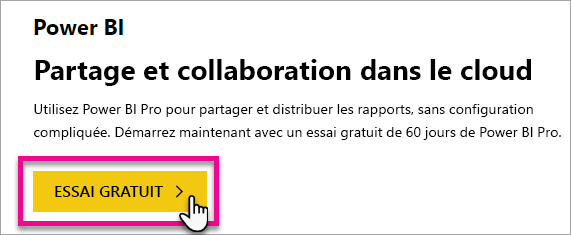
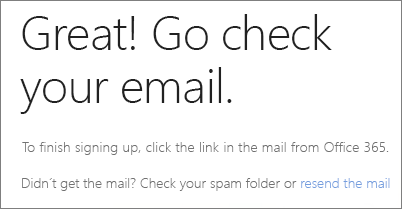
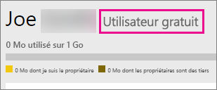
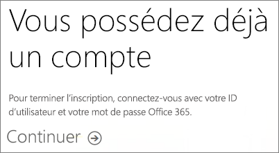
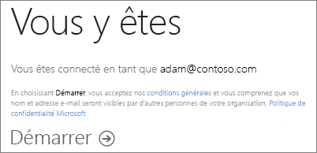

# Inscription individuelle à Power BI
Découvrez comment vous inscrire à Power BI et commencer à l’utiliser pour vos rapports et vos visualisations.

Power BI peut servir aussi bien d’outil de rapport et de visualisation personnel que de moteur d’analytique et de décision pour des projets de groupe, des divisions ou des grandes entreprises.

Cet article vous guidera tout au long des possibilités qui vous sont offertes pour vous inscrire et commencer à utiliser le service Power BI. Pour plus d’informations sur les différences entre les versions gratuite et Pro de Power BI, consultez la page sur les [versions gratuite et Pro de Power BI](service-free-vs-pro.md).

## Vous avez plusieurs possibilités
En tant que personne, vous avez plusieurs possibilités pour vous inscrire et commencer à utiliser Power BI. Vous pouvez choisir de vous inscrire gratuitement ou vous pouvez acheter un abonnement Power BI Pro. Si vous vous inscrivez pour obtenir un compte gratuit, une fois que vous êtes inscrit au service, vous pouvez choisir une version d’essai gratuite de 60 jours de Power BI Pro.

Si vous faites partie d’une organisation qui utilise Office 365, vous pouvez toujours vous inscrire pour obtenir un compte gratuit. Votre administrateur IT dispose également de plusieurs options pour acheter Power BI Pro et attribuer des licences. Pour plus d’informations sur les possibilités offertes aux administrateurs, consultez [Achat de Power BI Pro](service-admin-purchasing-power-bi-pro.md).

> [!NOTE]
> Si vous faites partie d’une organisation, il se peut que l’inscription individuelle soit désactivée. Consultez [L’inscription individuelle est désactivée](#individual-sign-up-has-been-turned-off) pour plus d’informations en cas de message d’erreur indiquant que cette option est désactivée.
>

## Inscriptions

Pour vous inscrire à Power BI, vous devez avoir une adresse e-mail professionnelle. Une adresse e-mail personnelle ne fonctionne pas quand vous tentez de vous inscrire à Power BI.

### Quelle adresse e-mail peut être utilisée avec Power BI ?
L’inscription à Power BI nécessite l’utilisation d’une adresse e-mail professionnelle ou scolaire. Vous ne pouvez pas vous inscrire à Power BI avec des adresses e-mail fournies par des services de messagerie de consommateur ou par des fournisseurs de télécommunication. Cela inclut outlook.com, hotmail.com, gmail.com et autres.

Si vous tentez de vous inscrire avec une adresse de messagerie personnelle, vous obtiendrez un message vous invitant à utiliser une adresse professionnelle ou scolaire.

> [!NOTE]
> Vous pouvez vous abonner à Power BI avec des adresses .gov ou .mil. Pour plus d’informations, consultez [Inscrire votre organisation US Government au service Power BI](https://docs.microsoft.com/en-us/power-bi/service-govus-signup).
>

> [!NOTE]
> Une fois que vous vous êtes connecté, vous pouvez [inviter des utilisateurs invités](https://docs.microsoft.com/en-us/azure/active-directory/active-directory-b2b-what-is-azure-ad-b2b) à voir le contenu de votre locataire Power BI avec n’importe quelle adresse e-mail, y compris des comptes personnels.
>

## Choix de la version
Vous pouvez déterminer celle dont vous avez besoin en examinant les points spécifiques à chaque type de licence. Les utilisateurs gratuits disposent de la plupart des fonctionnalités des services, à l’exception des fonctionnalités de partage et de collaboration. Les utilisateurs Power BI Pro peuvent profiter de toutes les fonctionnalités du service, mais cette licence n’est pas gratuite. Si vous n’avez pas besoin de partager du contenu, la version gratuite peut être le meilleur choix pour vous. Vous pouvez en savoir plus sur la [page de tarification de Power BI](https://powerbi.microsoft.com//pricing/).

Le reste de cet article examinera comment s’inscrire à chaque option.

## Inscription individuelle à Power BI (gratuit)
La méthode la plus rapide pour vous inscrire à Power BI consiste à créer un compte Power BI (gratuit). La création de ce compte n’entraîne aucuns frais et vous permet d’utiliser de nombreuses fonctionnalités associées à ce service.

> [!NOTE]
> Si vous recevez un message indiquant que nous vous connaissons déjà, essayez d’accéder à la page https://app.powerbi.com et de vous connecter.
> 
> 

Pour vous inscrire à Power BI, vous pouvez procédez comme suit.

1. Rendez-vous sur [powerbi.com](https://powerbi.microsoft.com).
2. Sélectionnez **Commencer gratuitement** ou **Inscrivez-vous gratuitement**.
   
    
3. Dans la page de démarrage, **Essai gratuit >** sous Power BI.
   
    
4. Entrez l’adresse de messagerie, puis sélectionnez **S’inscrire**. Assurez-vous que l’adresse de messagerie utilisée est autorisée. Pour plus d’informations sur les adresses de courrier utilisables, consultez [Quelle adresse de courrier peut être utilisée avec Power BI](#what-email-address-can-be-used-with-power-bi).
   
    
5. Vous voyez un message vous demandant de vérifier votre courrier.
   
    
6. Cliquez sur le lien inclus dans le message pour vérifier votre adresse de courrier. Vous réintégrez alors la procédure d’inscription. Vous devrez peut-être fournir des informations personnelles supplémentaires.
7. Vous êtes alors redirigé vers le site https://app.powerbi.com et vous pouvez commencer à utiliser Power BI en tant qu’utilisateur gratuit.

### Aperçu au sein du service
Une fois dans le service, vous pouvez vérifier que vous utilisez un compte gratuit en accédant à l’icône d’**engrenage** et en sélectionnant **Gérer le stockage personnel**.

### Que se passe-t-il si je fais déjà partie d’une organisation existante ?
Si votre compte fait partie d’une organisation existante, un message vous invite à vous connecter avec ce compte. Sélectionnez **Continuer** et connectez-vous avec votre identifiant Office 365.

Vous voyez ensuite un message vous demandant de sélectionner **Démarrer**.

## Version d’essai en service de 60 jours de Power BI Pro
Une fois votre compte gratuit créé, vous avez la possibilité d’essayer gratuitement la version Pro pendant 60 jours. Vous aurez accès à toutes les fonctionnalités de la version Pro pendant toute la durée de la version d’évaluation. Power BI Pro dispose de toutes les fonctionnalités de la version gratuite de Power BI, ainsi que de fonctionnalités de partage et de collaboration supplémentaires. Pour plus d’informations, consultez [Tarification de Power BI](https://powerbi.microsoft.com/pricing). Pour essayer une version d’évaluation gratuite de 60 jours de Power BI Pro, connectez-vous à Power BI et essayez l’une des fonctionnalités Power BI Pro suivantes :

* [Créer un espace de travail d’application](service-create-distribute-apps.md)
* [Partager un tableau de bord](service-share-dashboards.md)

Lorsque vous essayez l’une de ces fonctionnalités, vous êtes invité à démarrer votre version d’évaluation gratuite. Vous pouvez sélectionner manuellement cette option en cliquant sur l’icône d’engrenage et en sélectionnant **Gérer le stockage personnel**. Sélectionnez ensuite **Essayez gratuitement la version Pro** sur la droite.

Vous pouvez ensuite sélectionner **Démarrer l’évaluation**.

>[!NOTE]
>Les utilisateurs bénéficiant de cette version d’évaluation Power BI Pro intégrée au produit n’apparaissent pas dans le portail d’administration d’Office 365 en tant qu’utilisateurs de la version d’évaluation Power BI Pro (ils apparaissent en tant qu’utilisateurs gratuits de Power BI). Ils apparaîtront toutefois en tant qu’utilisateurs de la version d’évaluation Pro Power BI dans la page **Gérer le stockage** de Power BI.

>[!NOTE]
>Si vous êtes un administrateur informatique souhaitant acquérir et déployer des licences d’évaluation Power BI pour plusieurs utilisateurs de votre organisation sans que les utilisateurs individuels aient à accepter les conditions de la version d’évaluation individuellement, vous pouvez vous inscrire à une [version d’évaluation Power BI Pro](https://portal.office.com/Signup/MainSignup15.aspx?OfferId=d59682f3-3e3b-4686-9c00-7c7c1c736085&dl=POWER_BI_PRO). Vous devez être un administrateur général ou de facturation d’Office 365, ou bien créer un nouveau client à inscrire à une version d’évaluation pour administrateur. Pour plus d’informations, consultez [Achat de Power BI Pro](service-admin-purchasing-power-bi-pro.md).
> 
> [!NOTE]
> Avec la disponibilité de Power BI Premium et les modifications apportées à l’offre Power BI gratuite le 1 juin 2017, vous pouvez peut-être bénéficier de la version d’essai Pro prolongée. Pour plus d’informations, consultez [Activation de la version d’essai Pro prolongée](service-extended-pro-trial.md).
> 
> 

### Aperçu au sein du service
Une fois dans le service, vous pouvez vous assurer de disposer d’un compte pour la version d’évaluation en accédant à l’icône d’**engrenage* et en sélectionnant **Gérer le stockage personnel**.

## Que se passe-t-il si vous souhaitez utiliser la version complète de Power BI Pro ?
Il n’existe aucun moyen d’obtenir une licence Power BI Pro en tant qu’individu. Vous devez contacter votre administrateur IT pour qu’il achète une licence et l’attribue à votre compte. Pour plus d’informations, consultez [Achat de Power BI Pro](service-admin-purchasing-power-bi-pro.md).

## Résolution des problèmes
Dans de nombreux cas, l’inscription à Power BI peut être effectuée en suivant le processus simple d’inscription en libre-service susmentionné. Toutefois, selon les cas, il se peut que vous ne puissiez pas bénéficier de l’inscription en libre-service.  Le tableau ci-dessous répertorie quelques-unes des causes les plus courantes qui vous empêchent de vous inscrire, et fournit des solutions de contournement.

| **Symptôme/Message d’erreur** | **Cause et solution de contournement** |
| --- | --- |
| **Adresses de messagerie (par exemple, nancy@gmail.com)** Vous recevez un message comme celui-ci pendant l’inscription :    *Vous avez entré une adresse de messagerie personnelle : veuillez entrer une adresse professionnelle afin que nous puissions stocker les données de votre entreprise en toute sécurité.*    ou    *Il semble que vous utilisez une adresse de messagerie personnelle. Entrez votre adresse professionnelle pour que nous puissions vous connecter aux autres utilisateurs de votre organisation. Ne vous inquiétez pas. Nous ne communiquerons pas votre adresse de messagerie.* |Power BI ne prend pas en charge les adresses de messagerie fournies par des services de messagerie de consommateur ou par des fournisseurs de télécommunications.    Pour procéder à l’inscription, réessayez en utilisant une adresse de messagerie qui vous a été attribuée par votre organisation ou votre établissement.    Si vous ne pouvez toujours pas vous inscrire et que vous souhaitez effectuer un processus d’installation plus avancé, vous pouvez [vous inscrire à une version d’évaluation d’Office 365 et utiliser cette adresse de messagerie pour vous inscrire](service-admin-signing-up-for-power-bi-with-a-new-office-365-trial.md).    Invitez le compte d’utilisateur en tant qu’[invité Azure B2B](https://docs.microsoft.com/en-us/azure/active-directory/active-directory-b2b-what-is-azure-ad-b2b). |
| **Inscription libre-service désactivée** Vous recevez un message comme celui-ci pendant l’inscription :    *Nous ne pouvons pas poursuivre le processus d’inscription. Votre service informatique a désactivé l’inscription à Microsoft Power BI. Contactez-le pour terminer l’inscription.*    ou    *Il semble que vous utilisez une adresse de messagerie personnelle. Entrez votre adresse professionnelle pour que nous puissions vous connecter aux autres utilisateurs de votre organisation. Ne vous inquiétez pas. Nous ne communiquerons pas votre adresse de messagerie.* |L’administrateur informatique de votre organisation a désactivé l’inscription à Power BI.    Pour terminer l’inscription, contactez votre administrateur et demandez-lui de suivre les instructions de la page ci-dessous pour autoriser les utilisateurs existants à s’inscrire à Power BI et pour permettre aux nouveaux utilisateurs de rejoindre le client existant.    Vous pouvez également rencontrer ce problème si vous êtes inscrit à Office 365 par l’intermédiaire d’un partenaire. [En savoir plus](service-admin-syndication-partner.md)    [Power BI dans votre organisation](https://support.office.com/en-ca/article/Power-BI-in-your-Organization-d7941332-8aec-4e5e-87e8-92073ce73dc5#BKMK_HowCanIAllowO365Tenant) |
| **L’adresse de messagerie n’est pas un ID Office 365** Vous recevez un message comme celui-ci pendant l’inscription :    *Nous ne vous avons pas trouvé sur contoso.com.  Utilisez-vous un ID différent au sein de votre organisation ou de votre établissement ?    Essayez de vous connecter avec cette adresse et, si elle ne fonctionne pas, contactez votre service informatique.* |Votre organisation utilise des ID pour la connexion à Office 365 et à d’autres services Microsoft et ces ID ne correspondent pas à votre adresse de messagerie.  Par exemple, votre adresse de messagerie peut être Nancy.Smith@contoso.com, mais votre ID est nancys@contoso.com.    Pour terminer l’inscription, utilisez l’ID que votre organisation vous a attribué pour vous connecter à Office 365 ou aux autres services Microsoft.  Si vous ne le connaissez pas, contactez votre administrateur informatique.    Si vous ne pouvez toujours pas vous inscrire, mais êtes en mesure d’effectuer un processus d’installation plus avancé, vous pouvez [vous inscrire à une version d’évaluation d’Office 365 et utiliser cette adresse de messagerie pour vous inscrire](service-admin-signing-up-for-power-bi-with-a-new-office-365-trial.md). |

## Étapes suivantes
[Power BI (gratuit) dans votre organisation](service-admin-service-free-in-your-organization.md)  
[Achat de Power BI Pro](service-admin-purchasing-power-bi-pro.md)  
[Contrat du service Power BI pour les utilisateurs individuels](https://powerbi.microsoft.com/terms-of-service/)  
[Qu’est-ce que Power BI Premium ?](service-premium.md)  
[Livre blanc sur Power BI Premium](https://aka.ms/pbipremiumwhitepaper)  

D’autres questions ? [Essayez d’interroger la communauté Power BI](http://community.powerbi.com/)

