# Alertes de données dans le service Power BI
Définissez des alertes pour vous avertir quand des données de vos tableaux de bord changent au-delà des limites que vous définissez. 

Vous pouvez définir des alertes sur des vignettes si vous disposez d’une licence Power BI Pro ou si un tableau de bord a été partagé avec vous à partir d’une [capacité Premium](service-premium.md). Des alertes ne peuvent être configurées que sur des vignettes épinglées à partir de visuels de rapport, et uniquement sur des jauges, des indicateurs de performance clés et des cartes. Des alertes peuvent être définies sur des visuels créés à partir de jeux de données de streaming qui ont été épinglés d’un rapport vers un tableau de bord. Mais vous ne pouvez pas les définir sur des vignettes de streaming créées directement sur le tableau de bord à l’aide de **Ajouter une vignette** > **Données de streaming personnalisées**. 

Vous seul pouvez voir les alertes que vous définissez, même si vous partagez votre tableau de bord. Les alertes de données sont entièrement synchronisées entre plateformes. Définissez et affichez les alertes de données [dans les applications mobiles Power BI](mobile-set-data-alerts-in-the-mobile-apps.md) et dans le service Power BI. Elles ne sont pas disponibles dans Power BI Desktop. Les alertes peuvent même être [automatisées et intégrées avec Microsoft Flow](https://flow.microsoft.com) - [Essayez](service-flow-integration.md).

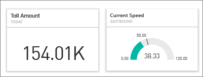

> [!WARNING]
> Les notifications d’alerte pilotées par les données fournissent des informations sur vos données. Si vous affichez vos données Power BI sur un appareil mobile et que celui-ci est volé, nous vous recommandons d’utiliser le service Power BI pour désactiver toutes les règles d’alerte pilotées par les données.
> 
> 

## Définir des alertes de données dans le service Power BI
Regardez Amanda ajouter certaines alertes à des vignettes sur son tableau de bord. Suivez ensuite les instructions détaillées sous la vidéo pour essayer vous-même.

<iframe width="560" height="315" src="https://www.youtube.com/embed/JbL2-HJ8clE" frameborder="0" allowfullscreen></iframe>

Cet exemple utilise une vignette de carte de l’exemple de tableau Retail Analysis (Analyse de vente au détail).

1. Commencez sur un tableau de bord. Dans une jauge de tableau de bord, un indicateur de performance clé ou une vignette de carte, sélectionnez les points de suspension.
   
   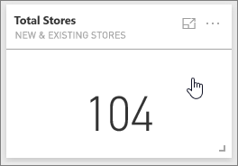
2. Sélectionnez l’icône en forme de cloche  ou **Gérer les alertes** pour ajouter une ou plusieurs alertes pour **Total stores** (Nombre total de magasins).
   
1. Dans le volet **Gérer les alertes**, sélectionnez **+ Ajouter une règle d’alerte**.  Vérifiez que le curseur est défini sur **Activé** et donnez un titre à votre alerte. Les titres vous aident à reconnaître facilement vos alertes.
   
   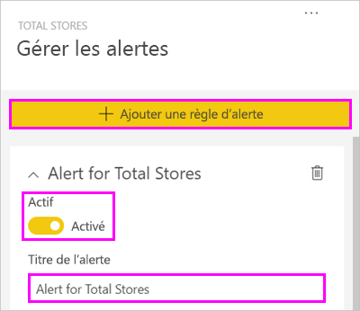
4. Faites défiler vers le bas, puis entrez les détails de l’alerte.  Dans cet exemple, nous allons créer une alerte qui nous avertit une fois par jour si le nombre total de magasins est supérieur à 100. Les alertes s’affichent dans notre centre de notification. Nous allons également demander à Power BI de nous envoyer un courrier électronique.
   
   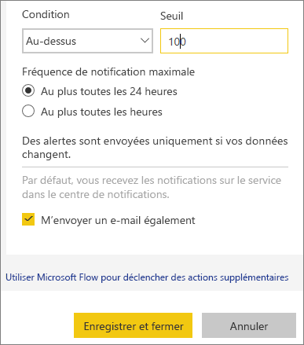
5. Sélectionnez **Enregistrer et fermer**.

## Recevoir des alertes
Lorsque les données suivies atteignent un des seuils définis, cela a plusieurs conséquences. Tout d’abord, Power BI vérifie si cela fait plus d’une heure ou plus de 24 heures (selon l’option sélectionnée) que la dernière alerte a été envoyée. Tant que les données se trouvent au-delà du seuil, vous recevez une alerte.

Ensuite, Power BI envoie une alerte à votre centre de notification et éventuellement par courrier électronique. Chaque alerte contient un lien direct vers vos données. Sélectionnez le lien pour afficher la vignette pertinente, dans laquelle vous pouvez explorer, partager et apprendre des informations supplémentaires.  

1. Si vous avez défini l’alerte de façon à recevoir un courrier électronique, vous recevez un message semblable à celui-ci dans votre boîte de réception.
   
   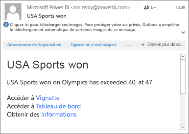
2. Power BI ajoute un message à votre **centre de notification** et ajoute une nouvelle icône d’alerte à la vignette applicable.
   
   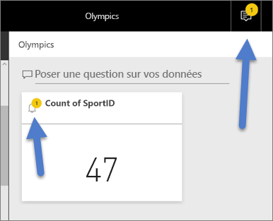
3. Ouvrez le centre de notification pour afficher les détails de l’alerte.
   
    
   
   > [!NOTE]
   > Les alertes fonctionnent uniquement sur les données actualisées Lorsque les données sont actualisées, Power BI vérifie si une alerte est définie pour celles-ci. Si les données ont atteint un seuil d’alerte, une alerte est déclenchée.
   > 
   > 

## Gestion des alertes
Il existe de nombreuses façons de gérer vos alertes : à partir de la vignette de tableau de bord elle-même, dans le menu Paramètres de Power BI et sur une vignette spécifique dans l’[application mobile Power BI sur iPhone](mobile-set-data-alerts-in-the-mobile-apps.md) ou dans l’[application mobile Power BI pour Windows 10](mobile-set-data-alerts-in-the-mobile-apps.md).

### À partir de la vignette elle-même
1. Si vous devez modifier ou supprimer une alerte pour une vignette, rouvrez la fenêtre **Gérer les alertes** en sélectionnant l’icône en forme de cloche . Toutes les alertes que vous avez définies pour cette vignette sont affichées.
   
    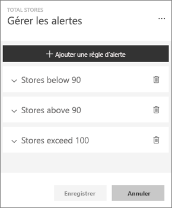.
2. Pour modifier une alerte, sélectionnez la flèche à gauche du nom de l’alerte.
   
    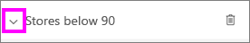.
3. Pour supprimer une alerte, sélectionnez la poubelle à droite du nom de l’alerte.
   
      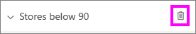

### Dans le menu Paramètres de Power BI
1. Sélectionnez l’icône en forme d’engrenage dans la barre de menus de Power BI.
   
    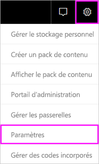.
2. Sous **Paramètres**, sélectionnez **Alertes**.
   
    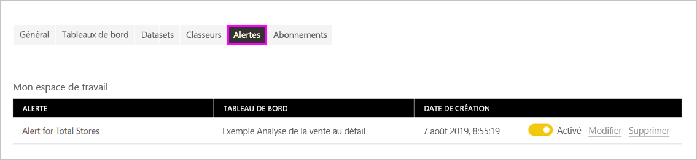
3. À ce stade, vous pouvez activer et désactiver les alertes, ouvrir la fenêtre **Gérer les alertes** pour apporter des modifications ou supprimer l’alerte.

## Conseils et résolution des problèmes
* Les alertes ne sont pas actuellement prises en charge pour les vignettes Bing ou les vignettes de carte avec des mesures au format date/heure.
* Les alertes fonctionnent uniquement avec des données numériques.
* Les alertes fonctionnent uniquement sur les données actualisées (pas sur les données statiques).
* Les alertes fonctionnent uniquement sur des jeux de données de streaming si vous générez un visuel de rapport de type KPI/carte/jauge, puis que vous épinglez ce visuel au tableau de bord.

## Étapes suivantes
[Créer un flux Microsoft Flow qui inclut une alerte de données](service-flow-integration.md)    
[Définir des alertes de données sur votre appareil mobile](mobile-set-data-alerts-in-the-mobile-apps.md)    

