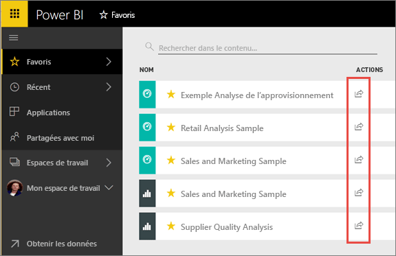
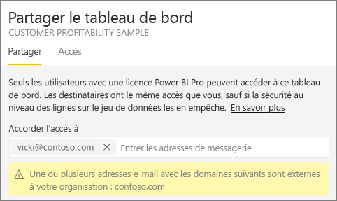
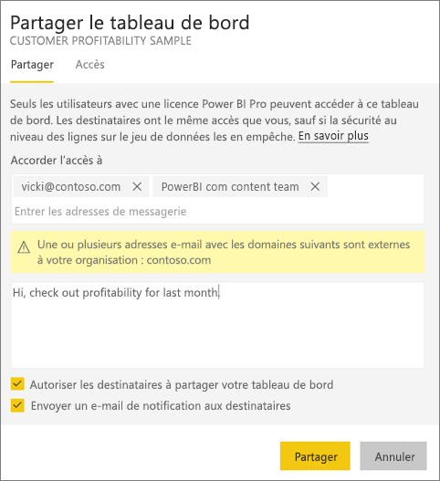
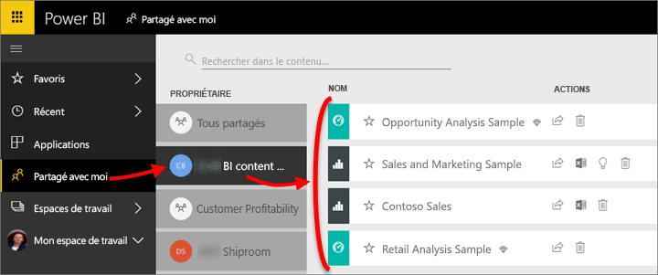
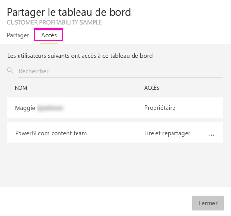
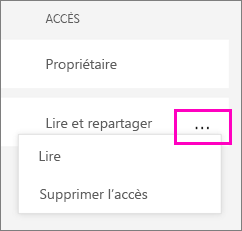
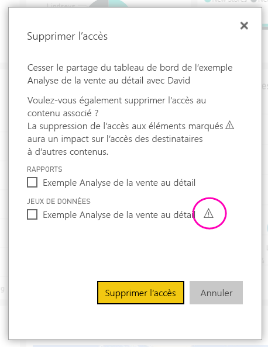
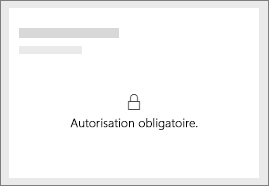
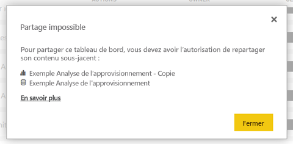

# Partager des rapports et des tableaux de bord Power BI avec des collègues et d’autres utilisateurs
Le *partage* est une façon d’autoriser quelques utilisateurs à accéder à vos tableaux de bord et rapports. Power BI propose également [d’autres façons de collaborer et de distribuer des tableaux de bord et des rapports](service-how-to-collaborate-distribute-dashboards-reports.md).

Que vous partagiez du contenu à l’intérieur ou à l’extérieur de votre organisation, vous devez disposer d’une [licence Power BI Pro](service-features-license-type.md). Vos destinataires ont également besoin d’une licence Power BI Pro ; sinon, le contenu doit avoir une [capacité Premium](service-premium.md). 

Vous pouvez partager des tableaux de bord et des rapports à différents endroits du service Power BI : Favoris, Récents, Partagés avec moi (si le propriétaire le permet), Mon espace de travail ou d’autres espaces de travail. Quand vous partagez un tableau de bord ou un rapport avec des utilisateurs, ces derniers peuvent l’afficher et interagir avec, mais pas le modifier. Ils voient les mêmes données que vous dans le tableau de bord ou le rapport, sauf si la [Sécurité au niveau des lignes](service-admin-rls.md) est appliquée. Ils peuvent également le partager avec leurs collègues, si vous les y autorisez. Les utilisateurs qui ne font pas partie de votre organisation peuvent consulter et interagir avec le tableau de bord ou le rapport, mais pas le partager. 

Vous pouvez également [partager un tableau de bord à partir de l’une des applications mobiles Power BI](consumer/mobile/mobile-share-dashboard-from-the-mobile-apps.md). Vous pouvez partager des tableaux de bord à partir du service Power BI et des applications mobiles Power BI, mais pas de Power BI Desktop.

## Vidéo : Partager un tableau de bord
Regardez Amanda partager son tableau de bord avec des collègues à l’intérieur et à l’extérieur de son entreprise. Suivez ensuite les instructions détaillées sous la vidéo pour essayer vous-même.

<iframe width="560" height="315" src="https://www.youtube.com/embed/0tUwn8DHo3s?list=PL1N57mwBHtN0JFoKSR0n-tBkUJHeMP2cP" frameborder="0" allowfullscreen></iframe>

## Partager un tableau de bord ou un rapport

1. Dans la liste des tableaux de bord ou des rapports, ou dans un tableau de bord ou un rapport ouvert, sélectionnez **Partage** .

2. Dans la zone supérieure, entrez les adresses e-mail complètes des personnes, des groupes de distribution ou des groupes de sécurité. Vous ne pouvez pas effectuer de partage avec des listes de distribution dynamique. 
   
   Vous pouvez partager avec des personnes dont les adresses électroniques sont externes à votre organisation, mais un message d’avertissement s’affiche.
   
    
 
   >[!NOTE]
   >La zone d’entrée prend en charge au maximum 100 utilisateurs ou groupes. Vous pouvez partager plusieurs fois ou partager avec un groupe d’utilisateurs si vous avez besoin de partager avec un grand nombre d’utilisateurs.
   > 
   > 

3. Ajoutez un message si vous le souhaitez. Ceci est facultatif.
4. Pour permettre à vos collègues de partager votre contenu avec d’autres personnes, cochez la case **Autoriser les destinataires à partager votre tableau de bord/rapport**.
   
   Autoriser le partage par d’autres utilisateurs est appelé *repartage*. Si vous les y autorisez, les utilisateurs peuvent repartager à partir du service Power BI et des applications mobiles ou transférer le message d’invitation à d’autres membres de votre organisation. L’invitation expire après un mois. Les personnes extérieures à votre organisation ne sont pas autorisées à le partager à nouveau. En tant que propriétaire du contenu, vous pouvez désactiver la possibilité de le partager à nouveau, ou la révoquer au cas par cas. Consultez la section [Arrêter ou empêcher le partage](service-share-dashboards.md#stop-sharing-or-stop-others-from-sharing) ci-dessous.

5. Sélectionnez **Partager**.
   
     
   
   Power BI envoie à des individus (et non à des groupes) un e-mail d’invitation contenant un lien vers le contenu partagé. Une notification **Réussite** s’affiche. 
   
   Lorsque les destinataires de votre organisation cliquent sur le lien, Power BI ajoute le tableau de bord ou le rapport à leur page de liste **Partagés avec moi**. Ils peuvent sélectionner votre nom pour voir tout le contenu que vous avez partagé avec eux. 
   
   
   
   Lorsque des destinataires extérieurs à votre organisation cliquent sur le lien, ils voient le tableau de bord ou le rapport, mais pas sur le portail Power BI habituel. Consultez la section [Partager avec des personnes extérieures à l’organisation](service-share-dashboards.md#share-a-dashboard-with-people-outside-your-organization) ci-dessous pour plus d’informations.

## Qui a accès à un tableau de bord ou à un rapport partagé ?
Il est parfois utile de voir avec qui vous avez partagé un contenu, et avec qui ces utilisateurs l’ont partagé.

1. Dans la liste des tableaux de bord et des rapports, ou dans le tableau de bord ou le rapport proprement dit, sélectionnez **Partager** . 
2. Dans la boîte de dialogue **Partager un tableau de bord/rapport**, sélectionnez **Accès**.
   
    
   
    Les personnes extérieures à votre organisation sont répertoriées en tant qu’ **Invités**.

## Arrêter ou empêcher le partage
Seul le propriétaire du tableau de bord ou du rapport peut activer et désactiver la possibilité de le partager de nouveau.

### Si vous n’avez pas encore envoyé l’invitation de partage
* Décochez la case **Autoriser les destinataires à partager le tableau de bord/rapport** en bas de l’invitation avant de l’envoyer.

### Si vous avez déjà partagé le tableau de bord ou le rapport
1. Dans la liste des tableaux de bord et des rapports, ou dans le tableau de bord ou le rapport proprement dit, sélectionnez **Partager** . 
2. Dans la boîte de dialogue **Partager un tableau de bord/rapport**, sélectionnez **Accès**.
   
    
3. Sélectionnez le bouton de sélection (**...**) en regard de **Lire et repartager**, puis sélectionnez :
   
   
   
   * **Lire** pour empêcher cette personne de partager avec quiconque.
   * **Supprimez l’accès** pour empêcher cette personne de voir le contenu partagé.

4. Dans la boîte de dialogue **Supprimer l’accès**, décidez si vous voulez également supprimer l’accès au contenu associé, tel que les rapports et les jeux de données. Si vous supprimez des éléments dotés d’une icône d’avertissement , il est recommandé de supprimer le contenu associé, car il ne s’affichera pas correctement.

    

## Partager un tableau de bord ou un rapport avec des personnes extérieures à l’organisation
Quand vous partagez un tableau de bord ou un rapport avec des personnes extérieures à votre organisation, celles-ci reçoivent un e-mail contenant le lien vers le contenu partagé ; elles doivent se connecter à Power BI pour le voir. Si elles ne disposent pas d’une licence Power BI Pro, elles peuvent en demander une après avoir cliqué sur le lien.

Une fois connectées, elles verront apparaître le tableau de bord ou le rapport partagé dans leur propre fenêtre de navigateur sans le volet de navigation gauche, et non sur leur portail Power BI habituel. Elles doivent ajouter le lien aux favoris pour pouvoir accéder de nouveau à ce tableau de bord ou à ce rapport.

Elles ne peuvent modifier aucun contenu dans ce tableau de bord ou ce rapport. Elles peuvent interagir avec les graphiques et modifier les filtres et les segments du rapport, mais non enregistrer leurs modifications. 

Seuls les destinataires directs peuvent voir le tableau de bord ou le rapport partagé. Par exemple, si vous avez envoyé le courrier à Vicki@contoso.com, seule Vicki peut voir le tableau de bord. Personne d’autre ne peut voir ce tableau de bord, même si elles disposent du lien, et Vicki doit utiliser la même adresse de messagerie pour accéder à ce tableau de bord. Si elle se connecte avec une autre adresse de messagerie, elle ne pourra pas non plus accéder au tableau de bord.

Les personnes extérieures à votre organisation ne peuvent pas du tout voir les données si la sécurité au niveau des rôles ou des lignes est établie selon les modèles tabulaires Analysis Services locaux.

Si vous envoyez un lien à partir d’une application mobile Power BI à des personnes extérieures à votre organisation, lorsque celles-ci cliquent sur le lien, le tableau de bord s’ouvre dans un navigateur, et non dans l’application mobile Power BI.

Si les utilisateurs invités sont activés à l’aide de l’option [Autoriser les utilisateurs invités externes à modifier et à gérer le contenu de l’organisation](service-admin-portal.md#export-and-sharing-settings), l’expérience par défaut de consommation uniquement ne s’applique pas à eux. [En savoir plus](service-admin-azure-ad-b2b.md)

## Considérations et limitations
Voici quelques éléments à prendre en compte avant de partager des tableaux de bord et des rapports :

* En général, vos collègues voient les mêmes données que vous dans le tableau de bord ou le rapport. Ainsi, si vous avez l’autorisation de voir plus de données qu’eux, ils pourront consulter toutes vos données dans le tableau de bord ou le rapport. Cependant, si la [Sécurité au niveau des lignes](service-admin-rls.md) est appliquée au jeu de données sous-jacent du tableau de bord ou du rapport, les informations d’identification de chaque personne sont utilisées pour déterminer à quelles données elle est autorisée à accéder.
* Tous les utilisateurs avec qui le tableau de bord est partagé peuvent le voir et interagir avec les rapports associés en [Mode Lecture](consumer/end-user-reading-view.md). Ils ne peuvent pas créer de rapports ni enregistrer les modifications apportées aux rapports existants.
* Aucun utilisateur ne peut voir ni télécharger le jeu de données, mais chacun peut y accéder directement à l’aide de la fonctionnalité Analyser dans Excel. Un administrateur peut limiter la capacité des personnes à utiliser Analyser dans Excel en limitant la capacité de tous les membres d’un groupe. Cependant, la restriction s’applique à tous les membres de ce groupe et à chaque espace de travail auquel le groupe appartient.
* Tout le monde peut [actualiser manuellement les données](refresh-data.md).
* Si vous utilisez Office 365 pour la messagerie électronique, vous pouvez partager avec les membres d’un groupe de distribution en entrant l’adresse de messagerie associée au groupe de distribution.
* Les collègues qui ont le même domaine de messagerie que le vôtre, ainsi que les collègues dont le domaine est différent mais inscrit auprès du même locataire, peuvent partager le tableau de bord avec d’autres utilisateurs. Par exemple, supposons que les domaines contoso.com et contoso2.com sont enregistrés dans le même locataire. Si votre adresse de courrier est konrads@contoso.com, ravali@contoso.com et gustav@contoso2.com peuvent partager, à condition que vous ayez autorisé ce partage.
* Si vos collègues ont déjà accès à un tableau de bord ou à un rapport spécifique, vous pouvez envoyer un lien direct en copiant simplement l’URL qui s’affiche quand vous vous trouvez dessus. Par exemple : `https://powerbi.com/dashboards/g12466b5-a452-4e55-8634-xxxxxxxxxxxx`
* De même, si vos collègues ont déjà accès à un tableau de bord spécifique, vous pouvez [envoyer un lien direct vers le rapport sous-jacent](service-share-reports.md). 
* Vous pouvez partager avec au maximum 100 utilisateurs ou groupes lors d’une seule action de partage. Toutefois, vous pouvez permettre à plus de 500 utilisateurs d’accéder à un élément. Pour ce faire, vous pouvez partager plusieurs fois en définissant les utilisateurs individuellement, ou partager avec un groupe d’utilisateurs qui contient tous les utilisateurs.

## Résoudre les problèmes de partage

### Les destinataires de mon tableau de bord voient une icône de verrou dans une vignette ou un message « Autorisation requise »

Les destinataires du partage peuvent voir une vignette verrouillée dans un tableau de bord ou un message « Autorisation requise » lorsqu’ils tentent de consulter un rapport.

Dans ce cas, vous devez leur accorder l’autorisation d’accès au jeu de données sous-jacent. Voici comment procéder.

1. Accédez à l’onglet **Jeux de données** dans votre liste de contenu.

1. Sélectionnez les points de suspension (**...**) en regard du jeu de données > **Gérer les autorisations**.

    

3. Sélectionnez **Ajouter un utilisateur**.

    

1. Entrez les adresses e-mail complètes des personnes, des groupes de distribution ou des groupes de sécurité. Vous ne pouvez pas effectuer de partage avec des listes de distribution dynamique.

    

5. Sélectionnez **Ajouter**.

### Je n’arrive pas à partager un tableau de bord ou un rapport

Pour pouvoir partager un tableau de bord ou un rapport, vous devez avoir l’autorisation d’en partager le contenu sous-jacent, c’est-à-dire tous les rapports et jeux de données associés. Si un message vous indique que vous ne pouvez pas effectuer le partage, demandez à l’auteur du rapport de vous autoriser à repartager ces rapports et jeux de données.

## Étapes suivantes
* Vous voulez donner votre avis ? Accédez au [site de la communauté Power BI](https://community.powerbi.com/) pour effectuer des suggestions.
* [Comment partager des tableaux de bord, rapports et vignettes ?](service-how-to-collaborate-distribute-dashboards-reports.md)
* [Partager un rapport Power BI filtré](service-share-reports.md)
* Vous avez des questions ? [Posez vos questions à la Communauté Power BI](http://community.powerbi.com/).

