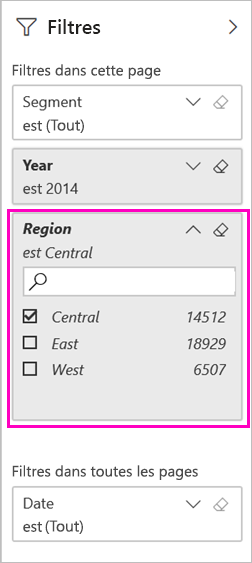
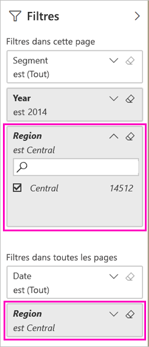

# Deux façons de partager un rapport Power BI filtré
Le *partage* est une façon d’autoriser quelques utilisateurs à accéder à vos tableaux de bord et rapports. Est-il possible de partager une version filtrée d’un rapport ? Par exemple un rapport qui affiche uniquement les données relatives à une ville, un fournisseur ou un commercial spécifique. Essayez de filtrer un rapport et de le partager, ou de créer une URL personnalisée. Le rapport est filtré quand les destinataires l’ouvrent pour la première fois. Ils peuvent supprimer le filtre en modifiant l’URL. 

Power BI propose également [d’autres façons de collaborer et de distribuer des rapports](service-how-to-collaborate-distribute-dashboards-reports.md). Avec le partage, vous et vos destinataires avez besoin d’une [licence Power BI Pro](service-features-license-type.md) ou le contenu doit être dans une [capacité Premium](service-premium-what-is.md). 

## Deux façons de filtrer un rapport

Pour les deux techniques de filtrage, nous utilisons l’exemple d’application de modèle Marketing et ventes. Vous voulez l’essayer ? Vous pouvez également installer [l’application de modèle d’exemple Marketing et ventes](https://appsource.microsoft.com/product/power-bi/microsoft-retail-analysis-sample.salesandmarketingsample?tab=Overview).

### Définir un filtre

Ouvrez un rapport en [mode Édition](consumer/end-user-reading-view.md) et appliquez un filtre.

Dans cet exemple, nous filtrons la page de catégorie chiffre d’affaires de l’application de modèle d’exemple Marketing et ventes pour afficher uniquement les valeurs où **Région** a la valeur **Central**. 
 

Enregistrez le rapport.

### Créer un filtre dans l’URL

Lorsque vous ajoutez le filtre à la fin de l’URL de la page de rapport, le comportement est légèrement différent. La page filtrée a la même apparence. Toutefois, Power BI ajoute le filtre à l’ensemble du rapport et supprime les autres valeurs du volet de filtre.  

Ajoutez le code suivant à la fin de l’URL de page de rapport :
   
    ?filter=*tablename*/*fieldname* eq *value*
   
Le champ doit être de type nombre, date/heure ou chaîne. Les valeurs *tablename* ou *fieldname* ne peuvent pas contenir d’espaces.
   
Dans notre exemple, le nom de la table est **Géo**, le nom du champ est **Région** et la valeur que nous voulons filtrer est **Central** :
   
    ?filter=Geo/Region eq 'Central'

Comme votre navigateur ajoute des caractères spéciaux pour représenter les barres obliques, les espaces et les apostrophes, vous obtenez un résultat semblable à ce qui suit :
   
    app.powerbi.com/groups/xxxx/reports/xxxx/ReportSection4d00c3887644123e310e?filter=Geo~2FRegion%20eq%20'Central'

Enregistrez le rapport.

Consultez l’article [Filtrer un rapport à l’aide de paramètres de chaîne de requête dans l’URL](service-url-filters.md) pour plus de détails.

## Partager le rapport filtré

1. Lorsque vous [partagez le rapport](service-share-dashboards.md), décochez la case **Envoyer un e-mail de notification aux destinataires**.

    

4. Envoyez le lien du filtre que vous avez créé.

## Étapes suivantes
* [Moyens de partager votre travail dans Power BI](service-how-to-collaborate-distribute-dashboards-reports.md)
* [Partager un tableau de bord](service-share-dashboards.md)
* D’autres questions ? [Posez vos questions à la Communauté Power BI](https://community.powerbi.com/).
* Vous voulez donner votre avis ? Accédez au [site de la communauté Power BI](https://community.powerbi.com/) pour effectuer des suggestions.

