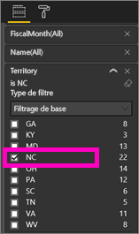
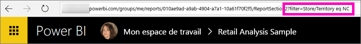
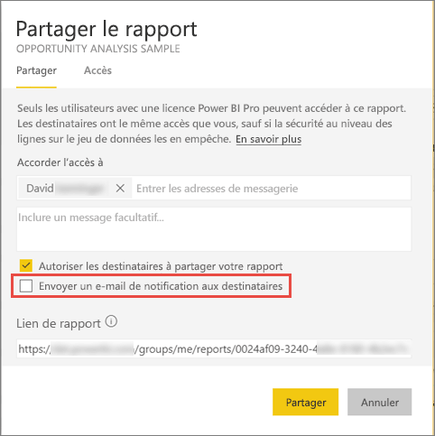

# Partager un rapport Power BI filtré avec des collègues
Le *partage* est une façon d’autoriser quelques utilisateurs à accéder à vos tableaux de bord et rapports. Power BI propose également [d’autres façons de collaborer et de distribuer des rapports](service-how-to-collaborate-distribute-dashboards-reports.md).

Avec le partage, vous et vos destinataires avez besoin d’une [licence Power BI Pro](service-free-vs-pro.md) ou le contenu doit être dans une [capacité Premium](service-premium.md). Vous avez des suggestions ? L’équipe Power BI est toujours intéressée par vos commentaires. Pour cela, accédez au [site de la communauté Power BI](https://community.powerbi.com/).

Vous pouvez partager un rapport avec vos collègues du même domaine de courrier que vous, à différents endroits du service Power BI : Favoris, Récents, Partagés avec moi (si le propriétaire le permet), Mon espace de travail ou d’autres espaces de travail. Quand vous partagez un rapport, les utilisateurs avec qui vous le partagez peuvent l’afficher et interagir avec lui, mais ils ne peuvent pas le modifier. Ils voient les mêmes données que vous dans le rapport, sauf si la [sécurité au niveau des lignes](service-admin-rls.md) est appliquée. 

## Filtrer et partager un rapport
Est-il possible de partager une version filtrée d’un rapport ? Par exemple un rapport qui affiche uniquement les données relatives à une ville, un fournisseur ou un commercial spécifique. Pour ce faire, créez une URL personnalisée.

1. Ouvrez le rapport en [mode Édition](service-reading-view-and-editing-view.md), appliquez le filtre et enregistrez le rapport.
   
   Dans cet exemple, nous filtrons l’[exemple Analyse de la vente au détail](sample-tutorial-connect-to-the-samples.md) pour afficher uniquement les valeurs où **Territory (Territoire)** est égale à **NC**.
   
   
2. Ajoutez le code suivant à la fin de l’URL de page de rapport :
   
   ?filter=*tablename*/*fieldname* eq *value*
   
    Le champ doit être de type **chaîne** et ni *fieldname* ni *tablename* ne peuvent contenir d’espaces.
   
   Dans notre exemple, le nom de la table est **Store**, le nom du champ est **Territory** et la valeur que nous voulons filtrer est **NC** :
   
    ?filter=Store/Territory eq 'NC'
   
   
   
   Comme votre navigateur ajoute des caractères spéciaux pour représenter les barres obliques, les espaces et les apostrophes, vous obtenez le résultat suivant :
   
   app.powerbi.com/groups/me/reports/010ae9ad-a9ab-4904-a7a1-xxxxxxxxxxxx/ReportSection2?filter=Store%252FTerritory%20eq%20%27NC%27

3. [Partagez le rapport](service-share-dashboards.md), mais décochez la case **Envoyer une notification par courrier électronique aux destinataires**. 

    

4. Envoyez le lien du filtre que vous avez créé.

## Étapes suivantes
* Vous voulez donner votre avis ? Accédez au [site de la communauté Power BI](https://community.powerbi.com/) pour effectuer des suggestions.
* [Comment partager des tableaux de bord, rapports et vignettes ?](service-how-to-collaborate-distribute-dashboards-reports.md)
* [Partager un tableau de bord](service-share-dashboards.md)
* D’autres questions ? [Posez vos questions à la Communauté Power BI](http://community.powerbi.com/).

