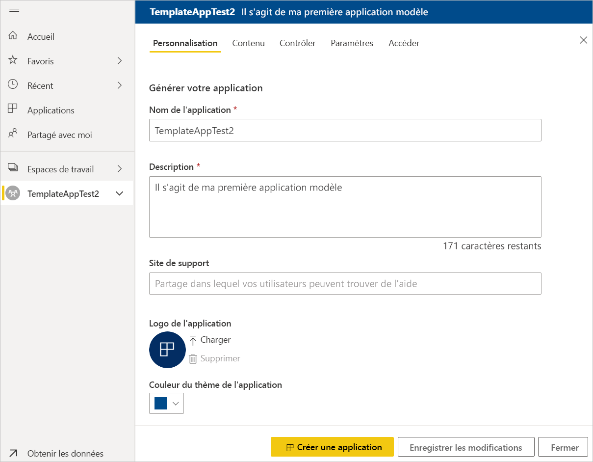
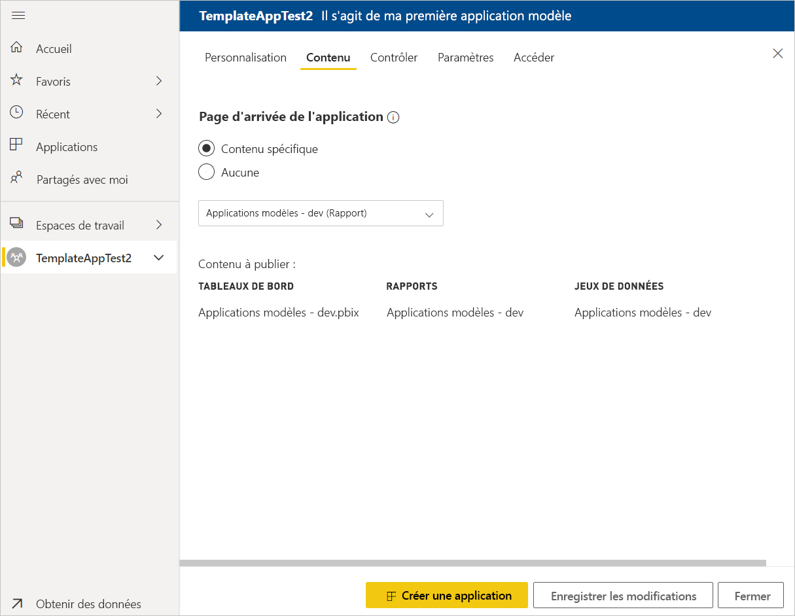
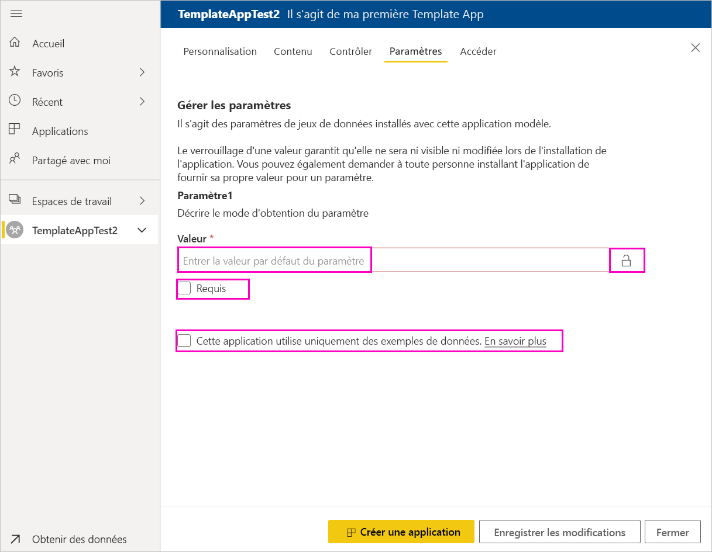

# Créer une application modèle dans Power BI (préversion)

Les nouvelles *applications modèles* Power BI permettent aux partenaires Power BI de créer des applications Power BI avec peu ou pas de codage et de les déployer ensuite vers n’importe quel client Power BI.  Cet article contient des instructions pas à pas pour créer une application modèle Power BI.

Si vous pouvez créer des tableaux de bord et rapports Power BI, vous pouvez devenir un *Générateur d’applications modèle* et génère et empaquète des analytique contenu dans un *application*. Vous pouvez déployer votre application à d’autres locataires Power BI via n’importe quelle plateforme disponible, telles que AppSource, ou à l’aide dans votre propre service web. Comme un générateur, vous avez la possibilité de créer un package protégé analytique pour la distribution.

Les administrateurs de locataires Power BI régissent et contrôlent les utilisateurs dans leur organisation qui sont autorisés à créer des applications modèles et/ou à les installer. Ces utilisateurs sont autorisés peuvent installer votre application du modèle, puis modifiez-le et distribuez-la aux consommateurs de Power BI dans leur organisation.

## Conditions préalables

Les prérequis pour créer une application modèle sont les suivants :  

- Une [licence Power BI Pro](service-self-service-signup-for-power-bi.md)
- Une [installation de Power BI Desktop](desktop-get-the-desktop.md) (facultatif)
- Vous êtes familiarisé avec le [concepts de base de Power BI](service-basic-concepts.md)
- Les autorisations de création d’application modèle. Pour plus d’informations, consultez [Paramètres des applications modèles dans le portail d’administration](service-admin-portal.md#template-apps-settings-preview) Power BI.

## Activer le mode développeur d’applications

Pour créer une application modèle que vous pourrez ensuite distribuer à d’autres locataires Power BI, vous devez être en mode développeur d’applications. Sinon, l’application que vous créez pourra uniquement être utilisée par les consommateurs Power BI appartenant à votre organisation.

1. Ouvrez le service Power BI dans un navigateur.
2. Accédez à **Paramètres** > **Général** > **Développeur** > **Activer le mode de développement d’applications modèles**.

    

    Si vous ne voyez pas cette option, demandez à votre administrateur Power BI qu’il vous accorde les [autorisations de développement d’applications modèles](service-admin-portal.md#template-apps-settings-preview) dans le portail d’administration.

3. Sélectionnez **Appliquer**.

## Créer l’espace de travail de l’application modèle

Pour créer une application modèle que vous pourrez ensuite distribuer à d’autres locataires Power BI, vous devez la créer dans l’un des nouveaux espaces de travail d’application.

1. Dans le service Power BI, sélectionnez **Espaces de travail** > **Créer un espace de travail d’application**.

    

2. Dans **Créer un espace de travail d’application**, dans **Afficher un aperçu des espaces de travail améliorés**, sélectionnez **Essayer maintenant**.

    

3. Entrez un nom, une description (facultative) et un logo (facultatif) pour votre espace de travail d’application.

4. Sélectionnez **Développer une application modèle**.

    

5. Sélectionnez **Enregistrer**.
>[!NOTE]
>Vous avez besoin d’autorisations à partir de votre administrateur Power BI pour promouvoir des applications de modèle.

## Créer le contenu dans votre application modèle

Comme avec tout espace de travail d’application Power BI standard, l’étape suivante consiste à créer le contenu dans l’espace de travail.  Dans cette préversion des applications modèles, vous pouvez créer un seul jeu de données, un seul rapport et un seul tableau de bord.

- [Créez votre contenu Power BI](power-bi-creator-landing.md) dans votre espace de travail d’application.

Si vous définissez des paramètres dans Power Query, assurez-vous d’utiliser des types de paramètre pris en charge (par exemple, Text). Les types Any et Binary ne sont pas pris en charge.

L’article [Conseils pour créer des applications modèles dans Power BI (préversion)](service-template-apps-tips.md) liste les différents points à prendre en considération quand vous créez des rapports et des tableaux de bord pour votre application modèle.

## Créer l’application modèle de test

Maintenant que vous avez ajouté du contenu dans votre espace de travail, vous êtes prêt à l’intégrer dans une application modèle. La première étape consiste à créer une application modèle de test, accessible uniquement au sein de votre organisation sur votre locataire.

1. Dans l’espace de travail d’application modèle, sélectionnez **Créer une application**.

    

    Ici, vous définissez les options de génération supplémentaires pour votre application de modèle, dans cinq catégories :

    **Personnalisation**

    
    - Nom de l’application
    - Description
    - Site de support (lien est présenté sous les informations sur l’application après la redistribution d’application du modèle en tant qu’application de l’organisation)
    - Logo de l’application (limite de taille de fichier 45 Ko, proportions de 1:1, .png .jpg .jpeg formats)
    - Couleur de thème d’application

    **Contenu**

    **Page de lancement d’application :** Définir un rapport ou un tableau de bord à la page d’accueil de votre application, utilisez une page d’accueil qui vous donne l’impression de droite :

    

    **Contrôle**

    Définir des limites et restrictions ayant des utilisateurs de votre application avec le contenu de votre application. Vous pouvez utiliser ce contrôle pour protéger les droits de propriété intellectuelle dans votre application.

    

    >[!NOTE]
    >Exportation au format .pbix est toujours bloqué pour les utilisateurs de l’installation de l’application.

    **Paramètres**

    Utilisez cette catégorie pour gérer le comportement du paramètre lors de la connexion aux sources de données. En savoir plus sur [création de paramètres de requête](https://powerbi.microsoft.com/blog/deep-dive-into-query-parameters-and-power-bi-templates/).

    
    - **Valeur**: valeur de paramètre par défaut.
    - **Requis**: utilisez cela pour exiger le programme d’installation pour un paramètre spécifique à l’utilisateur d’entrée.
    - **Verrou**: Le verrouillage empêche le programme d’installation à partir d’un paramètre de mise à jour.
    - **Statique**: Activer dans le cas où l’application contient *uniquement* échantillonner des données. Lorsque vous sélectionnez **statique**, l’Assistant d’installation ne demande aux utilisateurs de se connecter à une source de données.

    **Accès** dans la phase de test, décidez quels autres utilisateurs de votre organisation peuvent installer et tester votre application. Ne vous inquiétez pas, vous pouvez toujours revenir et modifier ces paramètres ultérieurement (paramètre n’affecte pas l’accès de l’application de modèle distribuée).

2. Sélectionnez **Créer une application**.

    Vous voyez un message indiquant que l’application de test est prête, ainsi qu’un lien à copier et à partager avec les testeurs de votre application.

    

    Vous avez également terminé la première étape du processus de gestion des mises en production, comme expliqué ci-dessous.

## Gérer la mise en production de l’application modèle

Avant de mettre votre nouvelle application modèle à la disposition de tous, vous devez vous assurer qu’elle est prête à l’emploi. À partir du volet Gestion des mises en production dans Power BI, vous pouvez suivre et inspecter tout le chemin de mise en production de l’application. Vous pouvez également déclencher la transition entre chaque phase. Voici les phases principales :

- Générer l’application de test : test de l’application uniquement dans votre organisation.
- Promouvoir le package de test en préproduction : test de l’application en dehors de votre organisation.
- Promouvoir le package de préproduction en production : version en production.
- Supprimer un package, ou recommencer à partir d’une phase précédente.

L’URL ne change pas lorsque vous déplacez entre les phases de mise en production. Promotion n’affecte pas l’URL proprement dite.

Passons en revue les étapes :

1. Dans l’espace de travail d’application modèle, sélectionnez **Gestion des mises en production**.

    

2. Sélectionnez **Créer une application**.

    Si vous avez créé l’application de test dans la section **Créer l’application modèle de test** ci-dessus, vous voyez déjà un rond jaune à côté de la phase **Test**. Vous n’avez donc pas besoin de sélectionner **Créer une application** ici. Si vous sélectionnez cette option, vous revenez en arrière dans le processus de création de l’application modèle.

3. Sélectionnez **Obtenir le lien**.

    

4. Pour tester l’expérience d’installation de l’application, copiez le lien fourni dans la fenêtre de notification et collez-le dans une nouvelle fenêtre de navigateur.

    À partir de là, la procédure est la même que pour vos clients. Consultez [Installer et distribuer des applications modèles dans votre organisation](service-template-apps-install-distribute.md) pour leur version.

5. Dans la boîte de dialogue, sélectionnez **Installer**.

    Au terme de l’installation, vous voyez une notification indiquant que la nouvelle application est prête.

6. Sélectionnez **Accéder à l’application**.
7. Dans **Bien démarrer avec votre nouvelle application**, vous voyez votre application telle qu’elle sera présentée à vos clients.

    
8. Sélectionnez **Explorer l’application** pour passer en revue l’application de test avec les exemples de données.
9. Pour effectuer des modifications, revenez à l’application dans l’espace de travail d’origine. Modifiez l’application de test jusqu’à ce que vous soyez satisfait.
10. Lorsque vous êtes prêt à promouvoir votre application pour la préproduction pour d’autres tests en dehors de votre client, revenez à la **Release Management** volet et sélectionnez **promouvoir application**. 

    

    >[!NOTE]
    > Quand l’application est promue rend disponible publiquement en dehors de votre organisation.

11. Sélectionnez **Promouvoir** pour confirmer votre choix.
12. Copiez cette nouvelle URL à partager en dehors de votre locataire pour les besoins du test. Ce lien est également celui que vous soumettez pour commencer le processus de distribution de votre application sur AppSource en créant un [nouvelle offre de portail Microsoft Cloud Partner](https://docs.microsoft.com/azure/marketplace/cloud-partner-portal/power-bi/cpp-publish-offer). Envoyer des liens de préproduction uniquement vers le portail Cloud Partner. Une fois que l’application est approuvée et vous obtenez notification qu’elle est publiée dans AppSource, vous pouvez promouvoir ce package en production dans Power BI.
13. Quand votre application est prête à être mise en production ou partagée via AppSource, revenez au volet **Gestion des mises en production** et sélectionnez **Promouvoir l’application** à côté de **Préproduction**.
14. Sélectionnez **Promouvoir** pour confirmer votre choix.

    Votre application est maintenant en production, et prête à être distribuée.

    

Pour mettre votre application à la disposition du plus grand nombre possible d’utilisateurs Power BI à travers le monde, nous vous conseillons de la soumettre sur AppSource. Pour plus d’informations, consultez [Offre d’application Power BI](https://docs.microsoft.com/azure/marketplace/cloud-partner-portal/power-bi/cpp-power-bi-offer).

## Mettre à jour votre application

Une fois que votre application est en production, vous pouvez recommencer la phase de test, tout en maintenant la continuité de l’application en production.

1. Dans le volet **Gestion des mises en production**, sélectionnez **Créer une application**.
2. Revenez en arrière dans le processus de création de l’application.
3. Après avoir défini les paramètres **Personnalisation**, **Contenu**, **Contrôle** et **Accès**, sélectionnez de nouveau **Créer une application**.
4. Sélectionnez **Fermer** et revenez au volet **Gestion des mises en production**.

   Vous avez maintenant deux versions de l’application : la version en production, et une nouvelle version en phase de test.

    

5. Lorsque vous êtes prêt à promouvoir votre application pour la préproduction pour d’autres tests en dehors de votre client, revenez au volet Release Management et sélectionnez **promouvoir application** regard **test**.
6. Votre lien est maintenant en direct, soumettre à nouveau vers le portail Cloud Partner en suivant les étapes indiquées dans [mise à jour d’application Power BI offre](https://docs.microsoft.com/azure/marketplace/cloud-partner-portal/power-bi/cpp-update-existing-offer).

>[!NOTE]
>Promouvoir votre application à la phase de production une fois que votre application est approuvée par le portail Microsoft Cloud Partner et vous l’avez publié.

## Étapes suivantes

Découvrez de quelle manière vos clients peuvent interagir avec votre application modèle dans l’article [Installer, personnaliser et distribuer des applications modèles dans votre organisation](service-template-apps-install-distribute.md).

Pour plus d’informations sur la distribution de votre application, consultez [Offre d’application Power BI](https://docs.microsoft.com/azure/marketplace/cloud-partner-portal/power-bi/cpp-power-bi-offer).
