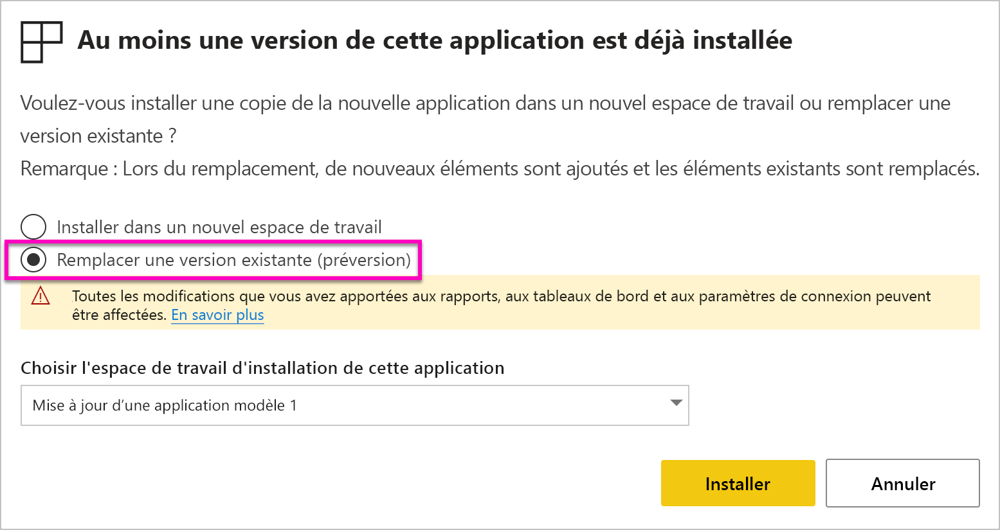
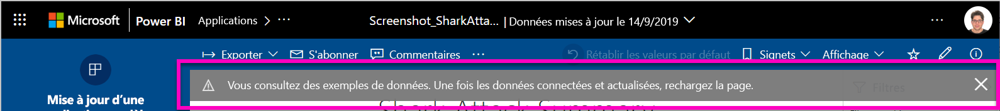

# Installer et distribuer des applications modèles dans votre organisation - Power BI

Vous êtes analyste Power BI ? Si oui, cet article explique comment installer des *applications modèles* à connecter aux nombreux services que vous utilisez pour gérer votre entreprise, tels que Salesforce, Microsoft Dynamics et Google Analytics. Vous pouvez modifier le tableau de bord et les rapports pour répondre aux besoins de votre organisation, puis les distribuer à vos collègues en tant qu’*application*. 

Si vous êtes intéressé par la création d’applications modèles à distribuer vous-même, consultez [Créer une application modèle dans Power BI](service-template-apps-create.md). Les partenaires Power BI peuvent créer des applications Power BI avec peu ou pas de code et les déployer sur les clients Power BI. 

## Conditions préalables  

Les prérequis pour installer, personnaliser et distribuer une application modèle sont les suivants : 

- Une [licence Power BI Pro](service-self-service-signup-for-power-bi.md)
- Une bonne connaissance des [concepts de base de Power BI ](service-basic-concepts.md)
- Un lien d’installation valide fourni par le créateur de l’application modèle ou AppSource. 
- Les autorisations d’installation d’applications modèles. 

## Installer une application modèle

Vous avez peut-être reçu un lien vers une application modèle. À défaut, vous pouvez rechercher une application qui vous intéresse dans AppSource. Dans les deux cas, après avoir installé l’application, vous pouvez la modifier et la distribuer au sein de votre organisation.

### Rechercher dans AppSource à partir d’un navigateur

Dans un navigateur, sélectionnez ce lien pour ouvrir AppSource filtré sur les applications Power BI :

- https://appsource.microsoft.com/marketplace/apps?product=power-bi

### Rechercher dans AppSource à partir du service Power BI

1. Dans le volet de navigation de gauche du service Power BI, sélectionnez **Applications** > **Obtenir des applications**.

    

2. Dans AppSource, sélectionnez **Applications**.

    

3. Parcourez les applications ou recherchez l’application souhaitée, puis sélectionnez **Obtenir maintenant**.

4. Dans la boîte de dialogue, sélectionnez **Installer**.

     Si vous avez une licence Power BI Pro, l’application est installée avec l’espace de travail d’application associé. Vous personnalisez l’application dans cet espace de travail.

    Au terme de l’installation, vous voyez une notification indiquant que la nouvelle application est prête.
4. Sélectionnez **Accéder à l’application**.
5. Dans **Bien démarrer avec votre nouvelle application**, sélectionnez l’une des trois options ci-dessous :

    

    - **Explorer l’application** : cette option permet une exploration rapide avec un exemple de données. Choisissez d’abord cette option pour voir l’apparence générale de l’application. 
    - **Connecter des données** : changez la source de données de l’exemple de données par votre propre source de données. Vous pouvez redéfinir les paramètres du jeu de données et les informations d’identification de la source de données. Consultez la section [Limitations connues](service-template-apps-tips.md#known-limitations) dans l’article « Conseils pour créer des applications modèles ». 
    - **Accéder à l’espace de travail** (option la plus avancée) : vous pouvez apporter toute modification autorisée par le concepteur de l’application.

    Ignorez cette boîte de dialogue si vous souhaitez accéder à l’espace de travail associé directement par le biais de l’onglet **Espaces de travail** dans le volet de navigation de gauche.
    >[!NOTE]
    >L’installation d’une application de modèle a installé à la fois une *application d’organisation* et un *espace de travail d’application*. En savoir plus sur [la distribution d’applications dans Power BI](service-create-distribute-apps.md).
 
6. Avant de partager l’application avec vos collègues, vous voudrez peut-être vous connecter à vos propres données. Vous pouvez également avoir besoin de modifier le rapport ou le tableau de bord en fonction des besoins de votre organisation. Vous pouvez aussi ajouter d’autres rapports ou tableaux de bord à ce stade.

   Si vous sélectionnez un lien d’installation pour une application qui n’est pas répertoriée sur AppSource, la boîte de dialogue de validation vous invitant à confirmer votre choix s’affiche.

   

   >[!NOTE]
   >Pour installer des applications de modèle qui ne sont pas répertoriées sur AppSource, vous devez effectuer la demande à partir de vos autorisations d’administrateur. Pour plus d’informations, consultez [Paramètres des applications modèles dans le portail d’administration](service-admin-portal.md#template-apps-settings) Power BI.

## Personnaliser et publier l’application

Une fois que vous avez mis à jour l’application pour votre organisation, vous êtes prêt à la publier. Suivez les mêmes étapes de publication que pour une application standard.

1. Lorsque vous avez fini le travail de personnalisation, dans la vue Liste de l’espace de travail, sélectionnez **Mettre à jour l’application** dans le coin supérieur droit.  

    

2. Dans **Détails**, vous pouvez modifier la description et changer la couleur d’arrière-plan.

   

3. Dans **Navigation**, vous pouvez utiliser le nouveau concepteur de navigation pour votre application, ou sélectionner le tableau de bord ou le rapport pour la page d’accueil. Pour plus d’informations, consultez [Concevoir l’expérience de navigation](service-create-distribute-apps.md#design-the-navigation-experience).

   

4. Dans **Accès**, vous pouvez accorder l’accès uniquement aux utilisateurs sélectionnés ou à toute votre organisation.  

   

5. Sélectionnez **Mettre à jour l’application**. 

6. Une fois que l’application a été publiée avec succès, vous pouvez copier le lien associé et le partager avec les utilisateurs à qui vous avez accordé l’accès. Si vous avez partagé le lien avec ces utilisateurs, ces derniers le voient également dans l’onglet **Mon organisation** dans AppSource.

## Mettre à jour une application modèle

Les créateurs d’applications modèles peuvent publier de nouvelles versions de leurs applications modèles via AppSource ou via un lien direct. Dans ce cas, vous pouvez mettre à jour l’application modèle lors de la réinstallation de l’application avec la même version ou avec la version plus récente.

  >[!NOTE]
  >L’installation d’une nouvelle version remplace toutes les modifications que vous avez apportées aux rapports et aux tableaux de bord. Pour conserver vos rapports et tableaux de bord mis à jour, vous pouvez les enregistrer sous un autre nom ou à un autre emplacement avant d’effectuer l’installation.

- **Remplacer une version existante :** Remplace l’espace de travail existant par la version mise à jour de l’application modèle.

   

- **Installer dans un nouvel espace de travail :** Installe une nouvelle version de l’espace de travail et de l’application que vous devez reconfigurer.

### Comportement du remplacement

* Le remplacement met à jour les rapports, les tableaux de bord et le jeu de données à l’intérieur de l’*espace de travail*, mais pas l’application. Le remplacement ne modifie pas la navigation, la configuration et les autorisations de l’application.
* Après avoir mis à jour l’espace de travail, vous devez *mettre à jour l’application* pour appliquer les modifications de l’espace de travail à l’application d’organisation.
* Le remplacement conserve l’authentification et les paramètres configurés. Après la mise à jour, une actualisation automatique du jeu de données démarre. Pendant ce temps, l’application d’organisation, les rapports et les tableaux de bord présentent l’expérience d’*exemple de données*.
  
* Le remplacement présente toujours l’exemple de données jusqu’à ce que l’actualisation soit terminée. Si l’auteur de l’application modèle a apporté des modifications au jeu de données ou aux paramètres, les utilisateurs de l’espace de travail et de l’application continuent de voir l’expérience d’*exemple de données*.
* Le remplacement ne supprime jamais les *nouveaux* rapports ou tableaux de bord que vous avez ajoutés à l’espace de travail. Il remplace les rapports et les tableaux de bord d’origine par les modifications de l’auteur d’origine.

>[!IMPORTANT]
>N’oubliez pas de [mettre à jour l’application](#customize-and-publish-the-app) après le remplacement afin d’appliquer les modifications apportées aux rapports et aux tableaux de bord pour les utilisateurs de votre application d’organisation.

## Étapes suivantes

[Créer des espaces de travail avec vos collègues dans Power BI](service-create-workspaces.md)
