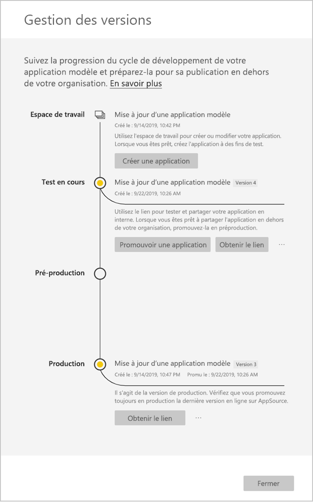

# Mettre à jour, supprimer et extraire une application modèle

Une fois que votre application est en production, vous pouvez recommencer la phase de test, tout en maintenant la continuité de l’application en production.
## Mettre à jour votre application

1. Dans le volet **Gestion des mises en production**, sélectionnez **Créer une application**.
2. Revenez en arrière dans le processus de création de l’application.
3. Après avoir défini les paramètres **Personnalisation**, **Contenu**, **Contrôle** et **Accès**, sélectionnez de nouveau **Créer une application**.
4. Sélectionnez **Fermer** et revenez au volet **Gestion des mises en production**.

   Vous avez maintenant deux versions de l’application : la version en production, et une nouvelle version en phase de test.

    

5. Quand vous êtes prêt à promouvoir votre application en préproduction pour la tester en dehors de votre locataire, revenez au volet Gestion des mises en production et sélectionnez **Promouvoir l’application** à côté de **Test**.
6. Votre lien est désormais en ligne. Envoyez-le à nouveau dans le portail Cloud Partner (CPP) en suivant les étapes indiquées dans [Mettre à jour une offre d’application Power BI](https://docs.microsoft.com/azure/marketplace/cloud-partner-portal/power-bi/cpp-update-existing-offer).
7. Dans le CPP, vous devez **publier** à nouveau votre offre, qui devra également être à nouveau validée.

>[!NOTE]
>Promouvez votre application en phase de production une fois qu’elle est approuvée par le portail Cloud Partner et que vous la publiez.

## Extraire l’espace de travail
La restauration de la version précédente d’une application modèle est désormais plus facile que jamais grâce à la fonctionnalité d’extraction. Les étapes suivantes traitent de l’extraction d’une version spécifique de l’application vers un nouvel espace de travail à partir de différentes phases de lancement :

1. Dans le volet de gestion de version, appuyez sur plus **(...)** , puis sur **Extraire**.

     
2. Dans la boîte de dialogue, entrez le nom de l’espace de travail extrait. un espace de travail est ajouté.

Le contrôle de version de votre nouvel espace de travail est réinitialisé et vous pouvez continuer à développer et à distribuer l’application modèle à partir de l’espace de travail qui vient d’être extrait.

## Supprimer une version d’application modèle
Un espace de travail d’application modèle est la source d’une application modèle distribuée active. Pour protéger les utilisateurs d’applications modèles, il n’est pas possible de supprimer un espace de travail sans supprimer au préalable toutes les versions de l’application créées dans l’espace de travail.
La suppression d’une version de l’application supprime également l’URL de l’application, qui ne fonctionnera plus.

1. Dans le volet de gestion de version, appuyez sur les points de suspension **(...)** , puis sur **Supprimer**.
 
 

>[!NOTE]
>Veillez à ne pas supprimer la version de l’application utilisée par les clients ou par **AppSource** , sinon ils ne fonctionneront plus.

## Étapes suivantes

Découvrez de quelle manière vos clients peuvent interagir avec votre application modèle dans l’article [Installer, personnaliser et distribuer des applications modèles dans votre organisation](service-template-apps-install-distribute.md).

Pour plus d’informations sur la distribution de votre application, consultez [Offre d’application Power BI](https://docs.microsoft.com/azure/marketplace/cloud-partner-portal/power-bi/cpp-power-bi-offer).
