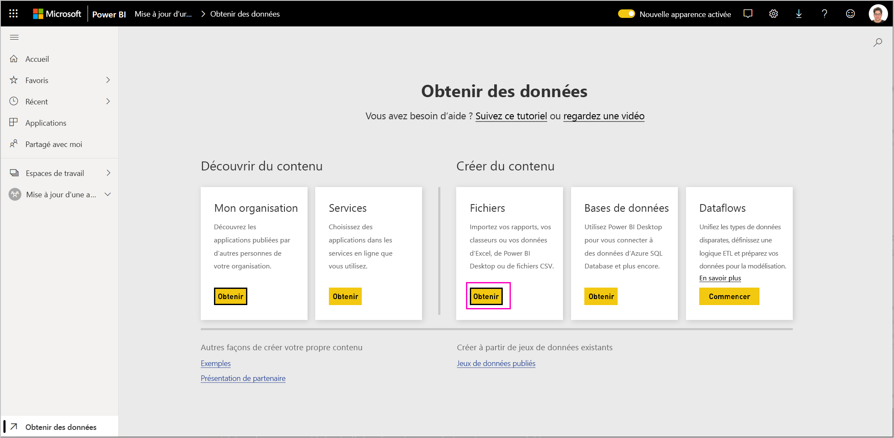
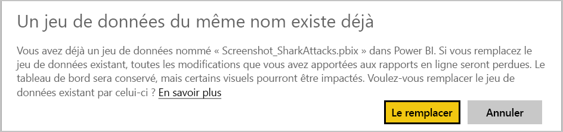

# Mettre à jour, supprimer et extraire une application modèle

Une fois que votre application est en production, vous pouvez recommencer la phase de test, tout en maintenant la continuité de l’application en production.
## Mettre à jour votre application

Si vous avez effectué les modifications dans Power BI Desktop, démarrez à l’étape (1). Si vous n’avez pas effectué les modifications dans Power BI Desktop, démarrez à l’étape (4).

1. Chargez le jeu de données mis à jour et remplacez le jeu de données existant. **Veillez à utiliser exactement le même nom de jeu de données**. Si vous utilisez un nom différent, un nouveau jeu de données est créé pour les utilisateurs qui mettent à jour l’application.

1. Importez le fichier pbix depuis votre ordinateur.

1. Confirmez le remplacement.

1. Dans le volet **Gestion des mises en production**, sélectionnez **Créer une application**.
1. Revenez en arrière dans le processus de création de l’application.
1. Après avoir défini les paramètres **Personnalisation**, **Contenu**, **Contrôle** et **Accès**, resélectionnez **Créer une application**.
1. Sélectionnez **Fermer** et revenez au volet **Gestion des mises en production**.

   Vous avez maintenant deux versions de l’application : la version en production, et une nouvelle version en phase de test.

    

1. Quand vous êtes prêt à promouvoir votre application en préproduction pour la tester en dehors de votre locataire, revenez au volet Gestion des mises en production et sélectionnez **Promouvoir l’application** à côté de **Test**.

   Vous avez maintenant une version en production et une version en préproduction.

   

   Votre lien est désormais en ligne. **Notez que le bouton Promouvoir l’application à l’étape de préproduction est grisé**. De cette façon, le lien de production actif à la version actuelle de l’application n’est pas accidentellement remplacé avant validation et approbation de la nouvelle version de l’application par le portail Cloud Partner.

1. Envoyez à nouveau votre lien au portail Cloud Partner (CPP) en suivant les étapes indiquées dans [Mettre à jour une offre d’application Power BI](https://docs.microsoft.com/azure/marketplace/cloud-partner-portal/power-bi/cpp-update-existing-offer). Dans le portail Cloud Partner, vous devez **republier** votre offre, qui doit être validée et approuvée.

   Une fois votre offre approuvée, le bouton Promouvoir l’application redevient actif. 
1. Promouvez votre application en phase de production.
   
### Comportement de la mise à jour

1. La mise à jour de l’application permet au programme d’installation de l’application modèle de [mettre à jour une application modèle](service-template-apps-install-distribute.md#update-a-template-app) dans l’espace de travail déjà installé sans perdre la configuration de la connexion.
1. Pour découvrir comment les modifications apportées au jeu de données affectent l’application modèle installée, consultez [comportement du remplacement](service-template-apps-install-distribute.md#overwrite-behavior).
1. Lors de la mise à jour (remplacement) d’une application modèle, elle rétablit d’abord les exemples de données et se reconnecte automatiquement avec la configuration de l’utilisateur (paramètres et authentification). Tant que l’actualisation n’est pas terminée, les rapports, les tableaux de bord et l’application d’organisation présentent la bannière de l’exemple de données.
1. Si vous avez ajouté un nouveau paramètre de requête au jeu de données mis à jour qui nécessite une entrée des utilisateurs, vous devez cocher la case *obligatoire*. Ceci demande la chaîne de connexion au programme d’installation après la mise à jour de l’application.
 

## Extraire l’espace de travail
La restauration de la version précédente d’une application modèle est désormais plus facile que jamais grâce à la fonctionnalité d’extraction. Les étapes suivantes traitent de l’extraction d’une version spécifique de l’application vers un nouvel espace de travail à partir de différentes phases de lancement :

1. Dans le volet de gestion de version, appuyez sur plus **(...)** , puis sur **Extraire**.

     
2. Dans la boîte de dialogue, entrez le nom de l’espace de travail extrait. un espace de travail est ajouté.

Le contrôle de version de votre nouvel espace de travail est réinitialisé et vous pouvez continuer à développer et à distribuer l’application modèle à partir de l’espace de travail qui vient d’être extrait.

## Supprimer une version d’application modèle
Un espace de travail modèle est la source d’une application modèle distribuée active. Pour protéger les utilisateurs d’applications modèles, il n’est pas possible de supprimer un espace de travail sans supprimer au préalable toutes les versions de l’application créées dans l’espace de travail.
La suppression d’une version de l’application supprime également l’URL de l’application, qui ne fonctionnera plus.

1. Dans le volet de gestion de version, appuyez sur les points de suspension **(...)** , puis sur **Supprimer**.
 
 

>[!NOTE]
>Veillez à ne pas supprimer la version de l’application utilisée par les clients ou par **AppSource** , sinon ils ne fonctionneront plus.

## Étapes suivantes

Découvrez de quelle manière vos clients peuvent interagir avec votre application modèle dans l’article [Installer, personnaliser et distribuer des applications modèles dans votre organisation](service-template-apps-install-distribute.md).

Pour plus d’informations sur la distribution de votre application, consultez [Offre d’application Power BI](https://docs.microsoft.com/azure/marketplace/cloud-partner-portal/power-bi/cpp-power-bi-offer).
