# Découverte du service Power BI
#### Juin 2017
Si vous utilisez le service Power BI depuis un certain temps, vous avez sans doute remarqué que nous avons apporté des modifications importantes à l’interface utilisateur.  La plupart de ces modifications affectent l’organisation de votre contenu (tableaux de bord, rapports, jeux de données) et les chemins d’accès (clics) que vous prenez pour effectuer des tâches avec ce contenu. 

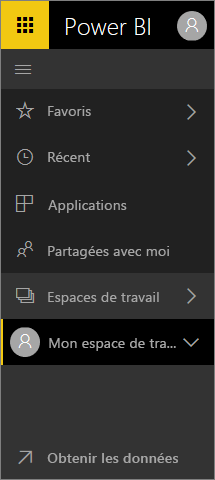

## Comment puis-je...
Ce guide de référence aide les utilisateurs familiarisés avec l’interface précédente du service Power BI à comprendre comment effectuer des tâches dans la nouvelle interface. Nous sommes conscients que vous pouvez être désorienté dans un premier temps, mais nous pensons que l’utilisation va vous permettre de découvrir les nombreux avantages en gain de temps de la nouvelle disposition. 

Guide de référence rapide

| Action | Nouveau chemin d’accès (actuel) |
| --- | --- | --- |
| Ajouter un tableau de bord aux favoris |Espace de travail > Tableaux de bord, puis sélectionner l’icône représentant une étoile pour l’afficher en jaune |
| Afficher la liste de vos tableaux de bord favoris |Sélectionner **Favoris** dans le volet de navigation gauche |
| Afficher la liste des rapports et tableaux de bord récemment consultés |Sélectionner **Récents** dans le volet de navigation gauche |
| Afficher la liste des tableaux de bord partagés avec vous |Sélectionner **Partagé avec moi** dans le volet de navigation gauche |
| Partager un tableau de bord |Ouvrir un tableau de bord et sélectionner **Partager** ou créer et publier une application |
| Supprimer un tableau de bord |Mon espace de travail > Tableaux de bord > icône Corbeille |
| Supprimer un rapport |Mon espace de travail > Rapports > icône Corbeille |
| Supprimer un jeu de données |Mon espace de travail > Jeux de données >... > Supprimer |
| Ouvrir un tableau de bord |Espace de travail > Tableaux de bord, puis sélectionner le nom du tableau de bord |
| Ouvrir un rapport |Espace de travail > Rapports, puis sélectionner le nom du rapport |
| Ouvrir un jeu de données |Espace de travail > Jeux de données, puis sélectionner le nom du jeu de données |
| Créer un tableau de bord |Dans la barre de navigation supérieure, sélectionner Créer > Tableau de bord |
| Créer un rapport |Dans la barre de navigation supérieure, sélectionner Créer > Rapport |
| Créer un jeu de données |Dans la barre de navigation supérieure, sélectionner Créer > Jeu de données |
| Créer une application |Espaces de travail > Créer un espace de travail d’application |
| Afficher la liste de l’ensemble des tableaux de bord, rapports et jeux de données dont vous êtes propriétaire |Espaces de travail > Mon espace de travail |

## Pourquoi avons-nous changé l’expérience de navigation du service Power BI ?
* Simplification des listes pour les tableaux de bord, rapports, classeurs et jeux de données    
* Ajout de menus volants d’accès rapide pour les favoris, les plus récents et la sélection d’espace de travail    
* Ajout d’un moyen d’identifier le contenu associé pour les tableaux de bord, les rapports et les jeux de données    
* Ajout d’une zone de contenu distincte pour les classeurs    
* Création d’une zone distincte pour vos tableaux de bord favoris    
* Création d’une zone distincte pour le contenu qui a été partagé avec vous 
* Création d’une zone distincte pour votre contenu le plus récent  
* Réduction du nombre de clics nécessaires pour accomplir des tâches -- Combinaison des listes de contenu et des actions que vous pouvez effectuer sur ce contenu dans un même écran. Par exemple, passage d’un tableau de bord et d’un rapport à l’autre.</td></tr></table>

Regardez Amanda présenter une visite guidée de la nouvelle expérience de navigation, en expliquant et illustrant les améliorations.  Suivez ensuite les instructions détaillées sous la vidéo pour explorer par vous-même.

<iframe width="560" height="315" src="https://www.youtube.com/embed/G26dr2PsEpk" frameborder="0" allowfullscreen></iframe>

## Nous avons ajouté certaines nouvelles fonctionnalités
## Affichage du contenu (tableaux de bord, rapports, classeurs, jeux de données, espaces de travail, applications)
Commençons par examiner comment le contenu de base (tableaux de bord, rapports, jeux de données, classeurs) est organisé. Auparavant, tout votre contenu était répertorié dans le volet de navigation de gauche. À présent, vous avez toujours cette option, mais la configuration par défaut consiste à afficher par type de contenu dans le contexte d’un espace de travail. Sélectionnez un espace de travail dans le volet de navigation de gauche. Les onglets correspondant au contenu associé (tableaux de bord, rapports, classeurs, jeu de données) occupent la zone de dessin de Power BI à droite.

Si vous avez une version gratuite de Power BI, vous voyez uniquement **Mon espace de travail**.

## Tableaux de bord favoris
Les**Favoris** vous permettent d’accéder rapidement aux tableaux de bord les plus importants pour vous.  

1. Lorsque le tableau de bord est ouvert, sélectionnez **Ajouter un favori** dans l’angle supérieur droit.
   
   
   
   **Ajouter un favori** devient **Retirer des favoris** et l’étoile devient jaune.
   
   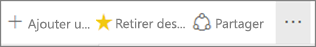
2. Pour afficher la liste de tous les tableaux de bord que vous avez ajoutés aux favoris, dans le volet de navigation gauche, sélectionnez la flèche à droite de **Favoris**. Étant donné que la navigation gauche est une fonctionnalité permanente du service Power BI, vous avez accès à cette liste quel que soit l’endroit où vous vous trouvez dans ce service.
   
    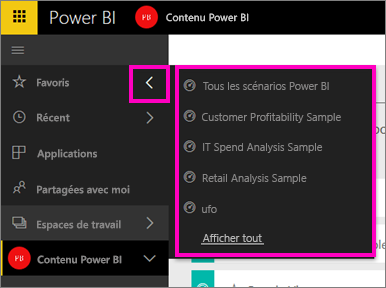
   
    Vous pouvez alors sélectionner un tableau de bord pour l’ouvrir.
3. Pour ouvrir le volet **Favoris**, dans le volet de navigation de gauche, sélectionnez **Favoris** ou l’icône Favoris .
   
   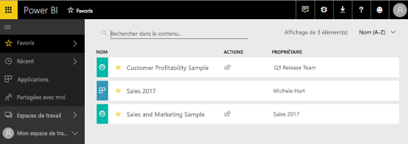
   
   Vous pouvez alors sélectionner un tableau de bord pour l’ouvrir, voir qui en est le propriétaire, supprimer le tableau de bord des favoris ou partager un tableau de bord avec vos collègues.
4. Une autre façon de marquer un tableau de bord comme favori est d’utiliser l’onglet **Tableaux de bord**.  Ouvrez simplement l’espace de travail qui contient le tableau de bord, puis sélectionnez l’icône en forme d’étoile à gauche du nom du tableau de bord.
   
   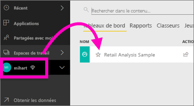

Pour en savoir plus, consultez [Ajouter un tableau de bord aux Favoris](service-dashboard-favorite.md)

## Récents
Accédez rapidement aux rapports et tableaux de bord que vous avez récemment consultés en visitant le volet **Récents**. Ce volet contient des informations issues de l’ensemble de vos espaces de travail.

  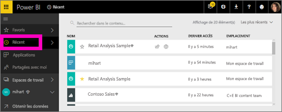

Comme avec les favoris, vous pouvez rapidement accéder à vos documents récents depuis n’importe où dans le service Power BI en sélectionnant la flèche en regard de **Récents** dans la navigation gauche.

  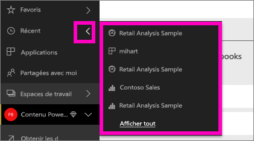

Pour en savoir plus, consultez [Récents dans Power BI](service-recent.md)

## Applications
Une application est une collection de tableaux de bord et de rapports destinés à fournir des métriques clés dans un seul emplacement. Vous pouvez avoir des applications internes à votre organisation, ainsi que des [applications pour des services externes](service-connect-to-services.md), tels que Google Analytics et Microsoft Dynamics CRM. 

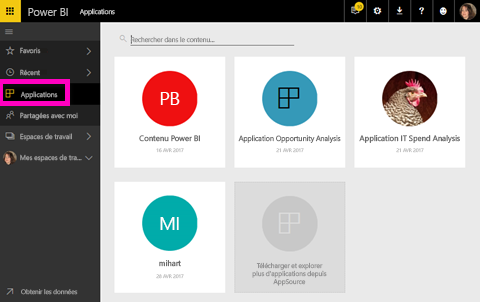

Pour en savoir plus, consultez **Espaces de travail d’application** (ci-dessous) et [Que sont les applications Power BI ?](service-install-use-apps.md).

## Partagé avec moi
**Partagé avec moi** est l’emplacement de tous les tableaux de bord que vos collègues ont partagés avec vous.  Filtrez par propriétaire de tableau de bord, utilisez le champ de recherche pour trouver ce qui est pertinent et triez les éléments par date.  En outre, vous pouvez facilement ajouter aux favoris le contenu partagé que vous consultez souvent, directement à partir de la vue **Partagé avec moi**.

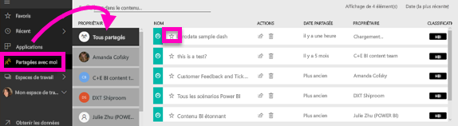

Pour en savoir plus, consultez [Partagé avec moi](service-shared-with-me.md).

## Utilisation des espaces de travail
Ensuite, dans le volet de navigation de gauche figurent les *espaces de travail*. Les espaces de travail peuvent être considérés comme des *conteneurs* pour le contenu Power BI. Il existe deux types d’espaces de travail : **Mon espace de travail** et les espaces de travail d’application.

Si vous n’êtes pas membre d’un espace de travail d’application ou administrateur, vous ne voyez peut-être pas d’espace de travail d’application dans votre volet de navigation gauche. Et si vous êtes un client Power BI gratuit, vous ne voyez aucun espace de travail d’application.

### Mon espace de travail
**Mon espace de travail** stocke tout le contenu que vous possédez. Considérez-le comme votre zone de travail ou bac à sable personnel pour votre propre contenu. À partir de Mon espace de travail, vous pouvez partager du contenu avec des collègues. Dans Mon espace de travail, votre contenu est organisé en 4 onglets : Tableaux de bord, Rapports, Classeurs et Jeux de données.

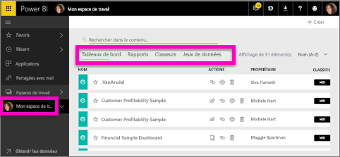

### Espaces de travail d’application
Les applications et espaces de travail d’application sont une caractéristique de Power BI Pro. Si vous créez des tableaux de bord et rapports pour d’autres, vous utilisez des espaces de travail d’application pour ce faire. Un espace de travail d’application étant l’emplacement dans lequel vous créez l’application, pour créer une application, vous devez commencer par créer l’espace de travail d’application correspondant. Ils constituent l’évolution des espaces de travail de groupe, avec des zones intermédiaires et des conteneurs pour le contenu des applications.  Vos collègues et vous pouvez collaborer sur des tableaux de bord, rapports et autres contenus que vous prévoyez de distribuer à un public plus large, voire à votre organisation toute entière.

Pour en savoir plus, visitez [Créer et distribuer une application dans Power BI](service-create-distribute-apps.md#app-workspaces).

Comment dans **Mon espace de travail**, votre contenu est organisé en 4 onglets : Tableaux de bord, Rapports, Classeurs et Jeux de données.

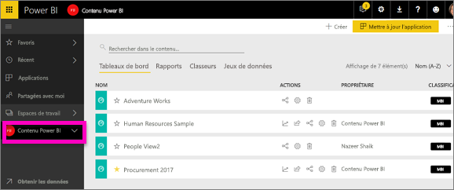

Pour passer d’un espace de travail à l’autre, sélectionnez **Espaces de travail** dans le volet de navigation de gauche.

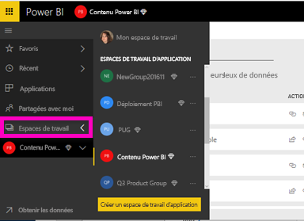

## Rechercher et trier du contenu
Le nouvel affichage du contenu facilite la recherche, le filtrage et le tri du contenu. Pour rechercher un tableau de bord, un rapport ou un classeur, tapez dans la zone de recherche. Power BI filtre uniquement le contenu qui contient votre chaîne de recherche.

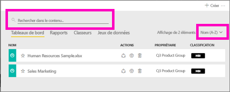

Vous pouvez également trier le contenu par nom ou propriétaire.  

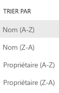

Pour en savoir plus, consultez [Navigation dans Power BI : rechercher, trier, filtrer](service-navigation-search-filter-sort.md).

Vous avez des questions ou des commentaires ? [Visitez le forum de la communauté Power BI](http://community.powerbi.com/t5/Navigation-Preview-Forum/bd-p/NavigationPreview).

