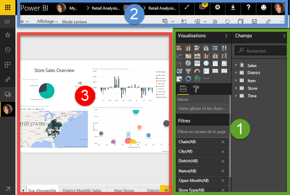
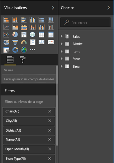
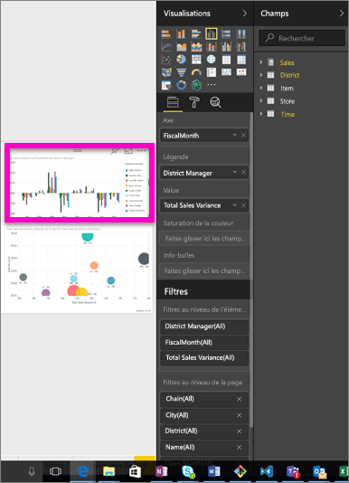
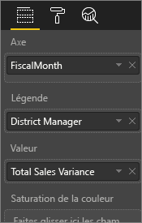
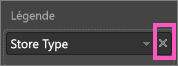
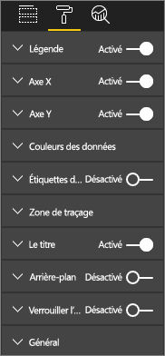
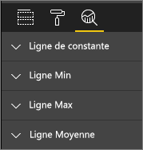
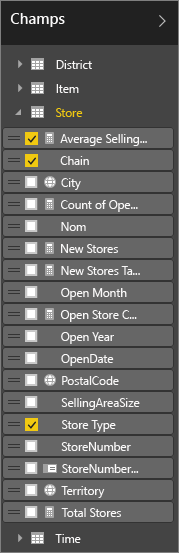

# Découverte de l’éditeur de rapport
L’éditeur de rapport dans le service Power BI et l’éditeur de rapport dans Power BI Desktop sont très similaires. La vidéo montre l’éditeur de rapport dans Power BI Desktop et cet article montre l’éditeur de rapport dans le service Power BI. 

<iframe width="560" height="315" src="https://www.youtube.com/embed/IkJda4O7oGs" frameborder="0" allowfullscreen></iframe>

Dans le service Power BI, l’*éditeur de rapport* est disponible uniquement en [mode Édition](service-reading-view-and-editing-view.md). Pour ouvrir un rapport en mode Édition, vous devez être propriétaire d’un rapport.

L’éditeur de rapport dans Power BI comprend 3 sections :  

1. les volets **Champs**, **Visualisations**, et **Filtres**
2. barres de navigation supérieures    
3. canevas de rapport     

## 1. Volets de l’éditeur de rapport

Lorsque vous ouvrez un rapport pour la première fois, 3 volets sont visibles : Visualisations, Filtres et Champs. Les volets du côté gauche, Visualisations et Filtres, contrôlent l’aspect de vos visualisations : type, couleurs, filtrage, mise en forme.  Le volet du côté droit, Champs, gère les données sous-jacentes utilisées dans les visualisations. 

Le contenu affiché dans l’éditeur de rapport varie en fonction des sélections effectuées dans le canevas de rapport.  Par exemple, lorsque vous sélectionnez un élément visuel individuel, 

|  |  |
| --- | --- |
|  |<ul><li>La partie supérieure du volet Visualisations identifie le type de visuel en cours d’utilisation. Dans cet exemple, il s’agit d’un histogramme groupé.  </li> <li>La partie inférieure du volet Visualisations (il se peut que vous deviez défiler vers le bas) affiche les champs utilisés dans le visuel. Ce graphique utilise les champs FiscalMonth, DistrictManager et Total Sales Variance.   </li><li>Le volet Filtres (il se peut que vous deviez faire défiler vers le bas) affiche tous les filtres appliqués.   </li><li>Le volet Champs répertorie les tables disponibles et, si vous développez le nom d’une table, les champs qui composent celle-ci. Une police de couleur jaune indique qu’au moins un champ de cette table est utilisé dans la visualisation.  </li><li> Pour afficher le volet de mise en forme, pour la visualisation sélectionnée, choisissez l’icône Rouleau de peinture.  </li><li>Pour afficher le volet d’analyse, sélectionnez l’icône Loupe.</ul> |
|  | |

## Le volet Visualisation (de haut en bas)

Voici où sélectionner un type de visualisation. Les petites images sont appelées *modèles*. Dans l’image ci-dessus, le graphique à barres groupées est sélectionné. Si vous ne sélectionnez pas de type de visualisation au départ, mais commencez à générer une visualisation en sélectionnant des champs, Power BI choisit le type de visualisation pour vous. Vous pouvez conserver la sélection de Power BI ou modifier le type en sélectionnant un autre modèle. Vous pouvez en changer autant de fois que nécessaire jusqu’à trouver le type de visualisation représentant le mieux vos données.

### Gérez les champs utilisés dans votre visuel.

Les compartiments (parfois appelés *puits*) affichés dans ce volet varient en fonction du type de visualisation que vous avez sélectionné.  Par exemple, si vous avez sélectionné un graphique à barres, des compartiments s’affichent pour Valeurs, Axe et Légende. Lorsque vous sélectionnez un champ, ou que vous le faites glisser sur le canevas, Power BI ajoute ce champ à l’un des compartiments.  Vous pouvez également faire glisser des champs de la liste Champs directement vers les compartiments.  Certains compartiments sont limités à certains types de données.  Par exemple, **Valeurs** n’accepte pas les champs non numériques. Par conséquent, si vous faites glisser un champ **employeename** dans le compartiment **Valeurs**, Power BI le remplace par **count of employeename**.

### Supprimer un champ
Pour supprimer un champ de la visualisation, sélectionnez le **X** à droite de son nom.

Pour plus d’informations, consultez [Ajouter des visualisations à un rapport Power BI](power-bi-report-add-visualizations-i.md).

### Mettre en forme vos éléments visuels
Sélectionnez l’icône Rouleau de peinture pour afficher le volet de mise en forme. Les options disponibles varient selon le type de la visualisation sélectionnée.

Les possibilités de mise en forme sont pratiquement illimitées.  Pour en savoir plus, explorez par vous-même ou consultez les articles suivants :

* [Personnalisation du titre, de l’arrière-plan et de la légende de la visualisation](power-bi-visualization-customize-title-background-and-legend.md)
* [Mise en forme des couleurs](service-getting-started-with-color-formatting-and-axis-properties.md)
* [Personnalisation des propriétés des axes X et Y](power-bi-visualization-customize-x-axis-and-y-axis.md)

### Ajouter des analyses à vos visualisations
Sélectionnez l’icône Loupe pour afficher le volet Analyse. Les options disponibles varient selon le type de la visualisation sélectionnée.

    
Le volet Analyse du service Power BI vous permet d’ajouter des lignes de référence dynamiques aux visualisations et de vous focaliser sur les tendances ou informations importantes. Pour en savoir plus, voir [Volet Analyse du service Power BI](service-analytics-pane.md) ou [Volet Analyse de Power BI Desktop](desktop-analytics-pane.md).

- - -
## Le volet Filtres
Affichez, définissez et modifiez les filtres de page, de rapport, d’extraction et de visuel.

Pour plus d’informations, consultez [Ajouter un filtre à un rapport](power-bi-report-add-filter.md).

- - -
## Le volet Champs
Le volet Champs affiche les tables et les champs qui existent dans vos données et sont disponibles pour créer des visualisations.

|  |  |
| --- | --- |
|  |<ul><li>Faites glisser un champ sur la page pour démarrer une nouvelle visualisation.  Vous pouvez également faire glisser un champ sur une visualisation existante pour y ajouter ce champ.  </li> <li>Lorsque vous ajoutez une coche en regard d’un champ, Power BI ajoute ce champ à la visualisation active (ou nouvelle). Il choisit également le compartiment dans lequel placer ce champ.  Par exemple, le champ doit-il être utilisé en tant que légende, axe ou valeur ? Power BI fait la meilleure hypothèse et vous pouvez déplacer le champ de ce compartiment vers un autre si nécessaire.   </li><li>Dans les deux cas, chaque champ sélectionné est ajouté au volet Visualisations dans l’éditeur de rapport.</li></ul> |

**REMARQUE** : si vous utilisez Power BI Desktop, vous pouvez également afficher/masquer des champs, ajouter des calculs, etc.

### Que signifient les icônes de champ ?
* **∑ Agrégats** Un agrégat est une valeur numérique additionnée, ou qui fait l’objet d’une moyenne, par exemple. Les agrégats sont importés avec les données (définies dans le modèle de données sur lequel votre rapport est basé).
  Pour plus d’informations, consultez [Agrégats dans des rapports Power BI](service-aggregates.md).
* **Mesures calculées (également appelées champs calculés)**  
   Chaque champ calculé a sa propre formule codée en dur. Vous ne pouvez pas modifier le calcul ; par exemple, s’il s’agit d’une somme, il peut uniquement être une somme. Pour plus d’informations, voir [Présentation des mesures](desktop-measures.md).
*  **Champs uniques**  
   Les champs portant cette icône ont été importés à partir d’Excel et sont configurés pour afficher toutes les valeurs, même si elles ont des doublons. Par exemple, vos données peuvent avoir deux enregistrements pour les personnes nommées « John Smith », et chacun est traité comme étant unique. Ils ne seront pas additionnés.  
* ** Champs de géographie**  
   Les champs d’emplacement peuvent être utilisés pour créer des visualisations de cartes. 
* ** Hiérarchie**  
   Sélectionnez la flèche pour afficher les champs qui composent la hiérarchie. 

- - -
## 2. Barre de navigation supérieure
Les actions disponibles dans la barre de navigation supérieure sont nombreuses, et de nouvelles actions sont en permanence ajoutées. Pour plus d’informations sur une action en particulier, utilisez la zone de recherche ou la table des matières de la documentation de Power BI.

## 3. Canevas de rapport
Le canevas de rapport est l’emplacement où votre travail s’affiche. Lorsque vous utilisez les volets Champs, Filtres et Visualisations pour créer des visuels, ceux-ci sont générés et affichés sur le canevas de rapport. Chaque onglet au bas du canevas représente une page du rapport. Sélectionnez un onglet pour ouvrir cette page. 

## Étapes suivantes :
[Créer un rapport](service-report-create-new.md)

[Modifier un rapport](service-interact-with-a-report-in-editing-view.md)

En savoir plus sur les [rapports dans Power BI](service-reports.md)

[Prise en main de Power BI](service-get-started.md)

[Power BI – Concepts de base](service-basic-concepts.md)

D’autres questions ? [Posez vos questions à la communauté Power BI](http://community.powerbi.com/)

