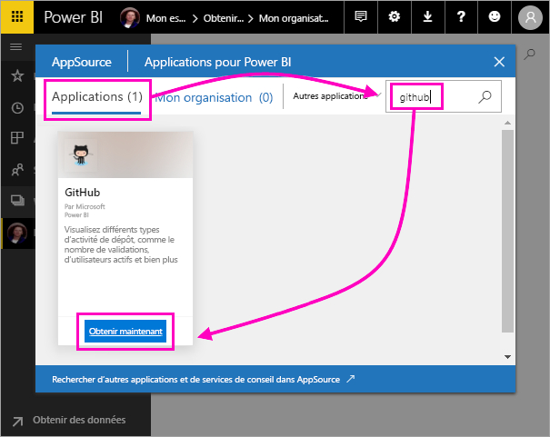
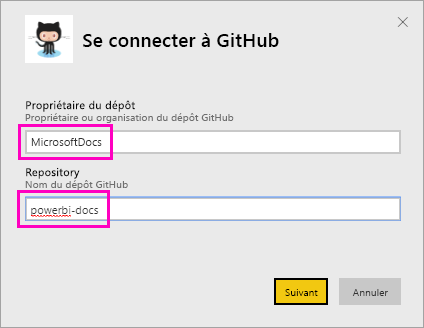
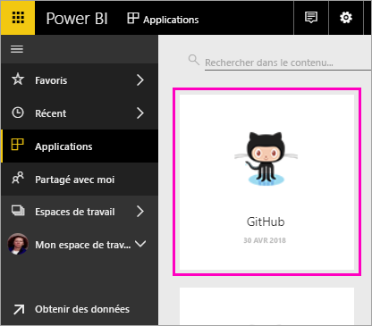
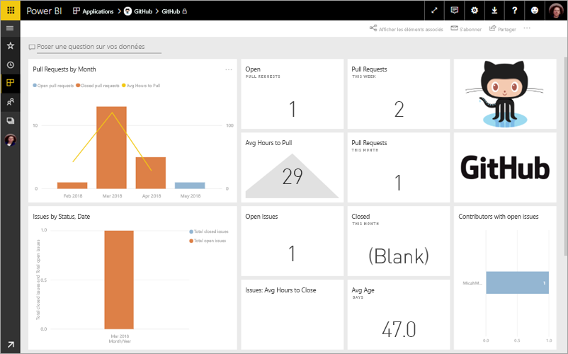
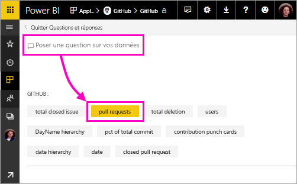
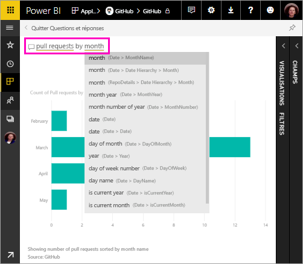
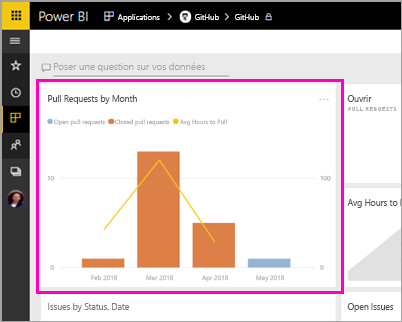
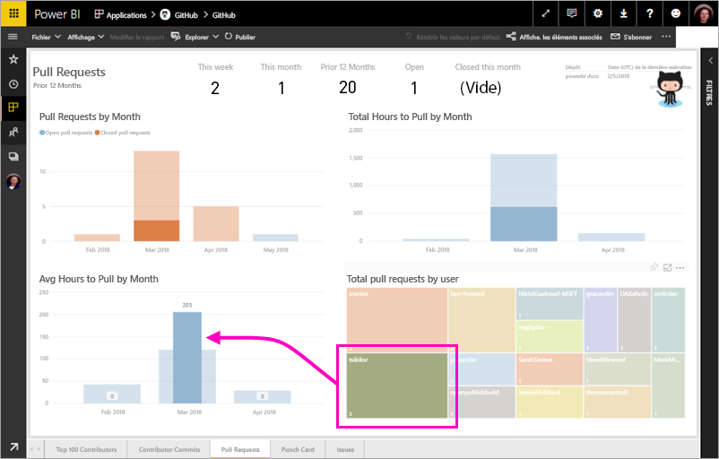

# Tutoriel : Se connecter à un exemple GitHub à l’aide de Power BI
Dans ce tutoriel, vous vous connectez à de vraies données disponibles dans le service GitHub à l’aide de Power BI, qui crée automatiquement des rapports et des tableaux de bord. Vous vous connectez au dépôt public de contenu Power BI (également appelé *référentiel*) et, à partir des informations affichées, vous obtenez des réponses à ces questions : Combien de personnes contribuent au contenu public Power BI ? Qui y contribue le plus ? Quel jour de la semaine enregistre le plus de contributions ? Et des réponses à d’autres questions. 

Ce tutoriel vous montre comment effectuer les étapes suivantes :

> [!div class="checklist"]
> * Demander un compte GitHub, si vous n’en avez pas encore 
> * Vous connecter au service avec votre compte Power BI, ou en demander un si vous n’en avez pas
> * Ouvrir le service Power BI
> * Rechercher l’application GitHub
> * Entrer les informations relatives au dépôt GitHub public dans Power BI
> * Afficher le tableau de bord et le rapport avec les données GitHub
> * Nettoyer les ressources en supprimant l’application

Si vous n’êtes pas inscrit à Power BI, [inscrivez-vous à un essai gratuit](https://app.powerbi.com/signupredirect?pbi_source=web) avant de commencer.

## Conditions préalables

Pour suivre ce tutoriel, vous avez besoin d’un compte GitHub (demandez-en un si vous n’en avez pas). 

- Demander un [compte GitHub](https://docs.microsoft.com/contribute/get-started-setup-github)

## Comment se connecter
1. Connectez-vous au service Power BI (http://powerbi.com). 
2. Dans le volet de navigation de gauche, sélectionnez **Applications**, puis **Obtenir des applications**.
   
    

3. Sélectionnez **Applications**, tapez **github** dans la zone de recherche > **Get it now** (Obtenir l’application maintenant).
   
    

4. Entrez le nom et le propriétaire du dépôt. L’URL de ce dépôt étant https://github.com/MicrosoftDocs/powerbi-docs, le **Propriétaire du dépôt** est **MicrosoftDocs** et le **Dépôt** est **powerbi-docs**. 
   
    

5. Entrez les informations d’identification GitHub que vous avez créées. Power BI ignore cette étape si vous êtes déjà connecté à GitHub dans votre navigateur. 

6. Pour la **Méthode d’authentification**, sélectionnez **oAuth2** \> **Se connecter**.

7. Suivez les écrans d’authentification Github. Accordez l’autorisation d’accès Power BI aux données GitHub.
   
   Power BI peut maintenant se connecter à GitHub et aux données.  Les données sont actualisées une fois par jour.

8. Une fois que Power BI a importé les données, vous voyez la nouvelle vignette GitHub. 
 
    

8. Sélectionnez l’icône de navigation globale pour réduire le volet de navigation de gauche et afficher la fenêtre en plus grand.

    

10. Sélectionnez la vignette GitHub de l’étape 8. 
    
    Le tableau de bord GitHub s’ouvre. Il est possible que vous voyiez des valeurs différentes, car il s’agit de données actives.

    

    

## Poser une question

11. Placez votre curseur dans la zone **Ask a question about your data** (Poser une question sur vos données), puis sélectionnez **pull requests** (demandes de tirage). 

    

12. Tapez **by month** (par mois).
 
    

     Power BI crée un graphique à barres qui montre le nombre de demandes de tirage par mois.

13. Sélectionnez **Exit Q&A** (Quitter Questions et réponses).

## Afficher le rapport GitHub 

1. Dans le tableau de bord GitHub, sélectionnez le graphique combiné en colonnes et en courbes **Pull Requests by Month** (Demandes de tirage par mois) pour ouvrir le rapport associé.

    

2. Sélectionnez un nom d’utilisateur dans le graphique **Total pull requests by user** (Nombre total de demandes de tirage par utilisateur). Comme le montre cet exemple, le nombre moyen d’heures est supérieur à la moyenne totale pour mars.

    

3. Sélectionnez l’onglet **Punch Card** (Carte perforée) pour afficher la page suivante du rapport. 
 
    

    Comme vous pouvez le remarquer, c’est le mardi à 15 h qu’il y a le plus de *contributions*, au moment où les utilisateurs valident leur travail.

## Nettoyer les ressources

Maintenant que vous avez terminé le tutoriel, vous pouvez supprimer l’application GitHub. 

1. Dans le volet de navigation de gauche, sélectionnez **Applications**.
2. Placez le curseur sur la vignette GitHub et sélectionnez la poubelle **Supprimer**.

    

## Étapes suivantes

Dans ce tutoriel, vous vous êtes connecté à un dépôt public GitHub et vous avez obtenu des données, que Power BI a mises en forme dans un tableau de bord et un rapport. Vous avez répondu à certaines questions en explorant les données du tableau de bord et du rapport. Vous pouvez maintenant découvrir comment vous connecter à d’autres services, tels que Salesforce, Microsoft Dynamics et Google Analytics. 
 
> [!div class="nextstepaction"]
> [Se connecter aux services en ligne que vous utilisez](./service-connect-to-services.md)

