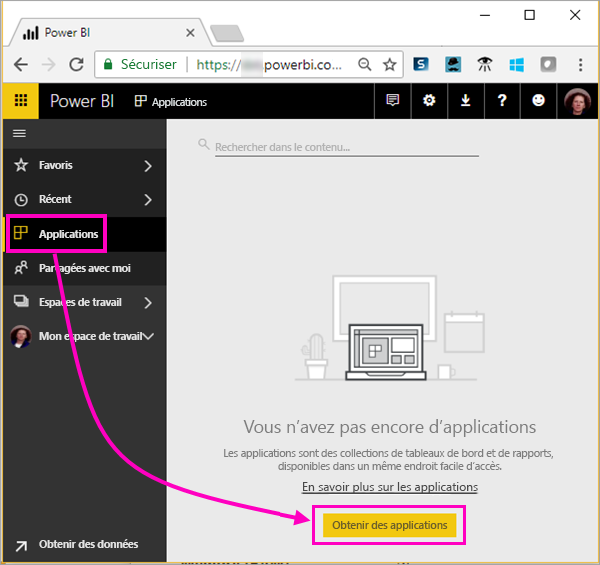
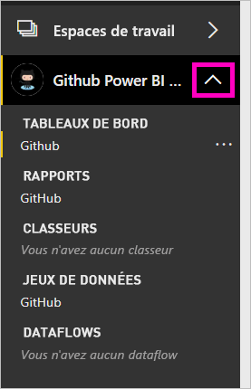
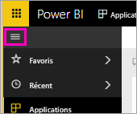

# Tutoriel : Se connecter à un dépôt GitHub à l’aide de Power BI
Dans ce tutoriel, vous vous connectez à de vraies données disponibles dans le service GitHub à l’aide de Power BI, qui crée automatiquement des rapports et des tableaux de bord. Vous vous connectez au dépôt public de contenu Power BI (également appelé *référentiel*) et, à partir des informations affichées, vous obtenez des réponses à des questions telles que celles-ci : Combien de personnes contribuent au contenu public Power BI ? Qui y contribue le plus ? Quel jour de la semaine enregistre le plus de contributions ? Et d’autres questions. 

Ce tutoriel vous montre comment effectuer les étapes suivantes :

> [!div class="checklist"]
> * Demander un compte GitHub, si vous n’en avez pas encore 
> * Vous connecter au service avec votre compte Power BI, ou en demander un si vous n’en avez pas
> * Ouvrir le service Power BI
> * Rechercher l’application GitHub
> * Entrer les informations relatives au dépôt GitHub public dans Power BI
> * Afficher le tableau de bord et le rapport avec les données GitHub
> * Nettoyer les ressources en supprimant l’application

Si vous n’êtes pas inscrit à Power BI, [inscrivez-vous à un essai gratuit](https://app.powerbi.com/signupredirect?pbi_source=web) avant de commencer.

## Prérequis

Pour suivre ce tutoriel, vous avez besoin d’un compte GitHub (demandez-en un si vous n’en avez pas). 

- Demandez un [compte GitHub](https://docs.microsoft.com/contribute/get-started-setup-github).

## Comment se connecter
1. Connectez-vous au service Power BI (`https://app.powerbi.com`). 
2. Dans le volet de navigation, sélectionnez **Applications**, puis **Obtenir des applications**.
   
    

3. Sélectionnez **Applications**, tapez **GitHub** dans la zone de recherche > **Get it now** (Obtenir l’application maintenant).
   
    

4. Dans **Installer cette application Power BI ?** , sélectionnez**Installer**.
5. Dans **Votre nouvelle application est prête**, sélectionnez **Accéder à l’application**.
6. Dans **Démarrer avec votre nouvelle application**, sélectionnez **Se connecter**.

    

7. Entrez le nom et le propriétaire du dépôt. L’URL de ce dépôt étant https://github.com/MicrosoftDocs/powerbi-docs, le **Propriétaire du dépôt** est **MicrosoftDocs** et le **Dépôt** est **powerbi-docs**. 
   
    

5. Entrez les informations d’identification GitHub que vous avez créées. Power BI ignore cette étape si vous êtes déjà connecté à GitHub dans votre navigateur. 

6. Pour la **Méthode d’authentification**, conservez l’option **oAuth2** sélectionnée \>**Se connecter**.

7. Suivez les écrans d’authentification GitHub. Accordez l’autorisation d’accès Power BI aux données GitHub.
   
   Power BI peut maintenant se connecter à GitHub et aux données.  Les données sont actualisées une fois par jour.

8. Une fois les données importées dans Power BI, le contenu de votre nouvel espace de travail GitHub s’affiche. 
9. Sélectionnez la flèche à côté du nom de l’espace de travail dans le volet de navigation. L’espace de travail contient un tableau de bord et un rapport. 

    

10. Sélectionnez **Plus d’options** (...) en regard du nom du tableau de bord > **Renommer** > tapez **Tableau de bord GitHub**.
 
     

8. Sélectionnez l’icône de navigation globale pour réduire le volet de navigation de façon à disposer de plus d’espace.

    

10. Sélectionnez votre tableau de bord GitHub.
    
    Vous verrez peut-être des valeurs différentes, car le tableau de bord GitHub contient des données actives.

    

    

## Poser une question

1. Placez votre curseur dans la zone **Poser une question sur vos données**. Power BI propose **Questions pour vous aider à démarrer**. 

1. Sélectionnez **how many users are there** (combien y a-t-il d’utilisateurs).
 
    

13. Entre **how many** et **users are there**, tapez **pull requests per** (demandes de tirage par). 

     Power BI crée un graphique à barres qui montre le nombre de demandes de tirage par personne.

    

13. Sélectionnez l’épingle pour l’épingler à votre tableau de bord, puis quittez **Questions et réponses**.

## Afficher le rapport GitHub 

1. Dans le tableau de bord GitHub, sélectionnez l’histogramme **Pull Requests by Month** (Demandes de tirage par mois) pour ouvrir le rapport associé.

    

2. Sélectionnez un nom d’utilisateur dans le graphique **Total pull requests by user** (Nombre total de demandes de tirage par utilisateur). Dans cet exemple, nous voyons que la plupart de ses heures se trouvent en février.

    

3. Sélectionnez l’onglet **Punch Card** (Carte perforée) pour afficher la page suivante du rapport. 
 
    

    Comme vous pouvez le remarquer, c’est le mardi à 15 h qu’il y a le plus de *commits*, au moment où les utilisateurs valident leur travail.

## Nettoyer les ressources

Maintenant que vous avez terminé le tutoriel, vous pouvez supprimer l’application GitHub. 

1. Dans le volet de navigation, sélectionnez **Applications**.
2. Placez le curseur sur la vignette GitHub et sélectionnez la poubelle **Supprimer**.

    

## Étapes suivantes

Dans ce tutoriel, vous vous êtes connecté à un dépôt public GitHub et vous avez obtenu des données, que Power BI a mises en forme dans un tableau de bord et un rapport. Vous avez répondu à certaines questions en explorant les données du tableau de bord et du rapport. Vous pouvez maintenant découvrir comment vous connecter à d’autres services, tels que Salesforce, Microsoft Dynamics et Google Analytics. 
 
> [!div class="nextstepaction"]
> [Se connecter aux services en ligne que vous utilisez](service-connect-to-services.md)

