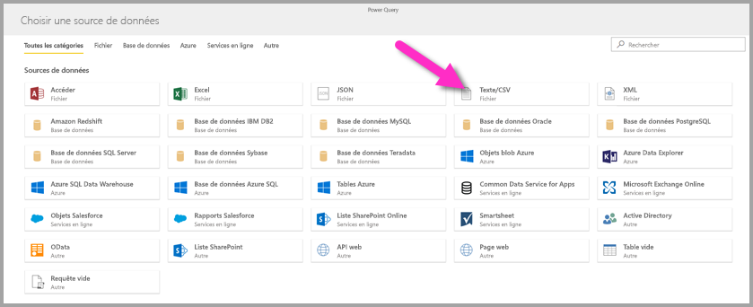
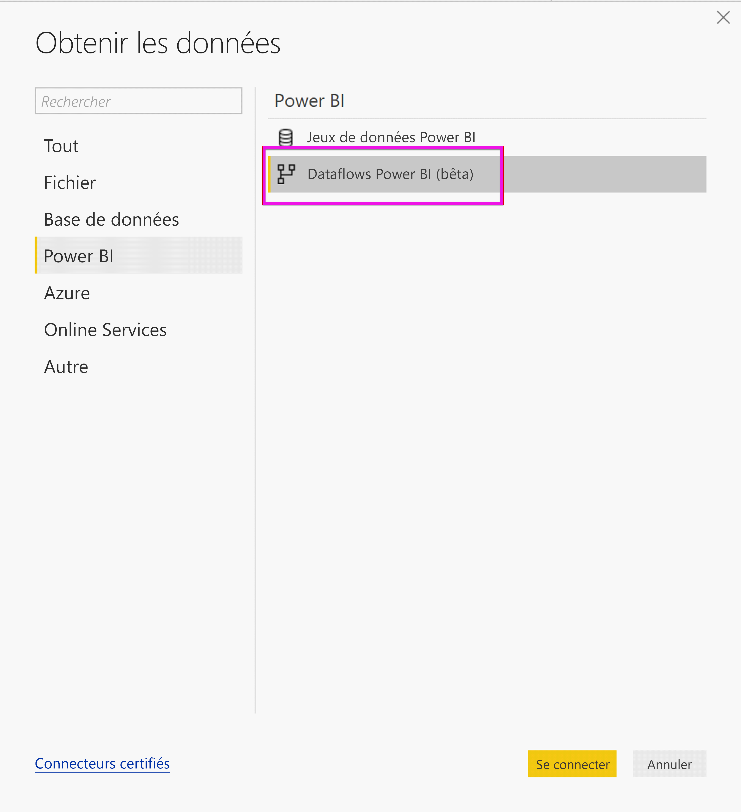
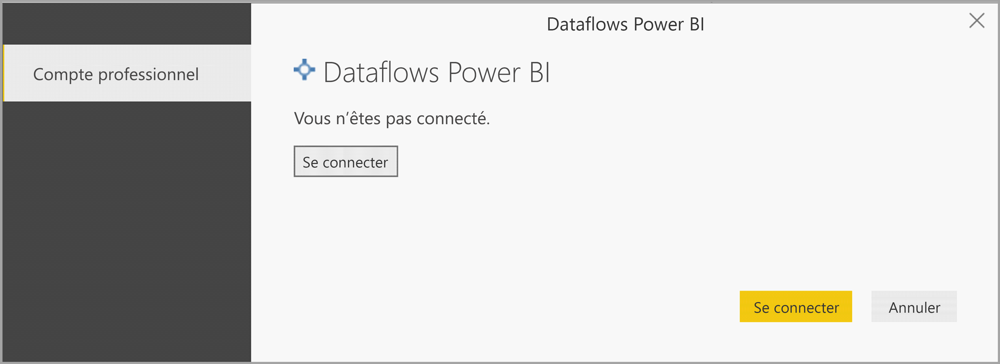
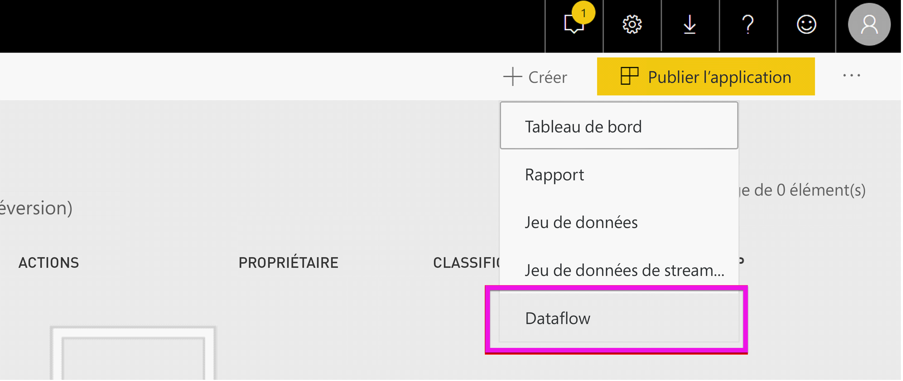
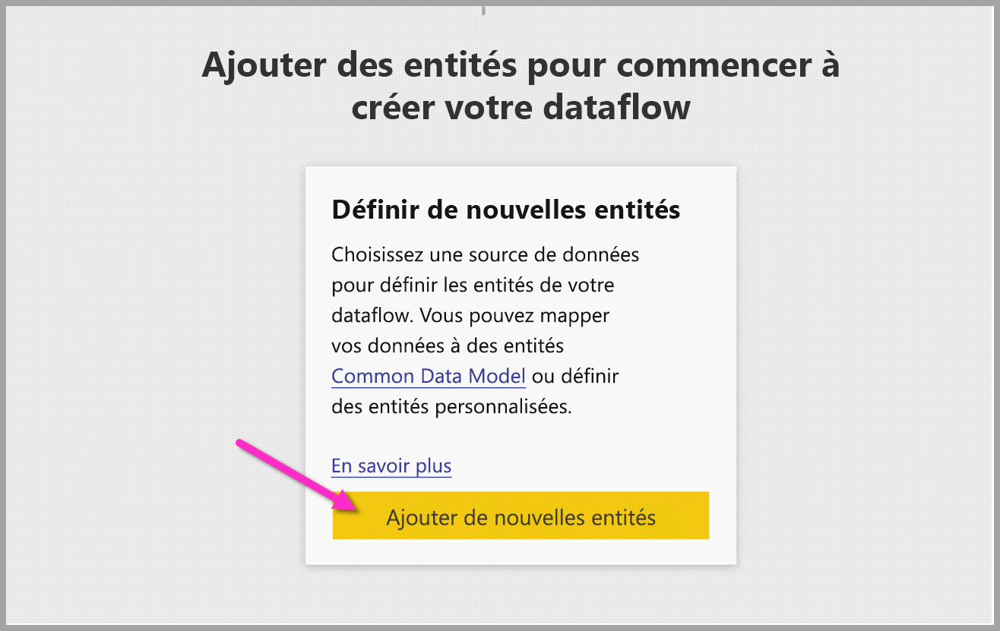
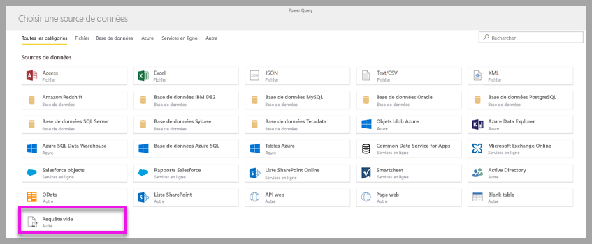
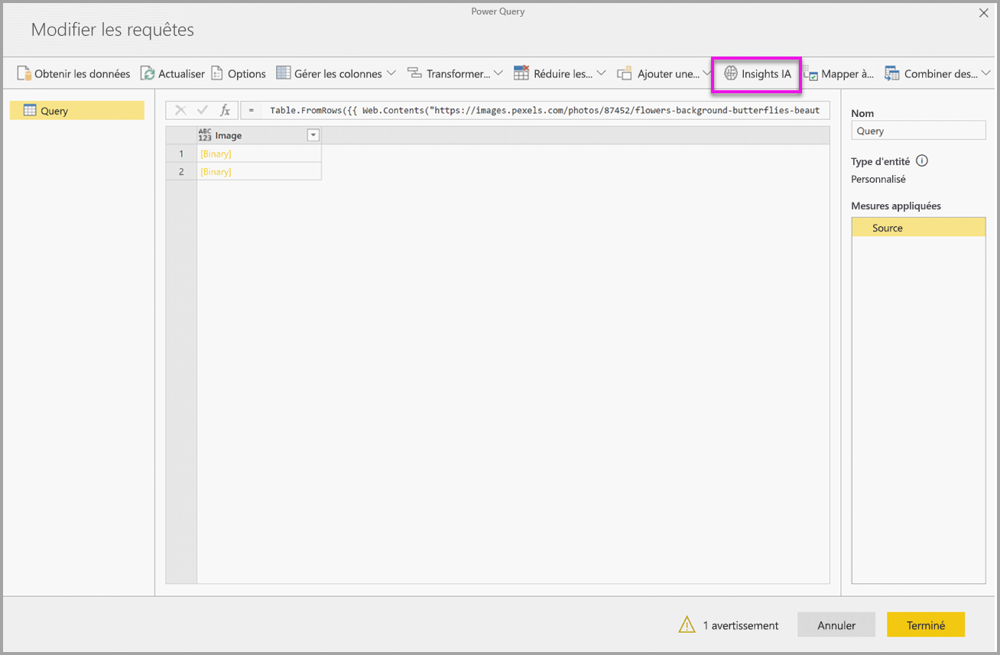

# <a name="tutorial-use-cognitive-services-in-power-bi"></a>Tutoriel : Utiliser Cognitive Services dans Power BI

Power BI permet d’accéder à un ensemble de fonctions d’Azure Cognitive Services pour enrichir vos données dans la préparation des données de libre-service pour les flux de données. Les services actuellement pris en charge sont l’[analyse des sentiments](https://docs.microsoft.com/azure/cognitive-services/text-analytics/how-tos/text-analytics-how-to-sentiment-analysis), l’[extraction de phrases clés](https://docs.microsoft.com/azure/cognitive-services/text-analytics/how-tos/text-analytics-how-to-keyword-extraction), la [détection de langue](https://docs.microsoft.com/azure/cognitive-services/text-analytics/how-tos/text-analytics-how-to-language-detection) et le [balisage des images](https://docs.microsoft.com/azure/cognitive-services/computer-vision/concept-tagging-images). Les transformations sont exécutées sur le service Power BI et ne nécessitent pas d’abonnement Azure Cognitive Services. Cette fonctionnalité requiert Power BI Premium.

Les transformations de Cognitive Services sont prises en charge dans la [préparation des données de libre-service pour les flux de données](https://powerbi.microsoft.com/blog/introducing-power-bi-data-prep-wtih-dataflows/). Utilisez les exemples pas à pas pour l’analyse de texte et le balisage des images balisage ci-dessous pour commencer.

Dans ce tutoriel, vous allez découvrir comment :

> [!div class="checklist"]
> * importer des données dans un flux de données ;
> * noter les sentiments et extraire les phrases clés d’une colonne de texte dans un flux de données ;
> * vous connecter aux résultats à partir de Power BI Desktop.


## <a name="prerequisites"></a>Prérequis

Pour suivre ce tutoriel, vous devez avoir de ce qui suit : 

- un compte Power BI. Si vous n’êtes pas inscrit à Power BI, [inscrivez-vous à un essai gratuit](https://app.powerbi.com/signupredirect?pbi_source=web) avant de commencer.
- Accès à une capacité Power BI Premium avec la charge de travail IA activée. Cette charge de travail est désactivée par défaut dans préversion. Si vous utilisez dans une capacité Premium et que les insights IA ne s’affichent pas, contactez votre administrateur de capacité Premium pour activer la charge de travail IA dans le portail d’administration.

## <a name="text-analytics"></a>Analyse de texte

Suivez les étapes décrites dans cette section pour terminer la partie analyse de texte de ce tutoriel.

### <a name="step-1-apply-sentiment-scoring-in-power-bi-service"></a>Étape 1 : Appliquez le scoring des sentiments dans le service Power BI

Pour commencer, accédez à un espace de travail Power BI avec une capacité Premium et créez un flux de données à l’aide du bouton **Créer** dans le coin supérieur droit de l’écran.


La boîte de dialogue de flux de données vous montre les options de création d’un flux de données, sélectionnez **Ajouter de nouvelles entités.** Ensuite, choisissez **Texte/CSV** dans le menu des sources de données.



Collez cette URL dans le champ d’URL : [https://pbiaitutorials.blob.core.windows.net/textanalytics/FabrikamComments.csv](https://pbiaitutorials.blob.core.windows.net/textanalytics/FabrikamComments.csv) et cliquez sur **Suivant.**


Les données sont maintenant prêtes à utiliser pour l’analyse de texte, et nous pouvons utiliser le scoring des sentiments et l’extraction de phrases clés sur la colonne de commentaires client.

Dans l’éditeur Power Query, sélectionnez **Insights d’IA**


Développez le dossier **Cognitive Services** et sélectionnez la fonction que vous souhaitez utiliser. Cet exemple montre le scoring du sentiment de la colonne de commentaires, mais vous pouvez suivre les mêmes étapes pour tester la détection de langue et l’extraction de phrases clés.


Lorsqu’une fonction est sélectionnée, les champs obligatoires et facultatifs s’affichent. Pour noter le sentiment des exemples d’évaluation, sélectionnez la colonne des évaluations comme entrée de texte. Les informations sur la culture sont une entrée facultative et requièrent un format ISO. Par exemple, entrez « en » si vous souhaitez que le texte soit traité en tant que texte anglais. Lorsque le champ est laissé vide, Power BI commence par détecter la langue de la valeur d’entrée avant de noter le sentiment.


Sélectionnez à présent **Appeler** pour exécuter la fonction. Une nouvelle colonne avec le score du sentiment pour chaque ligne est ajoutée à la table. Vous pouvez revenir à **Insights d’IA** pour extraire les phrases clés du texte d’évaluation de la même façon.

Une fois que vous avez terminé les transformations, modifiez le nom de la requête en « Commentaires client » et sélectionnez **Terminé.**


Ensuite, **Enregistrez** le flux de données et nommez-le Fabrikam. Sélectionnez le bouton **Actualiser maintenant**, qui s’affiche après l’enregistrement du flux de données.


Une fois que le flux de données est enregistré et actualisé, vous pouvez l’utiliser dans un rapport Power BI.

### <a name="step-2-connect-from-power-bi-desktop"></a>Étape 2 : se connecter à partir de Power BI Desktop

Ouvrez Power BI Desktop. Dans le ruban Accueil, sélectionnez **Obtenir des données**.

Accédez au **flux de données Power BI (version bêta**) dans la section Power BI et sélectionnez **Se connecter.**



Comme il s’agit d’une fonctionnalité de préversion, le connecteur vous demandera d’accepter les conditions de la préversion. Après les avoir acceptées, connectez-vous avec votre compte professionnel.



Sélectionnez le flux de données que vous venez de créer. Accédez à la table de commentaires client et cliquez sur **Charger.**


Maintenant que les données sont chargées, vous pouvez commencer à générer un rapport.

## <a name="image-tagging"></a>Balisage des images

Accédez à un espace de travail Power BI avec une capacité Premium. Créez un flux de données à l’aide du bouton **Créer** dans le coin supérieur droit de l’écran.



Sélectionnez **Ajouter de nouvelles entités**.



Une fois que vous êtes invité à choisir une source de données, sélectionnez **Requête vide.**



Copiez la requête ci-dessous dans l’éditeur de requête, puis cliquez sur Suivant. Vous pouvez remplacer les chemins d’accès de l’URL ci-dessous par d’autres images ou ajouter des lignes. La fonction *Web.Contents* importe l’URL d’image sous forme de fichier binaire. Si vous avez une source de données avec des images stockées sous forme de fichier binaire, vous pouvez également l’utiliser directement.


```python
let
  Source = Table.FromRows({
  { Web.Contents("https://images.pexels.com/photos/87452/flowers-background-butterflies-beautiful-87452.jpeg") },
  { Web.Contents("https://upload.wikimedia.org/wikipedia/commons/5/53/Colosseum_in_Rome%2C_Italy_-_April_2007.jpg") }}, { "Image" })
in
  Source
```


Lorsque vous êtes invité à saisir des informations d’identification, sélectionnez *anonyme*.


Vous voyez l’image suivante.


Vous êtes invité à saisir des informations d'identification pour chaque page web.

Sélectionnez **Insights d’IA** dans l’éditeur de requête.



Ensuite, connectez-vous avec votre **compte professionnel**.


Sélectionnez la fonction Baliser des images, entrez _[Binaire]_ dans le champ de colonne et _en_ dans le champ d’informations sur la culture. 

> [!NOTE]
> Vous ne pouvez actuellement pas choisir une colonne à l’aide d’une liste déroulante, ce qui sera résolu dès que possible dans la préversion privée.


Dans l’éditeur de la fonction, supprimez les guillemets du nom de la colonne. 

> [!NOTE]
> La suppression des guillemets est une solution de contournement provisoire. Le problème sera résolu le plus rapidement possible dans la préversion.


La fonction retourne un enregistrement avec les balises dans un format séparé par des virgules et sous forme d’enregistrement json. Sélectionnez le bouton de développement pour ajouter l’un des enregistrements ou les deux en tant que colonnes à la table.


Sélectionnez **Terminé** et enregistrez le flux de données. Une fois que vous avez actualisé le flux de données un, vous pouvez vous y connecter à partir de Power BI Desktop à l’aide des connecteurs de flux de données. (Voir les étapes à la page 5 de ce document).

## <a name="clean-up-resources"></a>Nettoyer les ressources

Lorsque vous n’en avez plus besoin, supprimez la requête en cliquant avec le bouton droit sur le nom de la requête dans l’éditeur Power Query et en sélectionnant **Supprimer**.

## <a name="next-steps"></a>Étapes suivantes

Dans ce tutoriel, vous avez appliqué des fonctions de scoring des sentiments et de balisage d’images à un flux de données Power BI. Pour en savoir plus sur Cognitive Services dans Power BI, lisez les articles suivants.

* [Cognitive Services dans Azure](https://docs.microsoft.com/azure/cognitive-services/)
* Prise en main [de la préparation des données en libre-service sur le flux de données](service-dataflows-overview.md)
* En savoir plus sur [Power BI Premium](https://powerbi.microsoft.com/power-bi-premium/)

Les articles suivants pourraient également vous intéresser.

* [Tutoriel : Appeler un modèle Machine Learning Studio (classique) dans Power BI (préversion)](service-tutorial-invoke-machine-learning-model.md)
* [Intégration d’Azure Machine Learning dans Power BI (préversion)](service-machine-learning-integration.md)
* [Cognitive Services dans Power BI (préversion)](service-cognitive-services.md)