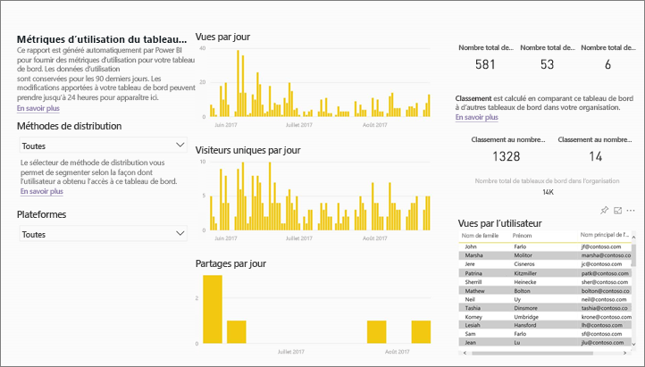
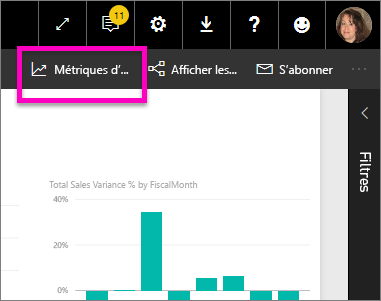
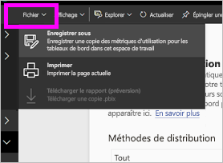
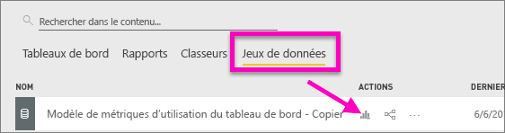
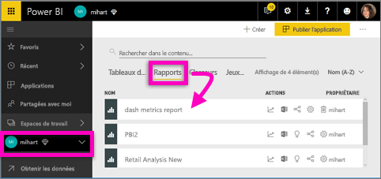
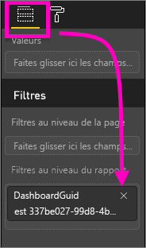
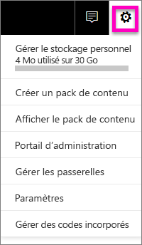
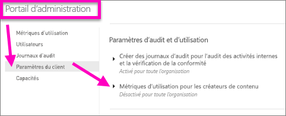

# Mesures d’utilisation pour les tableaux de bord et les rapports
Si vous créez des tableaux de bord et des rapports, des mesures d’utilisation vous aident à comprendre leur impact. Lorsque vous exécutez des métriques d’utilisation de tableau de bord ou de rapport, vous découvrez comment les tableaux de bord et les rapports sont utilisés dans votre organisation : ce qui est utilisé, par qui et dans quel but.  

> [!NOTE]
> Les métriques d’utilisation suivent l’utilisation de rapports incorporés dans SharePoint Online. Toutefois, elles ne suivent pas l’incorporation de tableaux de bord et rapports via les flux « l’utilisateur a des informations d’identification » et « l’application a des informations d’identification ». Les métriques d’utilisation ne suivent pas non plus l’utilisation des rapports incorporés via [publier sur le web](service-publish-to-web.md).

Ces rapports de métriques d’utilisation sont en lecture seule. Toutefois, vous pouvez personnaliser un rapport de métriques d’utilisation à l’aide de la commande « Enregistrer sous ». Cette opération crée un nouveau jeu de données et convertit le rapport en lecture seule en un rapport Power BI pleinement fonctionnel que vous pouvez modifier. Non seulement le rapport personnalisé contient des métriques pour le tableau de bord ou le rapport sélectionné, mais en supprimant le filtre par défaut, vous avez accès aux métriques d’utilisation de tous les tableaux de bord et tous les rapports de l’espace de travail sélectionné. Et vous pouvez même voir les noms de vos utilisateurs finaux.

## Pour quelles raisons les mesures sont-elles importantes pour moi ?
De cette manière, vous pouvez démontrer votre impact et hiérarchiser vos efforts. Vos mesures d’utilisation peuvent indiquer qu’un de vos rapports est utilisé quotidiennement par un segment important de l’organisation ou que vous avez créé un tableau de bord qui n’est pas du tout consulté. Ce type de retour est essentiel car il guide vos efforts de travail.

L’exécution de rapports de métriques d’utilisation n’est disponible que dans le service Power BI.  Toutefois, si vous enregistrez un rapport de métriques d’utilisation ou que vous l’épinglez à un tableau de bord, vous pouvez ouvrir et interagir avec ce rapport sur des appareils mobiles.

### Conditions préalables
- La fonctionnalité de métriques d’utilisation capture les informations d’utilisation de tous les utilisateurs, quelle que soit la licence qui leur est attribuée. Cependant, une licence Power BI Pro est nécessaire pour obtenir les données des métriques d’utilisation et y accéder.
- Les métriques d’utilisation sont fournies dans les tableaux de bord ou les rapports de l’espace de travail sélectionné. Pour accéder aux métriques d’utilisation d’un tableau de bord ou d’un rapport en particulier, vous devez :    
    • Avoir accès à ce tableau de bord ou rapport   
    • Disposer d’une licence Pro

## À propos du rapport Métriques d’utilisation

Quand vous sélectionnez **Métriques d’utilisation** ou l’icône , Power BI génère un rapport prédéfini avec des métriques d’utilisation relatives à ce contenu au cours des 90 derniers jours.  Ce rapport est similaire aux rapports Power BI que vous connaissez déjà, mais il est conçu pour être informatif, pas interactif. Vous pouvez le segmenter en fonction de la façon dont vos utilisateurs finaux ont reçu leur accès, s’ils accédaient au service via le web ou via une application mobile, etc. À mesure que vos tableaux de bord et vos rapports évoluent, votre rapport de métriques d’utilisation évolue lui aussi et se met à jour quotidiennement avec de nouvelles données.  

Les rapports de métriques d’utilisation ne s’affichent pas dans **Récents**, dans **Espaces de travail**, dans **Favoris** ni dans d’autres listes de contenu. Vous ne pouvez pas les ajouter à une application. Si vous épinglez une vignette du rapport de métriques d’utilisation à un tableau de bord, ce tableau de bord ne peut pas être ajouté à une application ni à un pack de contenu.

Pour explorer les données du rapport ou pour créer vos propres rapports sur le jeu de données, utilisez **Enregistrer sous** (consultez [Enregistrer le rapport des métriques d’utilisation en tant que rapport Power BI pleinement fonctionnel](#Save-the-Usage-Metrics-report-as-a-full-featured-Power-BI-report-(personalize)).

## Ouvrir un rapport Métriques d’utilisation pour un tableau de bord ou un rapport
1. Commencez dans l’espace de travail contenant le tableau de bord ou le rapport.
2. Dans la liste du contenu de l’espace de travail ou dans le tableau de bord ou le rapport, sélectionnez l’icône des **Métriques d’utilisation** .

    

    
3. La première fois que vous procédez de la sorte, Power BI crée le rapport des métriques d’utilisation et vous avertit quand il est prêt.

        
4. Pour ouvrir les résultats, sélectionnez **Afficher les métriques d’utilisation**.

    Les métriques d’utilisation sont un atout important lorsque vous déployez et gérez des rapports et des tableaux de bord Power BI. Vous vous demandez quelles pages de votre rapport sont les plus utiles et quelles sont celles que vous devez éliminer progressivement ? Segmentez les **pages du rapport** pour le savoir. Vous vous demandez si vous devez créer une version mobile de votre tableau de bord ? Segmentez par **plateformes** pour savoir combien d’utilisateurs accèdent à votre contenu via les applications mobiles et via le navigateur web.

5. Vous pouvez également pointer sur une visualisation, puis sélectionner l’icône en forme d’épingle pour ajouter la visualisation à un tableau de bord. Ou, dans la barre de menus supérieure, sélectionnez **Épingler une page dynamique** pour ajouter la page entière à un tableau de bord. Dans le tableau de bord, vous pouvez surveiller plus facilement les métriques d’utilisation ou les partager avec d’autres utilisateurs.

    > [!NOTE]
    > Si vous épinglez une vignette du rapport de métriques d’utilisation à un tableau de bord, ce tableau de bord ne peut pas être ajouté à une application ni à un pack de contenu.

## Métriques d’utilisation figurant sur le rapport

| Métrique | Tableau de bord | Rapport | Description |
| --- | --- | --- | --- |
| Segment Méthode de distribution |oui |oui |Manière dont les utilisateurs ont eu accès au contenu. Il existe 3 méthodes possibles : les utilisateurs peuvent accéder au tableau de bord ou au rapport s’ils sont membres d’un [espace de travail d’application](service-the-new-power-bi-experience.md), quand du contenu est [partagé avec eux](service-share-dashboards.md) ou en installant un pack ou une application de contenu.  Notez que les vues dans une application sont comptées comme « packs de contenu ». |
| Segment Plateformes |oui |oui |L’accès au tableau de bord ou au rapport a-t-il eu lieu via le service Power BI (powerbi.com) ou un appareil mobile ? L’accès mobile inclut toutes nos applications iOS, Android et Windows. |
| Segment Page de rapport |non |oui |Si le rapport comporte plus d’une page, segmentez-le par page(s) visitées(s). Si vous voyez une option de liste « Vide », cela signifie qu’une page de rapport a été ajoutée récemment (dans les 24 heures, le nom réel de la nouvelle page s’affiche dans la liste des segments) et/ou que des pages de rapport ont été supprimées. « Vide » capture ces types de situations. |
| Visites par jour |oui |oui |Nombre total de visites par jour : une visite correspond à un chargement de page de rapport ou de tableau de bord par un utilisateur. |
| Visiteurs uniques par jour |oui |oui |Nombre d’utilisateurs *différents* qui ont consulté le tableau de bord ou le rapport (basé sur le compte d’utilisateur AAD). |
| Vues par l’utilisateur |oui |oui |Nombre de vues au cours des 90 derniers jours, ventilées par utilisateur. |
| Partages par jour |oui |non |Nombre de fois que le tableau de bord ou le rapport a été partagé avec un autre utilisateur ou groupe. |
| Nombre total de visites |oui |oui |Nombre de visites au cours des 90 derniers jours. |
| Nombre total de visiteurs |oui |oui |Nombre de visiteurs uniques au cours des 90 derniers jours. |
| Nombre total de partages |oui |non |Nombre de fois où que le tableau de bord ou le rapport a été partagé au cours des 90 derniers jours. |
| Total dans l’organisation |oui |oui |Nombre de tableaux de bord ou de rapports dans toute l’organisation qui ont été consultés au moins une fois au cours des 90 derniers jours.  Utilisé pour calculer le classement. |
| Classement : nombre total de visites |oui |oui |Classement de ce tableau de bord ou rapport dans le nombre total de visites de tous les tableaux de bord ou rapports dans l’organisation au cours des 90 derniers jours. |
| Classement : nombre total de partages |oui |non |Classement de ce tableau de bord ou rapport dans le nombre total de partages de tous les tableaux de bord ou rapports dans l’organisation au cours des 90 derniers jours. |

### Rapport Métriques d’utilisation du tableau de bord

### Rapport Métriques d’utilisation du rapport

## Enregistrer le rapport Métriques d’utilisation en tant que rapport Power BI pleinement fonctionnel (personnalisé)

Utilisez la commande **Enregistrer sous** pour convertir le rapport des métriques d’utilisation en rapport Power BI pleinement fonctionnel que vous pouvez personnaliser et partager. Une fois que vous avez créé une copie personnalisée, vous obtenez l’accès total au jeu de données sous-jacent, ce qui vous permet de personnaliser le rapport de métriques d’utilisation en fonction de vos besoins. Vous pouvez même utiliser Power BI Desktop pour générer des rapports de métriques d’utilisation personnalisés à l’aide de la [connexion active à la fonctionnalité de service Power BI](https://powerbi.microsoft.com/blog/connecting-to-datasets-in-the-power-bi-service-from-desktop).

Mieux encore, le jeu de données sous-jacent comprend les détails d’utilisation de tous les tableaux de bord ou rapports dans l’espace de travail. Cela ouvre encore d’autres perspectives. Vous pouvez par exemple créer un rapport qui compare tous les tableaux de bord dans votre espace de travail en fonction de l’utilisation. Vous pouvez aussi créer un tableau de bord des métriques d’utilisation pour votre application Power BI par agrégation de l’utilisation de tout le contenu distribué au sein de cette application.  Consultez [Supprimer le filtre de niveau page](#remove-the-filter-to-see-all-the-usage-metrics-data-in-the-workspace) ci-dessous.

### Qu’est-ce qui est créé lors de l’utilisation de la commande « Enregistrer sous » ?
Quand Power BI crée le rapport pleinement fonctionnel, il crée également un jeu de données **composé de tous les tableaux de bord et tous les rapports de l’espace de travail en cours** qui ont été consultés au cours des 90 derniers jours. Par exemple, supposons que vous ayez un espace de travail appelé « Ventes », qu’il contient trois tableaux de bord et deux rapports, et que vous créez un rapport de métriques d’utilisation du tableau de bord « Nord-est ». Vous utilisez ensuite **Enregistrer sous** pour le personnaliser et le convertir en rapport pleinement fonctionnel. Le jeu de données de ce nouveau rapport contient les métriques d’utilisation *non seulement pour ce tableau d’un bord nommé « Nord-est »*, mais pour les trois tableaux de bord de l’espace de travail « Ventes ». Par défaut, le rapport affiche des données du tableau de bord « Nord-est » et vous devrez [supprimer un filtre](#remove-the-filter-to-see-all-the-usage-metrics-data-in-the-workspace) (un seul clic) pour afficher les données des trois tableaux de bord.

### Créer une copie du rapport d’utilisation à l’aide de « Enregistrer sous »
Lorsque vous créez une copie à l’aide de la commande « Enregistrer sous » (Personnaliser), Power BI convertit le rapport prédéfini en lecture seule en un rapport pleinement fonctionnel.  À première vue, il se présente exactement de la même manière. Toutefois, vous pouvez maintenant ouvrir le rapport en mode édition, ajouter de nouvelles visualisations, des filtres et des pages, modifier ou supprimer les visualisations existantes et bien plus encore. Power BI enregistre le nouveau rapport et le nouveau jeu de données dans l’espace de travail actuel. Dans l’exemple ci-dessous, l’espace de travail actuel est **mihart**.

1. Dans le rapport des métriques d’utilisation, sélectionnez **Fichier > Enregistrer sous**. Power BI convertit le rapport des métriques d’utilisation en rapport Power BI pleinement fonctionnel. Il s’agit d’un rapport de métriques d’utilisation *personnalisé*. Le rapport d’utilisation personnalisé et le jeu de données sont enregistrés dans l’espace de travail actuel nommé **mihart*.

    
2. Ouvrez le rapport en mode Édition, puis [interagissez avec lui comme vous le feriez avec tout autre rapport Power BI](service-interact-with-a-report-in-editing-view.md). Vous pouvez, par exemple, ajouter des pages, générer de nouvelles visualisations, ajouter des filtres, mettre en forme les polices et les couleurs, etc.

    
3. Vous pouvez également commencer avec le nouveau jeu de données et créer un rapport de toutes pièces.

    
4. Le nouveau rapport est enregistré dans l’espace de travail en cours (mihart) et ajouté à la liste des contenus **Récents**.

    

### Supprimez le filtre pour voir ***toutes*** les données des métriques d’utilisation dans l’espace de travail
Pour voir les métriques de tous les tableaux de bord ou tous les rapports dans l’espace de travail, vous devrez supprimer un filtre. Par défaut, le rapport personnalisé est filtré pour n’afficher que les métriques du tableau de bord ou du rapport qui a été utilisé pour le créer.

Si par exemple vous avez utilisé le tableau de bord « Ventes en Europe » pour créer ce rapport personnalisé, seules les données d’utilisation du tableau de bord « Ventes en Europe » s’affichent. Pour supprimer le filtre et activer les données de tous les tableaux de bord dans cet espace de travail :

1. Ouvrez le rapport personnalisé en mode Édition.

    
2. Dans le volet Filtres, localisez le compartiment des **filtres de niveau rapport** et supprimez le filtre en cliquant sur le « x ».

    

    Votre rapport personnalisé affiche maintenant les métriques de la totalité de l’espace de travail.

## Contrôles d’administration pour les métriques d’utilisation - Pour les administrateurs Power BI
Les rapports de métriques d’utilisation sont une fonctionnalité qu’un administrateur Power BI ou Office 365 peut activer ou désactiver. Les administrateurs disposent d’un contrôle granulaire sur les utilisateurs ayant accès aux métriques d’utilisation. Par défaut, celles-ci sont activées pour tous les utilisateurs au sein de l’organisation.

1. Ouvrez le portail d’administration en sélectionnant l’icône Engrenage dans l’angle supérieur droit du service Power BI, puis en choisissant **Portail d’administration**.

    
2. Dans le portail d’administration, sélectionnez **Paramètres du client**, puis choisissez **Métriques d’utilisation pour les créateurs de contenu**.

    
3. Activez (ou désactivez) les métriques d’utilisation, puis sélectionnez **Appliquer**.

    

Par défaut, les données par utilisateur sont activées pour les métriques d’utilisation et les informations de compte de créateur de contenu sont incluses dans le rapport des métriques. Si vous ne souhaitez pas inclure ces informations pour tout ou partie des utilisateurs, désactivez la fonctionnalité pour des groupes de sécurité spécifiés ou pour l’ensemble de l’organisation. Les informations de compte figurent alors dans le rapport sous l’intitulé *Sans nom*.

Lorsque vous désactivez les métriques d’utilisation pour toute l’organisation, les administrateurs peuvent utiliser le l’option **Supprimer tout le contenu des métriques d’utilisation** pour supprimer toutes les vignettes de rapports et de tableaux de bord existantes générées à l’aide de rapports et de jeux de données de métriques d’utilisation. Cette option supprime tout accès aux données de métriques d’utilisation pour tous les utilisateurs au sein de l’organisation qui peuvent déjà les utiliser. Soyez prudent, car la suppression du contenu de métriques d’utilisation existantes est irréversible.

## Considérations et limitations
Q : Je ne parviens pas à exécuter les métriques d’utilisation sur un tableau de bord ou un rapport.    
R : Vous ne pouvez voir les métriques d’utilisation que pour le contenu dont vous êtes propriétaire ou que vous êtes autorisé à modifier.

Q : les métriques d’utilisation captureront-elles des vues de tableaux de bord et rapports incorporés ?     
R : Les métriques d’utilisation ne prennent actuellement pas en charge la capture de l’utilisation des tableaux de bord et rapports incorporés, y compris les flux [l’utilisateur est propriétaire des données](developer/integrate-report.md), [l’application est propriétaire des données](developer/embed-sample-for-customers.md) et [publier sur le web](service-publish-to-web.md). Dans ce cas, nous vous recommandons d’utiliser des plateformes Web Analytics existantes pour effectuer le suivi de l’utilisation de l’application ou du portail d’hébergement.

Q : Je ne parviens à exécuter les métriques d’utilisation sur aucun contenu.    
R1 : Les administrateurs ont la possibilité de désactiver cette fonctionnalité dans leur organisation.  Contactez votre administrateur pour vérifier si c’est le cas.    
R2 : Les mesures d’utilisation sont une fonctionnalité Power BI Pro.

Q : Les données ne semblent pas à jour. Par exemple, les méthodes de distribution n’apparaissent pas, des pages de rapport sont manquantes, etc.   
R : La mise à jour des données peut prendre jusqu’à 24 heures.

Q : Il existe quatre rapports dans l’espace de travail, mais le rapport des métriques d’utilisation n’en affiche que 3.    
R : Le rapport des métriques d’utilisation comprend uniquement les rapports (ou les tableaux de bord) qui ont été utilisés au cours des 90 derniers jours.  Si un rapport (ou un tableau de bord) n’apparaît pas, c’est probablement parce qu’il n’a pas été utilisé au cours des 90 derniers jours.

## Étapes suivantes
[Ajouter un tableau de bord aux favoris](service-dashboard-favorite.md)

D’autres questions ? [Posez vos questions à la communauté Power BI](http://community.powerbi.com/)

