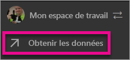
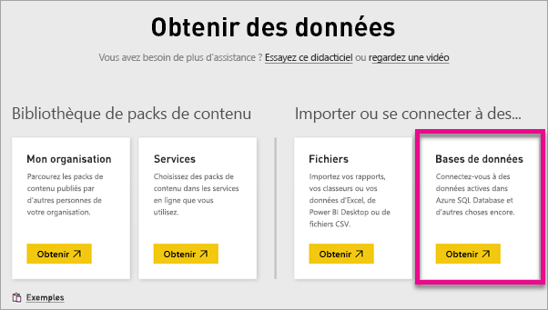
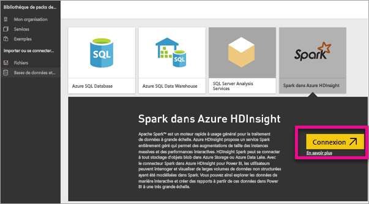
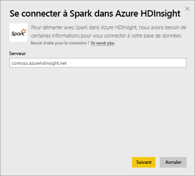
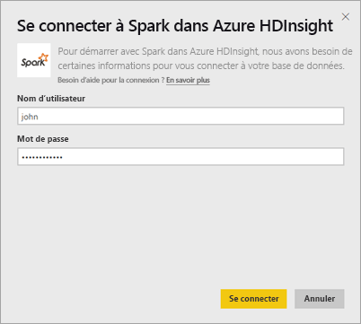
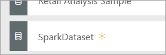
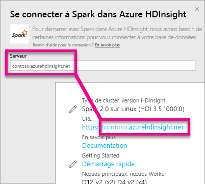
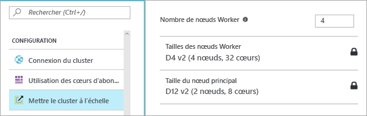

# Spark dans HDInsight avec DirectQuery
Spark dans Azure HDInsight avec DirectQuery vous permet de créer des rapports dynamiques basés sur les données et les métriques déjà présentes dans votre cluster Spark. Avec DirectQuery, les requêtes sont renvoyées à votre cluster Spark Azure HDInsight pendant que vous explorez les données dans l’affichage du rapport. Cette fonctionnalité est conseillée aux utilisateurs qui connaissent bien les entités auxquelles ils se connectent.

> [!WARNING]
> L’actualisation automatique des vignettes a été désactivée pour les vignettes de tableau de bord basées sur les jeux de données Spark. Vous pouvez sélectionner **Actualiser les vignettes du tableau de bord** pour actualiser manuellement. Les rapports ne sont pas affectés et doivent rester à jour. 
> 
> 

Suivez cette procédure pour vous connecter à votre source de données Spark dans Azure HDInsight à l’aide de DirectQuery dans le service Power BI.

> [!Important]
> Nous avons amélioré notre connectivité à Spark.  Pour une expérience optimale de connexion à votre source de données Spark, utilisez Power BI Desktop.  Une fois que vous avez créé votre modèle et votre rapport, vous pouvez publier ce dernier sur le service Power BI.  Le connecteur direct pour Spark rencontré dans le service Power BI est désormais déconseillé.
>

1. Sélectionnez **Obtenir des données** en bas du volet de navigation gauche.
   
     
2. Sélectionnez **Bases de données et plus**.
   
     
3. Sélectionnez le connecteur **Spark sur HDInsight** , puis choisissez **Connect**(Se connecter).
   
     
4. Entrez le nom du **serveur** auquel vous connecter, ainsi que votre **nom d’utilisateur** et votre **mot de passe**. Le serveur doit toujours être indiqué au format \<nom_cluster\>.azurehdinsight.net. Pour savoir comment obtenir ces valeurs, voir ci-dessous.
   
     
   
     
5. Une fois connecté, un nouveau jeu de données appelé « SparkDataset » s’affiche. Ce jeu de données est également accessible via la vignette d’espace réservé qui est créée.
   
     
6. L’exploration du jeu de données vous permet d’explorer toutes les tables et colonnes de votre base de données. La sélection d’une colonne renvoie une requête à la source, créant ainsi dynamiquement votre élément visuel. Les éléments visuels peuvent être enregistrés dans un nouveau rapport et épinglés dans votre tableau de bord.

## Recherche de vos paramètres Spark sur HDInsight
Le serveur doit toujours être indiqué sous la forme \<nom_cluster\>.azurehdinsight.net. Vous pouvez trouver cette valeur dans le portail Azure.

Le nom d’utilisateur et le mot de passe sont également indiqués sur le portail Azure.

## Limites
Ces points sont susceptibles de changer, car nous travaillons actuellement à améliorer le produit. Pour plus d’informations, consultez [Utiliser les outils BI avec Apache Spark sur Azure HDInsight](https://azure.microsoft.com/documentation/articles/hdinsight-apache-spark-use-bi-tools/).

* Le service Power BI prend uniquement en charge la configuration de Spark 2.0 et HDInsight 3.5.
* Chaque action, telle que la sélection d’une colonne ou l’ajout d’un filtre, renvoie une requête à la base de données. Avant de sélectionner des champs de très grande taille, songez à choisir un type de visuel approprié.
* Il n’y a pas de Q&R disponible pour les jeux de données DirectQuery.
* Les modifications apportées aux schémas ne sont pas sélectionnées automatiquement.
* Power BI prend en charge 16 000 colonnes **sur toutes les tables** au sein d’un jeu de données. Power BI inclut également une colonne de numéro de ligne interne par table. Cela signifie que si votre jeu de données contient 100 tables, le nombre de colonnes disponibles doit être de 15 900. Cette limitation peut survenir selon la quantité de données que vous utilisez à partir de votre source de données Spark.

## Résolution des problèmes
Si vous rencontrez des problèmes pour exécuter des requêtes sur votre cluster, vérifiez que l’application n’est pas arrêtée et, si c’est le cas, redémarrez-la.

Vous pouvez également allouer des ressources supplémentaires au sein du portail Azure sous **Configuration** > **Mettre le cluster à l’échelle** :

## Étapes suivantes
[Bien démarrer : Créer un cluster Apache Spark sur HDInsight Linux et exécuter des requêtes interactives à l’aide de Spark SQL](https://azure.microsoft.com/documentation/articles/hdinsight-apache-spark-jupyter-spark-sql)  
[Qu’est-ce que Power BI ?](power-bi-overview.md)  
[Obtenir des données pour Power BI](service-get-data.md)  
D’autres questions ? [Posez vos questions à la communauté Power BI](http://community.powerbi.com/)

