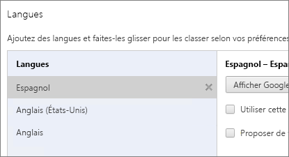
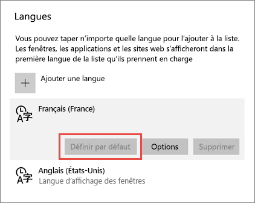
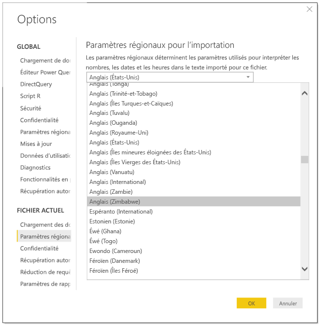

# Langues et pays/régions pris en charge pour Power BI

Cet article répertorie les langues prises en charge et pays/régions pour le service Power BI, Power BI Desktop et documentation Power BI.

## Pays et régions où Power BI est disponible
Pour obtenir la liste des pays et régions où Power BI est disponible, consultez cette [liste de disponibilité internationale](https://products.office.com/business/international-availability). 

## Langues disponibles pour le service Power BI
Le service Power BI (dans le navigateur) est disponible dans les 44 langues suivantes :

* Arabe
* Basque - Basque
* Bulgare - Български
* Catalan - català
* Chinois (simplifié) - 中文(简体)
* Chinois (traditionnel) - 中文(繁體)
* Croate - hrvatski
* Tchèque - čeština
* Danois - dansk
* Néerlandais - Nederlands
* Anglais - English
* Estonien - eesti
* Finnois - suomi
* Français - français
* Galicien - galego
* Allemand - Deutsch
* Grec - Ελληνικά
* Hébreu
* Hindi - हिंदी
* Hongrois - magyar
* Indonésien - Bahasa Indonesia
* Italien - italiano
* Japonais - 日本語
* Kazakh - Қазақ
* Coréen - 한국어
* Letton - latviešu
* Lituanien - lietuvių
* Malais - Bahasa Melayu
* Norvégien (Bokmål) - norsk (bokmål)
* Polonais - Polski
* Portugais (Brésil) - Português
* Portugais (Portugal) - português
* Roumain - română
* Russe - Русский
* Serbe (cyrillique) - српски
* Serbe (latin) - srpski
* Slovaque - slovenčina
* Slovène - slovenski
* Espagnol - español
* Suédois - svenska
* Thaï - ไทย
* Turc - Türkçe
* Ukrainien - українська
* Vietnamien - Tiếng Việt

### Éléments traduits
Power BI se traduit par des menus, des boutons, des messages et autres éléments de l’expérience dans votre langue.

Quelques fonctionnalités sont actuellement disponibles en anglais uniquement :

* Tableaux de bord et rapports Power BI crée lorsque vous vous connectez aux services tels que Microsoft Dynamics CRM, Google Analytique et Salesforce. Vous pouvez toujours créer vos propres tableaux de bord et les rapports dans votre propre langue.
* Exploration de vos données avec Q&R.

Tenez-vous informé, car nous ajouterons régulièrement des fonctionnalités à d’autres langues. 

### Choisir votre langue dans le service Power BI
1. Dans le service Power BI, sélectionnez l’icône **Paramètres**  > **Paramètres**.
2. Sous l’onglet **Général** > **Langue**.
3. Sélectionnez votre langue > **Appliquer**.

### Choisir votre langue dans le navigateur
Power BI détermine la langue utilisée en fonction des préférences linguistiques définies sur votre ordinateur. La méthode à suivre pour afficher et modifier ces préférences peut varier selon votre système d’exploitation et votre navigateur. Voici comment afficher ces préférences à partir d’Internet Explorer et de Google Chrome.

#### Internet Explorer (version 11)
1. Cliquez sur le bouton **Outils** en haut à droite de la fenêtre du navigateur :
   
   
2. Cliquez sur **Options Internet**.
3. Dans la boîte de dialogue Options Internet, sous l’onglet Général, sous Apparence, cliquez sur le bouton **Langues**.

#### Google Chrome (version 42)
1. Cliquez sur le bouton de menu en haut à droite de la fenêtre du navigateur :
   
   
2. Cliquez sur **Paramètres**.
3. Cliquez sur **Afficher les paramètres avancés**.
4. Sous Langues, cliquez sur le bouton **Paramètres de langue et de saisie**.
5. Cliquez sur **Ajouter**, sélectionnez une langue, puis cliquez sur **OK**.
   
   
   
   La nouvelle langue se trouve en fin de liste. 
6. Faites glisser la nouvelle langue en haut de la liste, puis cliquez sur **Afficher Google Chrome dans cette langue**.
   
   
   
   Vous devrez peut-être fermer et rouvrir votre navigateur pour appliquer la modification.

## Choisir la langue ou les paramètres régionaux de Power BI Desktop
Vous disposez de deux façons d’obtenir Power BI Desktop : Vous pouvez le télécharger, ou l’installer à partir du Windows Store.

* Lorsque vous [installez Power BI Desktop à partir du Windows Store](#choose-a-language-for-power-bi-desktop-installed-from-the-windows-store), il installe toutes les langues et indique la langue qui correspond à la langue par défaut de Windows.
* Lorsque vous [téléchargez Power BI Desktop](#choose-a-language-when-you-download-power-bi-desktop), vous choisissez la langue lors du téléchargement. 
* Vous pouvez également [choisir des paramètres régionaux à utiliser lors de l’importation de données](#choose-the-locale-for-importing-data-into-power-bi-desktop) pour un rapport spécifique.

### Choisir une langue pour Power BI Desktop quand ce dernier est installé à partir du Windows Store
1. [Installez Power BI Desktop](http://aka.ms/pbidesktopstore) à partir du Windows Store.
2. Pour modifier la langue, sur votre ordinateur, recherchez **Paramètres Windows**. 
3. Sélectionnez **Heure et langue**.
   
     
4. Sélectionnez **Région et langue**, une langue, puis **Par défaut**.
   
     
   
     Au prochain démarrage de Power BI Desktop, celui-ci utilise la langue définie en tant que valeur par défaut. 

### Choisir une langue quand vous téléchargez Power BI Desktop
La langue choisie pour Power BI Desktop affecte le format d’affichage des nombres et des dates figurant dans les rapports. 

* Sélectionnez une langue quand vous [téléchargez Power BI Desktop](https://powerbi.microsoft.com/desktop). 

Pour modifier la langue de Power BI Desktop, revenez à la page de téléchargement et téléchargez-le dans une autre langue.

### Choisir les paramètres régionaux à utiliser lors de l’importation de données dans Power BI Desktop
Si vous téléchargez Power BI Desktop ou l’installez à partir du Windows Store, vous pouvez choisir des paramètres régionaux pour un rapport spécifique autres que ceux de votre version de Power BI Desktop. Les modifications de paramètres régionaux que les façon dont les données sont interprétées quand il est importé à partir de vos données source, par exemple si « 3/4/2017 » est interprétée en tant que 3 avril ou le 4 mars. 

1. Dans Power BI Desktop, sélectionnez **Fichier** > **Options et paramètres** > **Options**.
2. Sous **Fichier actuel**, sélectionnez **Paramètres régionaux**.
3. Dans la boîte **Paramètres régionaux à importer**, sélectionnez des paramètres régionaux différents. 
   
   
4. Sélectionnez **OK**.

### Choisir la langue du modèle dans Power BI Desktop

Outre la définition de la langue de l’application Power BI Desktop, vous pouvez également définir la langue du modèle. La langue du modèle affecte principalement deux éléments :

- la façon dont nous comparons et trions des chaînes. Par exemple, étant donné que le turc possède deux lettres i, selon le classement de votre base de données, les deux peuvent se retrouver dans des ordres différents lors du tri. 
- La langue que Power BI Desktop utilise lors de la création des tables avec dates masquées à partir de champs de date. Par exemple, les champs sont appelés Month/Monat/Mois, etc.

> [!NOTE]
> Le modèle Power BI utilise actuellement des paramètres régionaux qui ne respectent pas la casse (le jeu de caractères Kana), de sorte que « ABC » et « abc » sont interprétés de la même façon. Si « ABC » est chargé en premier dans la base de données, les autres chaînes qui diffèrent uniquement d’une casse, par exemple « Abc », ne seront pas chargées en tant que valeur distincte.
> 
>

Voici comment définir la langue du modèle.

1. Dans Power BI Desktop, sélectionnez **Fichier** > **Options et paramètres** > **Options**.
2. Sous **Global**, sélectionnez **Paramètres régionaux**.
3. Dans la zone **Langue du modèle**, sélectionnez une autre langue. 

    

> [!NOTE]
> Une fois créée, la langue d’un modèle Power BI ne peut pas être modifiée.
> 
>

## Langues de la documentation d’aide
L’aide est localisée dans les 10 langues suivantes : 

* Chinois (simplifié) - 中文(简体)
* Chinois (traditionnel) - 中文(繁體)
* Français - français
* Allemand - Deutsch
* Italien - italiano
* Japonais - 日本語
* Coréen - 한국어
* Portugais (Brésil) - Português
* Russe - Русский
* Espagnol - español

## Étapes suivantes
* Vous utilisez l’une des applications mobiles Power BI ? Pour plus d’informations, voir [Langues prises en charge dans les applications mobiles Power BI](consumer/mobile/mobile-apps-supported-languages.md).
* Vous avez des questions ? Essayez de d’interroger la [Communauté Power BI](http://community.powerbi.com/).
* Le problème persiste ? Visitez la [page de support Power BI](https://powerbi.microsoft.com/support/).

