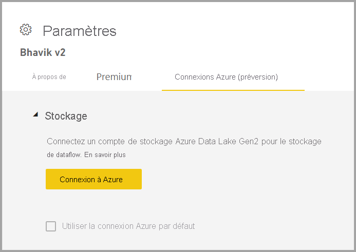
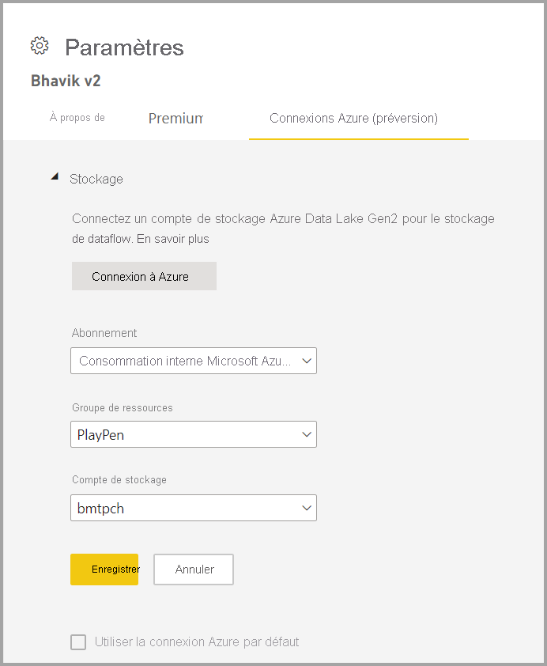

# Configuration du stockage de dataflows pour utiliser Azure Data Lake Gen 2 

Par défaut, les données utilisées avec Power BI sont stockées dans le stockage interne fourni par Power BI. Avec l’intégration des dataflows et d’Azure Data Lake Storage Gen 2 (ADLS Gen2), vous pouvez stocker vos dataflows dans le compte Azure Data Lake Storage Gen2 de votre organisation.

Il existe deux façons de configurer le magasin ADLS Gen 2 à utiliser : vous pouvez soit utiliser un compte ADLS Gen 2 assigné par un locataire, soit apporter votre propre magasin ADLS Gen 2 au niveau de l’espace de travail. 

## Conditions préalables

Pour apporter votre propre compte ADLS Gen 2, vous devez disposer d’autorisations de propriétaire au niveau du compte de stockage, du groupe de ressources ou de l’abonnement. Si vous êtes administrateur, vous devez quand même vous assigner des autorisations de propriétaire. 

De même, le compte ADLS Gen 2 doit être déployé dans la même région que votre locataire Power BI. Une erreur se produit si les emplacements des ressources ne se trouvent pas dans la même région.

Enfin, vous pouvez vous connecter à n’importe quel compte ADLS Gen 2 à partir du portail d’administration, mais si vous vous connectez directement à un espace de travail, vous devez vérifier que ce dernier ne comporte aucun dataflow avant de vous connecter.

## Connexion à un compte Azure Data Lake Gen 2 à partir d’un espace de travail
Accédez à un espace de travail qui ne comporte aucun dataflow. Sélectionnez **Paramètres d’espace de travail** pour accéder à un nouvel onglet intitulé **Connexions Azure**. Sélectionnez l’onglet **Connexion Azure**, puis la section **Stockage**.

 
L’option **Utiliser la connexion Azure par défaut** est visible si le locataire a déjà configuré ADLS Gen 2. Deux options s’offrent à vous : soit vous utilisez le compte ADLS Gen 2 configuré par le locataire en cochant la case **Utiliser la connexion Azure par défaut**, soit vous sélectionnez **Se connecter à Azure** pour pointer vers un nouveau compte Stockage Azure. 

Quand vous sélectionnez **Se connecter à Azure**, Power BI récupère la liste des abonnements Azure auxquels vous avez accès. Renseignez les listes déroulantes et sélectionnez un abonnement Azure, un groupe de ressources et un compte de stockage valides avec l’option d’espace de noms hiérarchique activée, qui est l’indicateur ADLS Gen2.

 
Une fois la sélection effectuée, sélectionnez **Enregistrer** ; l’espace de travail est alors attaché à votre propre compte ADLS Gen2. Power BI configure automatiquement le compte de stockage avec les autorisations nécessaires et définit le système de fichiers Power BI dans lequel les données seront écrites. Désormais, les données de chaque dataflow situé à l’intérieur de cet espace de travail seront écrites directement dans ce système de fichiers, qui peut être utilisé avec les autres services Azure, créant ainsi une source unique pour toutes les données de votre organisation ou de votre service.

## Détachement d’Azure Data Lake Gen 2 d’un espace de travail ou d’un locataire

Avant de supprimer une connexion au niveau d’un espace de travail, vous devez d’abord vérifier que tous les dataflows de l’espace de travail ont été supprimés. Une fois que tous les dataflows ont été supprimés, sélectionnez **Déconnecter** dans les paramètres d’espace de travail. Cela vaut aussi pour un locataire, mais vous devez d’abord vérifier que tous les espaces de travail ont également été déconnectés du compte de stockage du locataire avant de pouvoir vous déconnecter au niveau du locataire.

## Désactivation d’Azure Data Lake Gen 2

Sur le **portail d’administration**, sous **dataflows**, vous pouvez désactiver l’accès pour permettre aux utilisateurs d’utiliser cette fonctionnalité et empêcher les administrateurs de l’espace de travail d’apporter leur propre Stockage Azure.

## Étapes suivantes
Les articles suivants vous permettront d’en savoir plus sur les dataflows et Power BI :

* [Introduction aux dataflows et à la préparation des données en libre-service](dataflows-introduction-self-service.md)
* [Création d’un flux de données](dataflows-create.md)
* [Configurer et consommer un dataflow](dataflows-configure-consume.md)
* [Fonctionnalités Premium des dataflows](dataflows-premium-features.md)
* [IA et dataflows](dataflows-machine-learning-integration.md)
* [Considérations et limitations des dataflows](dataflows-features-limitations.md)
* [Bonnes pratiques pour les dataflows](dataflows-best-practices.md)