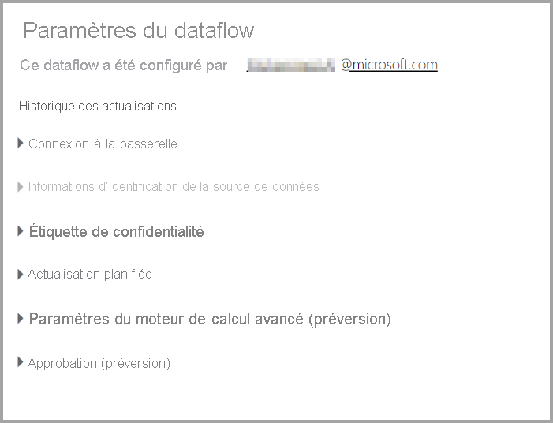
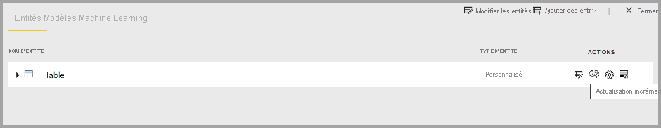

# Configurer et consommer un dataflow

Avec les dataflows, vous pouvez unifier les données de plusieurs sources et préparer les données unifiées pour la modélisation. Chaque fois que vous créez un flux de données, vous êtes invité à actualiser les données du dataflow. L’actualisation d’un dataflow est nécessaire avant de pouvoir le consommer dans un jeu de données à l’intérieur de Power BI Desktop ou le référencer en tant qu’entité liée ou calculée.

## Configuration d’un dataflow

Pour configurer l’actualisation d’un dataflow, sélectionnez le menu **Plus** (points de suspension) et sélectionnez **Paramètres**.

Les options **Paramètres** fournissent de nombreuses options pour votre dataflow, comme décrit dans les sections suivantes.

* **Se définir comme propriétaire :** Si vous n’êtes pas le propriétaire du dataflow, un grand nombre de ces paramètres sont désactivés. Pour prendre possession du dataflow, sélectionnez **Prendre le contrôle** pour en prendre le contrôle. Vous êtes invité à fournir des informations d’identification pour vous assurer que vous disposez du niveau d’accès nécessaire.

* **Connexion à la passerelle :** Dans cette section, vous pouvez choisir si le dataflow utilise une passerelle, puis sélectionner la passerelle utilisée. 

* **Informations d’identification de la source de données :** Dans cette section, vous choisissez les informations d’identification qui sont utilisées et vous pouvez modifier la façon dont vous vous authentifiez auprès de la source de données.

* **Étiquette de sensibilité :** Ici, vous pouvez définir la sensibilité des données dans le dataflow. Pour en savoir plus sur les étiquettes de confidentialité, consultez [Guide pratique pour appliquer des étiquettes de confidentialité dans Power BI](../../admin/service-security-apply-data-sensitivity-labels.md).

* **Actualisation planifiée :** Ici, vous pouvez définir les heures de la journée à laquelle le dataflow sélectionné est actualisé. Un dataflow peut être actualisé à la même fréquence qu’un jeu de données.

* **Paramètres améliorés du moteur de calcul :** Ici, vous pouvez définir si le dataflow est stocké dans le moteur de calcul. Le moteur de calcul autorise les dataflows suivants, qui font référence à ce dataflow, pour effectuer des fusions et des jointures et d’autres transformations beaucoup plus rapidement que vous ne le feriez autrement. Il permet également l’exécution de DirectQuery sur le dataflow. Le réglage sur **Activé** garantit que le dataflow est toujours pris en charge en mode DirectQuery, et que les références tirent parti du moteur. Si vous sélectionnez **Optimisé** , le moteur est utilisé uniquement s’il existe une référence à ce dataflow. La sélection de **Désactivé** désactive le moteur de calcul et la fonctionnalité DirectQuery pour ce dataflow.

* **Approbations :** Vous pouvez définir si le dataflow est certifié ou promu. 

## Actualisation d’un dataflow
Les dataflows agissent comme des blocs de construction posés les uns sur les autres. Supposons que vous avez un dataflow appelé *Données brutes* et une entité liée appelée *Données transformées* qui contient une entité liée au dataflow *Données brutes*. Lorsque l’actualisation planifiée du dataflow *Données brutes* se déclenche, cela déclenche un dataflow qui y fait référence à la fin de l’opération. Cette fonctionnalité crée un effet de chaîne d’actualisations, ce qui vous évite d’avoir à planifier les dataflows manuellement. Voici quelques nuances à prendre en compte lors de l’utilisation des entités liées :

* Une entité liée est déclenchée par une actualisation uniquement si elle existe dans le même espace de travail

* Une entité liée sera verrouillée pour modification si une entité source est actualisée. En cas d’échec de l’actualisation de l’un des dataflows d’une chaîne de référence, tous les dataflows sont restaurés vers les anciennes données (les actualisations de dataflow sont transactionnelles dans un espace de travail).

* Seules les entités référencées sont actualisées lorsqu’elles sont déclenchées par une actualisation de la source. Pour planifier toutes les entités, vous devez également définir une actualisation planifiée sur l’entité liée. Évitez de définir une planification d’actualisation sur les dataflows liés pour éviter une double actualisation.

Les dataflows **Annuler l’actualisation** prennent en charge la possibilité d’annuler une actualisation, contrairement aux jeux de données. Si une actualisation s’exécute longtemps, vous pouvez sélectionner les options de dataflow (les points de suspension en regard du dataflow), puis sélectionner **Annuler l’actualisation**.

Les dataflows **Actualisation incrémentielle (Premium uniquement)** peuvent également être configurés pour actualiser de façon incrémentielle. Pour ce faire, sélectionnez le dataflow que vous souhaitez configurer pour l’actualisation incrémentielle, puis sélectionnez l’icône d’actualisation incrémentielle.

Le fait de définir l’actualisation incrémentielle a pour effet d’ajouter des paramètres au dataflow pour spécifier la plage de dates. Pour plus d’informations sur la configuration de l’actualisation incrémentielle, consultez l’article traitant de l’[actualisation incrémentielle dans Power Query](/power-query/dataflows/incremental-refresh).

Dans certains cas, vous ne devez pas définir l’actualisation incrémentielle :

* Les entités liées ne doivent pas utiliser l’actualisation incrémentielle si elles font référence à un dataflow. Les dataflows ne prennent pas en charge le Query Folding (même si DirectQuery est activé pour l’entité). 

* Les jeux de données qui font référence à des dataflows ne doivent pas utiliser l’actualisation incrémentielle. Les actualisations des dataflows sont généralement performantes, donc les actualisations incrémentielles ne devraient pas être nécessaires. Si les actualisations prennent trop de temps, envisagez d’utiliser le moteur de calcul ou le mode DirectQuery.

## Consommation d’un dataflow

Un dataflow peut être consommé des trois façons suivantes :

* Créer une entité liée à partir du dataflow pour permettre à un autre auteur de dataflow d’utiliser les données

* Créer un jeu de données à partir du dataflow pour permettre à un utilisateur d’utiliser les données pour créer des rapports

* Créer une connexion à partir d’outils externes pouvant lire le format CDM

**Consommation depuis Power BI Desktop** Pour consommer un dataflow, exécutez Power BI Desktop et sélectionnez **Connecteur de dataflows Power BI** dans la boîte de dialogue **Obtenir des données**.

> [!NOTE]
> Le connecteur de dataflows Power BI utilise un autre jeu d’informations d’identification que l’utilisateur actuellement connecté. Ce comportement est voulu, pour la prise en charge des utilisateurs multi-locataires.

Sélectionnez le dataflow et les entités auxquelles vous souhaitez vous connecter. 

> [!NOTE]
> Vous pouvez vous connecter à n’importe quel dataflow ou n’importe quelle entité, quel que soit l’espace de travail dans lequel cet élément réside, et qu’il ait été défini dans un espace de travail Premium ou non Premium.

Si DirectQuery est disponible, vous êtes invité à choisir si vous souhaitez vous connecter aux entités via DirectQuery ou par importation. 

En mode DirectQuery, vous pouvez rapidement interroger les jeux de données à grande échelle localement. Toutefois, vous ne pouvez pas effectuer d’autres transformations. 

L’utilisation de l’importation pour importer des données dans Power BI exige que le jeu de données soit actualisé indépendamment du dataflow.

## Étapes suivantes
Les articles suivants vous permettront d’en savoir plus sur les dataflows et Power BI :

* [Introduction aux dataflows et à la préparation des données en libre-service](dataflows-introduction-self-service.md)
* [Création d’un flux de données](dataflows-create.md)
* [Configuration du stockage de dataflows pour utiliser Azure Data Lake Gen 2](dataflows-azure-data-lake-storage-integration.md)
* [Fonctionnalités Premium des dataflows](dataflows-premium-features.md)
* [IA et dataflows](dataflows-machine-learning-integration.md)
* [Considérations et limitations des dataflows](dataflows-features-limitations.md)