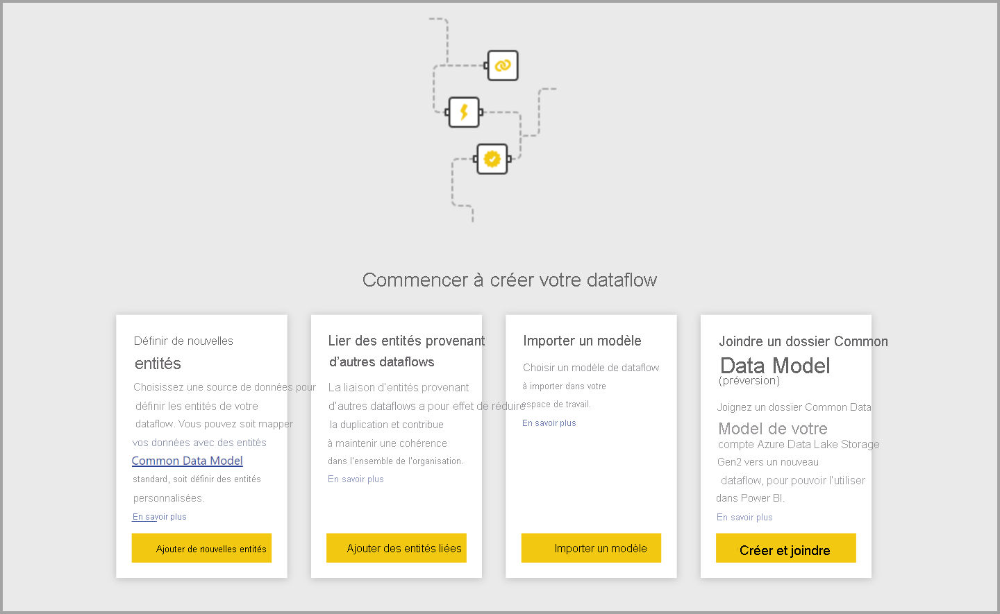
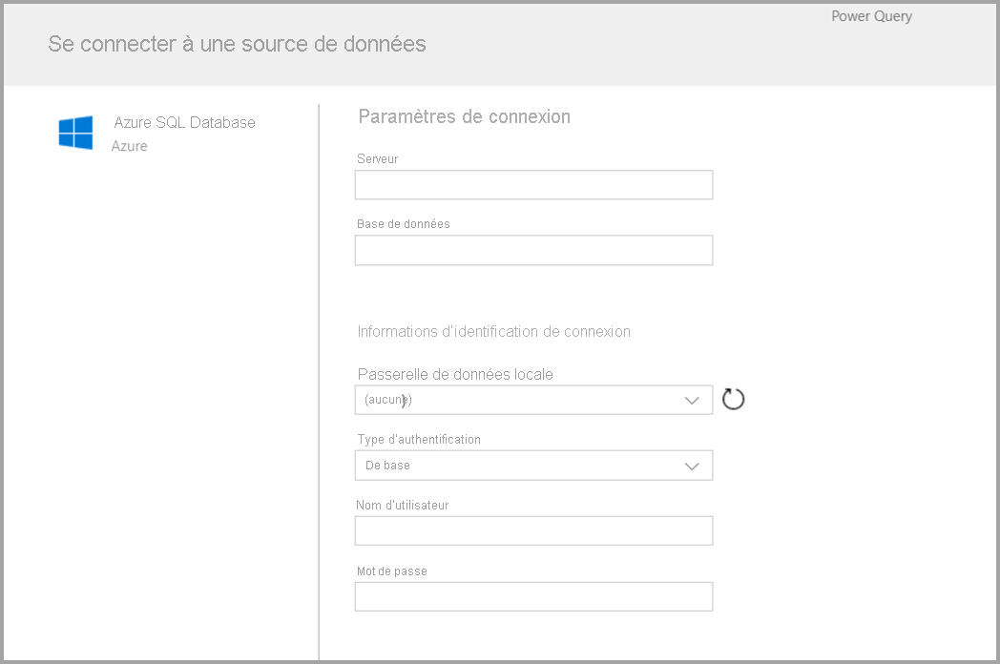
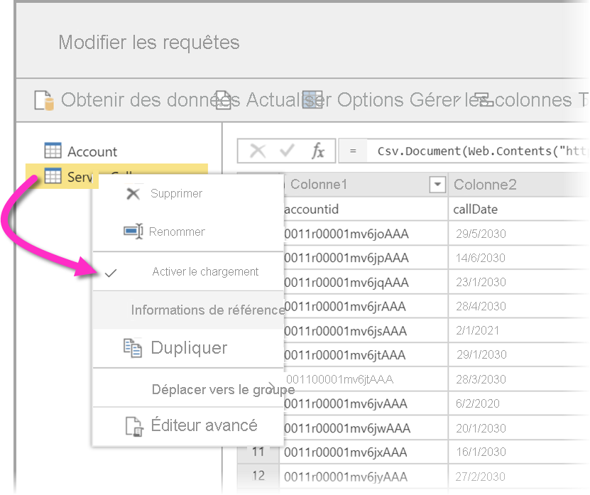
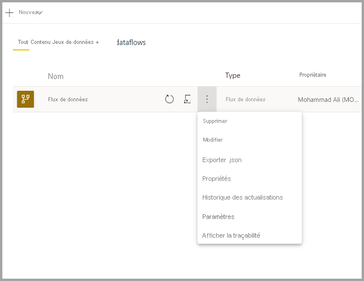

# Création d’un flux de données
Un **dataflow** est une collection d’entités (les entités sont similaires aux tables) créées et gérées dans des espaces de travail du service Power BI. Une **entité/table** est un ensemble de champs utilisés pour stocker des données, à l’instar d’une table dans une base de données. Vous pouvez ajouter et modifier des entités/tables dans votre dataflow, mais aussi gérer des planifications d’actualisation de données, directement dans l’espace de travail où votre dataflow a été créé.

Pour créer un dataflow, lancez le service Power BI dans un navigateur, puis sélectionnez un **espace de travail** (les dataflows ne sont pas disponibles dans la section *Mon espace de travail* du service Power BI) à partir du volet de navigation sur la gauche, comme le montre l’écran suivant. Vous pouvez également créer un espace de travail dans lequel créer votre nouveau flux de données.

Il existe plusieurs façons de créer un dataflow ou de bâtir par-dessus un dataflow :

* [Créer un dataflow à l’aide de l’option Définir de nouvelles entités](#create-a-dataflow-using-define-new-entities)
* [Créer un dataflow en utilisant des entités liées](#create-a-dataflow-using-linked-entities)
* [Créer un dataflow en utilisant une entité calculée](#create-a-dataflow-using-a-computed-entity)
* [Créer un dataflow en utilisant l’importation/exportation](#create-a-dataflow-using-importexport)

Les sections suivantes explorent en détail chacune de ces méthodes de création de dataflow.

## Créer un dataflow à l’aide de l’option Définir de nouvelles entités

L’option Définir de nouvelles entités vous permet de définir une nouvelle entité/table et de vous connecter à une nouvelle source de données.

Lorsque vous sélectionnez une source de données, vous êtes invité à fournir les paramètres de connexion, y compris le compte à utiliser lors de la connexion à la source de données, comme le montre l’illustration suivante.

Une fois connecté, vous pouvez sélectionner les données à utiliser pour votre entité. Quand vous choisissez des données et une source, Power BI se reconnecte à la source de données afin de maintenir les données de votre dataflow actualisées, selon une fréquence que vous sélectionnerez par la suite dans le processus d’installation.

Une fois que vous sélectionnez les données à utiliser dans l’entité, vous pouvez utiliser l’éditeur de flux de données pour former ou transformer ces données dans le format nécessaire pour une utilisation dans votre flux de données. 

## Créer un dataflow en utilisant des entités liées

En créant un dataflow avec des entités liées, vous pouvez faire référence à une entité existante, définie dans un autre dataflow, en lecture seule. La liste suivante décrit certaines des raisons d’opter pour cette approche :

* Si vous avez l’intention de réutiliser une entité dans plusieurs dataflows, par exemple une entité Date ou une table de recherche statique, vous devez créer une entité une seule fois et la référencer dans les autres dataflows.

* Si vous voulez éviter de créer plusieurs actualisations pour une même source de données, il est préférable d’utiliser des entités liées pour stocker les données et offrir une fonction de cache. Cela permet à chaque consommateur ultérieur d’exploiter cette entité, ce qui réduit la charge au niveau de la source de données sous-jacente.

* Si vous avez besoin d’effectuer une fusion entre deux entités.

> [!NOTE]
> Les entités liées sont disponibles uniquement avec Power BI Premium.

## Créer un dataflow en utilisant une entité calculée

En créant un dataflow avec une entité calculée, vous pouvez faire référence à une entité liée et effectuer des opérations sur celle-ci en écriture seule. Vous obtenez alors une nouvelle entité, qui fait partie du dataflow. Pour convertir une entité liée en entité calculée, vous pouvez soit créer une requête à partir d’une opération de fusion, soit créer une référence ou un double de l’entité, si vous voulez modifier ou transformer l’entité.

### Comment créer des entités calculées

Une fois que vous avez un flux de données avec une liste d’entités, vous pouvez effectuer des calculs sur ces entités.
Dans l’outil de création de flux de données du service Power BI, sélectionnez **Modifier des entités**, puis cliquez avec le bouton droit sur l’entité que vous souhaitez utiliser comme base pour votre entité calculée et sur laquelle vous souhaitez effectuer des calculs. Dans le menu contextuel, choisissez **Référence**.
Pour que l’entité soit éligible en tant qu’entité calculée, la sélection **Activer le chargement** doit être activée, comme le montre l’illustration suivante. Cliquez avec le bouton droit sur l’entité pour afficher ce menu contextuel.

En sélectionnant **Activer le chargement**, vous créez une entité dont la source est l’entité référencée. L’icône change et l’icône **calculée** s’affiche, comme le montre l’illustration suivante.

Toute transformation que vous effectuez sur cette nouvelle entité s’exécute sur les données qui résident déjà dans le stockage de dataflow Power BI. La requête ne sera donc pas exécutée sur la source de données externe d’où les données ont été importées (par exemple, la base de données SQL dont les données ont été extraites), mais plutôt sur les données qui résident dans le stockage de flux de données.

**Exemples de cas d’usage** Quels types de transformations est-il possible d’effectuer avec les entités calculées ? Toutes les transformations normalement définies avec l’interface utilisateur de transformation dans Power BI ou avec l’éditeur M sont prises en charge lors de l’exécution de calculs dans le stockage.

Prenons l’exemple suivant : vous avez une entité *Compte* qui contient les données brutes de tous les clients de votre abonnement à Dynamics 365. Vous avez également des données brutes *ServiceCalls* du centre de service, avec des données issues des appels de support effectués depuis les différents comptes chaque jour de l’année.

Imaginez que vous souhaitez enrichir l’entité *Compte* avec des données issues de *ServiceCalls*.
Tout d’abord, vous devez agréger les données à partir de *ServiceCalls* pour calculer le nombre d’appels qui ont été passés au support pour chaque compte au cours de l’année dernière.

Ensuite, vous souhaitez fusionner l’entité *Compte* avec l’entité *ServiceCallsAggregated* pour calculer la table *Compte* enrichie.

Vous pouvez alors voir les résultats sous forme d *EnrichedAccount* dans l’illustration suivante.

Et voilà, la transformation est effectuée sur les données dans le flux de données qui réside dans votre abonnement Power BI Premium, pas sur les données source.

> [!NOTE]
> Les entités calculées sont une fonctionnalité Premium uniquement

## Créer un dataflow en utilisant un dossier CDM

En créant un dataflow à partir d’un dossier CDM, vous pouvez faire référence à une entité qui a été écrite par une autre application au format CDM (Common Data Model). Vous êtes invité à indiquer le chemin complet du fichier au format CDM stocké dans ADLS Gen 2.

 

La création de flux de données à partir de dossiers CDM est soumise aux conditions suivantes :

* Le compte ADLS Gen 2 doit disposer des autorisations appropriées pour permettre à PBI d’accéder au fichier

* Le compte ADLS Gen 2 doit être accessible à l’utilisateur qui tente de créer le dataflow

* La création de flux de données à partir de dossiers CDM est uniquement disponible dans la nouvelle expérience d’espace de travail.

* L’URL doit être un chemin d’accès direct au fichier JSON et utiliser le point de terminaison ADLS Gen 2 ; blob.core n’est pas pris en charge

## Créer un dataflow en utilisant l’importation/exportation

En créant un dataflow en utilisant l’importation/exportation, vous pouvez importer un dataflow à partir d’un fichier. Cela est utile si vous souhaitez enregistrer une copie du dataflow en mode hors connexion ou déplacer un dataflow d’un espace de travail vers un autre. 

Pour exporter un dataflow, sélectionnez le dataflow que vous avez créé, sélectionnez l’élément de menu **Plus** (les points de suspension) pour développer les options, puis sélectionnez **export.json**. Vous êtes invité à commencer le téléchargement du dataflow représenté au format CDM.

Pour importer un dataflow, sélectionnez l’option d’importation et chargez le fichier. Power BI crée le dataflow automatiquement et vous permet de l’enregistrer en l’état ou d’effectuer des transformations supplémentaires.

## Étapes suivantes

Une fois que vous avez créé un flux de données, vous pouvez utiliser Power BI Desktop et le service Power BI pour créer des jeux de données, des rapports, des tableaux de bord et des applications basés sur les données entrées dans les flux de données Power BI Desktop, ce qui vous permet d’avoir des informations sur vos activités métier. Les articles suivants explorent plus en détail les scénarios d’usage courant pour les dataflows :

* [Introduction aux dataflows et à la préparation des données en libre-service](dataflows-introduction-self-service.md)
* [Configurer et consommer un dataflow](dataflows-configure-consume.md)
* [Configuration du stockage de dataflows pour utiliser Azure Data Lake Gen 2](dataflows-azure-data-lake-storage-integration.md)
* [Fonctionnalités Premium des dataflows](dataflows-premium-features.md)
* [IA et dataflows](dataflows-machine-learning-integration.md)
* [Considérations et limitations des dataflows](dataflows-features-limitations.md)
* [Bonnes pratiques pour les dataflows](dataflows-best-practices.md)