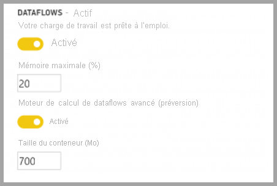
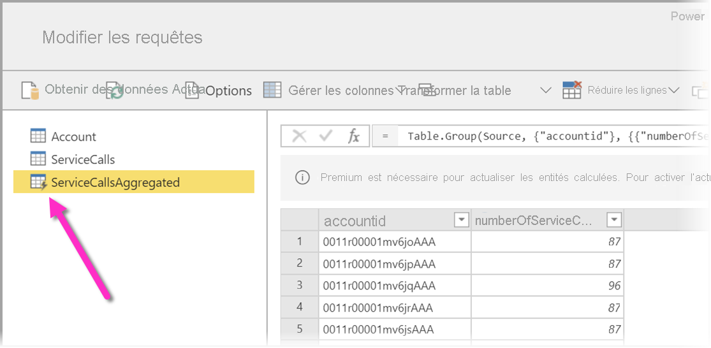
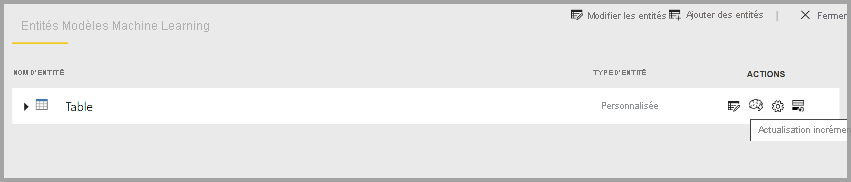

# Fonctionnalités Premium des dataflows

Les dataflows sont pris en charge pour les utilisateurs Power BI Pro et Power BI Premium. Certaines fonctionnalités sont uniquement disponibles avec un abonnement Power BI Premium. Cet article décrit et détaille les fonctionnalités uniquement Premium et leurs utilisations. 

Les fonctionnalités suivantes sont disponibles uniquement avec Power BI Premium :

* Moteur de calcul avancé
* Direct Query
* Entités calculées
* Entités liées
* Actualisation incrémentielle

Les sections suivantes décrivent chacune de ces fonctionnalités en détail.

## Le moteur de calcul amélioré

Le moteur de calcul amélioré dans Power BI permet aux abonnés Power BI Premium d’utiliser leur capacité pour optimiser l’utilisation des dataflows. L’utilisation du moteur de calcul amélioré offre les avantages suivants :

* Elle réduit considérablement le temps d’actualisation nécessaires aux étapes ETL de longue durée sur les entités calculées, comme l’exécution de *jointures* , le calcul de *distinctions* , les *filtres* et les *regroupements*.
* Exécuter des requêtes DirectQuery sur les entités

L’activation du moteur de calcul avancé est décrite à la suite, et vous trouverez également des réponses aux questions courantes.

### Utilisation du moteur de calcul amélioré

Le moteur de calcul amélioré s’active à partir de la page **Paramètres de capacité** du service Power BI, dans la section **Dataflows**. Par défaut, le moteur de calcul amélioré est **Désactivé**. Pour activer le moteur de calcul avancé, faites passer le bouton bascule sur **Activé** , comme dans l’image suivante, puis enregistrez vos paramètres. 

> [!IMPORTANT]
> Le moteur de calcul avancé fonctionne uniquement pour les capacités Power BI de niveau A3 et supérieur.

Une fois le moteur de calcul avancé activé, revenez aux **dataflows**. Vous devriez alors constater une amélioration des performances dans les entités calculées qui effectuent des opérations complexes, comme les *jointures* ou les *regroupements* pour les dataflows créés à partir des entités liées existantes de la même capacité. 

Pour tirer le meilleur parti du moteur de calcul, divisez l’étape ETL en deux dataflows distincts de la façon suivante :

* **Dataflow 1**  : ce dataflow doit uniquement ingérer tout ce qui est nécessaire d’une source de données et le placer dans le dataflow 2.
* **Dataflow 2**  : effectuez toutes les opérations ETL dans ce second dataflow, mais vérifiez que vous référencez bien le dataflow 1, qui doit se trouver sur la même capacité. Veillez également à effectuer les opérations pliables (filtrer, grouper par, distinct, jointure) avant toutes les autres, pour veiller à ce que le moteur de calcul soit utilisé.

### Questions et réponses courantes

**Question :** J’ai activé le moteur de calcul amélioré, mais mes actualisations sont plus lentes. Pourquoi ?

**Réponse :** Si vous activez le moteur de calcul amélioré, deux explications peuvent justifier des temps d’actualisation plus lents :

 * Lorsque le moteur de calcul amélioré est activé, il requiert de la mémoire pour fonctionner correctement. Ainsi, la mémoire disponible pour effectuer une actualisation est réduite et augmente donc la probabilité qu’elle soit mise en file d’attente, ce qui réduit à son tour le nombre de dataflows pouvant être actualisés simultanément. Pour résoudre ce problème, quand vous activez le calcul amélioré, augmentez la mémoire allouée aux dataflows pour veiller à ce que la mémoire disponible pour les actualisations de dataflows simultanées reste la même.

 * Une autre raison pour laquelle vous pouvez rencontrer des actualisations plus lentes est que le moteur de calcul fonctionne uniquement sur les entités existantes. Si votre dataflow fait référence à une source de données qui n’est pas un dataflow, vous ne constaterez pas d’amélioration. Les performances ne s’améliorent pas car, dans certains scénarios Big Data, la lecture initiale d’une source de données est plus lente, puisque les données doivent être transmises au moteur de calcul amélioré.  

**Question :** Je ne vois pas la bascule du moteur de calcul amélioré. Pourquoi ?

**Réponse :** Le moteur de calcul amélioré est publié par étapes dans les régions du monde entier. Nous prévoyons que toutes les régions seront prises en charge d’ici la fin 2020.

**Question :** Quels sont les types de données pris en charge pour le moteur de calcul ?

**Réponse :** Le moteur de calcul amélioré et les dataflows prennent actuellement en charge les types de données suivants. Si votre dataflow n’utilise pas l’un des types de données suivants, une erreur se produit lors de l’actualisation :

* Date/heure
* Nombre décimal
* Texte
* Nombre entier
* Date/heure/fuseau horaire
* Vrai/Faux
* Date
* Heure

## Utiliser DirectQuery avec des dataflows dans Power BI (préversion)

Vous pouvez utiliser DirectQuery pour vous connecter directement des dataflows, et ainsi vous connecter directement à votre dataflow sans devoir importer ses données. 

L’utilisation de DirectQuery avec des dataflows apporte les améliorations suivantes à Power BI et à vos processus de dataflows :

* **Éviter les planifications d’actualisation distinctes**  : DirectQuery se connecte directement à un dataflow, ce qui élimine la nécessité de créer un jeu de données. Ainsi, l’utilisation de DirectQuery avec vos dataflows signifie que vous n’avez plus besoin de planifications d’actualisation distinctes pour le dataflow et pour le jeu de données pour garantir que vos données sont synchronisées.

* **Filtrage des données**  : DirectQuery est pratique pour travailler sur une vue filtrée des données au sein d’un dataflow. Si vous voulez filtrer les données et ainsi travailler sur un sous-ensemble de données plus petit dans votre dataflow, vous pouvez utiliser DirectQuery (et le moteur de calcul) pour filtrer les données du dataflow et utiliser le sous-ensemble filtré dont vous avez besoin.

### Utilisation de DirectQuery pour les dataflows

L’utilisation de DirectQuery avec des dataflows est une fonctionnalité en préversion disponible à partir de la version de mai 2020 de Power BI Desktop. 

Il existe également des prérequis pour l’utilisation de DirectQuery avec des dataflows :

* Votre dataflow doit se trouver dans un espace de travail activé pour Power BI Premium
* Le **moteur de calcul** doit être activé

### Activer DirectQuery pour les dataflows

Pour garantir que votre flux de données est disponible pour un accès par DirectQuery, le moteur de calcul amélioré doit être dans son état optimisé. Pour activer DirectQuery pour les dataflows, définissez l’option **Paramètres du moteur de calcul amélioré** sur **On**. L’image suivante montre le paramètre correctement sélectionné.

Une fois que vous avez appliqué ce paramètre, actualisez le dataflow pour que l’optimisation prenne effet.

### Considérations et limitations concernant DirectQuery

DirectQuery et les dataflows présentent quelques limitations connues, à savoir :

* Pendant la période de préversion de cette fonctionnalité, certains clients peuvent rencontrer des dépassements de délai d’expiration ou des problèmes de performances lors de l’utilisation de DirectQuery avec des dataflows. Des solutions à ces problèmes sont activement recherchées pendant cette période de préversion.

* Les modèles composites/mixtes qui ont des sources de données d’importation et DirectQuery ne sont pas pris en charge pour le moment.

* Les grands dataflows peuvent rencontrer des problèmes de délai d’expiration lors de l’affichage des visualisations. Les dataflows volumineux qui rencontrent des problèmes de délai d’attente doivent utiliser le mode d’importation.

* Sous paramètres de source de données, le connecteur de dataflow affiche des informations d’identification non valides si vous utilisez DirectQuery. Cela n’affecte pas le comportement, et le jeu de données fonctionnera correctement. 

## Entités calculées

Vous pouvez effectuer des **calculs dans le stockage** lors de l’utilisation de **flux de données** avec un abonnement Power BI Premium. Ceci vous permet d’effectuer des calculs sur vos flux de données existants et de retourner des résultats qui vous permettent de vous concentrer sur la création et l’analyse de rapports.

Pour effectuer des calculs dans le stockage , vous devez tout d’abord créer le flux de données et amener des données dans le stockage de flux de données Power BI. Une fois que vous avez un flux de données qui contient des données, vous pouvez créer des entités calculées, qui effectuent des calculs dans le stockage.

### Considérations et limitations concernant les entités calculées

* Quand vous utilisez les dataflows créés dans le compte Azure Data Lake Storage Gen2 d’une organisation, les entités liées et les entités calculées ne fonctionnent correctement que lorsque les entités résident dans le même compte de stockage. 

Si vous avez besoin d’effectuer des calculs sur des données jointes par des données locales et cloud, la bonne pratique consiste à créer un dataflow pour chaque source (un pour les données locales et un pour les données cloud), puis à créer un troisième dataflow pour fusionner ces deux sources de données et/ou effectuer des calculs sur celles-ci.

## Entités liées

Quand vous utilisez un abonnement Power BI Premium, vous avez la possibilité de faire référence à des dataflows existants. Cela vous permet soit d’effectuer des calculs sur ces entités en utilisant des entités calculées, soit de créer une seule et même table de référence que vous pouvez réutiliser dans plusieurs dataflows.

## Actualisation incrémentielle

Les dataflows peuvent être configurés en vue d’une actualisation incrémentielle pour éviter d’avoir à extraire toutes les données à chaque actualisation. Pour ce faire, sélectionnez le dataflow, puis l’icône d’actualisation incrémentielle.

Le fait de définir l’actualisation incrémentielle a pour effet d’ajouter des paramètres au dataflow pour spécifier la plage de dates. Pour plus d’informations sur la configuration de l’actualisation incrémentielle, consultez l’article traitant de l’[actualisation incrémentielle](/power-query/dataflows/incremental-refresh).

### Cas où l’actualisation incrémentielle ne doit pas être définie

Évitez d’utiliser l’actualisation incrémentielle pour un dataflow dans les cas suivants :

* Les entités liées ne doivent pas utiliser l’actualisation incrémentielle si elles font référence à un dataflow. Les dataflows ne prennent pas en charge le Query Folding (même si DirectQuery est activé pour l’entité). 
* Les jeux de données qui font référence à des dataflows ne doivent pas utiliser l’actualisation incrémentielle. En général, l’actualisation des dataflows fonctionne bien. Si l’opération prend plus de temps que prévu, envisagez d’utiliser le moteur de calcul et/ou le mode DirectQuery.

## Étapes suivantes
Les articles suivants vous permettront d’en savoir plus sur les dataflows et Power BI :

* [Introduction aux dataflows et à la préparation des données en libre-service](dataflows-introduction-self-service.md)
* [Création d’un flux de données](dataflows-create.md)
* [Configurer et consommer un dataflow](dataflows-configure-consume.md)
* [Configuration du stockage de dataflows pour utiliser Azure Data Lake Gen 2](dataflows-azure-data-lake-storage-integration.md)
* [IA et dataflows](dataflows-machine-learning-integration.md)
* [Considérations et limitations des dataflows](dataflows-features-limitations.md)