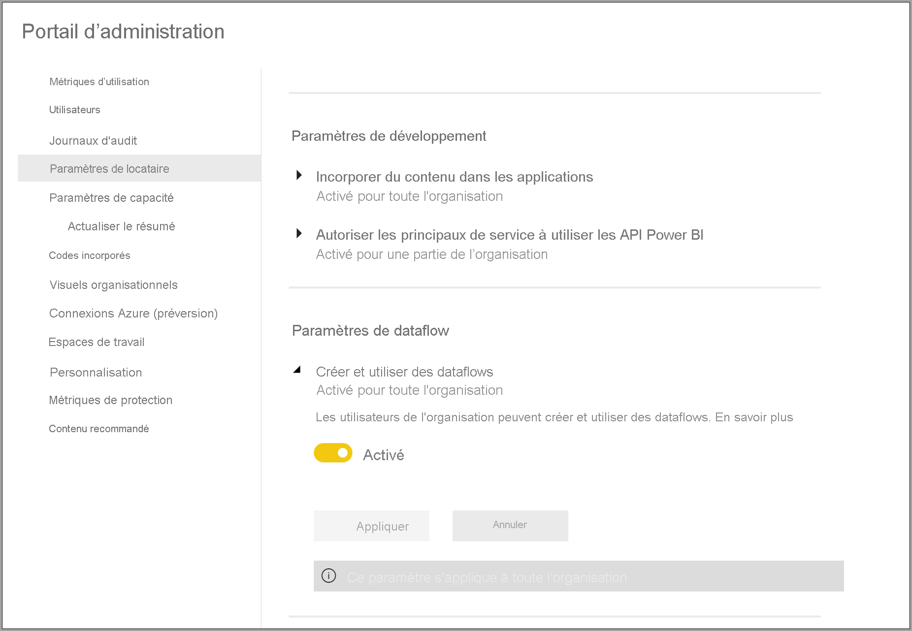
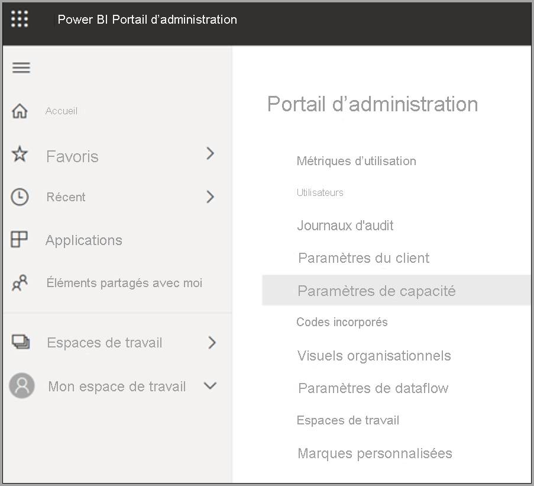
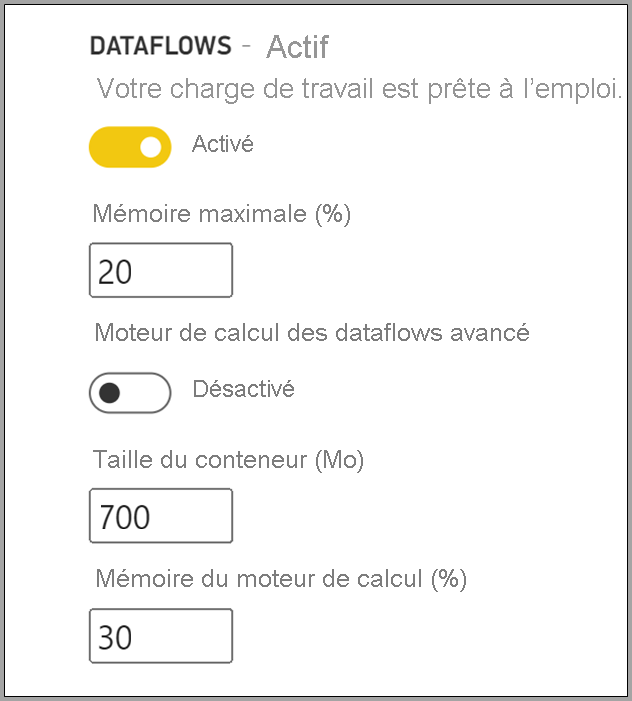

# Configurer des charges de travail de dataflow Power BI Premium

Vous pouvez créer des charges de travail de dataflow dans votre abonnement Power BI Premium. Power BI utilise le concept des *charges de travail* pour décrire le contenu Premium. Les charges de travail incluent les jeux de données, les rapports paginés, les dataflows et l’intelligence artificielle. La charge de travail des *dataflows* vous permet d’utiliser la préparation des données en libre-service des dataflows pour ingérer, transformer, intégrer et enrichir les données. Les dataflows Power BI Premium se gèrent dans le **portail d’administration**.

Les sections suivantes décrivent comment activer des dataflows dans votre organisation, comment ajuster leurs paramètres dans votre capacité Premium et comment obtenir des conseils sur leur utilisation courante.

## Activation des dataflows dans Power BI Premium

La première obligation pour utiliser des dataflows dans votre abonnement Power BI Premium consiste à activer la création et l’utilisation des dataflows pour votre organisation. Dans le **portail d’administration** , sélectionnez **Paramètres du client** et basculez le curseur **Paramètres de dataflow** sur **Activé** , comme illustré dans l’image ci-après.

Une fois que la charge de travail Dataflows est activée, elle est configurée avec les paramètres par défaut. Vous pouvez ajuster ces paramètres à votre gré. Nous allons ensuite décrire chacun de ces paramètres et leur emplacement afin de vous aider à comprendre à quel moment vous pouvez en modifier les valeurs pour optimiser les performances de vos dataflows.

## Ajustement des paramètres de dataflow

Une fois les dataflows activés, vous pouvez utiliser le **portail d’administration** pour modifier ou ajuster la façon dont les dataflows sont créés et utilisent les ressources de votre abonnement Power BI Premium. Les étapes suivantes montrent comment ajuster vos paramètres de dataflow.

1. Dans le **portail d’administration** , sélectionnez **Paramètres du client** pour lister toutes les capacités déjà créées. Sélectionnez une capacité pour gérer ses paramètres.

    

2. Votre capacité Power BI Premium reflète les ressources disponibles pour vos dataflows. Vous pouvez modifier la taille de votre capacité en sélectionnant le bouton **Modifier la taille** , comme illustré dans l’image ci-après.

    

3. Dans Paramètres de capacité, vous pouvez configurer les paramètres de dataflow en développant **Charges de travail**.

    

4. Dans la section **Charges de travail** , accédez à la zone **Dataflows**. L’image ci-après montre les paramètres que vous pouvez utiliser pour contrôler ou ajuster le comportement des charges de travail de dataflow pour votre capacité.

    

Le tableau suivant fournit une description élémentaire des paramètres de dataflow.

| **Section Administration** | **Nom du paramètre** | **Description** |
|---------|---------|---------|
| **Taille de la capacité** | **Modifier la taille** | La capacité en cours de sélection est listée, avec des options pour la modifier. La modification de ce paramètre permet d’effectuer un scale-up ou un scale-down de la capacité. |
| **Charge de travail** | **Mémoire maximale (%)** | Pourcentage maximal de mémoire disponible que les dataflows peuvent utiliser dans une capacité. |
| **Charge de travail** | **Moteur de calcul de dataflows avancé** | Activez cette option pour un calcul jusqu’à 20 fois plus rapide d’entités calculées lors de l’utilisation de volumes de données à grande échelle.  **Vous devez redémarrer la capacité pour activer le nouveau moteur.**  Pour plus d’informations, consultez [Moteur de calcul de dataflows avancé](../../admin/service-admin-premium-workloads.md#enhanced-dataflows-compute-engine). |
| **Charge de travail** | **Taille du conteneur** | Taille maximale du conteneur que les dataflows utilisent pour chaque entité dans le dataflow. La valeur par défaut est 700 Mo. Pour plus d’informations, consultez [Taille du conteneur](../../admin/service-admin-premium-workloads.md#container-size). |
| **Charge de travail** | **Mémoire du moteur de calcul (%)** | Pourcentage maximal de mémoire allouée au moteur de calcul. La valeur par défaut s’élève à 30 %. |

Dans les sections suivantes, nous examinons de près chacun des paramètres et leur impact sur votre charge de travail de dataflow.

### Compréhension des options de charge de travail de dataflow

Pour appréhender simplement les options de charge de travail de dataflow, nous allons utiliser une analogie. Considérons la *taille de la capacité* , ou le type d’instance Power BI Premium dont vous disposez, comme votre *restaurant*. Au sein de votre restaurant, vous avez la *mémoire de votre charge de travail* , qui correspond à votre *cuisine*. Le *moteur de calcul* est votre *four*. Enfin, le *conteneur* est le type de qualité de votre *chef*. Pour évaluer vos options de charge de travail de dataflow, imaginez que vous préparez un plat pour un important dîner. Vous allez recevoir des invités prestigieux et le dîner devra être servi à leur arrivée.

Nous allons utiliser cette analogie du restaurant pour expliquer chacun des paramètres et donner les instructions qui les concernent. Nous allons commencer par le commencement : votre capacité Premium, car il s’agit du premier choix que vous faites quand vous utilisez Power BI Premium.

#### Références SKU de capacité Premium : effectuer un scale-up du matériel

Les charges de travail Power BI Premium utilisent une combinaison de cœurs front-end et back-end pour servir des requêtes rapides sur les différents types de charges de travail. L’article sur les [nœuds de capacité](../../admin/service-premium-what-is.md#capacity-nodes) comprend un graphique qui illustre les spécifications actuelles de chacune des offres de charges de travail disponibles. Les capacités A3 et plus peuvent tirer parti du moteur de calcul. Ainsi, quand vous voulez utiliser le moteur de calcul amélioré, commencez par les [nœuds de capacité](../../admin/service-premium-what-is.md#capacity-nodes). 

Dans notre analogie du restaurant, le choix d’une capacité revient à choisir un restaurant de qualité supérieure. Bien que son coût soit plus élevé, vous pouvez en attendre un niveau de performance supérieur en raison de l’augmentation des cœurs front-end, des cœurs back-end et de la mémoire accrue. Quand vous choisissez un restaurant plus grand, vous avez une cuisine plus grande et de meilleurs chefs, ce que vous pouvez comparer à une mise à niveau vers une référence SKU plus élevée dans Power BI Premium, pour profiter d’une augmentation de la vitesse du processeur, d’une augmentation de la mémoire par opération et d’un parallélisme renforcé.

#### Mémoire maximale : dédier une capacité aux dataflows 

Le paramètre **Mémoire maximale (%)** est le pourcentage de mémoire, en dehors de la mémoire physique disponible pour la capacité Premium, fourni pour les charges de travail de dataflow. Vous pouvez effectivement dédier jusqu’à la capacité totale d’une charge de travail de dataflow. Un scale-up de la capacité est alors effectué dynamiquement en fonction des besoins de l’allocation que vous définissez. Dans notre analogie, si vous agrandissez votre cuisine, vous pouvez préparer plus de plats. De même, vous pouvez augmenter la taille de la charge de travail de votre capacité pour les dataflows et en autoriser davantage. Bien qu’une gouvernance dynamique des ressources soit en place, l’option de configuration *Mémoire maximale (%)* vous permet de dédier 100 % de la mémoire à la charge de travail de dataflow. Cette situation rare se produit quand vous voulez veiller à ce que la mémoire de la capacité soit disponible pour votre charge de travail de dataflow, plutôt que compter sur la gouvernance des ressources. Dans notre analogie, cela revient à veiller à ce que votre cuisine se concentre sur la préparation d’un repas spécifique pour un invité, en consacrant toute la cuisine à cette tâche. Bien entendu, la possibilité de dédier davantage ne rend pas la nourriture meilleure et n’accélère pas le service en salle, comme l’explique la section suivante.

#### Taille du conteneur : problèmes d’actualisation ou de mémoire insuffisante

Nous allons ensuite nous intéresser au paramètre **Taille du conteneur (Mo)** . En interne, les dataflows utilisent un processus appelé *conteneurs mashup* pour évaluer vos processus ETL. Le moteur fractionne la logique de votre requête dans ces conteneurs pour leur permettre un traitement en parallèle. Le nombre de conteneurs assure un traitement simultané efficace, ce qui augmente les performances. Ces conteneurs sont limités par la **capacité**  en premier lieu, par le paramètre **Mémoire maximale (%)** dans un deuxième temps, puis par la quantité de mémoire que vous leur allouez spécifiquement dans le paramètre correspondant, laquelle s’élève à 700 Mo par défaut. Ainsi, il est possible d’augmenter la quantité de mémoire matérielle et la taille de conteneur, mais ces augmentations vont aussi diminuer les opérations parallèles tout en dédiant plus de mémoire au processus ETL spécifique au sein de vos conteneurs. Le nombre de conteneurs est limité à trois fois le nombre de cœurs back-end, ce qui est important car vous ne pouvez pas réduire le conteneur fortement et avoir un grand nombre de conteneurs parallèles au-delà de ce point. La taille minimale que vous pouvez définir pour un conteneur est de 200 Mo. La taille de conteneur s’étend au niveau de la requête, ce qui signifie que chaque requête est exécutée dans son propre conteneur, sauf quand des requêtes en référencent d’autres, auquel cas elles sont actualisées dans le cadre du même conteneur.

Si nous revenons à notre analogie, un nombre plus petit de cuisiniers dans la cuisine mais dont le niveau de concentration est plus élevé vous permet de préparer un plat beaucoup plus rapidement, selon les types de commandes passées et la complexité du plat. Le compromis ici est le fait d’avoir moins de cuisiniers, mais un temps de préparation optimisé. De même, l’augmentation de la taille de conteneur dans une fourchette comprise entre 1200 et 1500 Mo peut signifier qu’un nombre plus petit de tâches ETL plus complexes, comme des agrégations, des jointures, des champs dynamiques, des manipulations de lignes ou de colonnes, peut entraîner une amélioration des performances si nous fournissons plus de mémoire pour chaque conteneur, mais réduisons en même temps le nombre de conteneurs. Tout comme l’implique l’analogie, un nombre trop élevé de commandes peut en fait ralentir la cadence de la cuisine, ce que vous pouvez comparer à la taille de conteneur. Utilisez cette méthode quand vous avez besoin d’exécuter des opérations d’entité complexes et que vous êtes prêt à sacrifier le parallélisme pour les performances, car l’amélioration de cette ressource divise la mémoire allouée à un nombre plus petit de conteneurs.

Pour résumer, vous avez intérêt à optimiser votre taille de conteneur en fonction des requêtes utilisées. Par exemple, le simple chargement de données à partir d’une source dans une entité ne nécessite pas d’extraire des données ni d’effectuer des opérations. Il s’agit juste de charger les données dans le stockage. Vous avez besoin du niveau de parallélisme le plus élevé possible dans cette situation, car vous avez intérêt à augmenter la vitesse des opérations de chargement et d’actualisation. À l’inverse, quand vous ajoutez d’autres opérations de transformation (des filtres complexes, des jointures, des agrégations), la mémoire peut être beaucoup plus élevée, car nous aurons peut-être besoin de traiter certaines de ces opérations de transformation dans la mémoire. N’oubliez pas que si vous avez d’autres opérations de dataflow qui s’exécutent sur la capacité, elles peuvent être ralenties et mises automatiquement en file d’attente avant d’obtenir un emplacement d’exécution. À cette fin, la supervision et la gestion des dataflows, l’actualisation des performances et la capacité entière sont soutenues par l’application **Power BI Premium Capacity Metrics**. Vous pouvez utiliser l’application [Mesures de capacité Power BI Premium](../../admin/service-premium-capacity-optimize.md#what-content-is-using-up-my-capacity) pour filtrer par capacité et vérifier les mesures de performance pour le contenu de l’espace de travail. Il est possible de passer en revue les métriques de performances et l’utilisation des ressources par heure, pour les sept derniers jours, pour l’ensemble du contenu stocké dans une capacité Premium. Ainsi, pour examiner les performances des dataflows, il est recommandé de commencer avec l’application.

#### Moteur de calcul amélioré : une occasion d’améliorer les performances

Dans notre analogie, le [moteur de calcul amélioré](dataflows-premium-features.md#the-enhanced-compute-engine) est comme un four. Power BI utilise un moteur de calcul pour traiter vos requêtes et actualiser les opérations. Le moteur de calcul amélioré est une optimisation du moteur standard qui fonctionne en chargeant des données dans un cache SQL et utilise SQL pour accélérer la transformation des entités, actualiser les opérations et activer la connectivité DirectQuery. Si nous comparons les moteurs à des fours, quand vous bénéficiez du four amélioré, vous pouvez éventuellement cuisiner des plats plus rapidement et plus efficacement. Configuré sur **Activé** ou **Optimisé** pour les entités calculées, si votre logique métier l’autorise, Power BI utilise SQL pour accélérer les performances. La configuration sur **Activé** fournit également une connectivité DirectQuery. Comme le suggère l’analogie, certains plats n’ont peut-être pas besoin d’un four ou n’en tirent pas parti. Le moteur de calcul amélioré peut être considéré de la même manière : assurez-vous que l’utilisation des dataflows exploite correctement le moteur de calcul amélioré.

> [!NOTE]
> Le moteur de calcul amélioré n’est pas encore disponible dans toutes les régions.

## Instructions pour les scénarios courants

Cette section fournit des instructions pour les scénarios courants d’utilisation de charges de travail de dataflow avec Power BI Premium.

### Délais d’actualisation longs

Les délais d’actualisation longs relèvent généralement d’un problème de parallélisme. Vous devez passer en revue les options suivantes, dans l’ordre :

1. La nature de la préparation des données est un concept clé pour les délais d’actualisation longs. Dans notre analogie du restaurant décrite plus haut dans cet article, imaginez que vous avez déjà préparé des aliments, qui n’attendent plus que d’être utilisés. Dans ce scénario, les aliments peuvent être cuisinés beaucoup plus rapidement en raison d’un délai de préparation réduit. De même, chaque fois que vous pouvez optimiser votre délai d’actualisation en exploitant votre source de données qui effectue réellement la préparation et en exécutant la logique de requête intiale, vous devez le faire. Plus précisément, quand vous utilisez une base de données relationnelle comme SQL en tant que source, voyez si la requête initiale peut être exécutée sur la source et utilisez cette requête source pour votre dataflow d’extraction initial pour la source de données. Si vous ne pouvez pas utiliser une requête native dans le système source, effectuez des opérations que le [moteur de dataflow peut replier sur la source de données](https://docs.microsoft.com/power-query/power-query-folding).

2. Évaluez la répartition des délais d’actualisation sur la même capacité. Les opérations d’actualisation sont un processus qui requiert un calcul considérable. Dans notre analogie du restaurant, la répartition des délais d’actualisation revient à limiter le nombre de clients dans votre restaurant. Tout comme les restaurants prévoient le flux des clients et planifient leur capacité, vous devez également envisager d’effectuer les opérations d’actualisation en dehors des heures de pointe. Cela peut vous aider à réduire la pression sur la capacité.

3. Augmentez la quantité globale de mémoire donnée à la charge de travail. Considérez ce paramètre comme la taille de la cuisine. Ajuster cette ressource revient à adapter le nombre de cuisiniers que la cuisine peut accueillir. Pour cela, vous pouvez ajuster le paramètre **Mémoire maximale (%)** et l’augmenter jusqu’à 100 %.

4. Réduisez la quantité de mémoire pour le conteneur, ce qui permet d’obtenir plus de conteneurs. Considérez ce paramètre de la façon suivante : au lieu d’embaucher un chef célèbre, comme Philippe Etchebest, recrutez de nombreux chefs compétents mais moins onéreux. Vous avez donc plus de chefs dans la cuisine, mais ces chefs ne peuvent effectuer que des tâches plus petites. Vous avez alors plus de conteneurs, mais moins de mémoire.

5. Optez pour les deux étapes précédentes, pour obtenir un degré de parallélisme encore plus élevé, car vous obtenez plus de cuisiniers et une cuisine plus grande.
    
6. Si les étapes de cette section ne débouchent pas sur le degré de parallélisme souhaité, envisagez de mettre à niveau votre capacité vers une référence SKU supérieure. Ensuite, suivez à nouveau les précédentes étapes décrites dans cette section.

### Exceptions de mémoire insuffisante

Quand vous rencontrez des **exceptions de mémoire insuffisante** , vous devez augmenter les performances des conteneurs et de la mémoire. Effectuez les étapes suivantes.

1. Augmentez la mémoire sur le conteneur. Cela revient à avoir un seul chef étoilé plutôt qu’un grand nombre de chefs, comme décrit dans la section précédente.

2. Augmentez la mémoire pour la charge de travail et pour le conteneur. Dans notre analogie, cela revient à créer une cuisine plus grande et à faire appel à des chefs plus qualifiés.

3. Si ces modifications ne vous donnent pas le degré de parallélisme souhaité, envisagez de choisir une référence SKU Power BI Premium supérieure.

### Utilisation du moteur de calcul pour améliorer les performances

Effectuez les étapes suivantes pour permettre aux charges de travail de déclencher le moteur de calcul afin de toujours améliorer les performances :

**Pour les entités calculées et liées dans le même espace de travail :**

1. Pour l’ *ingestion* , concentrez-vous sur l’obtention aussi rapide que possible des données dans le stockage, en utilisant des filtres uniquement s’ils réduisent la taille globale du jeu de données. Une bonne pratique consiste à séparer votre logique de transformation de cette étape et à permettre au moteur de se concentrer sur la collecte initiale des ingrédients. Ensuite, séparez votre transformation et votre logique métier dans un dataflow distinct dans le même espace de travail, à l’aide d’entités liées ou calculées. Ainsi, le moteur peut activer et accélérer vos calculs. Dans notre analogie, il s’agit de la préparation des aliments dans la cuisine : la préparation des aliments constitue généralement une étape distincte de la sélection des ingrédients bruts et une condition préalable à leur cuisson dans le four. De même, votre logique a besoin d’être préparée séparément avant d’exploiter le moteur de calcul.

2. Veillez à effectuer les opérations de repli, comme les fusions, les jointures, les conversions et [autres](https://docs.microsoft.com/power-query/power-query-folding#transformations-that-can-achieve-folding).

3. Créez les dataflows [conformément aux instructions et limitations publiées](dataflows-features-limitations.md#dataflows-in-premium).

Vous pouvez également utiliser DirectQuery.

### Le moteur de calcul est activé mais les performances sont lentes

Effectuez les étapes suivantes dans les scénarios où le moteur de calcul est activé, mais que vous constatez une baisse des performances :

1. Limitez les entités calculées et liées qui existent dans l’espace de travail.

2. Si votre actualisation initiale avec le moteur de calcul est activée, alors les données sont écrites dans le lac et dans le cache. Cette double écriture implique que ces actualisations sont plus lentes.

3. Si vous avez un dataflow lié à plusieurs dataflows, vérifiez que vous planifiez les actualisations des dataflows sources de sorte qu’ils ne s’actualisent pas tous en même temps.

## Étapes suivantes
Les articles suivants vous permettront d’en savoir plus sur les dataflows et Power BI :

* [Introduction aux dataflows et à la préparation des données en libre-service](dataflows-introduction-self-service.md)
* [Création d’un flux de données](dataflows-create.md)
* [Configurer et consommer un dataflow](dataflows-configure-consume.md)
* [Configuration du stockage de dataflows pour utiliser Azure Data Lake Gen 2](dataflows-azure-data-lake-storage-integration.md)
* [IA et dataflows](dataflows-machine-learning-integration.md)
* [Considérations et limitations des dataflows](dataflows-features-limitations.md)
