# Utiliser des agrégations dans Power BI Desktop

Les *agrégations* dans Power BI vous permettent de réduire la taille des tables pour vous permettre de vous concentrer sur les données importantes et d’améliorer le niveau de performance des requêtes. Les agrégations permettent une analyse interactive de Big Data de façons qui ne seraient pas possibles autrement. De plus, elles peuvent réduire considérablement le coût du déverrouillage de jeux de données volumineux pour la prise de décision.

Voici certains avantages de l’utilisation d’agrégations :

- **Meilleur niveau de performance de requête sur le Big Data**. Chaque interaction avec des visuels Power BI soumet des requêtes DAX au jeu de données. Les données agrégées mises en cache utilisent une fraction des ressources requises pour les données de détail, ce qui vous permet de déverrouiller le Big Data qui seraient autrement inaccessibles.
- **Actualisation optimisée des données**. Les tailles de cache plus petites réduisent les temps d’actualisation, de sorte que les données parviennent plus rapidement aux utilisateurs.
- **Architectures équilibrées**. Le cache en mémoire Power BI peut gérer des requêtes agrégées, limitant les requêtes envoyées en mode DirectQuery et vous aidant à respecter les limites de concurrence. Les requêtes de données de niveau de détail restantes sont le plus souvent des requêtes filtrées, au niveau transactionnel, normalement bien gérées par les systèmes du big data et les entrepôts de données.

Les sources de données dimensionnelles, telles que les entrepôts de données et les mini-Data Warehouses, peuvent utiliser des [agrégations basées sur les relations](#aggregation-based-on-relationships). Souvent, les sources de big data basées sur Hadoop [basent les agrégations sur les colonnes GroupBy](#aggregation-based-on-groupby-columns). Cet article décrit les différences typiques de modélisation Power BI pour chaque type de source de données.

## Créer une table agrégée

Pour créer une table agrégée :
1. Configurez une nouvelle table avec les champs de votre choix, en fonction de votre source de données et de votre modèle. 
1. Définissez les agrégations en utilisant la boîte de dialogue **Gérer les agrégations**.
1. Le cas échéant, changez le [mode de stockage](#storage-modes) pour la table agrégée. 

### Gérer les agrégations

Après avoir créé la nouvelle table qui contient les champs souhaités, dans le volet **Champs** d’une vue Power BI Desktop, cliquez avec le bouton droit sur la table et sélectionnez **Gérer les agrégations**.

La boîte de dialogue **Gérer les agrégations** montre une ligne pour chaque colonne de la table, où vous pouvez spécifier le comportement d’agrégation. Dans l’exemple suivant, les requêtes adressées à la table de détails **Sales** sont redirigées en interne vers la table d’agrégation **Sales Agg**. 

La liste déroulante **Totalisation** dans la boîte de dialogue **Gérer les agrégations** fournit les valeurs suivantes :
- Count
- GroupBy
- Max
- Min
- Sum
- Compter les lignes de la table

Dans cet exemple d’agrégation basée sur les relations, les entrées GroupBy sont facultatives. À l’exception de DISTINCTCOUNT, elles n’affectent pas le comportement d’agrégation et sont principalement utilisées pour une meilleure lisibilité. Sans les entrées GroupBy, les agrégations obtiendraient quand même des correspondances, en fonction des relations. Cela diffère de l’[exemple de Big Data](#aggregation-based-on-groupby-columns) plus loin dans cet article, où les entrées GroupBy sont requises.

Après avoir défini les agrégations de votre choix, sélectionnez **Appliquer tout**. 

### Validations

La boîte de dialogue **Gérer les agrégations** applique les validations notables suivantes :

- La **colonne de détails** doit avoir le même type de données que la **colonne d’agrégation**, sauf pour les fonctions de **totalisation** Compter et Compter les lignes de la table. Les fonctions Compter et Compter les lignes de la table sont disponibles uniquement pour les colonnes d’agrégation d’entiers et ne nécessitent pas de type de données correspondant.
- Les agrégations chaînées couvrant trois tables ou plus ne sont pas autorisées. Par exemple, les agrégations sur une **Table A** ne peuvent pas faire référence à une **Table B** qui a des agrégations faisant référence à une **C**.
- Les agrégations en double, où deux entrées utilisent la même fonction de **totalisation** et font référence aux mêmes **table de détails** et **colonne de détails**, ne sont pas autorisées.
- La **table de détails** doit utiliser le mode de stockage DirectQuery, et non pas Importer.
- Le regroupement par une colonne de clé étrangère utilisée par une relation inactive et le recours à la fonction USERELATIONSHIP pour les accès à l’agrégation ne sont pas pris en charge.

La plupart des validations sont appliquées en désactivant les valeurs de liste déroulante et en affichant un texte explicatif dans l’info-bulle, comme illustré dans l’image suivante.

### Les tables d’agrégation sont masquées

Les utilisateurs disposant d’un accès en lecture seule au jeu de données ne peuvent pas interroger les tables d’agrégation. Cela évite des problèmes de sécurité en cas d’utilisation avec la *sécurité au niveau des lignes (RLS)* . Les consommateurs et les requêtes font référence à la table de détails, et non pas à la table d’agrégation, et n’ont pas besoin de connaître la table d’agrégation.

Pour cette raison, les tables d’agrégation sont masquées dans la vue **Rapport**. Si la table n’est pas déjà masquée, la boîte de dialogue **Gérer les agrégations** la définit comme masquée lorsque vous sélectionnez **Appliquer tout**.

### Modes de stockage
La fonctionnalité d’agrégation interagit avec les modes de stockage de niveau table. Les tables Power BI peuvent utiliser les modes de stockage *DirectQuery*, *Importer* ou *Double*. DirectQuery interroge directement le back-end, tandis que le mode Importer met en cache les données en mémoire et envoie les requêtes aux données mises en cache. Toutes les sources de données DirectQuery non multidimensionnelles et d’importation Power BI fonctionnent avec les agrégations. 

Pour définir le mode de stockage d’une table agrégée sur Importer pour accélérer les requêtes, sélectionnez la table agrégée dans la vue **Modèle** de Power BI Desktop. Dans le volet **Propriétés**, développez **Avancé**, déroulez la liste de sélection **Mode de stockage** et sélectionnez **Importer**. Notez que cette action est irréversible. 

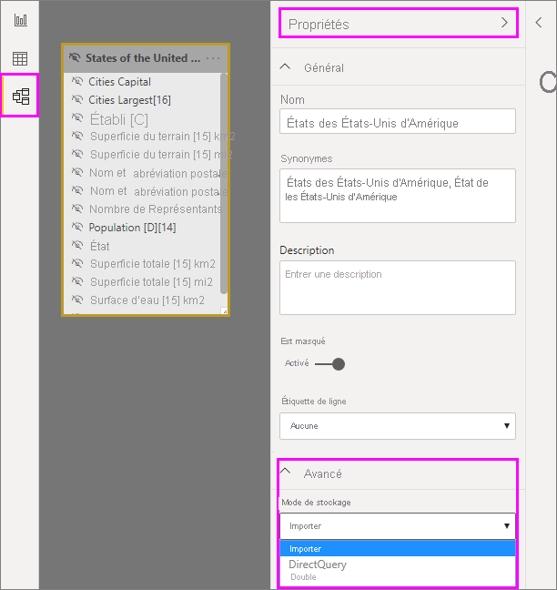

Pour plus d’informations sur les modes de stockage de table, consultez [Gérer le mode de stockage dans Power BI Desktop](desktop-storage-mode.md).

### Sécurité au niveau des lignes pour les agrégations

Pour fonctionner correctement pour les agrégations, les expressions de sécurité au niveau des lignes (SNL) doivent filtrer la table d’agrégation et la table de détails. 

Dans l’exemple suivant, l’expression SNL sur la table **Geography** fonctionne pour les agrégations, car Geography se trouve du côté du filtrage des relations avec les tables **Sales** et **Sales Agg**. La sécurité au niveau des lignes est appliquée aussi bien aux requêtes qui accèdent à la table d’agrégation qu’à celles qui n’y accèdent pas.

Une expression SNL sur la table **Product** filtre seulement la table de détails **Sales**, et non pas la table agrégée **Sales Agg**. La table d’agrégation étant une autre représentation des données de la table de détails, il ne serait pas sûr de répondre aux requêtes à partir de la table d’agrégation si le filtre SNL ne peut pas être appliqué. Le filtrage de la table de détails uniquement n’est pas recommandé, car les requêtes utilisateur issues de ce rôle ne bénéficient pas des accès à l’agrégation. 

Une expression SNL qui filtrerait uniquement la table d’agrégation **Sales Agg** et pas la table de détails **Sales** n’est pas autorisée.

Pour les [agrégations basées sur les colonnes GroupBy](#aggregation-based-on-groupby-columns), une expression SNL appliquée à la table de détails peut être utilisée pour filtrer la table d’agrégation, car toutes les colonnes GroupBy de la table d’agrégation sont couvertes par la table de détails. En revanche, un filtre SNL sur la table d’agrégation ne peut pas être appliqué à la table de détails et il est donc interdit.

## Agrégation basée sur des relations

Les modèles dimensionnels utilisent généralement des *agrégations basées sur des relations*. Les jeux de données Power BI issus d’entrepôts de données et de mini-Data Warehouses ressemblent à des schémas en étoile/flocons de neige, avec des relations entre les tables de dimension et les tables de faits.

Dans le modèle suivant issu d’une source de données unique, les tables utilisent le mode de stockage DirectQuery. La table de faits **Sales** contient des milliards de lignes. La définition du mode de stockage de **Sales** sur Importer pour la mise en cache entraînerait une charge de mémoire et de gestion considérable.

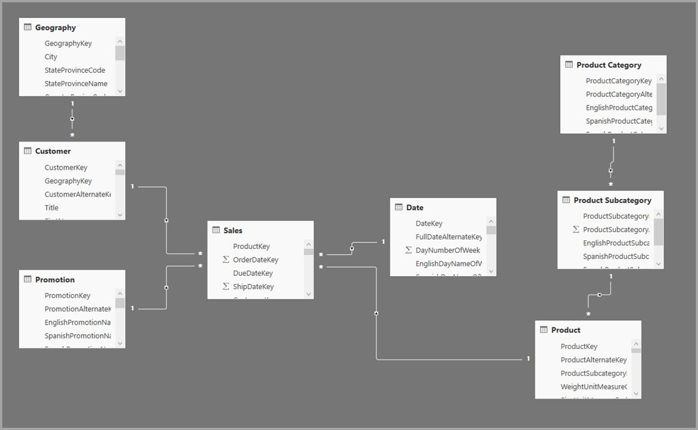

À la place, créez la table d’agrégation **Sales Agg**. Dans la table **Sales Agg**, le nombre de lignes est égal à la somme des **SalesAmount** regroupés par **CustomerKey**, **DateKey** et **ProductSubcategoryKey**. La table **Sales Agg** figure à un niveau de précision plus élevé que **Sales**. Par conséquent, au lieu de milliards, elle peut contenir des millions de lignes, ce qui est beaucoup plus facile à gérer.

Si les tables de dimension suivantes sont les plus couramment utilisées pour les requêtes à forte valeur métier, elles peuvent filtrer **Sales Agg** à l’aide de relations *un-à-plusieurs* ou *plusieurs-à-un*.

- Geography
- Client
- Date
- Product Subcategory
- Product Category

L’image suivante illustre ce modèle.

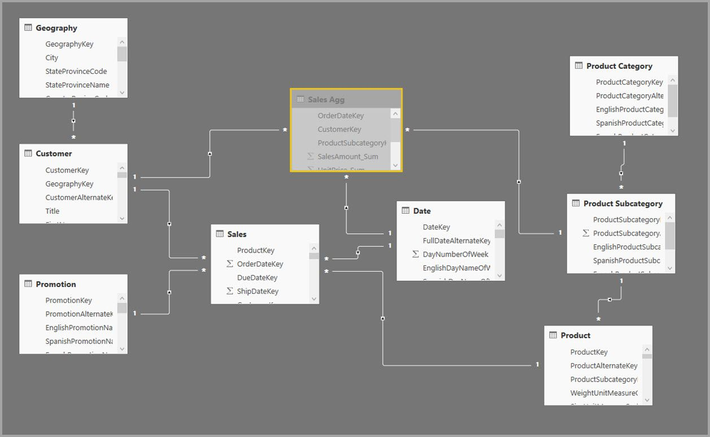

Le tableau suivant présente les agrégations pour la table **Sales Agg**.

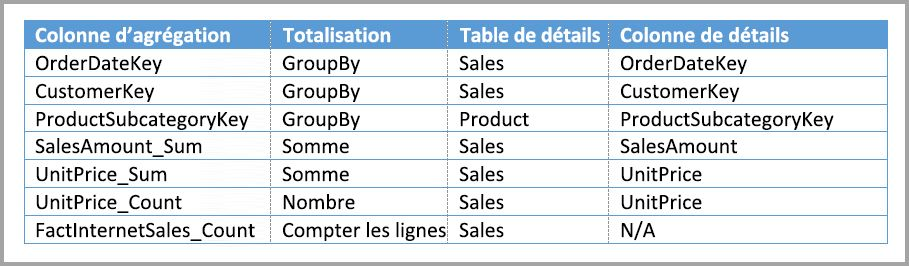

> [!NOTE]
> La table **Sales Agg**, comme toute autre table, offre la flexibilité de pouvoir être chargée de différentes manières. L’agrégation peut être effectuée dans la base de données source à l’aide de processus ETL/ELT, ou par l’[expression M](/powerquery-m/power-query-m-function-reference) pour la table. La table agrégée peut utiliser le mode de stockage Importer, avec ou sans [actualisation incrémentielle dans Power BI Premium](../admin/service-premium-incremental-refresh.md), ou elle peut utiliser DirectQuery et être optimisée pour les requêtes rapides à l’aide des [index columnstore](/sql/relational-databases/indexes/columnstore-indexes-overview). Cette flexibilité permet d’obtenir des architectures équilibrées capables de répartir la charge des requêtes pour éviter les goulots d’étranglement.

Le remplacement du mode de stockage de la table agrégée **Sales Agg** par **Importer** ouvre une boîte de dialogue indiquant que les tables de dimension associées peuvent être définies sur le mode de stockage *Double*. 

La configuration des tables de dimension associées en mode Double leur permet d’agir comme si elles étaient en mode Importer ou DirectQuery, en fonction de la sous-requête. Dans l’exemple :

- Les requêtes qui agrègent des métriques à partir de la table **Sales Agg** en mode Importer et qui regroupent par attribut à partir des tables en mode Double associées peuvent être renvoyées à partir du cache en mémoire.
- Les requêtes qui agrègent des métriques à partir de la table **Sales** en mode DirectQuery et qui regroupent par attribut à partir des tables en mode Double associées peuvent être renvoyées en mode DirectQuery. La logique de requête, y compris l’opération GroupBy, est transmise à la base de données source.

Pour plus d’informations sur le mode de stockage Double, consultez [Gérer le mode de stockage dans Power BI Desktop](desktop-storage-mode.md).

### Relations régulières/relations limitées

Les occurrences d’agrégations basées sur des relations nécessitent des relations régulières.

Les relations régulières incluent les combinaisons de modes de stockage suivantes, où les deux tables proviennent d’une source unique :

| Table côté *plusieurs* | Table côté *1* |
| ------------- |----------------------| 
| Double          | Double                 | 
| Importer        | Importer ou Double       | 
| DirectQuery   | DirectQuery ou Double  | 

Le seul cas où une relation *inter-sources* est considérée comme régulière est celui où les deux tables sont en mode Importer. Les relations plusieurs-à-plusieurs sont toujours considérées comme limitées.

Pour les accès à l’agrégation *inter-sources* qui ne dépendent pas de relations, consultez [Agrégation en fonction des colonnes GroupBy](#aggregation-based-on-groupby-columns). 

### Exemples de requêtes d’agrégation basée sur les relations

La requête suivante atteint l’agrégation, car les colonnes de la table **Date** sont au niveau de granularité qui peut atteindre l’agrégation. La colonne **SalesAmount** utilise l’agrégation **Somme**.

La requête suivante n’atteint pas l’agrégation. Bien qu’elle demande la somme de **SalesAmount**, la requête effectue une opération GroupBy sur une colonne de la table **Product**, dont le niveau de précision ne permet pas d’accéder à l’agrégation. Si vous observez les relations dans le modèle, une sous-catégorie de produit peut avoir plusieurs lignes **Product**. La requête ne peut pas déterminer le produit dans lequel effectuer l’agrégation. Dans ce cas, la requête rebascule vers DirectQuery et soumet une requête SQL à la source de données.

Les agrégations ne sont pas uniquement destinées à des calculs simples qui effectuent une simple addition. Les calculs complexes peuvent également en tirer parti. Conceptuellement, un calcul complexe est divisé en sous-requêtes pour chaque SUM, MIN, MAX et COUNT, et chaque sous-requête est évaluée pour déterminer si elle peut accéder à l’agrégation. Si cette logique n’est pas valable dans tous les cas en raison de l’optimisation du plan de requête, elle doit d’une manière générale s’appliquer. L’exemple suivant atteint l’agrégation :

La fonction COUNTROWS peut tirer parti des agrégations. La requête suivante accède à l’agrégation, car il y a une agrégation **Compter les lignes de la table** définie pour la table **Sales**.

La fonction AVERAGE peut tirer parti des agrégations. La requête suivante atteint l’agrégation, car AVERAGE équivaut en interne à une SUM divisée par un COUNT. Étant donné que la colonne **UnitPrice** a des agrégations définies pour SUM et COUNT, l’agrégation est atteinte.

Dans certains cas, la fonction DISTINCTCOUNT peut tirer parti des agrégations. La requête suivante atteint l’agrégation, car il existe une entrée GroupBy pour **CustomerKey**, qui préserve le caractère distinct de **CustomerKey** dans la table d’agrégation. Cette technique peut encore atteindre le seuil de performances, où une quantité de valeurs distinctes comprise entre deux et cinq millions peut affecter le niveau de performance des requêtes. Toutefois, elle peut être utile dans les scénarios où il existe des milliards de lignes dans la table de détails mais entre deux et cinq millions de valeurs distinctes dans la colonne. Dans ce cas, la fonction DISTINCTCOUNT peut être plus rapide que l’analyse de la table contenant des milliards de lignes, même si elles ont été mises en cache en mémoire.

Les fonctions temporelles DAX prennent en charge l’agrégation. La requête suivante atteint l’agrégation, car la fonction DATESYTD génère une table de valeurs **CalendarDay** et la table d’agrégation se situe à un niveau de précision couvert pour les colonnes group-by dans la table **Date**. Il s’agit d’un exemple de filtre table pour la fonction CALCULATE, qui peut fonctionner avec des agrégations.

## Agrégation basée sur des colonnes GroupBy 

Les modèles de Big Data basés sur Hadoop ont des caractéristiques différentes des modèles dimensionnels. Pour éviter les jointures entre les grandes tables, les modèles de Big Data n’utilisent souvent pas de relations, mais dénormalisent les attributs de dimension en tables de faits. Vous pouvez déverrouiller ces modèles de Big Data pour effectuer une analyse interactive à l’aide d’*agrégations basées sur des colonnes GroupBy*.

Le tableau suivant contient la colonne numérique **Movement** à agréger. Toutes les autres colonnes sont des attributs permettant d’effectuer des regroupements. La table contient des données IoT et un très grand nombre de lignes. Le mode de stockage est DirectQuery. Les requêtes sur la source de données agrégées sur l’ensemble du jeu de données sont lentes en raison du volume élevé. 

Pour permettre une analyse interactive sur ce jeu de données, vous pouvez ajouter une table d’agrégation qui effectue des regroupements selon la plupart des attributs, mais exclut les attributs à cardinalité élevée comme la longitude et la latitude. Cela réduit considérablement le nombre de lignes, qui est suffisamment petit pour tenir confortablement dans un cache en mémoire. 

Vous définissez les mappages d’agrégation pour la table **Driver Activity Agg** dans la boîte de dialogue **Gérer les agrégations**. 

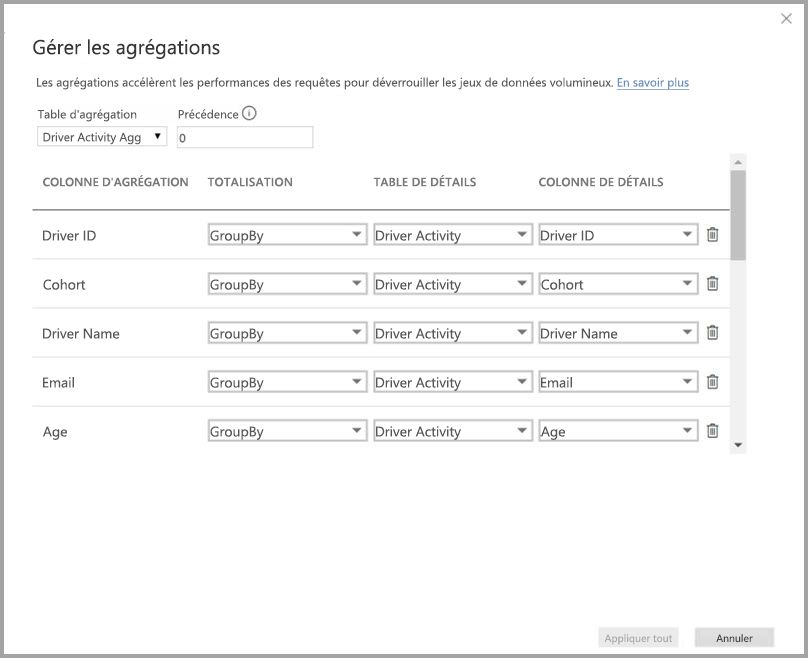

Dans les agrégations basées sur des colonnes GroupBy, les entrées **GroupBy** ne sont pas facultatives. Sans elles, les agrégations ne seront pas atteintes. Cela diffère de l’utilisation d’agrégations basées sur des relations, où les entrées GroupBy sont facultatives.

Le tableau suivant présente les agrégations pour la table **Driver Activity Agg**.

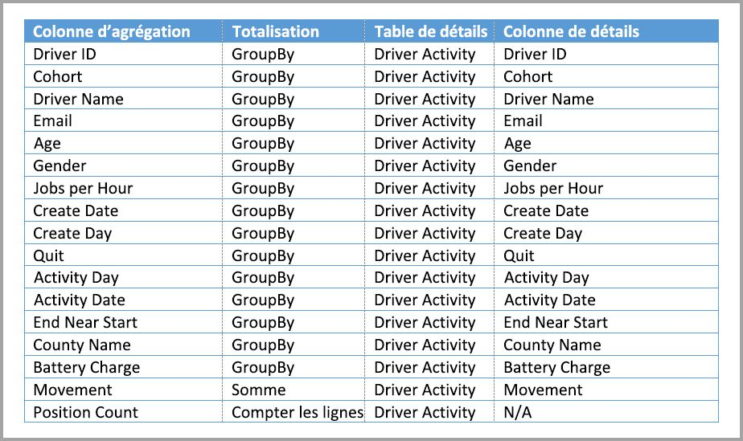

Vous pouvez définir le mode de stockage de la table agrégée **Driver Activity Agg** sur Importer.

### Exemple de requête d’agrégation GroupBy

La requête suivante accèdent à l’agrégation, car la colonne **Activity Date** est couverte par la table d’agrégation. La fonction COUNTROWS utilise l’agrégation **Compter les lignes de la table**.

Il est judicieux d’utiliser des agrégations **Compter les lignes de la table**, en particulier pour les modèles qui contiennent des attributs de filtre dans les tables de faits. Power BI peut soumettre des requêtes au jeu de données à l’aide de COUNTROWS dans des cas où cela n’est pas demandé explicitement par l’utilisateur. Par exemple, la boîte de dialogue de filtres indique le nombre de lignes pour chaque valeur.

## Techniques d’agrégation combinées

Vous pouvez combiner les relations et les techniques des colonnes GroupBy pour les agrégations. Les agrégations basées sur les relations peuvent nécessiter le fractionnement en plusieurs tables des tables de dimension dénormalisées. Si cette opération est coûteuse ou difficile pour certaines tables de dimension, vous pouvez répliquer les attributs nécessaires dans la table d’agrégation pour ces dimensions et utiliser des relations pour les autres.

Par exemple, le modèle suivant réplique **Month**, **Quarter**, **Semester** et **Year** dans la table **Sales Agg**. Il n’existe aucune relation entre **Sales Agg** et la table **Date**, mais il existe des relations avec **Customer** et **Product Subcategory**. Le mode de stockage de **Sales Agg** est Importer.

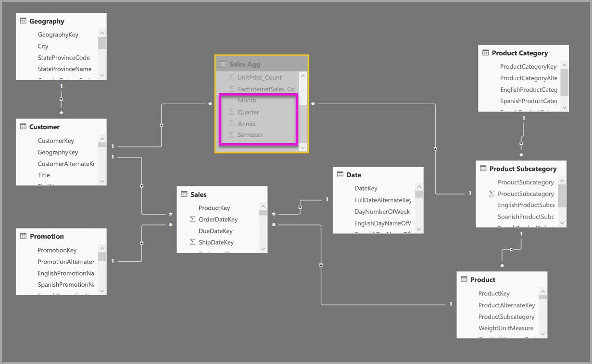

Le tableau suivant présente les entrées définies dans la boîte de dialogue **Gérer les agrégations** pour la table **Sales Agg**. Les entrées GroupBy où **Date** est la table de détails sont obligatoires pour accéder aux agrégations pour les requêtes qui regroupent par les attributs **Date**. Comme dans l’exemple précédent, les entrées **GroupBy** pour **CustomerKey** et **ProductSubcategoryKey** n’affectent pas les accès à l’agrégation, à l’exception de DISTINCTCOUNT, en raison de la présence des relations.

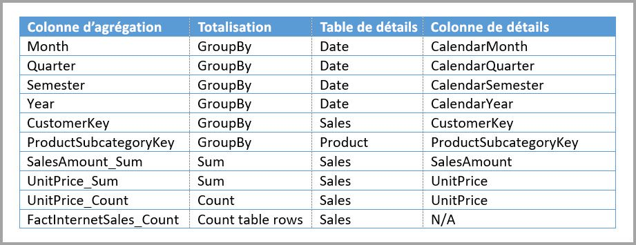

### Exemples de requêtes d’agrégation combinées

La requête suivante accède à l’agrégation, car la table d’agrégation couvre **CalendarMonth** et **CategoryName** est accessible via des relations un-à-plusieurs. **SalesAmount** utilise l’agrégation **SUM**.

La requête suivante n’accède pas à l’agrégation, car la table d’agrégation ne couvre pas **CalendarDay**.

La requête temporelle suivante n’accède pas à l’agrégation, car la fonction DATESYTD génère une table de valeurs **CalendarDay** et la table d’agrégation ne couvre pas **CalendarDay**.

## Précédence d’agrégation

La précédence d’agrégation permet à plusieurs tables d’agrégation d’être prises en compte par une sous-requête unique.

L’exemple suivant est un [modèle composite](desktop-composite-models.md) contenant plusieurs sources :

- La table en mode DirectQuery **Driver Activity** contient plus de mille milliards de lignes de données IoT provenant d’un système big data. Elle satisfait les requêtes d’extraction pour afficher des relevés IoT individuels dans des contextes de filtrage contrôlés.
- La table **Driver Activity Agg** est une table d’agrégation intermédiaire en mode DirectQuery. Elle contient plus d’un milliard de lignes dans Azure SQL Data Warehouse et est optimisée à la source à l’aide des index columnstore.
- La table en mode Importer **Driver Activity Agg2** est à un niveau de précision élevé, car les attributs de regroupement sont peu nombreux et ont une faible cardinalité. Le nombre de lignes pourrait n’être que de quelques milliers, et donc tenir facilement dans un cache en mémoire. Ces attributs étant utilisés par le tableau de bord d’un cadre supérieur, les requêtes qui y font référence doivent être le plus rapides possible.

> [!NOTE]
> Les tables d’agrégation en mode DirectQuery qui utilisent une source de données différente de la table de détails sont uniquement prises en charge si la table d’agrégation provient d’une source SQL Server, Azure SQL ou Azure SQL Data Warehouse.

L’encombrement mémoire de ce modèle est relativement faible, mais il déverrouille un jeu de données volumineux. Il représente une architecture équilibrée, car il répartit la charge des requêtes entre les composants de l’architecture et les utilise en fonction de leurs points forts.

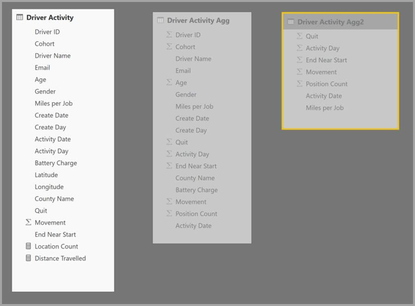

La boîte de dialogue **Gérer les agrégations** pour **Driver Activity Agg2** définit le champ **Précédence** sur *10*, ce qui est supérieur à la précédence pour **Driver Activity Agg**. Un paramètre de précédence plus élevé signifie que les requêtes qui utilisent des agrégations prendront en compte **Driver Activity Agg2** en premier. Les sous-requêtes qui ne présentent pas la précision pouvant être satisfaite par **Driver Activity Agg2** considéreront **Driver Activity Agg** à la place. Les requêtes de détail qui ne peuvent être satisfaites par aucune de ces tables d’agrégation seront dirigées vers **Driver Activity**.

La table spécifiée dans la colonne **Table de détails** est **Driver Activity**, et non pas **Driver Activity Agg**, car les agrégations chaînées ne sont pas autorisées.

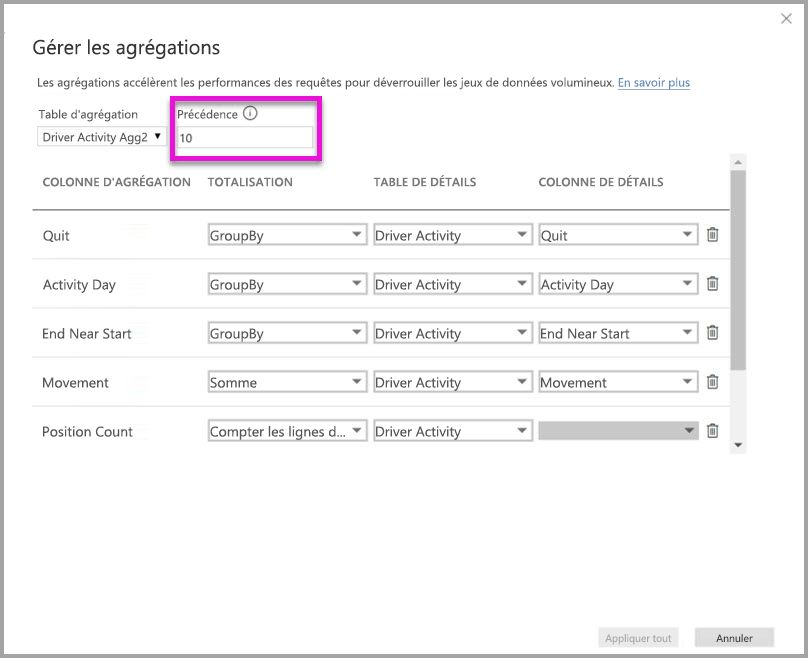

Le tableau suivant présente les agrégations pour la table **Driver Activity Agg2**.

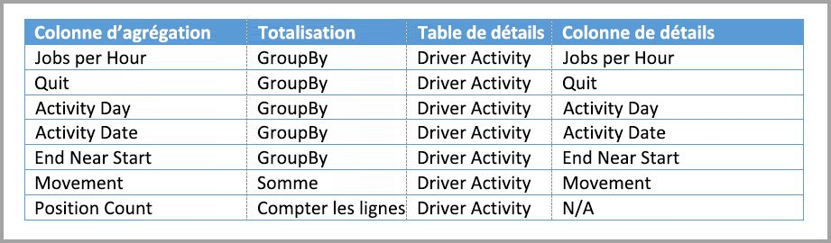

## Détecter si les requêtes atteignent ou manquent les agrégations

SQL Profiler peut détecter si les requêtes sont retournées à partir du moteur de stockage du cache en mémoire ou envoyées (push) à la source de données par DirectQuery. Vous pouvez utiliser le même processus pour détecter si les agrégations sont atteintes. Pour plus d’informations, consultez [Requêtes accédant au cache ou le manquant](desktop-storage-mode.md#queries-that-hit-or-miss-the-cache). 

SQL Profiler fournit également l’événement étendu `Query Processing\Aggregate Table Rewrite Query`.

L’extrait de code JSON suivant montre un exemple de sortie de l’événement quand une agrégation est utilisée.

- **matchingResult** montre que la sous-requête a utilisé une agrégation.
- **dataRequest** indique la ou les colonnes GroupBy et la ou les colonnes agrégées utilisées par la sous-requête.
- **mapping** indique les colonnes de la table d’agrégation avec lesquelles le mappage a été effectué.

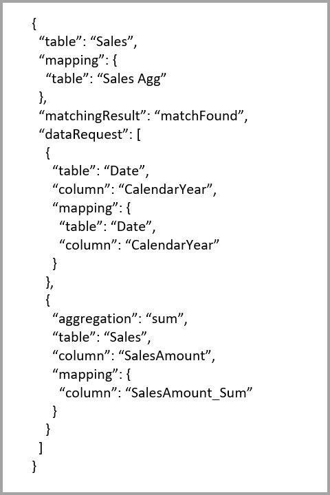

## Maintenir la synchronisation des caches

Les agrégations qui combinent les modes de stockage DirectQuery, Importer et/ou Double peuvent retourner des données différentes à moins que le cache en mémoire soit maintenu synchronisé avec les données sources. Par exemple, l’exécution des requêtes ne tente pas de masquer les problèmes de données en filtrant les résultats DirectQuery pour qu’ils correspondent aux valeurs mises en cache. Il existe des techniques établies pour gérer ces problèmes à la source, si nécessaire. Les optimisations de performances doivent être utilisées uniquement d’une manière qui ne compromet pas votre capacité à répondre aux besoins de l’entreprise. Il vous incombe de connaître vos flux de données et de réaliser la conception en conséquence. 

## Étapes suivantes

Pour plus d’informations sur les modèles composites, consultez :

- [Utiliser des modèles composites dans Power BI Desktop](desktop-composite-models.md)
- [Appliquer des relations plusieurs à plusieurs dans Power BI Desktop](desktop-many-to-many-relationships.md)
- [Gérer le mode de stockage dans Power BI Desktop](desktop-storage-mode.md)

Pour plus d’informations sur DirectQuery, consultez :

- [À propos de l’utilisation de DirectQuery dans Power BI](../connect-data/desktop-directquery-about.md)
- [Sources de données Power BI](../connect-data/power-bi-data-sources.md)
