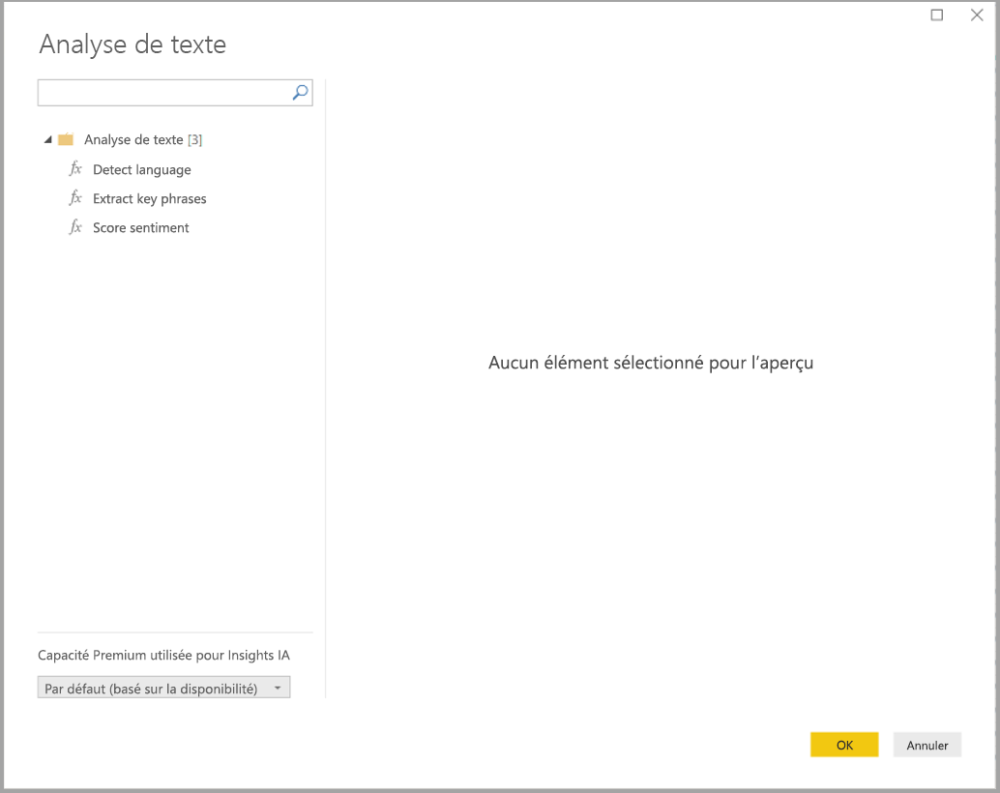
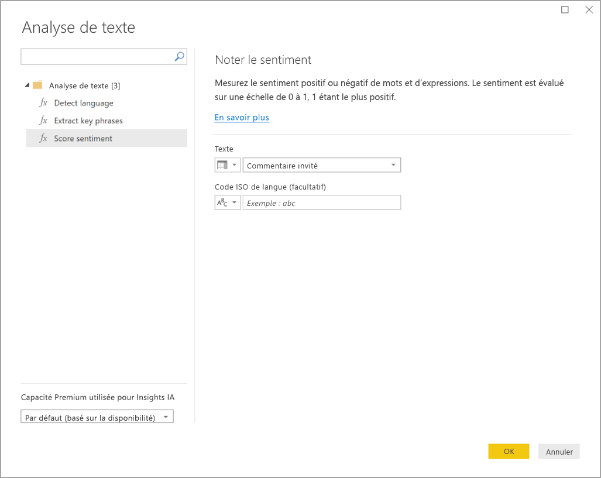
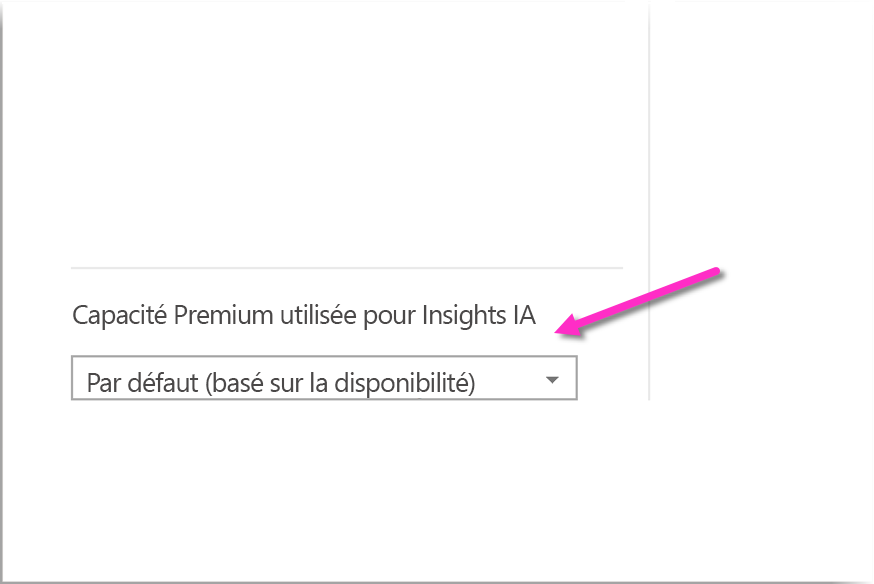
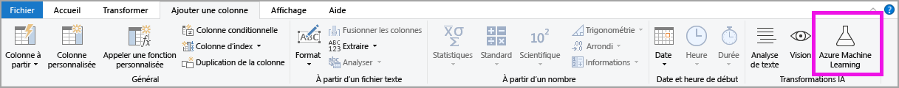

# Utiliser Insights IA dans Power BI Desktop

Dans Power BI, vous pouvez utiliser Insights IA pour accéder à une collection de modèles d'apprentissage machine préformés qui améliorent la préparation de vos données. Insights IA est accessible dans l'éditeur **Power Query**, et ses fonctionnalités et fonctions associées sont accessibles via les onglets **Accueil** et **Ajouter une colonne** dans l’**éditeur Power Query**. 

Cet article décrit les fonctions Analyse de texte et Vision, toutes deux disponibles dans Azure Cognitive Services. Vous trouverez également dans cet article une section qui décrit les fonctions personnalisées disponibles dans Power BI d'Azure Machine Learning.

## Comment activer Insights IA

Les Insights IA ont été mises à la disposition générale dans la version de juin 2020 de Power BI Desktop. Pour les versions antérieures de Power BI Desktop, les Insights IA dans Power BI doivent être activées en sélectionnant **Fichier > Options et paramètres > Options**, puis **Fonctionnalités en préversion** dans la colonne de gauche. Le volet droit affiche une sélection **Navigateur de fonctions Insights IA**. Cochez la case en regard de **Navigateur de fonctions Insights IA** pour activer la fonctionnalité en préversion. Vous devez redémarrer Power BI Desktop pour appliquer la fonctionnalité en préversion.

> [!NOTE]
> Les Insights IA sont généralement disponibles pour toutes les versions de Power BI Desktop à partir de la version de juin 2020, et pour ces versions, il n’est pas nécessaire d’activer cette fonctionnalité en tant que fonctionnalité en préversion.

## Utilisation des options Analyse de texte et Vision

Les options Analyse de texte et Vision de Power BI vous permettent d’appliquer différents algorithmes d’[Azure Cognitive Services](https://azure.microsoft.com/services/cognitive-services/) pour enrichir vos données dans Power Query.

Les services actuellement pris en charge sont les suivants :

* [Analyse des sentiments](https://docs.microsoft.com/azure/cognitive-services/text-analytics/how-tos/text-analytics-how-to-sentiment-analysis)
* [Extraction de phrases clés](https://docs.microsoft.com/azure/cognitive-services/text-analytics/how-tos/text-analytics-how-to-keyword-extraction)
* [Détection de langue](https://docs.microsoft.com/azure/cognitive-services/text-analytics/how-tos/text-analytics-how-to-language-detection)
* [Balisage des images](https://docs.microsoft.com/azure/cognitive-services/computer-vision/concept-tagging-images). 

Les transformations sont exécutées sur le service Power BI et ne nécessitent pas d’abonnement Azure Cognitive Services. 

> [!IMPORTANT]
> 
> L'utilisation des fonctions Analyse de texte ou Vision nécessite Power BI Premium.

### Activation des options Analyse de texte et Vision sur les capacités Premium

Cognitives Services est pris en charge pour les nœuds de capacité Premium EM2, A2 ou P1 et versions ultérieures. Une charge de travail d’intelligence artificielle distincte sur la capacité est utilisée pour exécuter Cognitive Services. Dans la préversion publique de ces fonctionnalités (avant juin 2019), cette charge de travail était désactivée par défaut. Avant d’utiliser les services cognitifs dans Power BI, la charge de travail d’intelligence artificielle doit être activée dans les **paramètres de capacité** du portail d’administration. Vous pouvez activer la **charge de travail d’intelligence artificielle** dans la section des **charges de travail** et définir la quantité maximale de mémoire que vous souhaitez que cette charge de travail utilise. La limite de mémoire recommandée est de 20 %. Le dépassement de cette limite ralentit la requête.

### Fonctions disponibles

Cette section décrit les fonctions disponibles dans Cognitive Services dans Power BI.

#### Détecter la langue

La fonction de détection de langue évalue le texte entré et, pour chaque champ, retourne le nom de la langue et l’identificateur ISO. Cette fonction est utile pour les colonnes de données qui collectent du texte arbitraire dont la langue est inconnue. La fonction attend des données au format texte en tant qu’entrée.

L’analyse de texte reconnaît jusqu'à 120 langues. Pour plus d’informations, consultez [langues prises en charge](https://docs.microsoft.com/azure/cognitive-services/text-analytics/text-analytics-supported-languages).

#### Extraire les phrases clés

La fonction **Extraction de phrases clés** évalue du texte non structuré et, pour chaque champ de texte, retourne une liste de phrases clés. La fonction requiert un champ de texte en tant qu’entrée et accepte une entrée facultative pour **Culture info**.

L’extraction de phrases clés fonctionne au mieux lorsque vous lui donnez de plus grands blocs de texte à traiter. C’est le contraire avec l’analyse des sentiments, qui fonctionne mieux sur des blocs de texte plus petits. Pour obtenir les meilleurs résultats lors des deux opérations, envisagez de restructurer les entrées en conséquence.

#### Noter le sentiment

La fonction **Noter le sentiment** évalue une entrée de texte et retourne un score de valeur de 0 (négatif) à 1 (positif) pour chaque document. Cette fonction est utile pour détecter les sentiments positifs et négatifs dans les médias sociaux, les avis de clients et les forums de discussion.

L’analyse de texte utilise un algorithme de classification de Machine Learning pour générer un score de sentiment entre 0 et 1. Des scores plus proches de 1 indiquent un sentiment positif, des scores plus proches de 0 un sentiment négatif. Le modèle est préformé avec un corps de texte étendu contenant des associations de sentiments. Il n’est actuellement pas possible de fournir vos propres données d’apprentissage. Le modèle utilise une combinaison de techniques pendant l’analyse de texte, notamment le traitement de texte, l’analyse morphosyntaxique, le placement des mots et les associations de mots. Pour plus d’informations sur l’algorithme, consultez [Introduction à l’analyse de texte](https://blogs.technet.microsoft.com/machinelearning/2015/04/08/introducing-text-analytics-in-the-azure-ml-marketplace/).

L’analyse des sentiments est effectuée sur tout le champ d’entrée, par opposition à l’extraction des sentiments pour une entité particulière du texte. Dans la pratique, on a tendance à noter la précision d’amélioration lorsque des documents contiennent une ou deux phrases plutôt qu’un grand bloc de texte. Pendant une phase d’évaluation de l’objectivité, le modèle détermine si un champ d’entrée en tant que tout est objectif ou contient des sentiments. Un champ d’entrée principalement objectif ne passe pas à la phase de détection des sentiments. Un score de .50 est généré sans traitement supplémentaire. Pour que les champs d’entrée continuent dans le pipeline, la phase suivante génère un score inférieur ou supérieur à .50, selon le degré de sentiment détecté dans le champ d’entrée.

Actuellement, l’analyse des sentiments prend en charge l’anglais, l’allemand, l’espagnol et le français. D’autres langues sont en préversion. Pour plus d’informations, consultez [langues prises en charge](https://docs.microsoft.com/azure/cognitive-services/text-analytics/text-analytics-supported-languages).

#### Baliser des images

La fonction **Baliser des images** retourne des balises basées sur plus de deux mille objets, êtres vivants, scènes et actions reconnaissables. Lorsque des balises sont ambiguës ou ne sont pas connues de beaucoup de personnes, la sortie donne des *indications* pour clarifier la signification de la balise dans le contexte d’un paramètre connu. Les balises ne sont pas organisées sous la forme d’une taxonomie et il n’y a pas de hiérarchies d’héritage. Une collection de balises de contenu constitue le fondement d’une *description* d’image affichée en tant que langage lisible humain mis en forme dans des phrases complètes.

Après le chargement d’une image ou la spécification d’une URL d’image, les algorithmes de vision par ordinateur sortent des balises basées sur des objets, des êtres vivants et des actions identifiés dans l’image. Le balisage n’est pas limité à l’objet principal, par exemple une personne au premier plan, mais inclut également le cadre (intérieur ou extérieur), le mobilier, les outils, les plantes, les animaux, les accessoires, les gadgets, etc.

Cette fonction requiert une URL de l’image ou un champ de base de données 64 bits en tant qu’entrée. Actuellement, le balisage des images prend en charge l’anglais, l’espagnol, le japonais, le portugais et le chinois simplifié. Pour plus d’informations, consultez [langues prises en charge](https://docs.microsoft.com/rest/api/cognitiveservices/computervision/tagimage/tagimage#uri-parameters).

### Appel des fonctions Analyse de texte ou Vision dans Power Query

Pour enrichir vos données avec les fonctions Analyse de texte ou Vision, ouvrez l’**éditeur Power Query**. Cet exemple montre comment noter le sentiment d'un texte. Les mêmes étapes peuvent être utilisées pour extraire des phrases clés, détecter la langue et baliser des images.

Sélectionnez le bouton **Analytique de texte** dans le ruban **Accueil** ou **Ajouter une colonne**. Vous serez invité à vous connecter.

Une fois connecté, sélectionnez la fonction que vous voulez utiliser et la colonne de données que vous voulez transformer dans la fenêtre contextuelle.

Power BI sélectionne une capacité Premium pour exécuter la fonction et renvoyer les résultats à Power BI Desktop. La capacité sélectionnée n'est utilisée que pour les fonctions Analyse de texte et vision pendant l'application et s’actualise dans Power BI Desktop. Une fois le rapport publié, les actualisations s'effectuent sur la capacité Premium de l'espace de travail sur lequel le rapport est publié. Vous pouvez modifier la capacité utilisée pour tous les services cognitifs dans le menu déroulant situé dans le coin inférieur gauche de la fenêtre contextuelle.

**CultureInfo** est une entrée facultative pour spécifier la langue du texte. Ce champ est un code ISO. Vous pouvez utiliser une colonne ou un champ statique en tant qu’entrée pour Cultureinfo. Dans cet exemple, la langue spécifiée pour toute la colonne est l’anglais (en). Si vous laissez ce champ vide, Power BI détecte automatiquement la langue avant d’appliquer la fonction. Sélectionnez ensuite **Appliquer.**

La première fois que vous utilisez Insights IA sur une nouvelle source de données, vous êtes invité à définir le niveau de confidentialité de vos données.

> [!NOTE]
> Les mises à jour du jeu de données dans Power BI ne fonctionneront que pour les sources de données dont le niveau de confidentialité est défini sur public ou organisationnel.

Après que la fonction a été appelée, le résultat est ajouté à la table en tant que nouvelle colonne. La transformation est également ajoutée en tant qu’étape appliquée dans la requête.

Dans le cas du balisage d'images et de l'extraction de phrases-clés, les résultats peuvent retourner plusieurs valeurs. Chaque résultat individuel est renvoyé sur un doublon de la ligne originale.

### Publication d'un rapport à l'aide des fonctions Analyse de texte ou Vision

Lors de l'édition dans Power Query et des actualisations dans Power BI Desktop, Analyse de texte et Vision utilisent la capacité Premium sélectionnée dans l'éditeur Power Query. Après la publication du rapport dans Power BI, le rapport utilise la capacité Premium de l'espace de travail dans lequel il a été publié.

Les rapports avec des fonctions appliquées Analyse de texte et Vision doivent être publiés dans un espace de travail qui ne dispose pas d'une capacité Premium.Sinon, l’actualisation du jeu de données échouera.

### Gérer l'impact sur une capacité Premium

Les sections suivantes expliquent comment gérer l’impact des options Analyse de texte et Vision sur la capacité.

#### Sélection d’une capacité

Les auteurs du rapport peuvent choisir la capacité Premium sur laquelle ils souhaitent exécuter Insights IA. Par défaut, Power BI sélectionne la première capacité créée à laquelle l'utilisateur a accès.

#### Suivi avec l'application Capacity Metrics

Les propriétaires de la capacité Premium peuvent suivre l'impact des fonctions Analyse de texte et Vision sur une capacité avec l'[application Power BI Premium Capacity Metrics](../admin/service-admin-premium-monitor-capacity.md). L’application fournit des métriques détaillées sur l’intégrité des charges de travail d’intelligence artificielle dans votre capacité. Le graphique supérieur montre la consommation de mémoire par les charges de travail d’intelligence artificielle. Les administrateurs de capacité Premium peuvent définir la limite de mémoire pour la charge de travail d’intelligence artificielle par capacité. Lorsque l'utilisation de la mémoire atteint la limite de mémoire, vous pouvez augmenter la limite de mémoire ou déplacer certains espaces de travail vers une autre capacité.

### Comparaison de Power Query et Power Query Online

Les fonctions Analyse de texte et Vision utilisées dans Power Query et Power Query Online sont identiques. Les seules différences entre les expériences sont les suivantes :

* Power Query comporte des boutons distincts pour Analyse de texte, Vision et Azure Machine Learning. Dans Power Query Online, ces fonctions sont regroupées dans un même menu.
* Dans Power Query, l'auteur du rapport peut sélectionner la capacité Premium utilisée pour exécuter les fonctions. Ceci n'est pas nécessaire dans Power Query Online car un flux de données est déjà appliqué à une capacité spécifique.

### Considérations et limitations relatives à Analyse de texte

Voici quelques considérations et limitations à prendre en compte lorsque vous utilisez Analyse de texte.

* L’actualisation incrémentielle est prise en charge, mais peut entraîner des problèmes de performance lorsqu'elle est utilisée sur des requêtes avec Insight IA.
* La requête directe n’est pas prise en charge.

## Urilisation d’Azure ML

De nombreuses organisations utilisent des modèles **Machine Learning** pour bénéficier d’insights et de prédictions sur leur activité. La possibilité de visualiser et d’appeler des insights à partir de ces modèles dans vos rapports, tableaux de bord et autres analyses peut aider à diffuser ces insights pour les utilisateurs professionnels qui en ont le plus besoin. Power BI facilite l’incorporation des insights tirés de modèles hébergés sur Azure Machine Learning avec des gestes simples de pointer-cliquer.

Pour utiliser cette fonctionnalité, un scientifique des données peut simplement autoriser l’analyste décisionnel à accéder au modèle Azure ML avec le portail Azure. Ensuite, au début de chaque session, Power Query permet de découvrir tous les modèles Azure ML auxquels l’utilisateur a accès et les expose en tant que fonctions dynamiques de Power Query. L’utilisateur peut alors appeler ces fonctions en y accédant à partir du ruban dans l’éditeur de Power Query, ou en appelant directement la fonction M. Power BI regroupe automatiquement les demandes d’accès lorsque vous appelez le modèle Azure ML pour un ensemble de lignes afin d’obtenir de meilleures performances.

Cette fonctionnalité est prise en charge pour les dataflows Power BI Desktop et Power BI et pour Power Query Online dans le service Power BI.

Pour en savoir plus sur les flux de données, consultez [Préparation des données en libre-service dans Power BI](service-dataflows-overview.md).

Pour en savoir plus sur Azure Machine Learning, consultez les articles suivants :

- Vue d’ensemble : [Qu'est-ce que Microsoft Azure Machine Learning ?](https://docs.microsoft.com/azure/machine-learning/service/overview-what-is-azure-ml)
- Démarrages rapides et tutoriels pour Azure Machine Learning : [Documentation Azure Machine Learning](https://docs.microsoft.com/azure/machine-learning/)

### Autoriser l'accès à un modèle Azure ML

Pour accéder à un modèle Azure ML à partir de Power BI, l’utilisateur doit avoir un accès **en lecture** à l’abonnement Azure. De plus, il doit disposer des éléments suivants :

- Pour les modèles Machine Learning Studio (classique), accédez **en lecture** au service web Machine Learning Studio (classique)
- Pour les modèles Machine Learning, accédez **en lecture** à l’espace de travail Machine Learning

Cette section décrit pas à pas comment autoriser un utilisateur de Power BI à accéder à un modèle hébergé sur le service Azure ML de telle manière que ce modèle soit accessible en tant que fonction de Power Query. Pour plus d’informations, consultez [Gérer l’accès avec RBAC et le portail Azure](https://docs.microsoft.com/azure/role-based-access-control/role-assignments-portal).

1. Connectez-vous au [portail Azure](https://portal.azure.com/).
2. Accédez à la page **Abonnements**. Vous pouvez trouver la page **Abonnements** via la liste **Tous les services** dans le menu de navigation gauche du portail Azure.
3. Sélectionnez votre abonnement
4. Sélectionnez **Access control (IAM)** , puis sélectionnez le bouton **Ajouter**.
5. Sélectionnez le rôle **Lecteur**. Sélectionnez l’utilisateur de Power BI auquel vous souhaitez accorder l’accès au modèle Azure ML.
6. Sélectionnez **Enregistrer**.
7. Répétez les étapes 3 à 6 pour accorder l’accès **Lecteur** à l’utilisateur pour le service web Machine Learning Studio (classique) spécifique *ou* pour l’espace de travail Machine Learning hébergeant le modèle.

### Découverte de schéma pour les modèles Machine Learning

Les scientifiques des données utilisent principalement Python pour développer et même pour déployer leurs modèles Machine Learning pour le Machine Learning. Contrairement à Machine Learning Studio (classique), qui permet d’automatiser la tâche de création d’un fichier de schéma pour le modèle, dans le cas de Machine Learning, le scientifique des données doit générer explicitement le fichier de schéma avec Python.

Ce fichier de schéma doit être inclus dans le service web déployé pour les modèles Machine Learning. Pour générer automatiquement le schéma pour le service web, vous devez fournir un exemple d’entrée/de sortie dans le script d’entrée pour le modèle déployé. Consultez la sous-section de la documentation du service [Azure Machine Learning relative à la génération automatique (facultative) d’un schéma Swagger dans les modèles de déploiement](https://docs.microsoft.com/azure/machine-learning/how-to-deploy-and-where#optional-define-model-web-service-schema). Le lien inclut l’exemple de script d’entrée avec les instructions pour la génération du schéma.

Plus précisément, les fonctions _@input\_schema_ et _@output\_schema_ dans le script d’entrée font référence aux formats des échantillons d’entrée et de sortie dans les variables _input\_sample_ et _output\_sample_. Par ailleurs, elles utilisent ces échantillons pour générer une spécification OpenAPI (Swagger) pour le service web pendant le déploiement.

Ces instructions relatives à la génération du schéma en mettant à jour le script d’entrée doivent également être appliquées aux modèles créés à l’aide d’expériences de Machine Learning automatisé avec le SDK Azure Machine Learning.

> [!NOTE]
> Les modèles créés à l’aide de l’interface visuelle d’Azure Machine Learning ne prennent pas en charge la génération de schéma (cette prise en charge sera fournie dans des versions ultérieures).
> 
### Appel d’un modèle Azure ML dans Power Query

Vous pouvez appeler n’importe quel modèle Azure ML auquel vous avez le droit d’accéder directement à partir de l’éditeur Power Query. Pour accéder aux modèles Azure ML, sélectionnez **Azure Machine Learning** dans le ruban **Accueil** ou **Ajouter une colonne** dans l'éditeur Power Query.

Tous les modèles Azure ML auxquels vous avez accès sont répertoriés ici en tant que fonctions de Power Query. De plus, les paramètres d’entrée pour le modèle Azure ML sont automatiquement mappées en tant que paramètres de la fonction Power Query correspondante.

Pour appeler un modèle Azure ML, vous pouvez définir une des colonnes de l’entité sélectionnée en tant qu’entrée dans la liste déroulante. Vous pouvez également spécifier une valeur constante à utiliser comme entrée en basculant l’icône de la colonne à gauche de la boîte de dialogue d’entrée.

Sélectionnez **OK** pour afficher l’aperçu de la sortie du modèle Azure ML en tant que nouvelle colonne dans la table de l’entité. Vous voyez également l’appel de modèle comme étape appliquée pour la requête.

Si le modèle retourne plusieurs paramètres de sortie, ils sont regroupés en tant qu’enregistrement dans la colonne de sortie. Vous pouvez développer la colonne pour produire des paramètres de sortie individuels dans des colonnes distinctes.

### Considérations et limitations relatives à Azure ML

Les considérations et limitations suivantes s'appliquent à Azure ML dans Power BI Desktop.

* Les modèles créés à l’aide de l’interface visuelle d’Azure Machine Learning ne prennent pas en charge la génération de schéma, mais ils les prendront en charge dans des versions ultérieures.
* L’actualisation incrémentielle est prise en charge, mais peut entraîner des problèmes de performance lorsqu'elle est utilisée sur des requêtes avec Insight IA.
* La requête directe n’est pas prise en charge.

## Étapes suivantes

Cet article donne une vue d’ensemble de l’intégration de Machine Learning dans Power BI Desktop. Les articles suivants pourraient également être intéressants et utiles pour vous.

- [Tutoriel : Appeler un modèle Machine Learning Studio (classique) dans Power BI](../connect-data/service-tutorial-invoke-machine-learning-model.md)
- [Tutoriel : Utilisation de Cognitive Services dans Power BI](../connect-data/service-tutorial-use-cognitive-services.md)
- [Cognitive Services dans Power BI](service-cognitive-services.md)
- [Intégration d’Azure Machine Learning dans Power BI](service-machine-learning-integration.md)
- [Supervision des capacités Premium avec l’application](../admin/service-admin-premium-monitor-capacity.md)
- [Métriques d’intelligence artificielle dans l’application Premium Capacity Metrics](https://powerbi.microsoft.com/blog/ai-metrics-now-available-in-power-bi-premium-capacity-metrics-app/)
