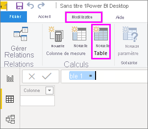
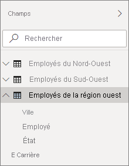

# <a name="create-calculated-tables-in-power-bi-desktop"></a>Créer des tables calculées dans Power BI Desktop
La plupart du temps, vous créez des tables en important des données dans votre modèle à partir d’une source de données externe. Toutefois, avec les *tables calculées*, vous pouvez aussi ajouter de nouvelles tables basées sur des données que vous avez déjà chargées dans le modèle. Au lieu d’interroger et de charger les valeurs dans les colonnes de votre nouvelle table à partir d’une source de données, vous créez une formule [DAX (Data Analysis Expressions)](/dax/index) qui définit les valeurs de la table.

DAX est un langage de formule permettant d’utiliser des données relationnelles, comme dans Power BI Desktop. Le langage DAX inclut une bibliothèque de plus de 200 fonctions, opérateurs et constructions. Il offre ainsi une flexibilité considérable pour créer des formules afin d’effectuer les calculs nécessaires pour quasiment tout type d’analyse de données. Utilisez des tables calculées pour des calculs intermédiaires et des données que vous souhaitez stocker dans le modèle plutôt que pour des calculs à la volée ou sous forme de résultats de requête. Par exemple, vous pouvez choisir de lier deux tables existantes par une *union* ou une *jointure croisée*.

Tout comme les autres tables Power BI Desktop, les tables calculées peuvent avoir des relations avec d’autres tables. Les colonnes de tables calculées ont des types de données et une mise en forme, et elles peuvent appartenir à une catégorie de données. Vous pouvez nommer vos colonnes comme vous le souhaitez et les ajouter à des visualisations de rapport comme d’autres champs. Les tables calculées sont recalculées si des tables à partir desquelles elles extraient des données sont actualisées ou mises à jour, sauf si la table utilise les données d’une table qui utilise DirectQuery ; dans le cas de DirectQuery, la table reflète uniquement les modifications une fois que le jeu de données a été actualisé. Si une table doit utiliser DirectQuery, il est préférable de disposer également de la table calculée dans DirectQuery.

## <a name="create-a-calculated-table"></a>Créer une table calculée

Vous créez des tables calculées à l’aide de la fonctionnalité **Nouvelle table** dans la vue Rapport ou Données de Power BI Desktop.

Par exemple, imaginons que vous êtes responsable du personnel et que vous utilisez ces deux tables : la table **Northwest Employees** pour les employés de la région Nord-Ouest et la table **Southwest Employees** pour les employés de la région Sud-Ouest. Vous souhaitez combiner les deux tables dans une seule table appelée **Western Region Employees**.

Table **Northwest Employees**

 

Table **Southwest Employees**

 

Dans la vue Rapport ou Données de Power BI Desktop, dans le groupe **Calculs** de l’onglet **Modélisation**, sélectionnez **Nouvelle table**. Il est plus simple de travailler dans la vue Données, car vous voyez immédiatement votre nouvelle table calculée.

 

Entrez la formule suivante dans la barre de formule :

```dax
Western Region Employees = UNION('Northwest Employees', 'Southwest Employees')
```

Une nouvelle table nommée **Western Region Employees** est créée et s’affiche comme toutes les tables dans le volet **Champs**. Vous pouvez créer des relations avec d’autres tables, ajouter des mesures et des colonnes calculées, et ajouter les champs à des rapports comme avec toute autre table.

 

 

## <a name="functions-for-calculated-tables"></a>Fonctions pour les tables calculées

Vous pouvez définir une table calculée par toute expression DAX qui retourne une table, y compris une simple référence à une autre table. Par exemple :

```dax
New Western Region Employees = 'Western Region Employees'
```

Cet article fournit une brève introduction aux tables calculées. Vous pouvez utiliser des tables calculées avec DAX pour résoudre de nombreux problèmes analytiques. Voici quelques-unes des fonctions de table DAX les plus couramment utilisées :

* DISTINCT
* VALUES
* CROSSJOIN
* UNION
* NATURALINNERJOIN
* NATURALLEFTOUTERJOIN
* INTERSECT
* CALENDAR
* CALENDARAUTO

Pour plus d’informations sur ces fonctions et d’autres fonctions DAX qui retournent des tables, consultez les [informations de référence sur les fonctions DAX](/dax/dax-function-reference).

