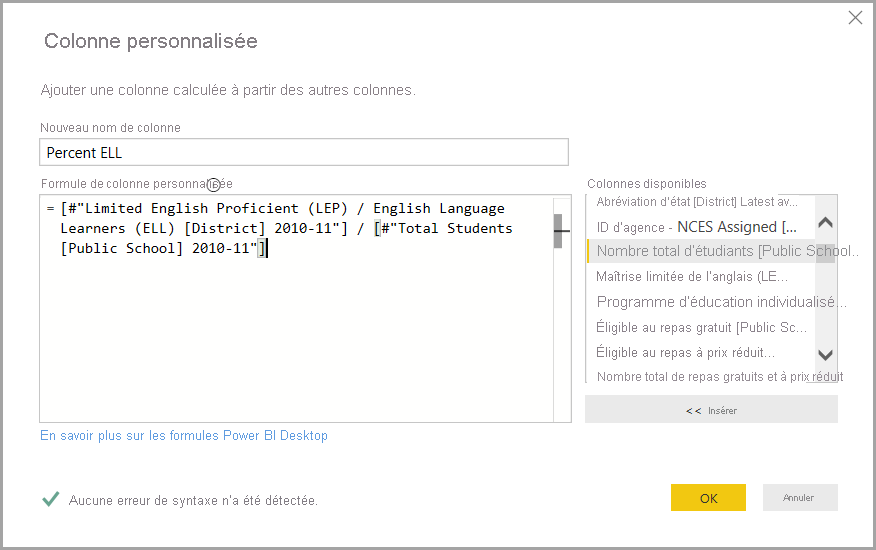
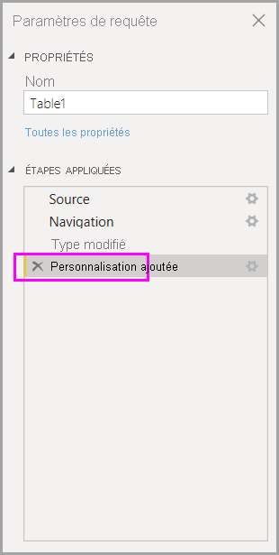

# Effectuer des tâches courantes relatives aux requêtes dans Power BI Desktop

La fenêtre Éditeur Power Query de Power BI Desktop présente un certain nombre de tâches courantes. Cet article décrit ces tâches et fournit des liens pour plus d’informations.

Les tâches courantes relatives aux requêtes illustrées ici sont les suivantes :

* Se connecter aux données
* Mettre en forme et combiner des données
* Regrouper des lignes
* Créer un tableau croisé dynamique des colonnes
* Créer des colonnes personnalisées
* Utiliser des formules de requête

Nous allons utiliser plusieurs connexions de données pour effectuer ces tâches. Vous pouvez télécharger ces données ou vous y connecter, au cas où vous souhaiteriez parcourir ces tâches vous-même.

La première connexion de données est [un classeur Excel](https://download.microsoft.com/download/5/7/0/5701F78F-C3C2-450C-BCCE-AAB60C31051D/PBI_Edu_ELSi_Enrollment_v2.xlsx), que vous pouvez télécharger et enregistrer en local. L’autre est une ressource Web qui est également utilisée dans d’autres articles Power BI Desktop :

<https://www.bankrate.com/retirement/best-and-worst-states-for-retirement/>

Les tâches courantes relatives aux requêtes commencent par les étapes nécessaires pour se connecter à ces deux sources de données.

## Se connecter aux données

Pour vous connecter aux données dans Power BI Desktop, sélectionnez **Accueil**, puis **Obtenir des données**. Power BI Desktop présente un menu qui répertorie les sources de données les plus courantes. Pour obtenir la liste complète des sources de données auxquelles Power BI Desktop peut se connecter, sélectionnez **Plus** à la fin du menu. Pour plus d’informations, consultez [Sources de données dans Power BI Desktop](../connect-data/desktop-data-sources.md).

Pour commencer, sélectionnez **Excel**, spécifiez le classeur Excel mentionné précédemment, puis sélectionnez **Ouvrir**. Power Query inspecte le classeur, puis présente les données trouvées dans la boîte de dialogue **Navigateur** lorsqu’une table est sélectionnée.

Vous pouvez sélectionner **Transformer les données** pour modifier, ajuster ou *mettre en forme* les données avant de les charger dans Power BI Desktop. La modification est particulièrement utile avec des jeux de données volumineux qu’il faut réduire avant le chargement.

Il est tout aussi facile de se connecter à différents types de données. Il est également intéressant de se connecter à une ressource web. Choisissez **Obtenir des données** > **Plus**, puis sélectionnez **Autre** > **Web** > **Se connecter**.

Dans la boîte de dialogue **À partir du web** qui s’affiche, vous pouvez taper l’URL de la page web.

Sélectionnez **OK**. Comme précédemment, Power BI Desktop inspecte les données de la page web et affiche des options d’aperçu dans la boîte de dialogue **Navigateur**. La table sélectionnée présente un aperçu des données.

Les autres connexions de données sont similaires. Si l’authentification est nécessaire pour établir une connexion de données, Power BI Desktop vous invite à entrer les informations d’identification appropriées.

Pour une démonstration détaillée de la connexion à des données dans Power BI Desktop, consultez [Se connecter à des données dans Power BI Desktop](../connect-data/desktop-connect-to-data.md).

## Mettre en forme et combiner des données

Il est facile de mettre en forme et de combiner des données avec l’Éditeur Power Query. Cette section comprend quelques exemples de mise en forme des données. Pour une démonstration plus complète de la mise en forme et de la combinaison de données, consultez [Mettre en forme et combiner des données dans Power BI Desktop](../connect-data/desktop-shape-and-combine-data.md).

Dans la section précédente, nous avons connecté deux jeux de données : un classeur Excel et une ressource web. Une fois les données chargées dans l’Éditeur Power Query, sélectionnez la requête de page web parmi les requêtes disponibles dans le volet **Requêtes** :

Quand vous mettez en forme les données, vous transformez une source de données en fonction de vos besoins.

Dans l’Éditeur Power Query, le ruban et les menus contextuels comportent de nombreuses commandes. Par exemple, si l’on clique avec le bouton droit sur une colonne, le menu contextuel permet de la supprimer. On pourrait également sélectionner la colonne, puis le bouton **Supprimer les colonnes** dans l’onglet **Accueil** du ruban.

Il existe beaucoup d’autres moyens de mettre en forme les données dans cette requête. Vous pouvez supprimer autant de lignes que vous le souhaitez à partir du haut ou du bas. Vous pouvez également ajouter des colonnes, les fractionner, remplacer des valeurs et effectuer d’autres tâches de mise en forme. Ces fonctionnalités vous permettent de gérer l’Éditeur Power Query de façon à préparer les données comme vous le souhaitez.

## Regrouper des lignes

Dans l’Éditeur Power Query, vous pouvez regrouper les valeurs de plusieurs lignes en une seule valeur. Cette fonctionnalité peut être utile pour récapituler le nombre de produits proposés, le total des ventes ou le nombre d’étudiants.

Dans cet exemple, des lignes sont regroupées dans un jeu de données d’inscription à des études. Les données proviennent du classeur Excel. Elles ont été mises en forme dans l’Éditeur Power Query en proposant uniquement les colonnes nécessaires, en renommant la table et en effectuant d’autres transformations.

Examinons le nombre d’organismes de chaque État. (Il peut s’agir de divisions scolaires, d’autres organismes d’éducation comme des circonscriptions de service régionaux, etc.) Sélectionnez la colonne **Agency ID – NCES Assigned \[District\] Latest available year** (ID d’organisme – Centre américain des données statistiques en éducation District Dernière année disponible), puis le bouton **Grouper par** dans l’onglet **Transformer** ou l’onglet **Accueil** du ruban. (**Grouper par** est disponible dans les deux onglets.)

La boîte de dialogue **Grouper par** s’affiche. Quand l’Éditeur Power Query regroupe des lignes, il crée une colonne dans laquelle il place les résultats de l’opération **Grouper par**. Vous pouvez ajuster l’opération **Regrouper par** comme suit :

1. La liste déroulante sans étiquette indique la colonne à regrouper. L’Éditeur Power Query attribue par défaut cette valeur à la colonne sélectionnée, mais vous pouvez la remplacer par n’importe quelle colonne de la table.
2. **Nom de la nouvelle colonne** : l’Éditeur Power Query suggère un nom pour la nouvelle colonne, en fonction de l’opération qu’il applique à la colonne regroupée. Vous pouvez cependant nommer la nouvelle colonne comme vous le souhaitez.
3. **Opération** : vous pouvez choisir l’opération appliquée par l’Éditeur Power Query, par exemple **Somme**, **Médiane** ou **Compter les lignes distinctes**. La valeur par défaut est **Compter les lignes**.
4. **Ajouter un regroupement** et **Ajouter une agrégation** : ces boutons ne sont disponibles que si l’option **Avancé** est sélectionnée. En une seule opération, vous pouvez effectuer des opérations de regroupement (actions **Regrouper par**) sur de nombreuses colonnes et créer plusieurs agrégations à l’aide de ces boutons. En fonction des sélections effectuées dans cette boîte de dialogue, l’Éditeur Power Query crée une colonne qui implique plusieurs colonnes.

Sélectionnez **Ajouter un regroupement** ou **Ajouter une agrégation** pour ajouter d’autres regroupements ou d’autres agrégations à une opération **Grouper par**. Pour supprimer un regroupement ou une agrégation, sélectionnez l’icône représentant des points de suspension ( **…** ) à droite de la ligne, puis **Supprimer**. Essayez l’opération **Grouper par** avec les valeurs par défaut pour voir ce qui se produit.

Quand vous sélectionnez **OK**, Query effectue l’opération **Grouper par** et retourne les résultats. L’Ohio, l’Illinois, le Texas et la Californie comptent maintenant plus de mille organismes chacun !

Avec l’Éditeur Power Query, vous pouvez toujours supprimer la dernière opération de mise en forme. Dans le volet **Paramètres de requête**, sélectionnez simplement la croix **X** à côté de l’étape terminée sous **Étapes appliquées**. Profitez-en pour faire des essais. Si les résultats ne vous conviennent pas, effectuez de nouveau l’étape, jusqu’à ce que l’Éditeur Power Query mette en forme vos données comme vous le souhaitez.

## Créer un tableau croisé dynamique des colonnes

Il est possible de créer un tableau croisé dynamique à partir des colonnes et une table qui contient des valeurs agrégées pour chaque valeur unique d’une colonne. Par exemple, vous pouvez créer rapidement une table pour savoir combien de produits différents compte chaque catégorie de produits.

Examinons un exemple. La table **Products_by_Categories** suivante a été mise en forme pour afficher uniquement chaque produit unique (par nom) et la catégorie à laquelle il appartient. Pour créer une table qui affiche un nombre de produits pour chaque catégorie (en fonction de la colonne **CategoryName**), sélectionnez la colonne, puis **Transformer** > **Créer un tableau croisé dynamique à partir de la colonne**.

La boîte de dialogue **Créer un tableau croisé dynamique à partir de la colonne** qui s’affiche indique les valeurs de la colonne qui seront utilisées pour créer des colonnes (1). (Si le nom de la colonne souhaitée **CategoryName** n’est pas indiqué, sélectionnez-le dans la liste déroulante.) Lorsque vous développez **Options avancées** (2), vous pouvez sélectionner la fonction qui sera appliquée aux valeurs agrégées (3).

Quand vous sélectionnez **OK**, Query affiche la table conformément aux instructions de transformation fournies dans la boîte de dialogue **Créer un tableau croisé dynamique à partir de la colonne**.

## Créer des colonnes personnalisées

Dans l’Éditeur Power Query, vous pouvez créer des formules personnalisées qui fonctionnent sur plusieurs colonnes de votre table. Vous pouvez ensuite placer les résultats de ces formules dans une nouvelle colonne (personnalisée). L’Éditeur Power Query permet de créer facilement des colonnes personnalisées.

Avec les données d’un classeur Excel dans l’Éditeur Power Query, accédez à l’onglet **Ajouter une colonne** sur le ruban, puis sélectionnez **Colonne personnalisée**.

La boîte de dialogue suivante s’affiche. Dans cet exemple, nous créons une colonne personnalisée appelée *Percent ELL* (Pourcentage d’étudiants apprenant l’anglais) qui calcule le pourcentage d’étudiants apprenant l’anglais (ELL, English Language Learner).

Comme n’importe quelle autre étape appliquée dans l’Éditeur Power Query, vous pouvez supprimer l’étape si la nouvelle colonne personnalisée ne fournit pas les données que vous recherchez. Dans le volet **Paramètres de requête**, sélectionnez simplement la croix **X** à côté de l’étape **Ajout personnalisé** sous **Étapes appliquées**.

## Utiliser des formules de requête

Vous pouvez modifier les étapes générées par l’Éditeur Power Query. Vous pouvez également créer des formules personnalisées, qui vous permettent de vous connecter à vos données et de les mettre en forme plus précisément. Chaque fois que l’Éditeur Power Query effectue une action sur les données, la formule associée à l’action s’affiche dans la barre de formule. Pour afficher la barre de formule, accédez à l’onglet **Affichage** du ruban, puis sélectionnez **Barre de formule**.

L’Éditeur Power Query conserve toutes les étapes appliquées pour chaque requête sous forme de texte consultable ou modifiable. Il est possible d’afficher ou de modifier le texte d’une requête avec **l’Éditeur avancé**. Sélectionnez simplement **Affichage**, puis **Éditeur avancé**.

Voici un aperçu de l’**Éditeur avancé**, où figurent les étapes associées à la requête **USA\_StudentEnrollment** affichée. Ces étapes sont créées dans le langage de formule Power Query, souvent appelé *M*. Pour plus d’informations, voir [En savoir plus sur les formules Power Query](https://support.office.com/article/learn-about-power-query-formulas-6bc50988-022b-4799-a709-f8aafdee2b2f). Pour voir la spécification du langage proprement dite, consultez [Spécification du langage Power Query M](/powerquery-m/power-query-m-language-specification).

Power BI Desktop fournit un ensemble complet de catégories de formules. Pour plus d’informations et pour obtenir les informations de référence complètes de toutes les formules de l’Éditeur Power Query, consultez [Informations de référence sur les fonctions Power Query M](/powerquery-m/power-query-m-function-reference).

## Étapes suivantes

Power BI Desktop permet d’effectuer des tâches très diverses. Pour plus d’informations sur ses fonctionnalités, consultez les ressources suivantes :

* [Qu’est-ce que Power BI Desktop ?](../fundamentals/desktop-what-is-desktop.md)
* [Vue d’ensemble des requêtes dans Power BI Desktop](desktop-query-overview.md)
* [Sources de données dans Power BI Desktop](../connect-data/desktop-data-sources.md)
* [Se connecter aux données dans Power BI Desktop](../connect-data/desktop-connect-to-data.md)
* [Mettre en forme et combiner des données dans Power BI Desktop](../connect-data/desktop-shape-and-combine-data.md)
