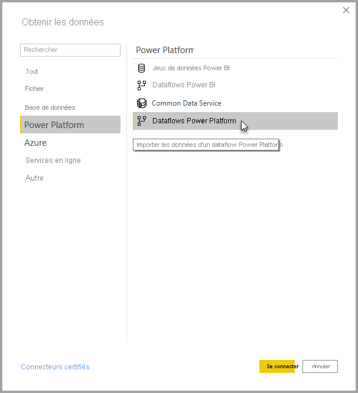

# Se connecter à des données créées par des dataflows Power Platform dans Power BI Desktop
Dans **Power BI Desktop**, vous pouvez vous connecter à des données créées par des **dataflows Power Platform** comme toute autre source de données dans Power BI Desktop.

Le connecteur **Dataflows Power Platform)** vous permet d’établir des connexions à des entités créées par des dataflows dans le service Power BI. 

## Considérations et limitations

Pour utiliser le **connecteur Dataflows Power Platform**, vous devez exécuter une version plus récente de **Power BI Desktop**. Vous pouvez toujours [télécharger Power BI Desktop](../fundamentals/desktop-get-the-desktop.md) et l’installer sur votre ordinateur pour être certain d’avoir la version la plus récente.  

> [!NOTE]
> La version précédente du connecteur Dataflows Power Platform vous obligeait à télécharger un fichier .MEZ et à la placer dans un dossier. Les versions actuelles de **Power BI Desktop** incluent le connecteur Dataflows Power Platform, de sorte que le fichier n’est plus nécessaire et peut entrer en conflit avec la version du connecteur incluse. Si vous avez manuellement placé le fichier .MEZ dans le dossier, vous *devez* supprimer ce fichier .MEZ téléchargé de votre dossier **Documents > Power BI Desktop > Connecteurs personnalisés** pour éviter tout conflit. 

## Performances de Power BI Desktop
**Power BI Desktop** s’exécute localement sur l’ordinateur sur lequel il est installé. Les performances d’ingestion de flux de données sont déterminées par plusieurs facteurs. Ces facteurs incluent la taille des données, le processeur et la mémoire RAM de votre ordinateur, la bande passante réseau, la distance depuis le centre de données et d’autres facteurs.

Vous pouvez améliorer les performances d’ingestion des données des flux de données. Par exemple, si la taille des données ingérées est trop grande pour permettre à **Power BI Desktop** de les gérer sur votre ordinateur, vous pouvez utiliser des entités liées et calculées dans le flux de données pour agréger les données (au sein de flux de données) et recevoir uniquement les données agrégées et préalablement préparées. 

De cette manière, le traitement de données volumineuses est effectué en ligne dans le flux de données et non localement dans votre instance en cours d’exécution de **Power BI Desktop**. Cette approche permet à Power BI Desktop d’ingérer de petites quantités de données et maintient la réactivité et la rapidité des flux de données.

## Considérations supplémentaires

La plupart des flux de données se trouvent dans le locataire du service Power BI. Toutefois, les utilisateurs de **Power BI Desktop** n’ont pas accès aux flux de données stockés dans un compte Azure Data Lake Storage Gen2, sauf s’ils sont propriétaires du flux de données ou explicitement autorisés à accéder au dossier CDM du flux de données. Prenons la situation suivante :

1.  Anna crée un espace de travail et le configure de façon à stocker les dataflows dans le lac de données de l’organisation.
2.  Ben, qui est également membre de l’espace de travail créé par Anna, veut utiliser Power BI Desktop et le connecteur de flux de données pour obtenir des données à partir du flux de données créé par Anna.
3.  Ben reçoit une erreur, car il n’a pas été autorisé à accéder au dossier CDM du dataflow dans le lac de données.

Pour résoudre ce problème, Ben doit disposer d’autorisations de lecture sur le dossier CDM et ses fichiers. Vous pouvez en apprendre davantage sur la façon d’accorder l’accès au dossier CDM dans [configurer et consommer un dataflow](dataflows/dataflows-configure-consume.md).

## Étapes suivantes
Les dataflows permettent d’effectuer toutes sortes de choses intéressantes. Pour plus d’informations, consultez les ressources suivantes :

* [Introduction aux dataflows et à la préparation des données en libre-service](dataflows/dataflows-introduction-self-service.md)
* [Création d’un flux de données](dataflows/dataflows-create.md)
* [Configurer et consommer un dataflow](dataflows/dataflows-configure-consume.md)
* [Configuration du stockage de dataflows pour utiliser Azure Data Lake Gen 2](dataflows/dataflows-azure-data-lake-storage-integration.md)
* [Fonctionnalités Premium des dataflows](dataflows/dataflows-premium-features.md)
* [IA et dataflows](dataflows/dataflows-machine-learning-integration.md)

Il existe également des articles sur **Power BI Desktop** qui peuvent vous être utiles :

* [Sources de données dans Power BI Desktop](../connect-data/desktop-data-sources.md)
* [Mettre en forme et combiner des données dans Power BI Desktop](../connect-data/desktop-shape-and-combine-data.md)
* [Entrer des données directement dans Power BI Desktop](../connect-data/desktop-enter-data-directly-into-desktop.md)