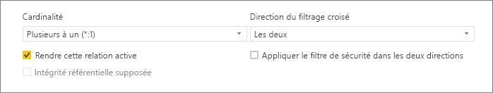
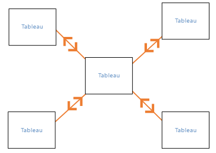
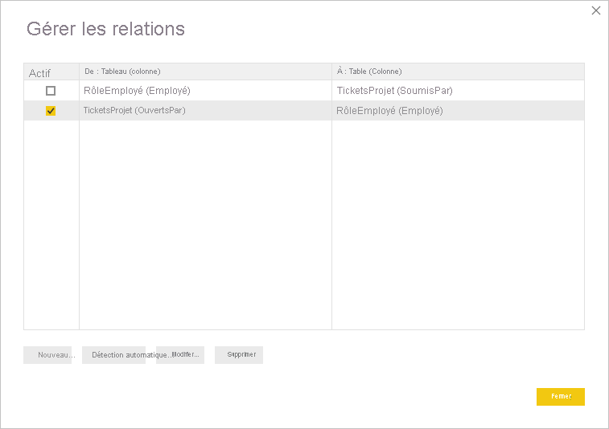
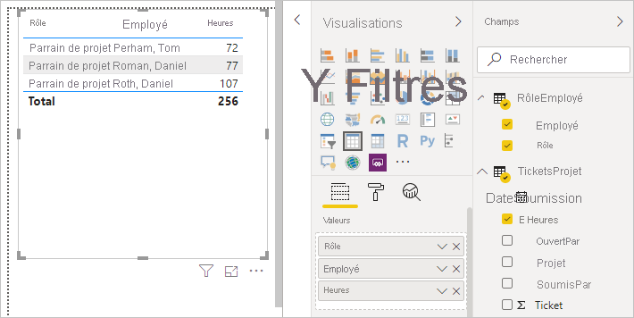

# Créer et gérer des relations dans Power BI Desktop
Quand vous importez plusieurs tables, vous êtes souvent amené à effectuer des analyses avec les données de toutes ces tables. Les relations entre ces tables sont nécessaires pour calculer des résultats précis et pour afficher les informations correctes dans vos rapports. Power BI Desktop facilite la création de ces relations. Dans la plupart des cas, vous n’avez rien à faire ; la fonctionnalité Détection automatique se charge de tout. Vous pouvez cependant parfois être amené à créer des relations vous-même ou à apporter des modifications à une relation. Dans les deux cas, il est important de comprendre le fonctionnement des relations dans Power BI Desktop et comment les créer et les modifier.

## Détection automatique pendant le chargement
Si vous interrogez plusieurs tables en même temps, quand les données sont chargées, Power BI Desktop tente de trouver et de créer des relations pour vous. Les options de relation **Cardinalité**, **Direction du filtrage croisé** et **Rendre cette relation active** sont définies automatiquement. Power BI Desktop examine les noms des colonnes des tables que vous interrogez pour déterminer s’il existe des relations potentielles. S’il en existe, ces relations sont automatiquement créées. Si Power BI Desktop ne peut pas déterminer avec un niveau de confiance élevé qu’il existe une correspondance, il ne crée pas la relation. Vous pouvez néanmoins utiliser la boîte de dialogue **Gérer les relations** pour créer ou modifier manuellement des relations.

## Créer une relation avec la fonctionnalité Détection automatique
Sous l’onglet **Accueil**, sélectionnez **Gérer les relations** \> **Détection automatique**.

## Créer une relation manuellement
1. Sous l’onglet **Accueil**, sélectionnez **Gérer les relations** \> **Nouveau**.

2. Dans la boîte de dialogue **Créer une relation**, dans la première liste déroulante des tables, sélectionnez une table. Sélectionnez la colonne que vous voulez utiliser dans la relation.

3. Dans la deuxième liste déroulante des tables, sélectionnez l’autre table que vous voulez dans la relation. Sélectionnez l’autre colonne que vous voulez utiliser, puis sélectionnez **OK**.

   

Par défaut, Power BI Desktop configure automatiquement les options **Cardinalité** (direction), **Direction du filtrage croisé** et **Rendre cette relation active** pour votre nouvelle relation. Vous pouvez cependant modifier ces paramètres si nécessaire. Pour plus d’informations, consultez [Présentation des options supplémentaires](#understanding-additional-options).

Si aucune des tables sélectionnées pour la relation n’a des valeurs uniques, vous voyez l’erreur suivante : *Une des colonnes doit avoir des valeurs uniques*. Au moins une table dans une relation *doit* avoir une liste distincte et unique de valeurs de clés. C’est une exigence commune à toutes les technologies de base de données relationnelle. 

Si vous rencontrez cette erreur, vous pouvez la résoudre de différentes manières :

* Utilisez **Supprimer les doublons** pour créer une colonne avec des valeurs uniques. L’inconvénient de cette approche est que vous pouvez perdre des informations lors de la suppression des lignes en doublon : une clé (ligne) est en effet souvent dupliquée pour une bonne raison.
* Ajoutez une table intermédiaire composée de la liste des valeurs de clés distinctes dans le modèle, qui sera ensuite liée aux deux colonnes d’origine de la relation.

Pour plus d’informations, voir [ce billet de blog](https://blogs.technet.microsoft.com/cansql/2016/12/19/relationships-in-power-bi-fixing-one-of-the-columns-must-have-unique-values-error-message/).

## Modifier une relation
1. Sous l’onglet **Accueil**, sélectionnez **Gérer les relations**.

2. Dans la boîte de dialogue **Gérer les relations**, sélectionnez la relation, puis sélectionnez **Modifier**.

## Configurer des options supplémentaires
Quand vous créez ou modifiez une relation, vous pouvez configurer des options supplémentaires. Par défaut, Power BI Desktop configure automatiquement des options supplémentaires en fonction de sa meilleure estimation, qui peut être différente pour chaque relation en fonction des données contenues dans les colonnes.

### Cardinalité
L’option **Cardinalité** peut avoir une des valeurs suivantes :

**Plusieurs à un (\*:1)**  : Une relation plusieurs-à-un est le type de relation par défaut le plus courant. Elle signifie que la colonne d’une table peut avoir plusieurs instances d’une valeur, tandis que la table liée, souvent appelée table de recherche, n’a qu’une seule instance d’une valeur donnée.

**Un à un (1:1)**  : Dans une relation un-à-un, la colonne d’une table n’a qu’une seule instance d’une valeur particulière et la table liée n’a qu’une seule instance d’une valeur donnée.

**Un à plusieurs (1:*)**  : Dans une relation un-à-plusieurs, la colonne d’une table n’a qu’une seule instance d’une valeur particulière, tandis que la table liée peut avoir plusieurs instances d’une valeur.

**Plusieurs à plusieurs (\*:\*)**  : Avec les modèles composites, vous pouvez établir des relations plusieurs-à-plusieurs entre des tables, ce qui élimine la nécessité d’avoir des valeurs uniques dans les tables. Les solutions de contournement précédentes, comme la présentation de nouvelles tables uniquement pour établir des relations, sont également supprimées. Pour plus d’informations, consultez [Relations avec une cardinalité plusieurs-à-plusieurs](https://docs.microsoft.com/power-bi/desktop-many-to-many-relationships). 

Pour plus d’informations sur le changement de cardinalité, consultez [Présentation des options supplémentaires](#understanding-additional-options).

### Direction du filtrage croisé
L’option **Direction du filtrage croisé** peut avoir une des valeurs suivantes :

**Les deux** : Pour le filtrage, les deux tables sont traitées comme s’il s’agissait d’une même table. La valeur **Les deux** fonctionne bien avec une seule table qui a autour d’elle plusieurs tables de recherche. Un exemple est une table des ventes effectuées avec une table de recherche pour son département. Cette configuration est souvent appelée « configuration de schéma en étoile » (une table centrale avec plusieurs tables de recherche). Cependant, si vous avez deux tables ou plus qui ont aussi des tables de recherche (certaines en commun), vous n’allez pas utiliser la valeur **Les deux**. Pour continuer avec l’exemple précédent, vous avez également une table de ventes budgétées qui enregistre le budget cible pour chaque service. Et la table des services est connectée à la fois à la table des ventes et à la table du budget. Évitez le paramètre **Les deux** pour ce type de configuration.

**À sens unique** : Il s’agit de la direction par défaut la plus courante, qui signifie que les choix de filtrage dans les tables connectées agissent sur la table où les valeurs sont agrégées. Si vous importez un modèle de données Power Pivot dans Excel 2013 ou version antérieure, toutes les relations ont une seule direction. 

Pour plus d’informations sur la modification de la direction du filtrage croisé, consultez [Présentation des options supplémentaires](#understanding-additional-options).

### Rendre cette relation active
Quand cette option est cochée, la relation fait office de relation par défaut active. S’il existe plusieurs relations entre deux tables, la relation active offre un moyen à Power BI Desktop de créer automatiquement des visualisations qui incluent les deux tables.

Pour plus d’informations sur le moment où il faut rendre active une relation particulière, consultez [Présentation des options supplémentaires](#understanding-additional-options).

## Présentation des relations
Une fois que vous avez connecté deux tables avec une relation, vous pouvez utiliser les données des deux tables comme s’il s’agissait d’une même table ; ainsi, vous n’avez pas à vous soucier des détails de la relation et vous n’avez pas besoin d’aplatir ces tables en une seule table avant de les importer. Dans de nombreux cas, Power BI Desktop peut créer automatiquement des relations pour vous. Cependant, si Power BI Desktop ne peut pas déterminer avec un fort degré de certitude qu’une relation entre deux tables doit exister, il ne crée pas la relation automatiquement. Dans ce cas, vous devez le faire. 

Nous allons suivre un rapide didacticiel pour mieux illustrer le fonctionnement des relations dans Power BI Desktop.

>[!TIP]
>Vous pouvez effectuer cette leçon vous-même : 
>
> 1. Copiez la table **ProjectHours** (Heures projet) suivante dans une feuille de calcul Excel (à l’exclusion du titre), sélectionnez toutes les cellules, puis sélectionnez **Insérer** \> **Tableau**. 
> 2. Dans la boîte de dialogue **Créer un tableau**, sélectionnez **OK**. 
> 3. Sélectionnez une cellule du tableau, sélectionnez **Création du tableau** \> **Nom du tableau**, puis entrez *ProjectHours*. 
> 4. Faites de même pour le tableau **CompanyProject** (Projet entreprise). 
> 5. Importez les données avec l’option **Obtenir des données** dans Power BI Desktop. Sélectionnez les deux tables comme source de données, puis sélectionnez **Charger**.

La première table, **ProjectHours**, contient les tickets de travail qui enregistrent le nombre d’heures qu’une personne a travaillé sur un projet particulier. 

**HeuresProjet**

| **Ticket** | **SoumisPar** | **Heures** | **Projet** | **DateSoumission** |
| ---:|:--- | ---:|:--- | ---:|
| 1001 |Brewer, Alan |22 |Blue |1/1/2013 |
| 1002 |Brewer, Alan |26 |Red |2/1/2013 |
| 1003 |Ito, Shu |34 |Yellow |12/4/2012 |
| 1004 |Brewer, Alan |13 |Orange |1/2/2012 |
| 1005 |Bowen, Eli |29 |Violet |1/10/2013 |
| 1006 |Bento, Nuno |35 |Green |2/1/2013 |
| 1007 |Hamilton, David |10 |Yellow |1/10/2013 |
| 1008 |Han, Mu |28 |Orange |1/2/2012 |
| 1009 |Ito, Shu |22 |Purple |2/1/2013 |
| 1010 |Bowen, Eli |28 |Green |10/1/2013 |
| 1011 |Bowen, Eli |9 |Blue |10/15/2013 |

La seconde table, **CompanyProject**, est une liste de projets affectés d’une priorité : A, B ou C. 

**ProjetEntreprise**

| **NomProjet** | **Priorité** |
| --- | --- |
| Blue |A |
| Rouge |B |
| Green |C |
| Jaune |C |
| Purple |B |
| Orange |C |

Notez que chaque table possède une colonne de projet. Chacune a un nom légèrement différent, mais les valeurs semblent identiques. Ce point est important, et nous y reviendrons rapidement.

Nos deux tables étant importées dans un modèle, nous allons maintenant créer un rapport. La première chose que nous voulons obtenir est le nombre d’heures soumises par priorité de projet ; nous sélectionnons donc les champs **Priority** (Priorité), **Hours** (Heures) et **Fields** (Secteurs).

Si nous regardons notre table dans le canevas de rapport, nous constatons que le nombre d’heures est de 256 pour chaque projet et que c’est également le total. Ce nombre est clairement incorrect. Pourquoi ? La raison en est que nous ne pouvons pas calculer une somme de valeurs à partir d’une table (**Hours** (Heures) dans la table **Project**), ventilées selon les valeurs d’une autre table (**Priority** (Priorité) dans la table **CompanyProject**) sans une relation entre ces deux tables.

Nous allons donc créer une relation entre ces deux tables.

Vous vous souvenez de ces colonnes communes aux deux tables avec un nom de projet et comportant des valeurs similaires ? Nous allons utiliser ces deux colonnes pour créer une relation entre nos tables.

Pourquoi ces colonnes ? Si nous regardons la colonne **Project** (Projet) de la table **ProjectHours**, nous y voyons des valeurs comme Blue (Bleu), Red (Rouge), Yellow (Jaune), Orange, etc. Comme vous pouvez le constater, plusieurs lignes contiennent la même valeur. Nous avons donc de nombreuses valeurs de couleur pour **Project**.

Si nous regardons la colonne **ProjName** de la table **CompanyProject**, nous voyons qu’elle ne contient qu’une seule occurrence de chacune des valeurs de couleur pour le nom du projet. Chaque valeur de couleur de cette table est unique ; cela est important, car nous pouvons créer une relation entre les deux tables. Dans ce cas, il s’agit d’une relation plusieurs-à-un. Dans une relation plusieurs-à-un, au moins une colonne d’une des tables doit contenir des valeurs uniques. Des options supplémentaires existent pour certaines relations : nous les examinerons ultérieurement. Pour le moment, nous allons créer une relation entre les colonnes du projet dans chacune de nos deux tables.

### Pour créer la relation
1. Sélectionnez **Gérer les relations** sous l’onglet **Accueil**.
2. Dans **Gérer les relations**, cliquez sur **Nouveau** pour ouvrir la boîte de dialogue **Créer une relation**, où nous pouvons sélectionner les tables, les colonnes et les paramètres supplémentaires que nous souhaitons pour notre relation.
3. Dans la première liste déroulante, sélectionnez **ProjectHours** comme première table, puis la colonne **Project**. Il s’agit du côté *plusieurs* de notre relation.
4. Dans la deuxième liste déroulante, **CompanyProject** est présélectionné comme deuxième table. Sélectionnez la colonne **ProjName** (Nom du projet). Il s’agit du côté *un* de notre relation. 
5. Acceptez les valeurs par défaut pour les autres paramètres, puis sélectionnez **OK**.

   

6. Dans la boîte de dialogue **Gérer les relations**, sélectionnez **Fermer**.

Pour que la démonstration soit le plus explicite, nous avons créé la relation manuellement. Vous auriez pu simplement sélectionner **Détection automatique** dans la boîte de dialogue **Gérer les relations**. En fait, la fonctionnalité Détection automatique aurait créé automatiquement la relation pour vous quand vous avez chargé les données si les deux colonnes avaient le même nom. Mais nous n’aurions eu aucun mérite.

À présent, réexaminons la table dans notre canevas de rapport.

Ça va beaucoup mieux maintenant, non ?

Quand nous additionnons les heures par **Priority** (Priorité), Power BI Desktop recherche chaque instance des valeurs de couleur uniques dans la table de recherche **CompanyProject**, recherche chaque instance de chacune de ces valeurs dans la table **ProjectHours**, puis calcule une somme totale pour chaque valeur unique.

Il s’agit de la partie facile. En fait, la fonctionnalité Détection automatique aurait même pu vous éviter tout ce travail.

## Présentation des options supplémentaires
Quand une relation est créée, manuellement ou avec la fonctionnalité Détection automatique, Power BI Desktop configure automatiquement les options supplémentaires en fonction des données de vos tables. Ces options de relation supplémentaires se trouvent dans la partie inférieure des boîtes de dialogue **Créer une relation** et **Modifier une relation**.

 

En général, Power BI définit automatiquement ces options et vous n’avez pas besoin de les ajuster ; vous pouvez cependant être amené dans plusieurs situations à configurer ces options vous-même.

## Mises à jour automatiques des relations

Vous pouvez gérer la façon dont Power BI traite et ajuste automatiquement les relations dans vos rapports et modèles. Pour spécifier la façon dont Power BI gère les options des relations, sélectionnez **Fichier** > **Options et paramètres** > **Options** dans Power BI Desktop, puis sélectionnez **Chargement des données** dans le volet gauche. Les options pour **Relations** apparaissent.

   

Vous pouvez sélectionner et activer trois options : 

- **Importer des relations à partir de sources de donnée au premier chargement** : Cette option est activée par défaut. Quand cette option est sélectionnée, Power BI vérifie les relations définies dans votre source de données, comme les relations de clé étrangère/clé primaire dans votre entrepôt de données. Si ces relations existent, elles sont reflétées dans le modèle de données Power BI quand vous chargez les données pour la première fois. Cette option vous permet de commencer rapidement à travailler avec votre modèle, au lieu de vous demander de trouver ou de définir ces relations vous-même.

- **Mettre à jour ou supprimer des relations pendant l’actualisation des données** : Cette option est désélectionnée par défaut. Si vous la sélectionnez, Power BI recherche les modifications apportées aux relations de la source de données quand votre jeu de données est actualisé. Si ces relations ont été modifiées ou supprimées, Power BI reflète ces modifications dans son propre modèle de données, en les mettant à jour ou en les supprimant pour qu’elles correspondent.

   > [!WARNING]
   > Si vous utilisez la sécurité au niveau des lignes qui s’appuie sur les relations définies, nous vous déconseillons de sélectionner cette option. Si vous supprimez une relation sur laquelle s’appuient vos paramètres de sécurité au niveau des lignes (RLS), votre modèle peut devenir moins sécurisé. 

- **Détecter automatiquement les nouvelles relations une fois les données chargées** : Cette option est décrite dans [Détection automatique pendant le chargement](#autodetect-during-load). 

## Les futures mises à jour des données nécessitent une cardinalité différente
Normalement, Power BI Desktop peut déterminer automatiquement la meilleure cardinalité pour la relation. Si vous avez besoin de remplacer le paramétrage automatique parce que vous savez que les données vont changer dans le futur, vous pouvez le changer avec le contrôle **Cardinalité**. Examinons un exemple où nous devons sélectionner une cardinalité différente.

La table **CompanyProjectPriority** (Priorité projet entreprise) est une liste de tous les projets de l’entreprise, avec leur priorité. La table **ProjectBudget** contient l’ensemble des projets pour lesquels un budget a été approuvé.

**PrioritéProjetEntreprise**

| **NomProjet** | **Priorité** |
| --- | --- |
| Blue |A |
| Rouge |B |
| Green |C |
| Jaune |C |
| Purple |B |
| Orange |C |

**BudgetProjet**

| **ProjetsApprouvés** | **AllocationBudget** | **DateAllocation** |
|:--- | ---:| ---:|
| Blue |40,000 |12/1/2012 |
| Red |100,000 |12/1/2012 |
| Vert |50,000 |12/1/2012 |

Si nous créons une relation entre la colonne **Approved Projects** (Projets approuvés) de la table **ProjectBudget** et la colonne **ProjectName** (Nom du projet) de la table **CompanyProjectPriority**, Power BI définit automatiquement **Cardinalité** sur **Un à un (1:1)** et **Direction du filtrage croisé** sur **Les deux**. 

 

La raison pour laquelle Power BI définit ces paramètres est que pour Power BI Desktop, la meilleure combinaison des deux tables est la suivante :

| **NomProjet** | **Priorité** | **AllocationBudget** | **DateAllocation** |
|:--- | --- | ---:| ---:|
| Bleu |A |40,000 |12/1/2012 |
| Red |B |100 000 |12/1/2012 |
| Green |C |50,000 |12/1/2012 |
| Yellow |C |  |  |
| Purple |B |  |  |
| Orange |C |  |  |

Il existe une relation un-à-un entre nos deux tables, car la colonne **ProjName** (Nom du projet) de la table combinée ne contient pas de valeurs répétées. La colonne **ProjName** est unique, car chaque valeur n’y apparaît qu’une seule fois ; ainsi, les lignes des deux tables peuvent être combinées directement sans aucune duplication.

Toutefois, supposons que les données sont censées changer à la prochaine actualisation. Une version actualisée de la table **ProjectBudget** a maintenant des lignes supplémentaires pour les projets Blue (Bleu) et Red (Rouge) :

**BudgetProjet**

| **ProjetsApprouvés** | **AllocationBudget** | **DateAllocation** |
| --- | ---:| ---:|
| Blue |40,000 |12/1/2012 |
| Red |100,000 |12/1/2012 |
| Vert |50,000 |12/1/2012 |
| Blue |80,000 |6/1/2013 |
| Red |90,000 |6/1/2013 |

 Ces lignes supplémentaires signifient que la meilleure combinaison des deux tables se présente maintenant comme ceci : 

| **NomProjet** | **Priorité** | **AllocationBudget** | **DateAllocation** |
| --- | --- | ---:| ---:|
| Bleu |A |40,000 |12/1/2012 |
| Red |B |100 000 |12/1/2012 |
| Green |C |50,000 |12/1/2012 |
| Yellow |C |  |  |
| Purple |B |  |  |
| Orange |C |  |  |
| Blue |A |80000 |6/1/2013 |
| Red |B |90000 |6/1/2013 |

Dans cette nouvelle table combinée, la colonne **ProjName** a des valeurs répétées. Les deux tables d’origine n’auront pas de relation un à un une fois la table actualisée. Dans ce cas, comme nous savons que ces mises à jour ultérieures vont introduire des doublons dans la colonne **ProjName**, nous voulons définir la **Cardinalité** sur **Plusieurs à un (\*:1)** , avec le côté *plusieurs* sur **ProjectBudget** et le côté *un* sur **CompanyProjectPriority**.

## Ajustement de la direction du filtrage croisé pour un jeu complexe de tables et de relations
Pour la plupart des relations, la direction du filtrage croisé est définie sur **Les deux**. Cependant, dans certaines circonstances plus rares, vous pouvez être amené à définir cette option différemment, comme dans le cas où vous importez un modèle à partir d’une ancienne version de Power Pivot, où chaque relation est définie sur une direction à sens unique. 

La valeur **Les deux** permet à Power BI Desktop de traiter tous les aspects des tables connectées comme s’il s’agissait d’une même table. Dans certaines situations cependant, Power BI Desktop ne peut pas définir la direction du filtrage croisé d’une relation sur **Les deux** tout en conservant un ensemble non ambigu de valeurs par défaut pour la création de rapports. En règle générale, la direction du filtrage croisé d’une relation n’est pas définie sur **Les deux** si cela risque de créer une ambiguïté. Si la valeur par défaut de la direction du filtrage croisé ne fonctionne pas pour vous, essayez en la définissant sur une table particulière ou sur **Les deux**.

Le filtrage croisé À sens unique fonctionne dans de nombreuses situations. En fait, si vous importez un modèle de données Power Pivot dans Excel 2013 ou version antérieure, toutes les relations sont définies sur À sens unique. Dans le cas d’une direction à sens unique, les choix de filtrage dans les tables connectées agissent sur la table où se produit l’agrégation. Parfois, le filtrage croisé peut être un peu difficile à comprendre. Nous allons donc étudier un exemple.

Dans le cas du filtrage croisé à sens unique, si vous créez un rapport qui totalise les heures des projets, vous pouvez choisir de totaliser (ou de filtrer) sur la table **CompanyProject** et sa colonne **Priority** (Priorité), ou sur la table **CompanyEmployee** et sa colonne **City** (Localité). Si toutefois vous souhaitez obtenir le nombre d’employés par projet (ce qui est moins fréquent), cela ne fonctionne pas. Vous obtenez une colonne de valeurs identiques. Dans l’exemple ci-dessous, la direction du filtrage croisé des deux relations est définie sur une direction à sens unique, vers la table **ProjectHours**. Dans les **Valeurs**, le champ **Project** (Projet) est défini sur **Count** (Total) :

 

La spécification du filtrage s’étendra de **CompanyProject** à **ProjectHours** (comme l’illustre l’image ci-dessous), mais ne remontera pas jusqu’à **CompanyEmployee**. 

 

Cependant, si vous définissez la direction du filtrage croisé sur **Les deux**, cela fonctionne. La valeur **Les deux** permet à la spécification du filtrage de remonter jusqu’à **CompanyEmployee**.

 

Avec la direction du filtrage croisé définie sur **Les deux**, notre rapport apparaît désormais correct :

 

Le filtrage croisé dans les deux directions convient pour un modèle de relations entre tables tel que le modèle ci-dessus. Ce schéma est généralement appelé « schéma en étoile », comme celui-ci :

 

La direction du filtrage croisé ne fonctionne pas correctement avec un modèle plus général fréquent dans les bases de données, comme dans le diagramme ci-dessous :

 

Si vous disposez d’un modèle de tables comme celui-ci, avec des boucles, le filtrage croisé peut créer un ensemble de relations ambigu. Par exemple, si vous additionnez les valeurs d’un champ de la table X et que vous choisissez de filtrer par un champ de la table Y, il est difficile de savoir si le filtrage doit passer par la table supérieure ou inférieure. Un exemple courant de ce genre de modèle est une TableX (une table des ventes avec des données réelles) et une TableY (une table contenant des données de budget). Les tables intermédiaires sont des tables de recherche utilisées par les deux tables, par exemple Division ou Région. 

Comme dans le cas des relations actives/inactives, Power BI Desktop n’autorise pas la définition d’une relation **Les deux** si cela crée une ambiguïté dans les rapports. Vous pouvez gérer cette situation de plusieurs manières différentes. Voici les deux manières les plus courantes :

* Supprimez les relations ou marquez-les comme inactives pour réduire l’ambiguïté. Vous pourrez peut-être ensuite définir le filtrage croisé d’une relation sur **Les deux**.
* Importez une table deux fois (avec un nom différent la deuxième fois) pour éliminer les boucles. Ceci fait du modèle de relations un schéma en étoile. Avec un schéma en étoile, toutes les relations peuvent être définies sur **Les deux**.

## Relation active incorrecte
Quand Power BI Desktop crée automatiquement des relations, il rencontre parfois plus d’une relation entre deux tables. Quand cette situation se produit, une seule des relations est définie comme étant active. La relation active fait office de relation par défaut. Ainsi, quand vous choisissez des champs dans deux tables différentes, Power BI Desktop peut créer automatiquement une visualisation pour vous. Toutefois, dans certains cas, la relation sélectionnée automatiquement peut être incorrecte. Utilisez la boîte de dialogue **Gérer les relations** pour définir une relation comme active ou inactive, ou définissez la relation active dans la boîte de dialogue **Modifier la relation**. 

Pour garantir qu’il y a une relation par défaut, Power BI Desktop n’autorise qu’une seule relation active entre deux tables à un moment donné. Ainsi, vous devez d’abord définir la relation actuelle comme inactive, puis définir la relation de votre choix comme relation active.

Examinons un exemple. La première table est **ProjectTickets** (Tickets projet) et la deuxième est **EmployeeRole** (Rôle employé).

**TicketsProjet**

| **Ticket** | **OuvertPar** | **SoumisPar** | **Heures** | **Projet** | **DateSoumission** |
| ---:|:--- |:--- | ---:|:--- | ---:|
| 1001 |Perham, Tom |Brewer, Alan |22 |Blue |1/1/2013 |
| 1002 |Roman, Daniel |Brewer, Alan |26 |Red |2/1/2013 |
| 1003 |Roth, Daniel |Ito, Shu |34 |Yellow |12/4/2012 |
| 1004 |Perham, Tom |Brewer, Alan |13 |Orange |1/2/2012 |
| 1005 |Roman, Daniel |Bowen, Eli |29 |Violet |1/10/2013 |
| 1006 |Roth, Daniel |Bento, Nuno |35 |Green |2/1/2013 |
| 1007 |Roth, Daniel |Hamilton, David |10 |Yellow |1/10/2013 |
| 1008 |Perham, Tom |Han, Mu |28 |Orange |1/2/2012 |
| 1009 |Roman, Daniel |Ito, Shu |22 |Purple |2/1/2013 |
| 1010 |Roth, Daniel |Bowen, Eli |28 |Green |10/1/2013 |
| 1011 |Perham, Tom |Bowen, Eli |9 |Blue |10/15/2013 |

**RôleEmployé**

| **Employé** | **Rôle** |
| --- | --- |
| Bento, Nuno |Chef de projet |
| Bowen, Eli |Chargé de projet |
| Brewer, Alan |Chef de projet |
| Hamilton, David |Chargé de projet |
| Han, Mu |Chargé de projet |
| Ito, Shu |Chargé de projet |
| Perham, Tom |Parrain de projet |
| Roman, Daniel |Parrain de projet |
| Roth, Daniel |Parrain de projet |

Il existe en fait ici deux relations :
- Entre **Employee** (Employé) dans la table **EmployeeRole** et **SubmittedBy** dans la table **ProjectTickets**.
- Entre **OpenedBy** dans la table **ProjectTickets** et **Employee** (Employé) dans la table **EmployeeRole**.

 

Si nous ajoutons les deux relations au modèle (**OpenedBy** en premier), la boîte de dialogue **Gérer les relations** indique que la relation **OpenedBy**est active :

 

Maintenant, si nous créons un rapport qui utilise les champs **Role** (Rôle) et **Employee** (Employé) de la table **EmployeeRole**, et le champ **Hours** (Heures) de la table **ProjectTickets** dans une visualisation de table sur le canevas de rapport, nous voyons seulement les sponsors des projets, car eux seuls ont ouvert un ticket de projet.

 

Nous pouvons changer la relation active, de façon à remplacer **OpenedBy** par **SubmittedBy**. Dans **Gérer les relations**, décochez la relation **ProjectTickets(OpenedBy)** à **EmployeeRole(Employee)** et cochez la relation **EmployeeRole(Employee)** à **Project Tickets(SubmittedBy)** .

## Voir toutes vos relations dans la vue Relation
Parfois, votre modèle comporte plusieurs tables avec des relations complexes. La vue **Relation** de Power BI Desktop montre toutes les relations de votre modèle, leur direction et leur cardinalité, dans un diagramme personnalisable et facile à comprendre. 

Pour plus d’informations, consultez [Utiliser la vue Relation dans Power BI Desktop](desktop-relationship-view.md).

