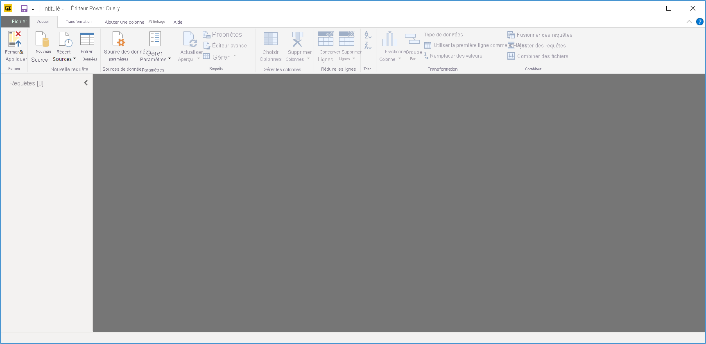
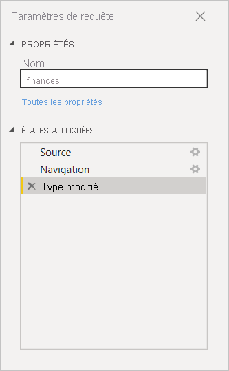
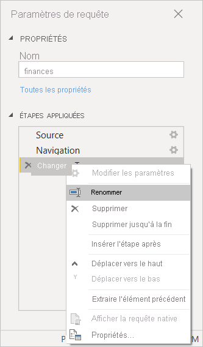
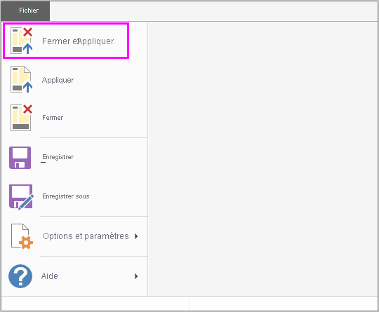
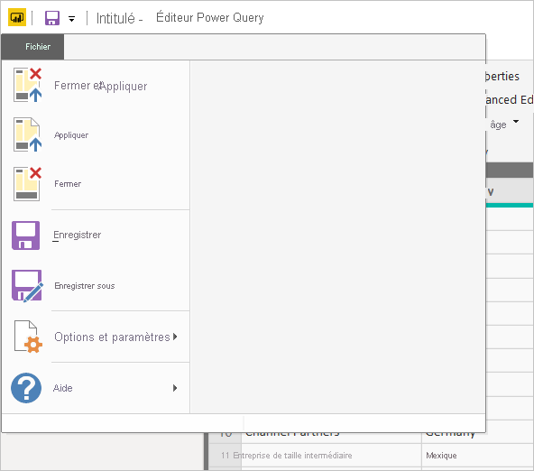

# Présentation des requêtes dans Power BI Desktop
Avec Power BI Desktop, vous pouvez vous connecter à tout un monde de données, créer des rapports attrayants et fondamentaux, puis les partager avec d’autres utilisateurs, qui peuvent ensuite s’appuyer sur votre travail pour développer leurs talents en matière de décisionnel.

Power BI Desktop propose trois vues :

* La vue **Rapport** : c’est là où vous utilisez des requêtes que vous avez créées pour générer des visualisations attrayantes, organisées comme vous souhaitez qu’elles apparaissent et avec plusieurs pages, que vous pouvez partager avec d’autres utilisateurs.
* La vue **Données** : elle vous permet de consulter les données de votre rapport dans un format de modèle de données, où vous pouvez ajouter des mesures, créer des colonnes et gérer les relations.
* La vue **Relations** : elle vous permet d’obtenir une représentation graphique des relations qui ont été définies dans votre modèle de données et de les gérer ou de les modifier si nécessaire.

Accédez à ces vues en sélectionnant l’une des trois icônes affichées sur le côté gauche de Power BI Desktop. Dans l’image suivante, la vue **Rapport** est sélectionnée, indiqué par la bande jaune à côté de l’icône.  

 
Power BI Desktop vient aussi avec l’Éditeur Power Query. Utilisez l’Éditeur Power Query pour vous connecter à une ou plusieurs sources de données, modeler et transformer les données en fonction de vos besoins, puis charger ce modèle dans Power BI Desktop.

Ce document fournit une vue d’ensemble de l’utilisation des données dans l’Éditeur Power Query, mais vous pouvez en apprendre plus. À la fin de ce document, vous trouverez des liens vers des instructions détaillées sur les types de données pris en charge. Vous y trouverez également des conseils sur la connexion aux données, la mise en forme des données, la création de relations et comment démarrer.

Mais tout d’abord, nous allons nous familiariser avec l’Éditeur Power Query.

## Éditeur Power Query
Pour accéder à l’Éditeur Power Query, sélectionnez **Modifier les requêtes** sous l’onglet **Accueil** de Power BI Desktop.  

Sans connexion de données, l’Éditeur Power Query se présente sous la forme d’un volet vide, prêt à accueillir des données.  

Une fois qu’une requête est chargée, la vue de l’Éditeur Power Query devient plus intéressante. Si nous nous connectons à la source de données web suivante, l’Éditeur Power Query charge des informations sur les données, que nous pouvons commencer à mettre en forme.

[*https://www.bankrate.com/retirement/best-and-worst-states-for-retirement/*](https://www.bankrate.com/retirement/best-and-worst-states-for-retirement/)

Voici à quoi ressemble l’Éditeur Power Query une fois qu’une connexion de données est établie :

1. Dans le ruban, de nombreux boutons sont maintenant actifs pour interagir avec les données de la requête.
2. Dans le volet gauche, les requêtes sont listées et disponibles pour être sélectionnées, consultées et mises en forme.
3. Dans le volet central, les données de la requête sélectionnée sont affichées et prêtes à être mises en forme.
4. Le volet **Paramètres d’une requête** s’affiche et liste les propriétés et les étapes appliquées de la requête.  
   
   

Nous allons examiner chacune de ces quatre zones : le ruban, le volet des requêtes, la vue des données et le volet Paramètres d’une requête.

## Ruban de la vue Requête
Le ruban de l’Éditeur Power Query se compose de quatre onglets : **Accueil**, **Transformer**, **Ajouter une colonne** et **Affichage**.

L’onglet **Accueil** contient les tâches de requête courantes.

Pour vous connecter à des données et démarrer le processus de création d’une requête, sélectionnez **Nouvelle source**. Un menu s’affiche, proposant les sources de données les plus courantes.  

Pour plus d’informations sur les sources de données disponibles, consultez **Sources de données**. Pour obtenir plus d’informations sur la connexion à des données, ainsi que des exemples et des étapes, consultez **Se connecter à des données**.

L’onglet **Transformer** donne accès à des tâches de transformation de données courantes, telles que :

* Ajout ou suppression de colonnes
* Changement de types de données 
* Fractionnement de colonnes 
* Autres tâches pilotées par les données

Pour plus d’informations sur la transformation des données, notamment des exemples, consultez [Tutoriel : Mettre en forme et combiner des données dans Power BI Desktop](../connect-data/desktop-shape-and-combine-data.md).

L’onglet **Ajouter une colonne** offre des tâches supplémentaires associées à l’ajout de colonne, à la mise en forme des données d’une colonne et à l’ajout de colonnes personnalisées. L’image suivante montre l’onglet **Ajouter une colonne** .  

L’onglet **Affichage** du ruban permet d’afficher ou de masquer certains volets ou fenêtres. Il sert également à afficher l’Éditeur avancé. L’image suivante montre l’onglet **Affichage**.  

Le saviez-vous ? De nombreuses tâches disponibles à partir du ruban sont également accessibles dans le volet central en cliquant avec le bouton droit sur une colonne ou sur des données.

## Volet gauche (Requêtes)
Le volet gauche, ou volet **Requêtes**, affiche le nombre de requêtes actives et le nom de la requête. Quand vous sélectionnez une requête dans le volet gauche, ses données sont affichées dans le volet central, où vous pouvez mettre en forme et transformer les données à votre guise. L’image suivante montre le volet gauche avec une requête.  

## Volet central (Données)
Le volet central, ou volet **Données**, affiche les données de la requête sélectionnée. Ce volet est l’endroit où le gros du travail de la vue **Requête** est effectué.

L’image suivante montre la connexion de données web établie précédemment. La colonne **Produit** est sélectionnée et son en-tête montre les éléments de menu disponibles quand vous cliquez dessus avec le bouton droit. Notez que la plupart de ces éléments de menu contextuel correspondent à des boutons des onglets du ruban.  

Quand vous sélectionnez un élément de menu contextuel (ou un bouton de ruban) obtenu par clic droit, la requête applique l’étape aux données. Elle enregistre également l’étape en tant que partie d’elle-même. Les étapes sont enregistrées séquentiellement dans le volet **Paramètres d’une requête** , comme décrit dans la section suivante.  

## Volet droit (Paramètres d’une requête)
Le volet droit, ou volet **Paramètres d’une requête** affiche toutes les étapes associées à une requête. Par exemple, dans l’image suivante, la section **Étapes appliquées** du volet **Paramètres d’une requête** reflète le fait que nous venons de modifier le type de la colonne **Overall score** (Score global).

À mesure que d’autres étapes de mise en forme sont appliquées à la requête, elles sont capturées dans la section **Étapes appliquées**.

Il est important de savoir que les données sous-jacentes *ne sont pas* modifiées. À la place, l’Éditeur Power Query ajuste et met en forme sa vue des données. Il met également en forme et ajuste la vue de toute interaction avec les données sous-jacentes qui se produit en fonction de sa vue mise en forme et modifiée de ces données.

Dans le volet **Paramètres d’une requête** , vous pouvez renommer des étapes, supprimer des étapes ou réorganiser les étapes comme vous le souhaitez. Pour ce faire, cliquez avec le bouton droit sur l’étape dans la section **Étapes appliquées** , puis choisissez une option dans le menu qui s’affiche. Toutes les étapes de la requête sont effectuées dans l’ordre de leur apparition dans le volet **Étapes appliquées**.

## Éditeur avancé
L’**Éditeur avancé** vous permet de voir le code que l’Éditeur Power Query crée à chaque étape. Il vous permet aussi de créer votre propre code de mise en forme. Pour lancer l’Éditeur avancé, sélectionnez **Affichage** dans le ruban, puis sélectionnez **Éditeur avancé**. Une fenêtre apparaît, affichant le code de requête existant.  

Vous pouvez modifier le code directement dans la fenêtre **Éditeur avancé** . Pour fermer la fenêtre, cliquez sur le bouton **Terminé** ou **Annuler** .  

## Enregistrement de votre travail
Quand votre requête se trouve là où vous voulez, sélectionnez **Fermer et appliquer** dans le menu **Fichier** de l’Éditeur Power Query. Cette action applique les modifications et ferme l’éditeur.  

À chaque étape, Power BI Desktop affiche une boîte de dialogue pour afficher l’état de la progression.  

Quand vous êtes prêt, Power BI Desktop peut enregistrer votre travail sous la forme d’un fichier *.pbix*.

Pour enregistrer votre travail, sélectionnez **Fichier** \> **Enregistrer** (ou **Fichier** \> **Enregistrer sous**), comme illustré dans l’image suivante.  

## Étapes suivantes
Power BI Desktop vous permet d’effectuer des tâches très diverses. Pour plus d’informations sur ses fonctionnalités, passez en revue les ressources suivantes :

* [Qu’est-ce que Power BI Desktop ?](../fundamentals/desktop-what-is-desktop.md)
* [Sources de données dans Power BI Desktop](../connect-data/desktop-data-sources.md)
* [Se connecter aux données dans Power BI Desktop](../connect-data/desktop-connect-to-data.md)
* [Tutoriel : Mettre en forme et combiner des données avec Power BI Desktop](../connect-data/desktop-shape-and-combine-data.md)
* [Effectuer des tâches de requête courantes dans Power BI Desktop](desktop-common-query-tasks.md)