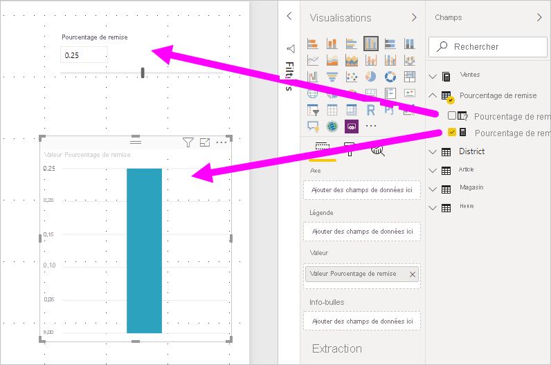
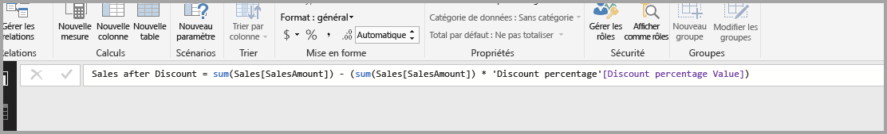

# Créer et utiliser le paramètre what-if pour visualiser des variables dans Power BI Desktop

À compter de la version d’août 2018 de *Power BI Desktop*, vous pouvez créer des variables *Scénarios* pour vos rapports, interagir avec la variable en tant que sélecteur, ainsi que visualiser et quantifier différentes valeurs de clés dans vos rapports.

Créez un paramètre *Scénarios* sous l’onglet **Modélisation** dans Power BI Desktop. Lorsque vous le sélectionnez, une boîte de dialogue s’affiche où vous pouvez configurer le paramètre.

## Création d’un paramètre de scénario

Pour créer un paramètre de scénario, sélectionnez **Nouveau paramètre** sous l’onglet **Modélisation** dans Power BI Desktop. Dans l’image suivante, nous avons créé un paramètre appelé *Pourcentage de remise* et défini son type de données sur **Nombre décimal**. La valeur **Minimale** est zéro. La valeur**Maximale** est 0,50 (50 %). Nous avons également défini l’**Incrément** sur 0,05 (ou 5 %). Il s’agit de la valeur d’ajustement du paramètre lors de son utilisation dans un rapport.

> [!NOTE]
> Pour les nombres décimaux, veillez à faire précéder la valeur d’un zéro, par exemple 0,50 plutôt que ,50. Sinon, le nombre n’est pas validé et le bouton **OK** ne peut pas être sélectionné.
> 
> 

Pour vous faciliter la tâche, la case à cocher **Ajouter un segment à cette page** place automatiquement un segment avec votre paramètre de scénario dans la page de rapport active.

En plus de créer le paramètre, la création d’un paramètre de scénario crée aussi une mesure, qui vous permet de visualiser la valeur actuelle du paramètre de scénario.

Il est important et utile de noter que lorsque vous créez un paramètre de scénario, ce dernier et la mesure font alors partie de votre modèle. Ainsi, ils sont disponibles dans l’ensemble du rapport et peuvent être utilisés sur d’autres pages du rapport. Et, étant donné qu’ils font partie du modèle, vous pouvez supprimer le segment de la page de rapport. Si vous voulez le remettre, il vous suffit de prendre le paramètre de scénario dans la liste **Champs** et de le faire glisser sur le canevas, puis de changer le visuel par un segment.

## Utilisation d’un paramètre de scénario

Créons un exemple simple d’utilisation du paramètre de scénario. Nous avons créé le paramètre de scénario dans la section précédente. À présent, nous allons l’utiliser en créant une nouvelle mesure dont la valeur s’ajuste au curseur.

La nouvelle mesure correspond simplement au montant total des ventes, avec le taux de remise appliqué. Vous pouvez créer des mesures complexes et intéressantes, qui permettent aux utilisateurs de vos rapports de visualiser la variable de votre paramètre de scénario. Par exemple, vous pouvez créer un rapport qui permet aux vendeurs de voir leur rémunération s’ils atteignent certains objectifs ou pourcentages de vente ou de voir l’impact de remises plus importantes sur l’augmentation des ventes.

Entrez la formule de mesure dans la barre de formule, puis nommez la formule *Ventes après remise*.

Créez ensuite un visuel de colonne avec **OrderDate** sur l’axe, avec **SalesAmount** et la mesure récemment créée **Ventes après remise** en tant que valeurs.

Ensuite, lorsque vous déplacez le curseur, vous constatez que la colonne **Ventes après remise** reflète le montant des ventes avec remise.

C’est tout. Vous pouvez utiliser des paramètres de scénario dans toutes sortes de situations. Ces paramètres permettent aux consommateurs de rapports d’interagir avec les différents scénarios que vous créez dans vos rapports.
