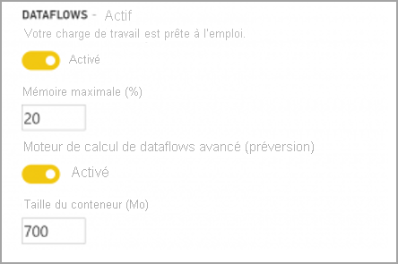

# Le moteur de calcul amélioré

Le moteur de calcul amélioré dans Power BI permet aux abonnés Power BI Premium d’utiliser leur capacité pour optimiser l’utilisation des dataflows. L’utilisation du moteur de calcul amélioré offre les avantages suivants :

* Elle réduit considérablement le temps d’actualisation nécessaires aux étapes ETL de longue durée sur les entités calculées, comme l’exécution de *jointures*, le calcul de *distinctions*, les *filtres* et les *regroupements*.
* Elle permet d’exécuter des requêtes DirectQuery sur des entités (en février 2020).

Les sections suivantes décrivent comment activer le moteur de calcul amélioré et répondent aux questions courantes.

## Utilisation du moteur de calcul amélioré

Le moteur de calcul amélioré s’active à partir de la page **Paramètres de capacité** du service Power BI, dans la section **Dataflows**. Par défaut, le moteur de calcul amélioré est **Désactivé**. Pour l’activer, faites passer le bouton bascule sur **Activé**, comme le montre l’illustration suivante, puis enregistrez vos paramètres. 

> [!IMPORTANT]
> Le moteur de calcul amélioré fonctionne seulement pour les capacités Power BI de niveau A3 et supérieur.

Une fois que vous avez activé le moteur de calcul amélioré, revenez aux dataflows. Vous devriez constater une amélioration des performances dans toutes les entités calculées qui effectuent des opérations complexes, comme des opérations de *jointure* ou de *regroupement* pour les dataflows créés à partir d’entités liées existantes sur la même capacité. 

Pour tirer le meilleur parti du moteur de calcul, vous devez diviser l’étape ETL en deux dataflows distincts de la façon suivante :

* **Dataflow 1** : ce dataflow doit uniquement ingérer tout ce qui est nécessaire d’une source de données et le placer dans le dataflow 2.
* **Dataflow 2** : effectuez toutes les opérations ETL dans ce second dataflow, mais vérifiez que vous référencez bien le dataflow 1, qui doit se trouver sur la même capacité. Veillez également à effectuer les opérations pliables (filtrer, grouper par, distinct, jointure) avant toutes les autres, pour veiller à ce que le moteur de calcul soit utilisé.

## Questions et réponses courantes

**Question :** J’ai activé le moteur de calcul amélioré, mais mes actualisations sont plus lentes. Pourquoi ?

**Réponse :** Si vous activez le moteur de calcul amélioré, deux explications peuvent justifier des temps d’actualisation plus lents :

 - Lorsque le moteur de calcul amélioré est activé, il requiert de la mémoire pour fonctionner correctement. Ainsi, la mémoire disponible pour effectuer une actualisation est réduite et augmente donc sa probabilité d’être mise en file d’attente, ce qui réduit alors le nombre de dataflows pouvant être actualisés simultanément. Pour résoudre ce problème, quand vous activez le calcul amélioré, augmentez la mémoire allouée aux dataflows pour veiller à ce que la mémoire disponible pour les actualisations de dataflows simultanées reste la même.

 - Une autre raison pour laquelle vous pouvez trouver les actualisations plus lentes est que le moteur de calcul fonctionne uniquement sur des entités existantes. Si votre dataflow référence une source de données qui n’est pas un dataflow, vous ne constaterez pas d’amélioration. Les performances ne s’améliorent pas car, dans certains scénarios Big Data, la lecture initiale d’une source de données est plus lente, puisque les données doivent être transmises au moteur de calcul amélioré.  

**Question :** Je ne vois pas la bascule du moteur de calcul amélioré. Pourquoi ?

**Réponse :** Le moteur de calcul amélioré est publié par étapes dans les régions du monde entier. Nous prévoyons que toutes les régions seront prises en charge d’ici la fin 2020.

**Question :** Quels sont les types de données pris en charge pour le moteur de calcul ?

**Réponse :** Le moteur de calcul amélioré et les dataflows prennent actuellement en charge les types de données suivants. Si votre dataflow n’utilise pas l’un des types de données suivants, une erreur se produit lors de l’actualisation :

* Date/heure
* Nombre décimal
* Texte
* Nombre entier
* Date/heure/fuseau horaire
* Vrai/Faux
* Date
* Heure

## Étapes suivantes

Cet article a fourni des informations sur l’utilisation du moteur de calcul amélioré pour les dataflows. Les articles suivants peuvent également vous être utiles :

* [Préparation des données en libre-service avec des flux de données](service-dataflows-overview.md)
* [Créer et utiliser des flux de données dans Power BI](service-dataflows-create-use.md)
* [Utilisation d’entités calculées sur Power BI Premium](service-dataflows-computed-entities-premium.md)
* [Ressources du développeur pour les flux de données Power BI](service-dataflows-developer-resources.md)

Pour plus d’informations sur Power Query et l’actualisation planifiée, vous pouvez consulter ces articles :
* [Présentation des requêtes dans Power BI Desktop](desktop-query-overview.md)
* [Configuration d’une actualisation planifiée](../connect-data/refresh-scheduled-refresh.md)

Pour plus d’informations sur le modèle Common Data Model, vous pouvez lire son article de présentation :
* [Vue d’ensemble du modèle CMD (Common Data Model) ](https://docs.microsoft.com/powerapps/common-data-model/overview)
