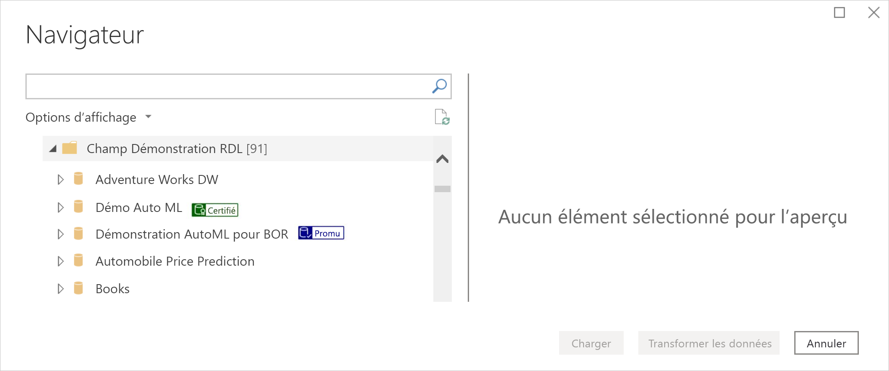
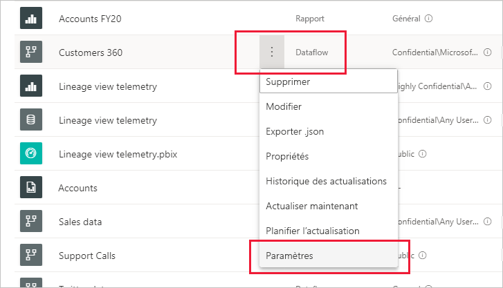
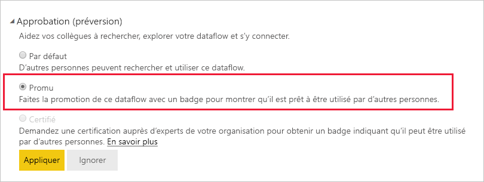
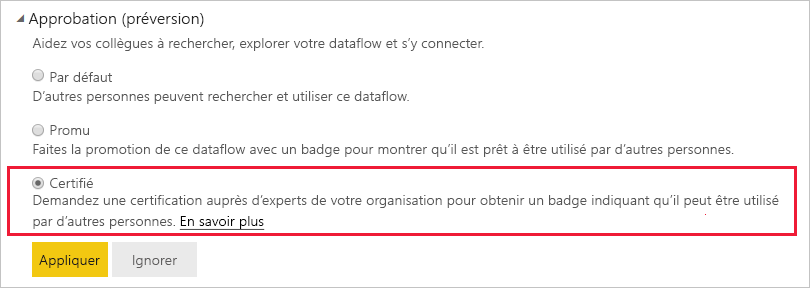

# Promouvoir ou certifier des dataflows (préversion)

Power BI offre deux méthodes vous permettant d’améliorer la visibilité de vos précieux dataflows de qualité : **promotion** et **certification**.

* **Promotion** : La promotion permet aux utilisateurs de mettre en évidence les dataflows qui leurs semblent importants et intéressants pour les autres utilisateurs. De cette façon, elle favorise la répartition collaborative de dataflows au sein d’une organisation. Tout propriétaire de dataflow, ou tout membre disposant d’autorisations en écriture sur l’espace de travail où se trouve un dataflow, peut simplement promouvoir le dataflow quand il pense qu’il est assez bien pour être partagé.

* **Certification** : La certification signifie qu’un dataflow a été vérifié par un réviseur autorisé et qu’il s’agit vraiment d’une source de données fiable et faisant autorité qui est prête à être utilisée dans l’organisation. Un groupe choisi de réviseurs défini par l’administrateur Power BI détermine les dataflows à certifier. Un utilisateur qui estime qu’un dataflow particulier doit être certifié, mais qui n’est pas autorisé à le certifier, doit contacter son administrateur.

  La certification de dataflow est possible uniquement si elle a été [activée par l’administrateur Power BI](../admin/service-admin-setup-certification.md).

La promotion ou la certification d’un dataflow est appelée *approbation*. Les créateurs de rapports Power BI ont souvent le choix entre de nombreux dataflows différents, et l’approbation permet de les guider vers les dataflows fiables, dignes de confiance et qui font autorité.

Les dataflows approuvés sont clairement étiquetés dans de nombreux emplacements de Power BI, ce qui permet aux créateurs de rapports de les trouver facilement quand ils recherchent des données fiables. Les administrateurs et les créateurs de rapports peuvent ainsi également suivre la façon dont ils sont utilisés dans l’ensemble de l’organisation.

L’image ci-dessous montre comment des dataflows promus et certifiés sont facilement identifiés dans Power Query.

Cet article aborde les points suivants :
* Promotion d’un dataflow (propriétaire du dataflow ou tout utilisateur disposant d’autorisations de membre sur l’espace de travail où se trouve le dataflow)
* Certification d’un dataflow (certificateur de dataflow autorisé, tel que déterminé par l’administrateur Power BI)

Pour plus d’informations sur la configuration de la certification de dataflow (administrateur), consultez [Configurer la certification de jeux de données et de dataflows](../admin/service-admin-setup-certification.md).

## Promouvoir un dataflow

Pour promouvoir un dataflow, vous devez disposer d’autorisations en écriture sur l’espace de travail dans lequel se trouve le dataflow que vous voulez promouvoir.

1. Accédez à la liste des dataflows dans l’espace de travail.
 
1. Sélectionnez **Plus d’options** (...) dans le dataflow que vous voulez promouvoir, puis sélectionnez **Paramètres**.

    

1. Développez la section d’approbation, puis sélectionnez **Promu**.

    

1. Sélectionnez **Appliquer**.

## Certifier un dataflow

Cette section est destinée aux utilisateurs qui ont été autorisés par leur administrateur Power BI à certifier des dataflows. La certification des dataflows est une grande responsabilité. Cette section décrit le processus de certification que vous suivez.

1. Obtenez des autorisations en écriture sur l’espace de travail où se trouve le dataflow que vous voulez certifier. Cela peut être effectué par le propriétaire du dataflow ou par toute personne disposant d’autorisations d’administration sur l’espace de travail. 

1. Examinez attentivement le dataflow et déterminez s’il mérite d’être certifié.

1. Si vous décidez de certifier le dataflow, accédez à l’espace de travail où il réside.
 
1. Recherchez le dataflow souhaité, cliquez sur **Plus d’options** (...), puis sélectionnez **Paramètres**.

    

1. Développez la section d’approbation, puis cliquez sur **Certifié**. 

    

2. Cliquez sur **Appliquer**.

## Étapes suivantes

* [Configurer la certification de jeux de données et de dataflows](../admin/service-admin-setup-certification.md)
* Vous avez des questions ? [Essayez d’interroger la communauté Power BI](https://community.powerbi.com/)