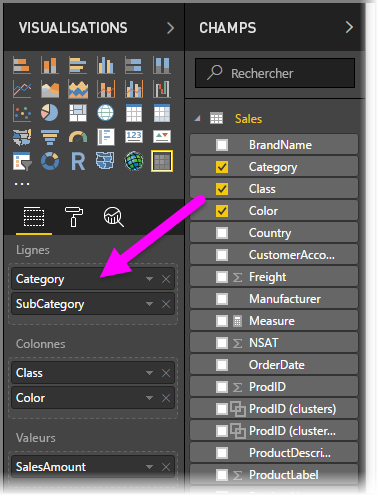
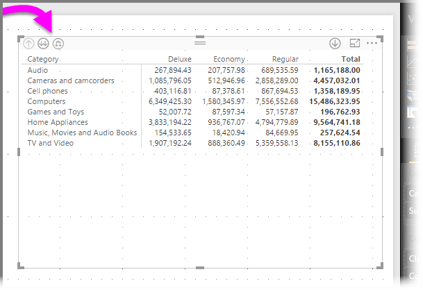
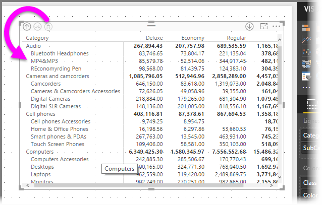
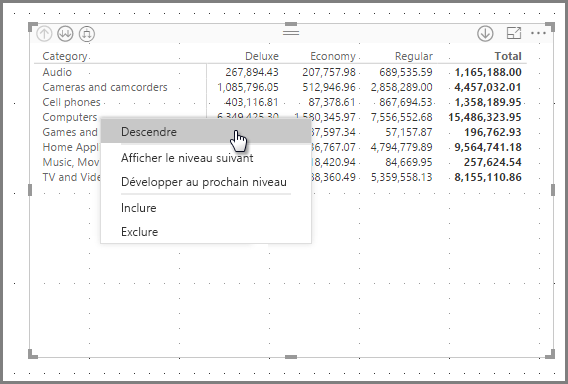
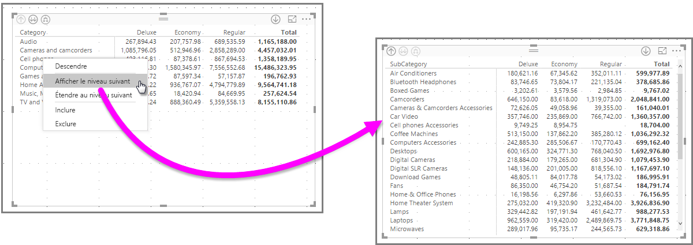
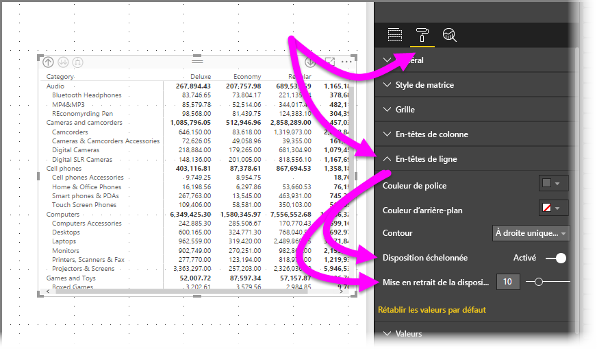
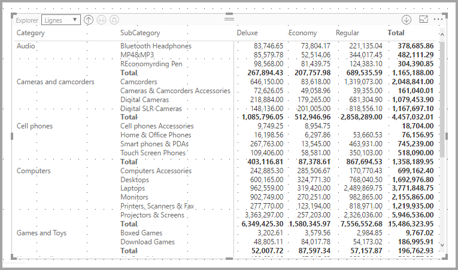
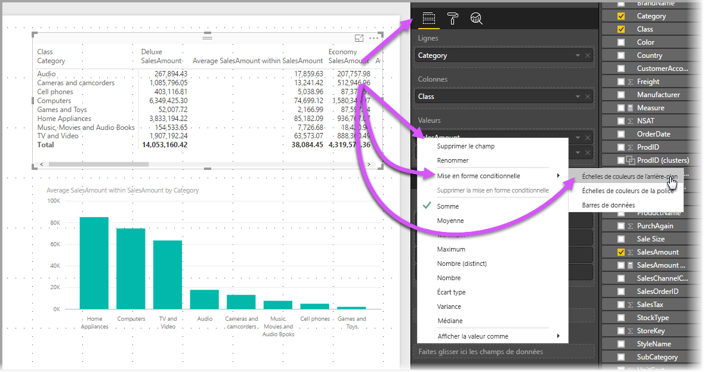
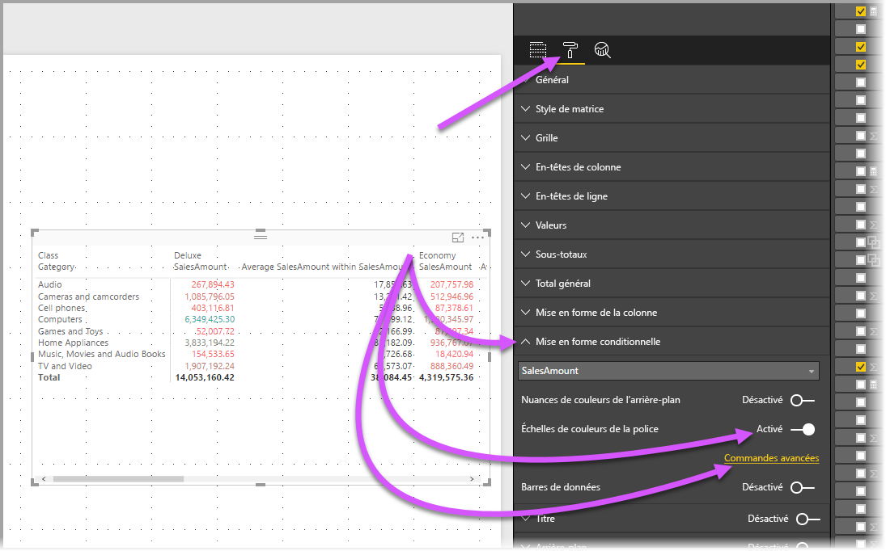
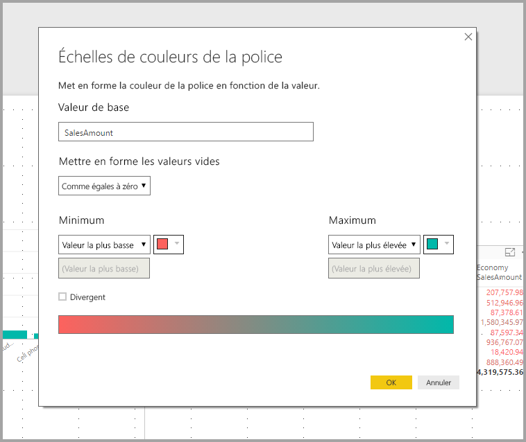

# Utiliser le visuel Matrice dans Power BI Desktop
La fonctionnalité visuelle **Matrice** vous permet de créer des visuels de matrice (également appelés *tables*) dans des rapports **Power BI Desktop** et de mettre en évidence des éléments au sein de la matrice en les croisant avec d’autres visuels. Vous pouvez également sélectionner des lignes, colonnes et cellules pour les mettre en évidence croisée. Enfin, pour optimiser l’utilisation de l’espace de disposition, le visuel de matrice prend en charge une disposition échelonnée.

De nombreuses fonctionnalités sont associées à la matrice, que nous allons passer en revue dans les sections suivantes de cet article.

> [!NOTE]
> Depuis la version de **Power BI Desktop** publiée en juillet 2017, les visuels de matrice et de table reflètent le style (y compris les couleurs) du **thème de rapport** appliqué. Il se peut que ces couleurs soient différentes de celles attendues pour votre visuel de matrice, mais vous pouvez les modifier dans votre configuration de **thème de rapport**. Pour plus d’informations sur les thèmes, consultez [**Utiliser les thèmes de rapport dans Power BI Desktop**](../desktop-report-themes.md).
> 
> 

## Comprendre comment Power BI calcule les totaux

Avant de passer à l’utilisation du visuel **Matrice**, il est important de comprendre comment Power BI calcule les valeurs des totaux et des sous-totaux dans les tables et les matrices. La mesure des totaux et des sous-totaux est évaluée sur toutes les lignes dans les données sous-jacentes : il ne s’agit *pas* d’une simple addition des valeurs des lignes visibles ou affichées. Les valeurs obtenues dans la ligne du total peuvent donc être différentes de ce à quoi on pourrait s’attendre. 

Regardez les visuels **Matrice** suivants. 

Dans cet exemple, chaque ligne du visuel **Matrice** tout à droite affiche le *Montant* de chaque combinaison vendeur/date. Toutefois, dans la mesure où chaque vendeur apparaît sur plusieurs dates, les chiffres sont susceptibles de s’afficher plusieurs fois. C’est pourquoi le total exact calculé à partir des données sous-jacentes n’est pas égal à la simple addition des valeurs visibles. Il s’agit d’un modèle courant, selon lequel la valeur additionnée correspond à l’élément de l’ensemble de départ dans une relation multivoque.

Lorsque vous étudiez les totaux et les sous-totaux, n’oubliez pas que ces valeurs sont basées sur les données sous-jacentes, et pas seulement sur les valeurs visibles. 

## Descendre dans la hiérarchie avec le visuel Matrice
Le visuel **Matrice** vous permet d’effectuer toutes sortes d’opérations intéressantes de descente dans la hiérarchie qui n’étaient pas possibles avant. Vous pouvez notamment descendre dans la hiérarchie en utilisant des lignes, des colonnes, voire des sections et cellules individuelles. Voyons comment ces opérations fonctionnent.

### Descendre dans la hiérarchie sur des en-têtes de ligne
Dans le volet **Visualisations**, lorsque vous ajoutez plusieurs champs à la section **Lignes** du puits **Champs**, vous activez la descente dans la hiérarchie sur les lignes du visuel de matrice. Cette opération est similaire à la création d’une hiérarchie, qui vous permet de descendre (et remonter) dans cette hiérarchie et d’analyser les données à chaque niveau.

Dans l’image suivante, la section **Lignes** contient les éléments *Catégorie* et *Sous-catégorie*, qui créent un regroupement (ou une hiérarchie) dans les lignes, à partir duquel nous pouvons extraire.

Lorsque le visuel comporte un regroupement créé dans la section **Lignes**, le visuel lui-même affiche les icônes *Explorer* et *Développer* dans l’angle supérieur gauche du visuel.

Similairement au comportement des fonctions Explorer et Développer dans d’autres visuels, ces boutons permettent de descendre (ou remonter) dans la hiérarchie. Dans ce cas, nous pouvons descendre dans la hiérarchie de *Catégorie* à *Sous-catégorie*, comme l’illustre l’image suivante, où l’icône Descendre d’un niveau dans la hiérarchie (en forme de fourche) a été sélectionnée.

Outre l’utilisation de ces icônes, vous pouvez cliquer avec le bouton de droite sur ces en-têtes de lignes et descendre dans la hiérarchie en opérant des sélections dans le menu qui s’affiche.

Notez que ce menu affiche quelques options qui produisent des résultats différents :

La sélection de l’option **Descendre dans la hiérarchie** a pour effet de développe la matrice pour *ce* niveau de ligne *en excluant* tous les autres en-têtes de ligne à l’exception de celui sur lequel nous cliquons avec le bouton droit. Dans l’image suivante, le clic avec le bouton droit a été effectué sur *Ordinateurs* et l’option **Descendre dans la hiérarchie** a été sélectionnée. Vous pouvez constater que d’autres lignes de niveau supérieur n’apparaissent plus dans la matrice. Cela est utile et s’avèrera particulièrement appréciable lorsque nous aborderons la section **Sélection croisée**.

Vous pouvez cliquer sur l’icône **Monter dans la hiérarchie** pour revenir à la vue de niveau supérieur précédente. Si vous sélectionnez ensuite **Afficher le niveau suivant** dans le menu contextuel, vous obtenez une liste alphabétique de tous les éléments du niveau suivant (en l’occurrence, le champ *Sous-catégorie*), sans la catégorisation de hiérarchie de niveau supérieur.

Lorsque vous cliquez sur l’icône **Monter dans la hiérarchie** dans le coin supérieur gauche pour que la matrice affiche toutes les catégories de niveau supérieur, puis cliquez à nouveau avec le bouton de droite et sélectionnez **Développer au prochain niveau**, ce qui suit s’affiche :

Nous pouvons également utiliser les options de menu **Inclure** et **Exclure** pour respectivement conserver ou supprimer la ligne sur laquelle nous avons cliqué (et toutes ses sous-catégories) dans la matrice.

### Descendre dans la hiérarchie sur des en-têtes de colonne
Tout comme sur des lignes, nous pouvons descendre dans la hiérarchie sur des **colonnes**. Dans l’image suivante, vous pouvez voir que le puits du champ **Colonnes** comprend deux champs, ce qui crée une hiérarchie similaire à celle que nous avons utilisée pour les lignes plus haut dans cet article. Dans le puits du champ **colonnes**, nous avons *Classe* et *Couleur*.

Dans le visuel **Matrice**, lorsque vous cliquez avec le bouton droit sur une colonne, vous voyez s’afficher l’option Descendre dans la hiérarchie. Dans l’image suivante, nous cliquons avec le bouton droit sur *Deluxe*, puis sélectionnons **Descendre dans la hiérarchie**.

Lorsque vous sélectionnez **Descendre dans la hiérarchie**, le niveau suivant de la hiérarchie de colonne pour *Deluxe* s’affiche, en l’occurrence *Couleur*.

Les autres éléments du menu contextuel opèrent sur les colonnes de la même manière que sur les lignes (consultez la section précédente, **Descendre dans la hiérarchie sur des en-têtes de ligne**). Vous pouvez **Afficher le niveau suivant**, **Développer au prochain niveau**, **Inclure** ou **Exclure** vos colonnes comme avec les lignes.

> [!NOTE]
> Les icônes Descendre dans la hiérarchie et Monter dans la hiérarchie dans l’angle supérieur gauche du visuel de matrice s’appliquent uniquement aux lignes. Pour descendre dans la hiérarchie sur des colonnes, vous devez utiliser le menu contextuel.
> 
> 

## Disposition échelonnée avec des visuels de matrice
Le visuel **Matrice** met automatiquement en retrait les sous-catégories dans une hiérarchie sous chaque parent. C’est ce qu’on appelle une **Disposition échelonnée**.

Dans la version *d’origine* du visuel de matrice, les sous-catégories s’affichaient dans une colonne tout à fait distincte, occupant beaucoup plus d’espace que le visuel. L’image suivante présente la table dans le visuel de **Matrice** d’origine. Vous pouvez constater que les sous-catégories apparaissent dans une colonne totalement distincte.

Dans l’image suivante, vous voyez un visuel **Matrice** avec une **Disposition échelonnée** en action. Notez que les sous-catégories (Accessoires d’ordinateur, Ordinateurs de bureau, ordinateurs portables, Moniteurs, etc.) de la catégorie *Ordinateurs* apparaissent légèrement en retrait, produisant un visuel plus clair et plus concentré.

Vous pouvez aisément ajuster les paramètres de la disposition échelonnée. Le visuel **Matrice** étant sélectionné, dans la section **Format** (icône de rouleau à peinture) du volet **Visualisations**, développez la section **En-têtes de ligne**. Vous avez deux options : la bascule **Disposition échelonnée** (qui active ou désactive cette option) et le **retrait de la disposition échelonnée** (qui spécifie l’importance du retrait en pixels).

Si vous désactivez l’option **Disposition échelonnée**, les sous-catégories s’affichent dans une autre colonne au lieu de s’afficher en retrait sous la catégorie parente.

## Sous-totaux avec les visuels Matrice
Vous pouvez activer ou désactiver des sous-totaux dans les visuels Matrice, aussi bien pour les lignes que les colonnes. Dans l’image suivante, vous pouvez voir que les sous-totaux de ligne sont définis sur **On (Activé)**.

Dans la section **Format** du volet **Visualisations**, développez la carte **Sous-totaux** et définissez le curseur **Sous-totaux des lignes** sur **Off (Désactivé)**. Lorsque vous procédez ainsi, les sous-totaux ne sont pas affichés.

Le même processus s’applique pour les sous-totaux des colonnes.

## Sélection croisée avec des visuels de matrice
Avec le visuel **Matrice**, tous les éléments de la matrice peuvent être sélectionnés comme base pour une sélection croisée. Lorsque vous sélectionnez une colonne dans un visuel **Matrice**, cette colonne s’affiche en surbrillance, comme tous les autres visuels sur la page de rapport. Il s’agit d’une fonctionnalité commune d’autres visuels et sélections de point de données, ainsi, à présent, le visuel **Matrice** offre la même fonction.

De plus, la combinaison Ctrl+Clic fonctionne également pour la sélection croisée. Par exemple, dans l’image suivante, une collection de sous-catégories a été sélectionnée dans le visuel **Matrice**. Notez comment les éléments non sélectionnés dans le visuel sont grisés, et comment les autres visuels de la page reflètent les sélections opérées dans le visuel **Matrice**.

## Couleurs d’ombrage et de police avec les visuels Matrice
Avec le visuel **Matrice**, vous pouvez appliquer la **Mise en forme conditionnelle** (couleurs et ombrage) à l’arrière-plan des cellules de la matrice et une mise en forme conditionnelle au texte et aux valeurs elles-mêmes.

Pour appliquer la mise en forme conditionnelle, vous pouvez effectuer les opérations suivantes lorsqu’un visuel Matrice est sélectionné :

* Dans le volet **Champs**, cliquez sur le champ, puis sélectionnez **Mise en forme conditionnelle** dans le menu.
  
  
* Ou, dans le volet **Format**, développez la carte **Mise en forme conditionnelle** et pour **Échelles de couleurs de l’arrière-plan** ou **Échelles de couleurs de la police**, définissez le curseur sur **On (Activé)**. Activer l’une de ces options a pour effet d’afficher un lien pour *Contrôles avancés*, qui vous permet de personnaliser les couleurs et les valeurs de la mise en forme des couleurs.
  
  

Chacune de ces approches permet d’obtenir le même résultat. Sélectionner *Contrôles avancés* a pour effet d’afficher la boîte de dialogue suivante, qui vous permet d’effectuer des ajustements :

## Étapes suivantes

Les articles suivants pourraient également vous intéresser :

* [Utiliser le quadrillage et l’alignement sur la grille dans les rapports Power BI Desktop](../desktop-gridlines-snap-to-grid.md)
* [Sources de données dans Power BI Desktop](../desktop-data-sources.md)
* [Types de données dans Power BI Desktop](../desktop-data-types.md)

 