# Créer des visualisations de matrice dans Power BI

[!INCLUDE[consumer-appliesto-nyyn](../includes/consumer-appliesto-nyyn.md)]

[!INCLUDE [power-bi-visuals-desktop-banner](../includes/power-bi-visuals-desktop-banner.md)]

Le visuel Matrice est similaire à une table.  Une table prend en charge deux dimensions et les données sont plates, ce qui signifie que les valeurs dupliquées sont affichées et non agrégées. Une matrice facilite l’affichage des données de manière claire entre plusieurs dimensions : elle prend en charge une disposition échelonnée. La matrice agrège automatiquement les données et permet de descendre dans la hiérarchie. 

Vous pouvez créer des visuels de matrice dans des rapports **Power BI Desktop** et mettre en évidence des éléments au sein de la matrice en les croisant avec d’autres visuels sur cette page de rapports. Par exemple, vous pouvez sélectionner des lignes, des colonnes, et même des cellules individuelles pour les mettre en évidence croisée. De même, les sélections de cellules individuelles et de plusieurs cellules peuvent être copiées et collées dans d’autres applications. 

De nombreuses fonctionnalités sont associées à la matrice, que nous allons passer en revue dans les sections suivantes de cet article.

> [!NOTE]
> Pour que vous puissiez partager votre rapport avec un collègue Power BI, il faut que vous disposiez tous deux de licences individuelles Power BI Pro ou que le rapport soit enregistré dans une capacité Premium.

## Comprendre comment Power BI calcule les totaux

Avant de passer à l’utilisation du visuel Matrice, il est important d’apprendre comment Power BI calcule les valeurs des totaux et des sous-totaux dans les tables et les matrices. Pour les lignes des totaux et des sous-totaux, Power BI évalue la mesure sur toutes les lignes dans les données sous-jacentes : il ne s’agit pas d’une simple addition des valeurs des lignes visibles ou affichées. Les valeurs obtenues dans la ligne du total peuvent donc être différentes de ce à quoi on pourrait s’attendre.

Regardez les visuels de matrice suivants. 

Dans cet exemple, chaque ligne du visuel de la matrice tout à droite affiche le *Montant* de chaque combinaison vendeur/date. Toutefois, dans la mesure où chaque vendeur apparaît sur plusieurs dates, les chiffres sont susceptibles de s’afficher plusieurs fois. C’est pourquoi le total exact calculé à partir des données sous-jacentes n’est pas égal à la simple addition des valeurs visibles. Il s’agit d’un modèle courant, selon lequel la valeur additionnée correspond à l’élément de l’ensemble de départ dans une relation multivoque.

Lorsque vous examinez des totaux et des sous-totaux, n’oubliez pas que ces valeurs sont basées sur les données sous-jacentes. Elles ne sont pas uniquement basées sur des valeurs visibles.

## Développer et réduire des en-têtes de lignes
Il existe deux manières de développer des en-têtes de lignes. La première se fait par le biais du menu contextuel, qui comporte des options pour développer l’en-tête de ligne sélectionné, le niveau tout entier ou absolument tout jusqu’au dernier niveau de la hiérarchie. Il existe des options similaires pour réduire les en-têtes de lignes.

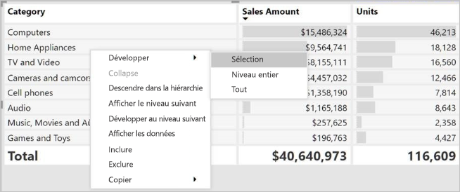

Vous pouvez également ajouter des boutons +/-aux en-têtes de lignes grâce au volet Mise en forme sous la carte **En-têtes de lignes**. Par défaut, les icônes correspondent à la mise en forme de l’en-tête de ligne, mais vous pouvez personnaliser la couleur et la taille des icônes séparément si vous le souhaitez.

Une fois activées, elles fonctionnent comme les icônes de tableau croisé dynamique dans Excel.

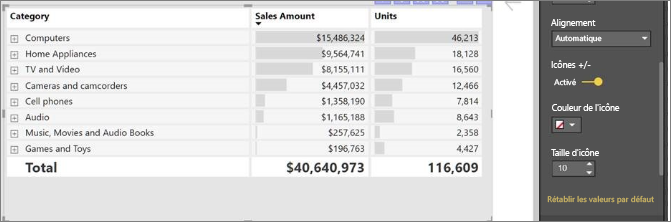

L’état de développement de la matrice sera enregistré avec le rapport. Une matrice peut être épinglée à un tableau de bord développé ou réduit. Lorsque cette vignette de tableau de bord est sélectionnée et que le rapport s’ouvre, l’état de développement peut encore être modifié dans le rapport. 

> [!NOTE]
> Si vous créez un rapport en plus d’un modèle multidimensionnel Analysis Services, des considérations spécifiques doivent être prises en compte pour développer/réduire si le modèle utilise la fonctionnalité de membre par défaut. Pour plus d’informations, consultez [Utiliser des modèles multidimensionnels dans Power BI](../desktop-default-member-multidimensional-models.md)

## Utilisation de la descente dans la hiérarchie avec le visuel de matrice
Le visuel de la matrice vous permet d’effectuer toutes sortes d’opérations intéressantes de descente dans la hiérarchie qui n’étaient pas possibles avant. Vous pouvez notamment descendre dans la hiérarchie en utilisant les lignes, les colonnes, voire des sections et cellules individuelles. Voyons comment ces opérations fonctionnent.

### Descendre dans la hiérarchie sur des en-têtes de ligne

Dans le volet Visualisations, lorsque vous ajoutez plusieurs champs à la section **Lignes** du puits **Champs**, vous permettez la descente dans la hiérarchie sur les lignes du visuel Matrice. Cette opération est similaire à la création d’une hiérarchie, qui vous permet de descendre (et remonter) dans cette hiérarchie et d’analyser les données à chaque niveau.

Dans l’image suivante, la section **Lignes** contient les éléments *Étape de vente* et *Taille de l’opportunité*, qui créent un regroupement (ou une hiérarchie) dans les lignes, à partir duquel nous pouvons extraire.

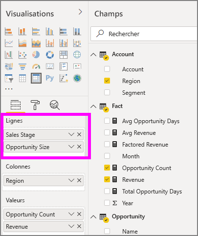

Lorsque le visuel comporte un regroupement créé dans la section **Lignes**, le visuel lui-même affiche les icônes *Explorer* et *Développer* dans l’angle supérieur gauche du visuel.

À l’instar du comportement des fonctions Explorer et Développer dans d’autres visuels, ces boutons permettent de descendre (ou remonter) dans la hiérarchie. Dans ce cas, nous pouvons descendre dans la hiérarchie d’*Étape de vente* à *Taille de l’opportunité*, comme l’illustre l’image suivante, où l’icône Descendre d’un niveau dans la hiérarchie (en forme de fourche) a été sélectionnée.

Outre l’utilisation de ces icônes, vous pouvez sélectionner une de ces en-têtes de lignes et descendre dans la hiérarchie en effectuant des choix dans le menu qui s’affiche.

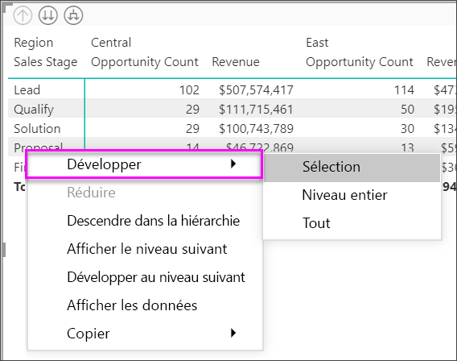

Notez que ce menu affiche quelques options qui produisent des résultats différents :

La sélection de l’option **Descendre dans la hiérarchie** a pour effet de développe la matrice pour *ce* niveau de ligne *en excluant* tous les autres en-têtes de ligne à l’exception de celui qui était sélectionné. Dans l’image suivante, **Proposition** > **Descendre dans la hiérarchie** a été sélectionné. Vous pouvez constater que d’autres lignes de niveau supérieur n’apparaissent plus dans la matrice. Cette manière d’explorer est utile et s’avèrera particulièrement appréciable lorsque nous aborderons la section Sélection croisée.

Sélectionnez l’icône **Monter dans la hiérarchie** pour revenir à la vue de niveau supérieur précédente. Si vous sélectionnez ensuite **Proposition** > **Afficher le niveau suivant**, vous obtenez une liste alphabétique de tous les éléments du niveau suivant (en l’occurrence, le champ *Taille de l’opportunité*), sans la catégorisation de hiérarchie de niveau supérieur.

Sélectionnez l’icône **Monter dans la hiérarchie** en haut à gauche pour que la matrice affiche toutes les catégories de niveau supérieur, puis sélectionnez **Proposition** > **Développer au prochain niveau** pour voir toutes les valeurs des deux niveaux de la hiérarchie - *Étape de vente* et *Nombre d’opportunité*.

Vous pouvez également utiliser l’élément de menu **Développer** pour contrôler davantage l’affichage.  Par exemple, sélectionnez **Proposition** > **Développer** > **Sélection**. Power BI affiche une ligne de total pour chaque *Étape de vente* et toutes les options de *Taille d’opportunité* pour *Proposition*.

### Descendre dans la hiérarchie sur des en-têtes de colonne
Tout comme sur des lignes, nous pouvons descendre dans la hiérarchie sur des colonnes. Dans l’image suivante, la zone du champ **Colonnes** comprend deux champs, ce qui crée une hiérarchie similaire à celle que nous avons utilisée pour les lignes plus haut dans cet article. Dans le puits du champ **colonnes**, nous avons *Région* et *Segment*. Dès que le deuxième champ a été ajouté à **Colonnes**, un nouveau menu déroulant affiché sur le visuel, il affiche actuellement **Lignes**.

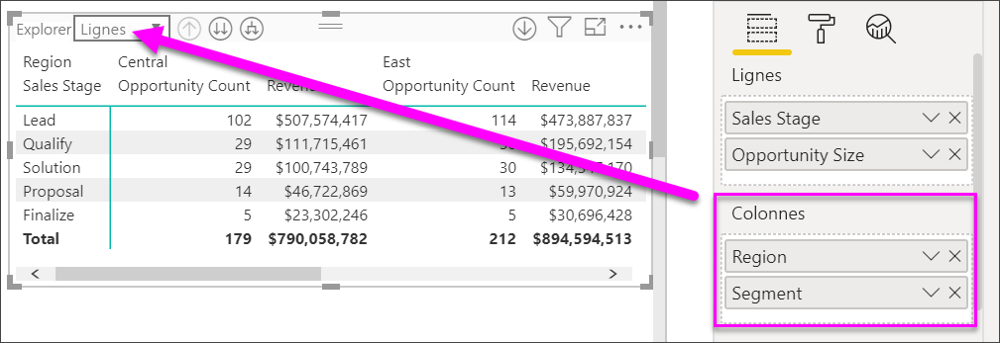

Pour Explorer sur les colonnes, sélectionnez **Colonnes** à partir du menu *Explorer* qui se trouve en haut à gauche de la matrice. Sélectionnez la région *Est* et choisissez **Descendre dans la hiérarchie**.

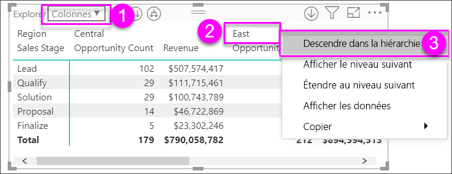

Lorsque vous sélectionnez **Descendre dans la hiérarchie**, le niveau suivant de la hiérarchie de colonne pour *Région > Est* s’affiche, en l’occurrence *Nombre d’opportunités*. L'autre région est masquée.

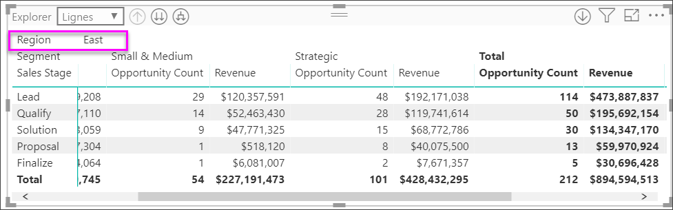

Les autres éléments du menu opèrent sur les colonnes de la même manière que sur les lignes (consultez la section précédente, **Descendre dans la hiérarchie sur des en-têtes de ligne**). Nous pouvons **Afficher le niveau suivant** et **Développer au prochain niveau** avec des colonnes comme nous pouvions le faire avec les lignes.

> [!NOTE]
> Les icônes Descendre dans la hiérarchie et Monter dans la hiérarchie dans l’angle supérieur gauche du visuel de matrice s’appliquent uniquement aux lignes. Pour descendre dans la hiérarchie sur des colonnes, vous devez utiliser le menu contextuel.

## Disposition échelonnée avec des visuels de matrice

Le visuel Matrice met automatiquement en retrait les sous-catégories dans une hiérarchie sous chaque parent. C’est ce qu’on appelle une disposition échelonnée.

Dans la version d’origine du visuel de matrice, les sous-catégories s’affichaient dans une colonne tout à fait distincte, occupant beaucoup plus d’espace que le visuel. L’image suivante présente le tableau dans le visuel Matrice d’origine. Vous pouvez constater que les sous-catégories apparaissent dans une colonne distincte.

Dans l’image suivante, vous voyez un visuel Matrice avec une disposition échelonnée en action. Notez que les sous-catégories (Accessoires d’ordinateur, Ordinateurs de bureau, ordinateurs portables, Moniteurs, etc.) de la catégorie *Ordinateurs* apparaissent légèrement en retrait, produisant un visuel plus clair et plus concentré.

Vous pouvez aisément ajuster les paramètres de la disposition échelonnée. Le visuel Matrice étant sélectionné, dans la section **Format** (icône de rouleau à peinture) du volet **Visualisations**, développez la section En-têtes de ligne. Vous avez deux options : le commutateur de disposition échelonnée (qui active ou désactive cette option) et le retrait de la disposition échelonnée (qui spécifie l’importance du retrait en pixels).

Si vous désactivez la disposition échelonnée, Power BI affiche les sous-catégories dans une autre colonne au lieu de s’afficher en retrait sous la catégorie parente.

## Sous-totaux et totaux généraux avec visuels Matrice

Vous pouvez activer ou désactiver des sous-totaux dans les visuels Matrice, aussi bien pour les lignes que les colonnes. Dans l’image suivante, vous pouvez voir que les sous-totaux de ligne sont définis sur **Activé** et pour s’afficher au bas.

Quand vous activez **Sous-totaux** et que vous ajoutez une étiquette, Power BI ajoute aussi une ligne (et la même étiquette) pour la valeur de total général. Pour mettre en forme le total général, sélectionnez l’option de format pour **Total général**. 

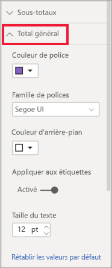

Si vous voulez désactiver les sous-totaux et le total général, dans la section Format du volet Visualisations, développez la carte **Sous-totaux**. Mettez le curseur des sous-totaux de ligne sur la position **Désactivé**. Lorsque vous procédez ainsi, les sous-totaux ne sont pas affichés.

Le même processus s’applique pour les sous-totaux des colonnes.

## Ajouter des icônes conditionnelles
Ajoutez des signaux visuels à votre table ou matrice avec des *icônes conditionnelles*. 

Dans la section Format du volet Visualisations, développez la carte **Mise en forme conditionnelle**. Mettez le curseur **Icônes** sur la position **Activé** et sélectionnez **Contrôles avancés**.

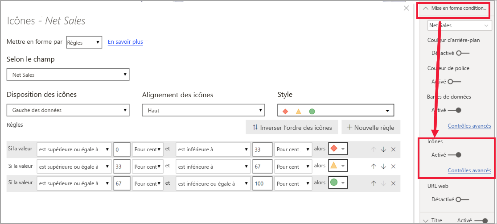

Ajustez les conditions, les icônes et les couleurs de votre matrice, puis sélectionnez **OK**. Dans cet exemple, nous avons utilisé un indicateur rouge pour les valeurs basses, un cercle violet pour les valeurs élevées et un triangle jaune pour tout ce qui se trouve entre les deux. 

## Sélection croisée avec des visuels de matrice

Avec le visuel Matrice, tous les éléments de la matrice peuvent être sélectionnés comme base pour une sélection croisée. Lorsque vous sélectionnez une colonne dans une Matrice, Power BI met cette colonne en surbrillance, comme tous les autres visuels sur la page de rapport. Ce type de sélection croisée est une fonctionnalité courante d’autres visuels et sélections de points de données et est à présent également disponible pour le visuel Matrice.

De plus, la combinaison Ctrl+Clic fonctionne également pour la sélection croisée. Par exemple, dans l’image suivante, une collection de sous-catégories a été sélectionnée dans le visuel Matrice. Notez comment les éléments non sélectionnés dans le visuel sont grisés, et comment les autres visuels de la page reflètent les sélections opérées dans le visuel Matrice.

## Copie des valeurs à partir de Power BI pour une utilisation dans d’autres applications

Votre matrice ou votre table peuvent avoir du contenu que vous souhaitez utiliser dans d’autres applications : Dynamics CRM, Excel et autres rapports de Power BI. Avec le clic droit Power BI, vous pouvez copier une cellule unique ou une sélection de cellules dans votre Presse-papiers. Ensuite, collez-les dans l’autre application.

* Pour copier la valeur d’une cellule unique, sélectionnez la cellule, cliquez avec le bouton droit, puis choisissez **Copier la valeur**. Avec la valeur de cellule non mise en forme dans votre Presse-papiers, vous pouvez maintenant la coller dans une autre application.

    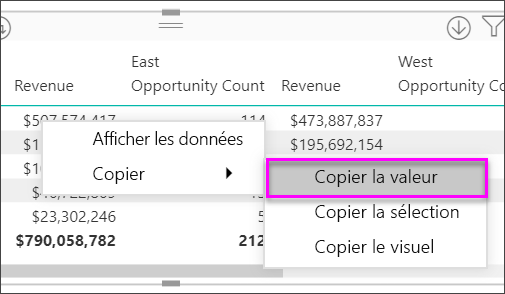

* Pour copier plusieurs cellules, sélectionnez une plage de cellules ou utilisez la touche CTRL pour sélectionner une ou plusieurs cellules. 

    

* La copie inclut les en-têtes de colonne et de ligne.

    

* Pour créer une copie du visuel lui-même ne contenant que les cellules sélectionnées, sélectionnez une ou plusieurs cellules à l’aide de la touche CTRL, cliquez avec le bouton droit de la souris, puis choisissez **Copier le visuel**

    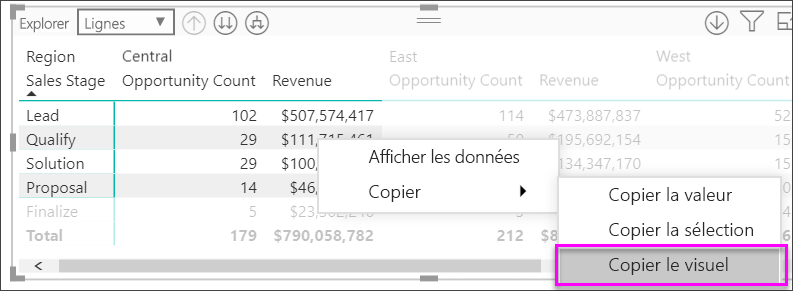

* La copie sera une autre visualisation matricielle, mais ne contiendra que vos données copiées.

    

## Définir une valeur de matrice comme URL personnalisée

Si vous avez une colonne ou une mesure qui contient des URL de site web, vous pouvez utiliser la mise en forme conditionnelle pour appliquer ces URL à des champs sous forme de liens actifs. Vous trouverez cette option sous la carte **Mise en forme conditionnelle** dans le volet Mise en forme.

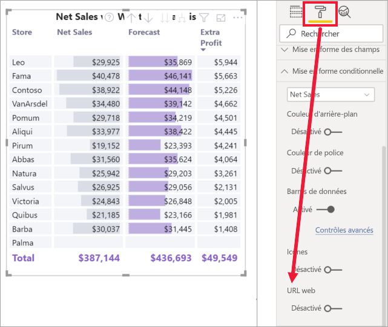

Activez **URL Web**, puis sélectionnez un champ à utiliser comme URL de la colonne. Une fois appliquées, les valeurs de ce champ (colonne) deviennent des liens actifs. Placez le curseur dessus pour voir le lien, puis sélectionnez-le pour accéder à cette page. 

Pour plus d’informations, consultez [Mise en forme conditionnelle des tableaux](../desktop-conditional-table-formatting.md).

## Couleurs d’ombrage et de police avec les visuels Matrice
Avec le visuel de matrice, vous pouvez appliquer la mise en forme conditionnelle (couleurs et ombrage ainsi que barres de données) à l’arrière-plan des cellules de la matrice et une mise en forme conditionnelle au texte et aux valeurs elles-mêmes.

Pour appliquer la mise en forme conditionnelle, sélectionnez le visuel de matrice et ouvrez le volet **Mise en forme**. Développez la carte **Mise en forme conditionnelle** et, pour **Couleur d’arrière-plan**, **Couleur de police** ou **Barres de données**, mettez le curseur sur **Activé**. Activer l’une de ces options a pour effet d’afficher un lien pour *Contrôles avancés*, qui vous permet de personnaliser les couleurs et les valeurs de la mise en forme des couleurs.
  
  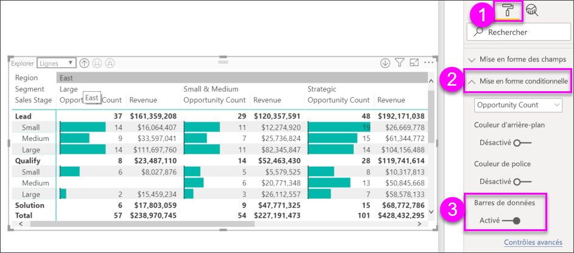

Sélectionnez *Contrôles avancés* pour afficher une boîte de dialogue, ce qui vous permet d’effectuer des ajustements. Cet exemple montre la boîte de dialogue pour **Barres de données**.

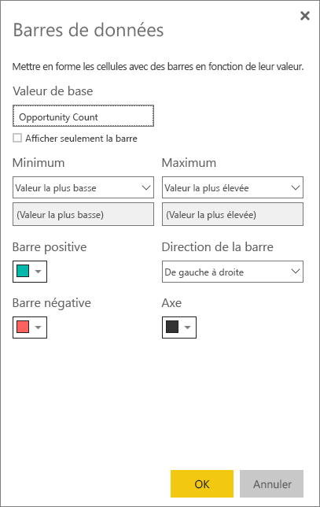

## Considérations et résolution des problèmes

* Si les données texte des en-têtes ou des cellules de votre matrice contiennent des caractères de nouvelle ligne, ces caractères sont ignorés, sauf si vous activez l’option « retour automatique à la ligne » dans la carte de volet de mise en forme associée à l’élément. 

## Étapes suivantes

[Visuel Power Apps pour Power BI](power-bi-visualization-powerapp.md)

[Types de visualisation dans Power BI](power-bi-visualization-types-for-reports-and-q-and-a.md)
