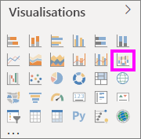

# Création de graphes en ruban dans Power BI

[!INCLUDE[consumer-appliesto-nyyn](../includes/consumer-appliesto-nyyn.md)]    

[!INCLUDE [power-bi-visuals-desktop-banner](../includes/power-bi-visuals-desktop-banner.md)]

Vous pouvez créer des graphes en ruban pour visualiser les données et détecter rapidement la catégorie de données qui occupe le rang le plus élevé (la plus grande valeur). Les graphiques de ruban sont efficaces pour l’affichage de changements de rangs, la plage (valeur) la plus élevée étant toujours affichée en première position pour chaque période de temps. 

> [!NOTE]
> Pour que vous puissiez partager votre rapport avec un collègue Power BI, il faut que vous disposiez tous deux de licences individuelles Power BI Pro ou que le rapport soit enregistré dans une capacité Premium. Consultez [partage des rapports](../collaborate-share/service-share-reports.md).

## Prérequis

Ce tutoriel utilise le [fichier PBIX de l’exemple Analyse de la vente au détail](https://download.microsoft.com/download/9/6/D/96DDC2FF-2568-491D-AAFA-AFDD6F763AE3/Retail%20Analysis%20Sample%20PBIX.pbix).

1. Dans la section supérieure gauche de la barre de menus, sélectionnez **Fichier** > **Ouvrir**.
   
2. Rechercher votre copie du **fichier PBIX de l’exemple Analyse de la vente au détail**

1. Ouvrez le **fichier PBIX de l’exemple Analyse de la vente au détail** dans la vue Rapport .

1. Sélectionner  pour ajouter une nouvelle page.

## Créer un graphique de ruban

1. Pour créer un graphique de ruban, sélectionnez **Graphique de ruban** dans le volet **Visualisations**.

    

    Les graphiques de ruban connectent une catégorie de données sur toute la période visualisée à l’aide des rubans, ce qui permet de voir comment une catégorie donnée se classe tout le long de l’axe X du graphique (généralement la chronologie).

2. Sélectionner des champs pour l’**axe**, la **légende** et la **valeur**.  Dans cet exemple, nous avons utilisé : **Store** > **OpenDate**, **Item** > **Category**, et **Sales** > **This year sales** > **Value**.  

    

    Comme le jeu de données contient des données pour une seule année, nous avons aussi supprimé le champ **Année** et **Trimestre** de l’**axe**.

3. Le graphique de ruban indique le rang pour chaque mois. Notez l’évolution du rang dans le temps. Par exemple, la catégorie Home passe du deuxième au cinquième rang entre février et mars.

    

## Mettre en forme un graphique de ruban
Lorsque vous créez un graphique de ruban, vous avez accès aux options de mise en forme disponibles dans la section **Format** du volet **visualisations**. Les options de mise en forme des graphiques de ruban sont similaires à celles des histogrammes empilés, mais comprennent des options supplémentaires spécifiques des rubans.

Les options suivantes de mise en forme des graphiques de ruban vous permettent d’apporter des ajustements :

* **Espacement** permet d’ajuster l’espace entre les rubans. Le nombre correspond à un pourcentage de la hauteur maximale de la colonne.
* **Faire correspondre la couleur de la série** permet d’assortir la couleur des rubans avec celle de la série. Si cette option est **désactivée**, les rubans sont gris.
* **Transparence** spécifie le degré de transparence des rubans, la valeur par défaut étant définie sur 30.
* **Bordure** permet de placer une bordure sombre en haut et en bas des rubans. Par défaut, les bordures sont désactivées.

Comme le graphique de ruban n’a pas d’étiquettes sur l’axe Y, vous pouvez ajouter des étiquettes de données. Dans le volet Mise en forme, sélectionnez **Étiquettes de données**. 

Définissez les options de mise en forme de vos étiquettes de données. Dans cet exemple, nous avons défini la couleur du texte sur blanc et les unités d’affichage sur les milliers.

## Étapes suivantes

[Nuages de points et graphiques en bulles dans Power BI](power-bi-visualization-scatter.md)

[Types de visualisation dans Power BI](power-bi-visualization-types-for-reports-and-q-and-a.md)
