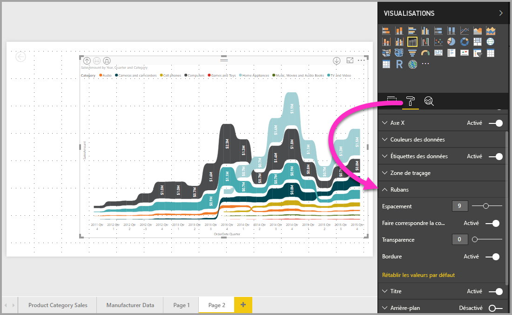

# Utiliser des graphiques de ruban dans Power BI
Vous pouvez utiliser des graphiques de ruban pour visualiser des données et rapidement découvrir la catégorie de données qui a le rang le plus élevé (valeur la plus grande). Les graphiques de ruban sont efficaces pour l’affichage de changements de rangs, la plage (valeur) la plus élevée étant toujours affichée en première position pour chaque période de temps. 

## Créer un graphique de ruban
Pour créer un graphique de ruban, sélectionnez **Graphique de ruban** dans le volet **Visualisations**.

Les graphiques de ruban connectent une catégorie de données sur toute la période visualisée à l’aide des rubans, ce qui permet de voir comment une catégorie donnée se classe tout le long de l’axe X du graphique (généralement la chronologie).

## Mettre en forme un graphique de ruban
Lorsque vous créez un graphique de ruban, vous avez accès aux options de mise en forme disponibles dans la section **Format** du volet **visualisations**. Les options de mise en forme des graphiques de ruban sont similaires à celles des histogrammes empilés, mais comprennent des options supplémentaires spécifiques des rubans.

Les options suivantes de mise en forme des graphiques de ruban vous permettent d’apporter des ajustements :

* **Espacement** permet d’ajuster l’espace entre les rubans. Le nombre correspond à un pourcentage de la hauteur maximale de la colonne.
* **Faire correspondre la couleur de la série** permet d’assortir la couleur des rubans avec celle de la série. Si cette option est **désactivée**, les rubans sont gris.
* **Transparence** spécifie le degré de transparence des rubans, la valeur par défaut étant définie sur 30.
* **Bordure** permet de placer une bordure sombre en haut et en bas des rubans. Par défaut, les bordures sont désactivées.

## Étapes suivantes

[Nuages de points et graphiques en bulles dans Power BI](power-bi-visualization-scatter.md)

[Types de visualisation dans Power BI](power-bi-visualization-types-for-reports-and-q-and-a.md)