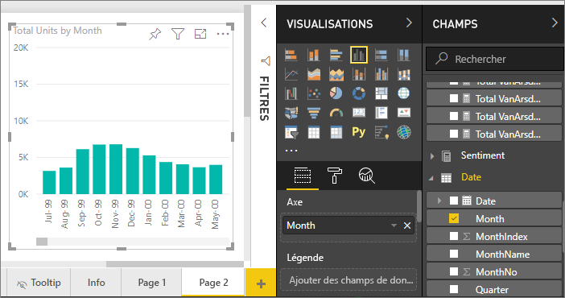
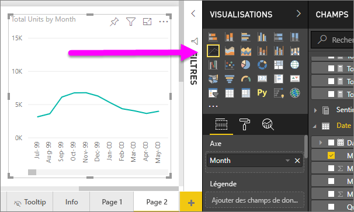
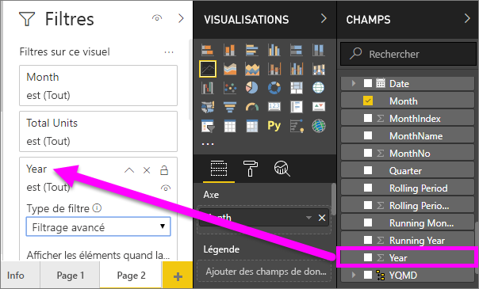
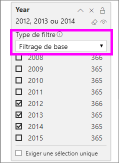
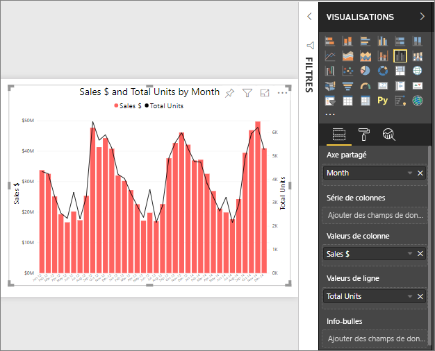
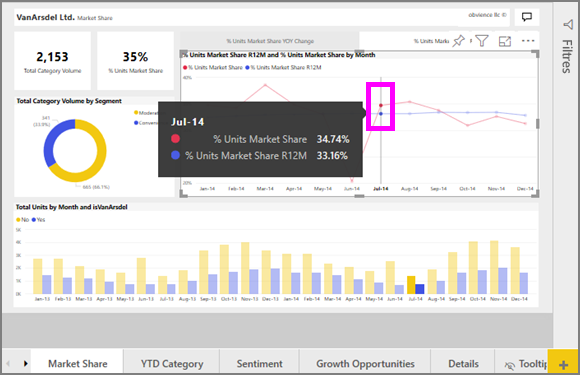

# Graphiques en courbes dans Power BI

[!INCLUDE[consumer-appliesto-nyyn](../includes/consumer-appliesto-nyyn.md)]

Un graphique en courbes est une série de points de données représentés par des points et connectés par des lignes droites. Un graphique en courbes peut avoir une ou plusieurs lignes. Les graphiques en courbes comportent un axe X et un axe Y. 

## Créer un graphique en courbes
Ces instructions utilisent l’app Exemple Vente et marketing pour créer un graphique en courbes qui affiche les ventes de cette année par catégorie. Pour suivre la procédure, obtenez l’exemple d’application à partir de appsource.com.

> [!NOTE]
> Pour que vous puissiez partager votre rapport avec un collègue Power BI, il faut que vous disposiez tous deux de licences individuelles Power BI Pro ou que le rapport soit enregistré dans une capacité Premium.

1. Démarrez sur une page de rapport vierge. Si vous utilisez le service Power BI, veillez à ouvrir le rapport en [mode Édition](../create-reports/service-interact-with-a-report-in-editing-view.md).

2. Dans le volet Champs, sélectionnez **SalesFact** \> **Unités totales** , puis **Date** > **Mois**.  Power BI crée un histogramme sur votre canevas de rapport.

    

4. Convertissez le visuel en graphique en courbes en sélectionnant le modèle Graphique en courbes dans le volet Visualisations. 

    
   

4. Filtrez votre graphique en courbes pour afficher les données des années 2012-2014. Si votre volet Filtres est réduit, développez-le maintenant. Dans le volet Champs, sélectionnez **Date** \> **Année** et faites glisser l’élément vers le volet Filtres. Déposez-le sous le titre **Filtres sur ce visuel**. 
     
    

    Définissez **Filtres avancés** sur **Filtres de base** , puis sélectionnez **2012** , **2013** et **2014**.

    

6. Si vous le souhaitez, [ajustez la taille et la couleur du texte du graphique](power-bi-visualization-customize-title-background-and-legend.md). 

    

## Ajouter des lignes supplémentaires au graphique
Les graphiques en courbes peuvent avoir de nombreuses lignes différentes. Et, dans certains cas, les valeurs sur les lignes peuvent être si divergentes qu’elles ne s’affichent pas bien ensemble. Vous allez maintenant ajouter des lignes supplémentaires à notre graphique et découvrir comment mettre en forme notre graphique lorsque les valeurs représentées par les lignes sont très différentes. 

### Ajouter des lignes supplémentaires
Au lieu d’afficher le nombre total d’unités pour toutes les régions sur une seule ligne dans le graphique, nous allons fractionner le nombre total d’unités par région. Ajoutez des lignes supplémentaires en faisant glisser **Géo** > **Région** vers le puits Légende.

   

### Utiliser deux axes Y
Que se passe-t-il si vous souhaitez afficher le total des ventes et le nombre total d’unités sur le même graphique ? Comme les valeurs des ventes sont beaucoup plus élevées que celle du nombre d’unités, le graphique en courbes est inutilisable. En fait, la ligne rouge du nombre total d’unités semble être égale à zéro.

   

Pour afficher les valeurs très divergentes sur un même graphique, utilisez un graphique combiné. Pour en savoir plus sur les graphiques combinés, lisez [Graphiques combinés dans Power BI](power-bi-visualization-combo-chart.md). Dans notre exemple ci-dessous, nous pouvons afficher les ventes totales et le nombre total d’unités sur un même graphique en ajoutant un second axe Y. 

   

## Mise en surbrillance et filtrage croisé
Pour plus d’informations sur le volet Filtres, consultez [Ajouter un filtre à un rapport](../create-reports/power-bi-report-add-filter.md).

La sélection d’un point de données sur un graphique en courbes entraîne la mise en surbrillance et le filtrage croisé des autres visualisations sur la page du rapport, et vice versa. Pour suivre la procédure, ouvrez l’onglet **Parts de marché**.  

Sur un graphique en courbes, un point de données représente l’intersection d’un point sur les axes X et Y. Lorsque vous sélectionnez un point de données, Power BI ajoute des marqueurs indiquant quel point (pour une seule ligne) ou quels points (s’il y a deux ou plusieurs lignes) constituent la source de la sélection croisée et du filtrage croisé des autres visuels sur la page du rapport. Si votre visuel est très dense, Power BI sélectionnera le point le plus proche de l’endroit où vous cliquez sur le visuel.

Dans cet exemple, nous avons sélectionné un point de données qui comprend : July 2014, %Units Market Share R12 of 33.16 et %Units Market Share of 34.74.

Notez comment l’histogramme est mis en surbrillance croisée et comment le filtrage croisé est appliqué à la jauge.

Pour gérer la mise en surbrillance croisée et le filtrage croisé des tableaux entre eux, consultez [Interactions de visualisation dans un rapport Power BI](../create-reports/service-reports-visual-interactions.md).

## Considérations et résolution des problèmes
* Un graphique en courbes ne peut pas avoir deux axes Y.  Vous aurez besoin pour cela d’un graphique combiné.
* Dans les exemples ci-dessus, les graphiques ont été mis en forme pour augmenter la taille de la police, modifier la couleur de police, ajouter des titres d’axe, centrer le titre du graphique et la légende, démarrer les deux axes à zéro et bien plus encore. Le volet Mise en forme (icône rouleau à peindre) possède un ensemble très complet d’options pour donner à vos graphiques l’apparence que vous souhaitez. La meilleure façon d’apprendre consiste à ouvrir et à explorer le volet Mise en forme.

## Étapes suivantes

[Types de visualisation dans Power BI](power-bi-visualization-types-for-reports-and-q-and-a.md)

