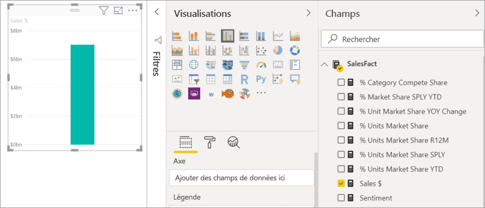
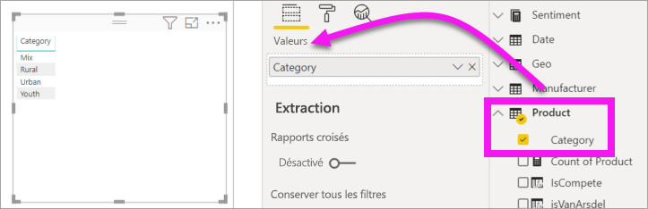
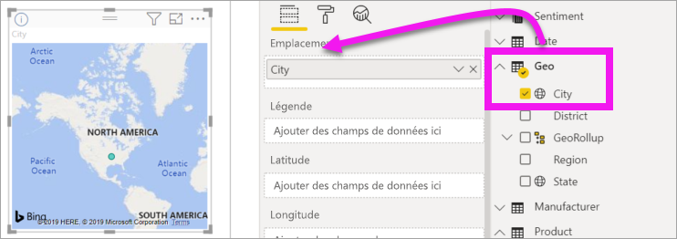
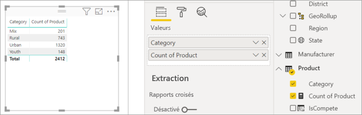
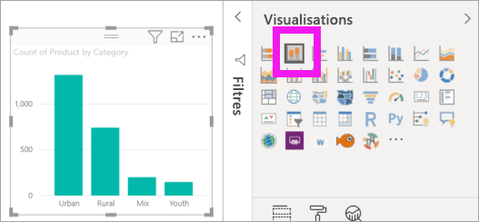
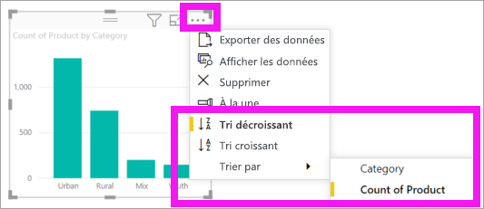

# Ajouter des visuels à un rapport Power BI (partie 1)

[!INCLUDE[consumer-appliesto-nyyn](../includes/consumer-appliesto-nyyn.md)]    

[!INCLUDE [power-bi-visuals-desktop-banner](../includes/power-bi-visuals-desktop-banner.md)]

Cet article explique brièvement comment créer une visualisation dans un rapport. Il s’applique à la fois au service Power BI et à Power BI Desktop. Pour un contenu plus avancé, [consultez la partie 2](power-bi-report-add-visualizations-ii.md) de cette série.

## Prérequis

Ce tutoriel s’appuie sur le [fichier PBIX Vente et marketing](https://download.microsoft.com/download/9/7/6/9767913A-29DB-40CF-8944-9AC2BC940C53/Sales%20and%20Marketing%20Sample%20PBIX.pbix).

1. Dans la section supérieure gauche de la barre de menus Power BI Desktop, sélectionnez **Fichier** > **Ouvrir**
   
2. Recherchez votre copie du **fichier PBIX de l’exemple Vente et marketing**

1. Ouvrez le **fichier PBIX de l’exemple Vente et marketing** dans la vue Rapport .

1. Sélectionner  pour ajouter une nouvelle page.

> [!NOTE]
> Pour que vous puissiez partager votre rapport avec un collègue Power BI, il faut que vous disposiez tous deux de licences individuelles Power BI Pro ou que le rapport soit enregistré dans une capacité Premium. Voir [partage des rapports](../collaborate-share/service-share-reports.md)

## Ajouter des visualisations au rapport

1. Créez une visualisation en sélectionnant un champ dans le volet **Champs**.

    Commencez par un champ numérique comme **Sales** > **TotalSales** (Ventes > TotalVentes). Power BI crée un histogramme avec une seule colonne.

    

    Ou commencez par un champ de catégorie, tel que **Nom** ou **Produit**. Power BI crée une table et ajoute ce champ à la zone **Valeurs**.

    

    Ou, commencez par un champ géographique, tel que **Geo** > **Ville**. Power BI et Bing Cartes créent une visualisation de carte.

    

## Changer le type de visualisation

 Créez une visualisation, puis modifiez son type. 
 
 1. Sélectionnez **Produit** > **Catégorie**, puis **Produit** > **Quantité de produit** pour ajouter ces éléments à la zone **Valeurs**.

    

1. Changez la visualisation en histogramme en sélectionnant l’icône d’**histogramme empilé**.

   

1. Pour changer le mode de tri du visuel, sélectionnez **Autres actions** (...).  Utilisez les options de tri pour changer le sens du tri (croissant ou décroissant) et la colonne sur laquelle s’effectue le tri (**Trier par**).

   
  
## Étapes suivantes

 Passez à :

* [Partie 2 : Ajouter des visualisations à un rapport Power BI](power-bi-report-add-visualizations-ii.md)

* [interagir avec les visualisations](../consumer/end-user-reading-view.md) dans le rapport ;
