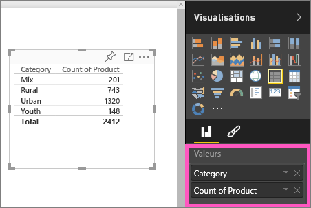
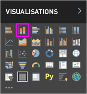
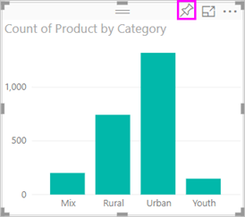

# Partie 1, Ajouter des visualisations à un rapport Power BI

Cet article explique brièvement comment créer une visualisation dans un rapport. Il s’applique à la fois au service Power BI et à Power BI Desktop. Pour un contenu plus avancé, [consultez la partie 2](power-bi-report-add-visualizations-ii.md) de cette série. Regardez Amanda montrer différentes manières de créer, modifier et mettre en forme les visuels sur un canevas de rapport. Essayez ensuite par vous-même d’utiliser l’[exemple Ventes et marketing](../sample-datasets.md) pour créer votre propre rapport.

<iframe width="560" height="315" src="https://www.youtube.com/embed/IkJda4O7oGs" frameborder="0" allowfullscreen></iframe>

## Ouvrir un rapport et ajouter une page vierge

1. Ouvrez un [rapport en Mode Edition](../service-interact-with-a-report-in-editing-view.md).

    Ce didacticiel s’appuie sur l’exemple [Vente et marketing](../sample-datasets.md).

1. Si le volet **Champs** n’est pas visible, sélectionnez l’icône de flèche pour l’ouvrir.

   

1. Ajoutez une page vierge au rapport.

## Ajouter des visualisations au rapport

1. Créez une visualisation en sélectionnant un champ dans le volet **Champs**.

    Commencez par un champ numérique comme **SalesFact** > **Sales $** . Power BI crée un histogramme avec une seule colonne.

    

    Ou commencez par un champ de catégorie, tel que **Nom** ou **Produit**. Power BI crée une table et ajoute ce champ à la zone **Valeurs**.

    

    Ou, commencez par un champ géographique, tel que **Geo** > **Ville**. Power BI et Bing Cartes créent une visualisation de carte.

    

1. Créez une visualisation, puis modifiez son type. Sélectionnez **Produit** > **Catégorie**, puis **Produit** > **Quantité de produit** pour ajouter ces éléments à la zone **Valeurs**.

   

1. Changez la visualisation en histogramme en sélectionnant l’icône d’**histogramme empilé**.

   

1. Quand vous créez des visualisations dans votre rapport, vous pouvez les [épingler à votre tableau de bord](../service-dashboard-pin-tile-from-report.md). Pour épingler la visualisation, sélectionnez l’icône d’épingle .

   
  
## Étapes suivantes

 Passez à :

* [Partie 2 : Ajouter des visualisations à un rapport Power BI](power-bi-report-add-visualizations-ii.md)

* [interagir avec les visualisations](../consumer/end-user-reading-view.md) dans le rapport ;

* [exploiter encore davantage les visualisations](power-bi-report-visualizations.md),

* [enregistrer votre rapport](../service-report-save.md).
