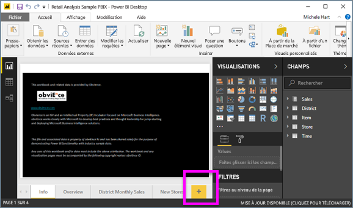
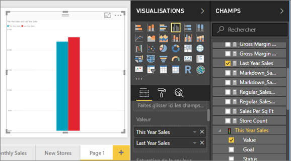
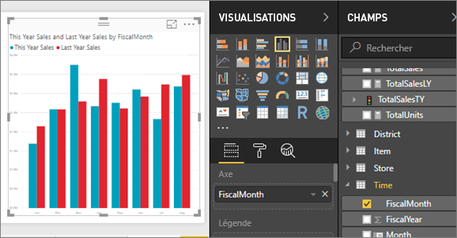
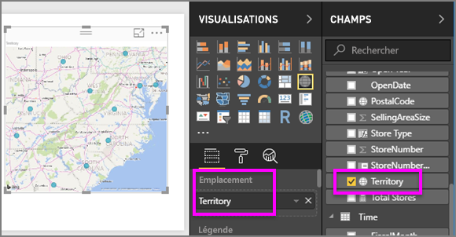
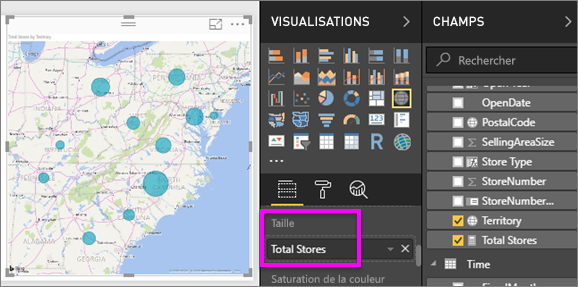
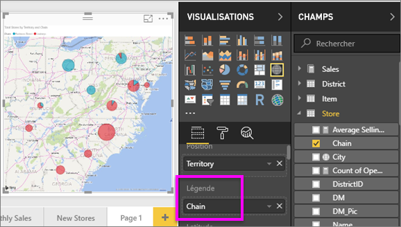

# Partie 2, Ajouter des visualisations à un rapport Power BI
Dans la [partie 1](power-bi-report-add-visualizations-ii.md), vous avez créé une visualisation de base en cochant les cases en regard des noms de champs.  Dans la partie 2, vous allez apprendre à utiliser le glisser-déplacer et tirer pleinement parti des volets **Champs** et **Visualisations** pour créer et modifier des visualisations.

### Conditions préalables
- [Partie 1](power-bi-report-add-visualizations-ii.md)
- Power BI Desktop - Il est possible d’ajouter des visualisations à des rapports à l’aide du service Power BI et de Power BI Desktop. Ce tutoriel utilise Power BI Desktop. 
- [Exemple Analyse de la vente au détail](http://download.microsoft.com/download/9/6/D/96DDC2FF-2568-491D-AAFA-AFDD6F763AE3/Retail%20Analysis%20Sample%20PBIX.pbix)

## Créer une visualisation
Dans ce didacticiel, nous allons explorer notre jeu de données Analyse de vente au détail et créer quelques visualisations clés.

### Ouvrez un rapport et ajoutez une nouvelle page vierge.
1. Ouvrez le fichier .PBIX de l’exemple Analyse de la vente au détail dans Power BI Desktop. 
      

2. Ajoutez une nouvelle page en sélectionnant l’icône représentant un signe « + » de couleur jaune au bas du canevas.

### Ajoutez une visualisation qui compare les ventes de cette année à celles de l’année dernière.
1. Dans la table **Sales** (Ventes), sélectionnez **This Year Sales** (Ventes de cette année) > **Value** (Valeur) **et Last Year Sales** (Ventes de l’année dernière). Power BI crée un histogramme.  Vous trouvez cela intéressant et vous voulez faire une exploration plus approfondie. Qu’en est-il des ventes par mois ?  
   
   
2. À partir de la table de temps, faites glisser **FiscalMonth** dans la zone **Axis**.  
   
3. [Changez la visualisation](power-bi-report-change-visualization-type.md) en graphique en aires.  Vous avez le choix entre plusieurs types de visualisation. Consultez [les descriptions, les bonnes pratiques et les didacticiels](power-bi-visualization-types-for-reports-and-q-and-a.md) liés à chaque type pour déterminer celui à utiliser. Dans le volet Visualisations, sélectionnez l’icône de graphique en aires .
4. Triez la visualisation en sélectionnant les points de suspension, puis en choisissant **Trier par FiscalMonth**.
5. [Redimensionnez la visualisation](power-bi-visualization-move-and-resize.md) en sélectionnant la visualisation, en saisissant l’un des cercles de contour et en le faisant glisser. Élargissez-la suffisamment de façon à éliminer la barre de défilement, mais pas trop de sorte qu’il reste suffisamment de place pour ajouter une autre visualisation.
   
   
6. [Enregistrez le rapport](../service-report-save.md).

### Ajouter une visualisation de type carte géographique qui présente les ventes par magasin
1. Dans la table **Store** (Magasin), sélectionnez **Territory**(Territoire). Power BI reconnaît que Territory correspond à un lieu et crée une visualisation Carte.  
   
2. Faites glisser **Total Stores** (Total des magasins) dans la zone Taille.  
   
3. Ajoutez une légende.  Pour afficher les données par nom de magasin, faites glisser **Chain** (Chaîne) dans la zone Legend (Légende).  
   

## Étapes suivantes
* En savoir plus sur les [visualisations dans les rapports Power BI](power-bi-report-visualizations.md).  
* D’autres questions ? [Posez vos questions à la communauté Power BI](http://community.powerbi.com/)

