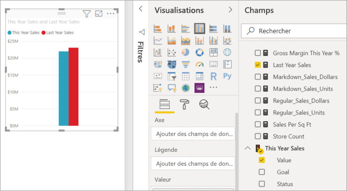
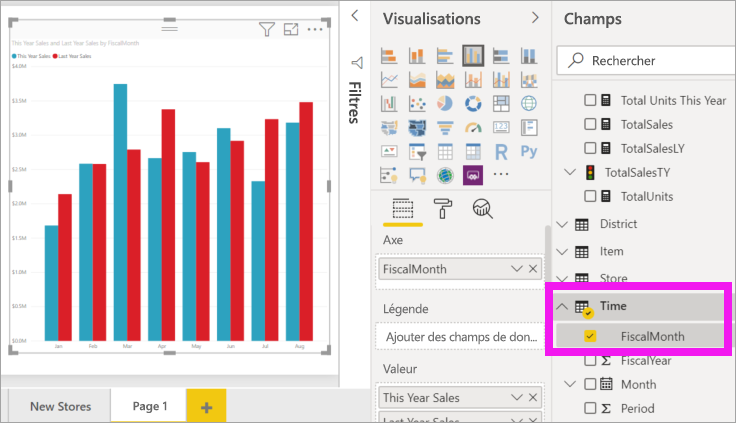
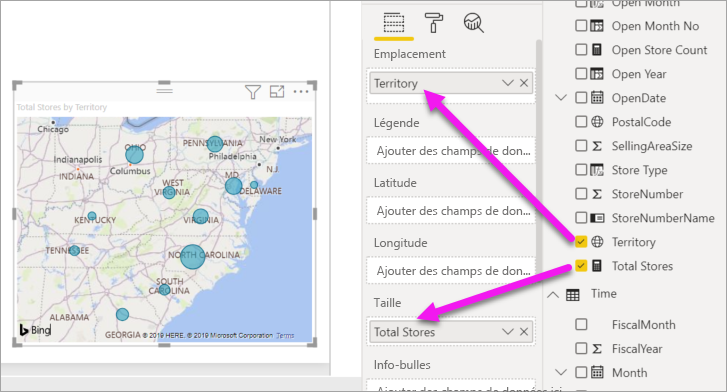
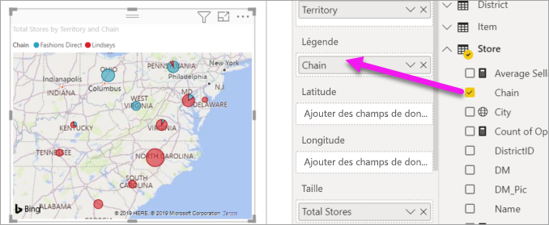

# Partie 2, Ajouter des visualisations à un rapport Power BI

[!INCLUDE [power-bi-visuals-desktop-banner](../includes/power-bi-visuals-desktop-banner.md)]

Dans la [partie 1](power-bi-report-add-visualizations-i.md), vous avez créé une visualisation de base en cochant les cases en regard des noms de champs.  Dans la partie 2, vous allez apprendre à utiliser le glisser-déplacer et tirer pleinement parti des volets **Champs** et **Visualisations** pour créer et modifier des visualisations.

## Créer une visualisation
Dans ce tutoriel, nous allons explorer notre jeu de données Analyse de la vente au détail et créer quelques visualisations clés.

## Conditions préalables

Ce tutoriel utilise le [fichier PBIX de l’exemple Analyse de la vente au détail](https://download.microsoft.com/download/9/6/D/96DDC2FF-2568-491D-AAFA-AFDD6F763AE3/Retail%20Analysis%20Sample%20PBIX.pbix).

1. Dans la section supérieure gauche de la barre de menus Power BI Desktop, sélectionnez **Fichier** > **Ouvrir**
   
2. Rechercher votre copie du **fichier PBIX de l’exemple Analyse de la vente au détail**

1. Ouvrez le **fichier PBIX de l’exemple Analyse de la vente au détail** dans la vue Rapport .

1. Sélectionner  pour ajouter une nouvelle page.

## Ajouter des visualisations au rapport

Créez une visualisation en sélectionnant un champ dans le volet **Champs**. Le type de visualisation créée dépend du type de champ sélectionné. Power BI se base sur le type de données pour déterminer quelle visualisation utiliser pour afficher les résultats. Vous pouvez changer la visualisation utilisée en sélectionnant une autre icône dans le volet Visualisations. N’oubliez pas que les visualisations ne sont pas toutes adaptées pour afficher vos données. Par exemple, les données géographiques ne s’affichent pas correctement dans un graphique en entonnoir ou en courbes. 

### Ajouter un graphique en aires qui compare les ventes de cette année à celles de l’année dernière

1. Dans la table **Sales** (Ventes), sélectionnez **This Year Sales** (Ventes de cette année) > **Value** (Valeur) **et Last Year Sales** (Ventes de l’année dernière). Power BI crée un histogramme.  Ce graphique est intéressant, et vous voulez explorer ses données de manière plus approfondie. Qu’en est-il des ventes par mois ?  
   
   

2. À partir de la table de temps, faites glisser **FiscalMonth** dans la zone **Axis**.  
   

3. [Changez la visualisation](power-bi-report-change-visualization-type.md) en graphique en aires.  Vous avez le choix entre de nombreux types de visualisations. Consultez ces [descriptions, bonnes pratiques et tutoriels](power-bi-visualization-types-for-reports-and-q-and-a.md) pour déterminer quel type utiliser. Dans le volet Visualisations, sélectionnez l’icône de graphique en aires .

4. Triez le contenu de la visualisation en sélectionnant **Autres actions** (...), puis en choisissant **Trier par** >  **FiscalMonth** (MoisFiscal).

5. [Redimensionnez la visualisation](power-bi-visualization-move-and-resize.md) en sélectionnant la visualisation, en saisissant l’un des cercles de contour et en le faisant glisser. Élargissez-la suffisamment de façon à éliminer la barre de défilement, mais pas trop de sorte qu’il reste suffisamment de place pour ajouter une autre visualisation.
   
   
6. [Enregistrez le rapport](../service-report-save.md).

### Ajouter une visualisation de type carte géographique qui présente les ventes par magasin

1. Dans la table **Store** (Magasin), sélectionnez **Territory**(Territoire). Faites glisser **Total Stores** (Total des magasins) dans la zone Taille. Power BI reconnaît que Territory correspond à un lieu et crée une visualisation Carte.  
   

2. Ajoutez une légende.  Pour afficher les données par nom de magasin, faites glisser **Store** > **Chain** (Magasin > Chaîne) vers la zone Légende.  
   

## Étapes suivantes
* En savoir plus sur les [visualisations dans les rapports Power BI](power-bi-report-visualizations.md).  
* D’autres questions ? [Posez vos questions à la communauté Power BI](https://community.powerbi.com/)

