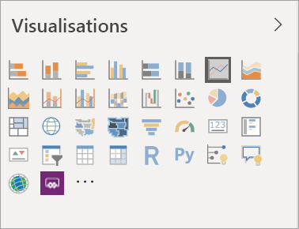
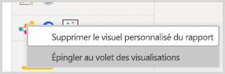
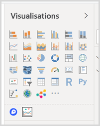

# Visualisations dans des rapports Power BI

Les visualisations (ou visuels pour faire plus court) affichent les insights qui ont été détectés dans les données. Un rapport Power BI peut avoir une seule page avec un visuel unique ou des pages contenant de nombreux visuels. Dans le service Power BI, les visuels peuvent être [épinglés aux tableaux de bord à partir des rapports](../service-dashboard-pin-tile-from-report.md).

Il est important de faire la distinction entre les *concepteurs* et les *consommateurs* de rapports.  Si vous êtes chargé de la création ou de la modification d’un rapport, vous êtes concepteur.  Un concepteur dispose d’autorisations de modification du rapport et de son jeu de données sous-jacent. Dans Power BI Desktop, cela signifie que vous pouvez ouvrir le jeu de données en mode Données et créer des visuels en mode rapport. Dans le service Power BI, cela signifie que vous pouvez ouvrir le jeu de données ou le rapport dans l’éditeur de rapport en [mode Édition](../consumer/end-user-reading-view.md). Si un rapport ou un tableau de bord a été [partagé avec vous](../consumer/end-user-shared-with-me.md), vous en êtes *consommateur*. Vous pouvez alors voir et manipuler le rapport et ses visuels, mais vous ne pouvez pas apporter autant de modifications qu’un *concepteur*.

Il existe de nombreux types de visuels accessibles directement dans le volet Visualisations de Power BI.

Et pour encore plus de choix, visitez le [site de la communauté Microsoft AppSource](https://appsource.microsoft.com) pour rechercher et [télécharger](https://appsource.microsoft.com/marketplace/apps?page=1&product=power-bi-visuals) [des visuels Power BI](../developer/visuals/custom-visual-develop-tutorial.md) fournis par Microsoft et par la communauté.

<iframe width="560" height="315" src="https://www.youtube.com/embed/SYk_gWrtKvM?list=PL1N57mwBHtN0JFoKSR0n-tBkUJHeMP2cP" frameborder="0" allowfullscreen></iframe>

Si vous débutez avec Power BI ou que vous avez besoin d’une remise à niveau, utilisez les liens ci-dessous pour découvrir les principes de base des visualisations de Power BI.  Vous pouvez également utiliser la table des matières (à gauche de cet article) pour trouver d’autres informations utiles.

## Ajouter une visualisation dans Power BI

[Créez des visualisations](power-bi-report-add-visualizations-i.md) dans les pages de vos rapports. Parcourez la [liste des visualisations et des didacticiels de visualisation disponibles](power-bi-visualization-types-for-reports-and-q-and-a.md). 

## Charger une visualisation personnalisée et l’utiliser dans Power BI

Ajoutez une visualisation personnalisée que vous avez créée vous-même ou que vous avez trouvée sur le [site Microsoft AppSource](https://appsource.microsoft.com/marketplace/apps?product=power-bi-visuals). Vous vous sentez créatif ? Explorez notre code source et utilisez nos [outils de développement](../developer/visuals/custom-visual-develop-tutorial.md) pour créer un nouveau type de visualisation et le [partager avec la communauté](../developer/visuals/office-store.md). Pour en savoir plus sur le développement de visuels personnalisés, voir [Développer un visuel personnalisé Power BI](../developer/visuals/custom-visual-develop-tutorial.md).

## Personnaliser votre volet de visualisation (préversion)

Si vous utilisez le même visuel personnalisé dans de nombreux rapports, vous pouvez l’épingler à votre volet de visualisation. Pour cela, cliquez avec le bouton droit sur le visuel pour l’épingler au volet.

Une fois un visuel épinglé, il se retrouve avec les autres visuels intégrés. Ce visuel est maintenant lié à votre compte de connexion. Si vous êtes connecté, les nouveaux rapports que vous générez incluent automatiquement ce visuel. Cela facilite la normalisation d’un visuel particulier sans qu’il soit nécessaire de l’ajouter à chaque rapport.

Cette fonctionnalité étant en préversion, seuls vos visuels épinglés apparaissent dans Power BI Desktop. De plus, vous devez être connecté pour que cette fonctionnalité soit disponible.

## Changer de type de visualisation

Essayez de [changer de type de visualisation](power-bi-report-change-visualization-type.md) pour trouver la visualisation la mieux adaptée à vos données.

## Épingler la visualisation

Dans le service Power BI, quand vous avez trouvé la visualisation qui vous convient, vous pouvez [l’épingler au tableau de bord](../service-dashboard-pin-tile-from-report.md) sous forme de vignette. Si vous modifiez la visualisation utilisée dans le rapport après l’avoir épinglée, la vignette du tableau de bord ne change pas : s’il s’agit d’un graphique en courbes, celui-ci reste ainsi, même si vous l’avez changé en graphique en anneau dans le rapport.

## Considérations et limitations
- La vitesse de chargement d’un visuel varie en fonction de la source de données et du nombre de champs (mesures ou colonnes).  Nous vous recommandons de limiter les visuels à 10-20 champs en tout pour des questions de lisibilité et de performance. 

- La limite supérieure pour les visuels est de 100 champs (mesures ou colonnes). Si le chargement de votre visuel échoue, réduisez le nombre de champs.   

## Étapes suivantes

* [Types de visualisation dans Power BI](power-bi-visualization-types-for-reports-and-q-and-a.md)
* [Visuels Power BI](../developer/visuals/power-bi-custom-visuals.md)
