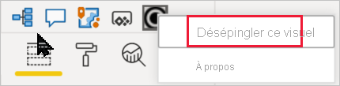

# Visualisations dans des rapports Power BI

[!INCLUDE[consumer-appliesto-yyyn](../includes/consumer-appliesto-yyyn.md)]    

Les visualisations (ou visuels pour faire plus court) affichent les insights qui ont été détectés dans les données. Un rapport Power BI peut avoir une seule page avec un visuel unique ou des pages contenant de nombreux visuels. Dans le service Power BI, les visuels peuvent être [épinglés aux tableaux de bord à partir des rapports](../create-reports/service-dashboard-pin-tile-from-report.md).

Il est important de faire la distinction entre les *concepteurs* et les *consommateurs* de rapports.  Si vous êtes chargé de la création ou de la modification d’un rapport, vous êtes concepteur.  Un concepteur dispose d’autorisations de modification du rapport et de son jeu de données sous-jacent. Dans Power BI Desktop, cela signifie que vous pouvez ouvrir le jeu de données en mode Données et créer des visuels en mode rapport. Dans le service Power BI, cela signifie que vous pouvez ouvrir le jeu de données ou le rapport dans l’éditeur de rapport en [mode Édition](../consumer/end-user-reading-view.md). Si un rapport ou un tableau de bord a été [partagé avec vous](../consumer/end-user-shared-with-me.md), vous en êtes *consommateur*. Vous pouvez alors voir et manipuler le rapport et ses visuels, mais vous ne pouvez pas apporter autant de modifications qu’un *concepteur*.

Il existe de nombreux types de visuels accessibles directement dans le volet Visualisations de Power BI.

D’autres visuels Power BI sont disponibles à partir du [site de la communauté Microsoft AppSource](https://appsource.microsoft.com). Dans AppSource, vous pouvez parcourir et [télécharger](https://appsource.microsoft.com/marketplace/apps?page=1&product=power-bi-visuals) les visuels Power BI fournis par Microsoft et la communauté.

Si vous débutez avec Power BI ou que vous avez besoin d’une remise à niveau, utilisez les liens ci-dessous pour découvrir les principes de base des visualisations de Power BI.  Vous pouvez également utiliser la table des matières (à gauche de cet article) pour trouver d’autres informations utiles.

## Ajouter une visualisation dans Power BI

[Créez des visualisations](power-bi-report-add-visualizations-i.md) dans les pages de vos rapports. Parcourez la [liste des visualisations et des didacticiels de visualisation disponibles](power-bi-visualization-types-for-reports-and-q-and-a.md). 

## Télécharger une visualisation à partir d’un fichier ou d’AppSource

Ajoutez une visualisation que vous avez créée vous-même ou que vous avez trouvée sur le [site Microsoft AppSource](https://appsource.microsoft.com/marketplace/apps?product=power-bi-visuals). Vous vous sentez créatif ? Explorez notre code source et utilisez nos [outils de développement](../developer/visuals/environment-setup.md) pour créer un nouveau type de visualisation et le [partager avec la communauté](../developer/visuals/office-store.md). Pour en savoir plus sur le développement de visuels Power BI, voir [Développer un visuel Power BI](../developer/visuals/develop-circle-card.md).

## Personnaliser votre volet de visualisation

Vous pouvez personnaliser le volet Visualisation en ajoutant et en supprimant des visuels Power BI. Si vous avez supprimé les éléments visuels par défaut du volet Visualisation, vous pouvez restaurer le volet par défaut et rétablir tous les visuels par défaut.

### Ajouter un visuel au volet Visualisation

Si vous utilisez le même visuel dans de nombreux rapports, vous pouvez l’ajouter à votre volet Visualisation. L’ajout de visuels s’applique aux visuels AppSource, aux visuels d’organisation et aux visuels à partir de fichiers. Pour ajouter un visuel, cliquez avec le bouton droit sur le visuel.

Une fois un visuel épinglé, il se retrouve avec les autres visuels par défaut. Ce visuel est maintenant lié à votre compte de connexion. Si vous êtes connecté, les nouveaux rapports que vous générez incluent automatiquement ce visuel. Vous n’avez plus besoin d’ajouter un visuel spécifique que vous utilisez régulièrement à chaque rapport.

### Supprimer un visuel du volet Visualisation

Si vous arrêtez d’utiliser un visuel régulièrement, vous pouvez cliquer dessus avec le bouton droit et le supprimer du volet Visualisation. Tout type de visuel peut être supprimé du volet Visualisation, y compris les visuels par défaut, d’organisation et ceux venant d’un fichier ou d’AppSource.

### Restaurer le volet Visualisation

La restauration du volet Visualisation s’applique uniquement aux visuels par défaut. Les visuels qui ont été ajoutés au volet Visualisation ne sont pas affectés et restent disponibles dans le volet Visualisation. Si vous souhaitez supprimer les visuels AppSource ou venant d’un fichier du volet Visualisation, vous devez le faire manuellement.

Pour restaurer l’état par défaut du volet Visualisation, cliquez sur Autres options, puis sélectionnez **Restaurer les visuels par défaut**.

## Changer de type de visualisation

Essayez de [changer de type de visualisation](power-bi-report-change-visualization-type.md) pour trouver la visualisation la mieux adaptée à vos données.

## Épingler la visualisation

Dans le service Power BI, quand vous avez trouvé la visualisation qui vous convient, vous pouvez [l’épingler au tableau de bord](../create-reports/service-dashboard-pin-tile-from-report.md) sous forme de vignette. Si vous changez de visualisation dans le rapport après l’avoir épinglée, la vignette existante reste la même sur le tableau de bord. S’il s’agit d’un graphique en courbes, il reste un graphique en courbes, même si vous l’avez modifié en graphique en anneau dans le rapport.

## Considérations et limitations
- La vitesse de chargement d’un visuel varie en fonction de la source de données et du nombre de champs (mesures ou colonnes).  Nous vous recommandons de limiter les visuels à 10-20 champs en tout pour des questions de lisibilité et de performance. 

- La limite supérieure pour les visuels est de 100 champs (mesures ou colonnes). Si le chargement de votre visuel échoue, réduisez le nombre de champs.

## Étapes suivantes

* [Types de visualisation dans Power BI](power-bi-visualization-types-for-reports-and-q-and-a.md)
* [Visuels Power BI](../developer/visuals/power-bi-custom-visuals.md)
