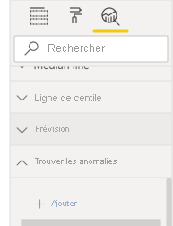

# Détection d’anomalie (préversion)

[!INCLUDE[consumer-appliesto-nyyn](../includes/consumer-appliesto-nyyn.md)]    

La détection d’anomalie vous aide à améliorer vos graphiques en courbes en détectant automatiquement les anomalies dans vos données de série chronologique. Elle fournit aussi des explications sur les anomalies pour faciliter l’analyse de la cause racine.  En quelques clics, vous pouvez facilement trouver des insights sans découper les données. Vous pouvez créer et voir les anomalies à la fois dans Power BI Desktop et dans le service Power BI. Les étapes et les illustrations dans cet article proviennent de Power BI Desktop.

Cette fonctionnalité est en préversion, donc vous devez d’abord activer son commutateur. Accédez à **Fichier** > **Options et paramètres** > **Options** > **Fonctionnalités en préversion**, puis vérifiez que **Détection d’anomalie** est activée :

:::image type="content" source="media/power-bi-visualization-anomaly-detection//preview-feature-switch.png" alt-text="Capture d’écran montrant comment activer le commutateur de la fonctionnalité de détection d’anomalie.":::
 
## Bien démarrer
Ce tutoriel utilise des données de ventes en ligne pour différents produits. Pour suivre ce tutoriel, téléchargez l’[exemple de fichier](https://github.com/microsoft/powerbi-desktop-samples/blob/master/Monthly%20Desktop%20Blog%20Samples/2020/2020SU09%20Blog%20Demo%20-%20September.pbix) d’un scénario de vente en ligne.

Vous pouvez activer la détection d’anomalie en sélectionnant le graphique et en ajoutant l’option « Rechercher les anomalies » dans le volet Analytique. 

 

 Par exemple, ce graphique montre le chiffre d’affaires au fil du temps. L’ajout de la détection d’anomalie enrichit automatiquement le graphique avec les anomalies et la plage de valeurs attendue. Quand une valeur sort de ces limites attendues, elle est marquée comme étant une anomalie. Consultez ce [blog technique](https://techcommunity.microsoft.com/t5/ai-customer-engineering-team/overview-of-sr-cnn-algorithm-in-azure-anomaly-detector/ba-p/982798) pour obtenir plus d’informations sur l’algorithme du détecteur d’anomalies.

 
 
## Mettre en forme les anomalies

Cette expérience est hautement personnalisable. Vous pouvez définir la forme, la taille et la couleur de l’anomalie, ainsi que la couleur, le style et la transparence de la plage attendue. Vous pouvez aussi configurer le paramètre de l’algorithme.  Si vous augmentez la sensibilité, l’algorithme est plus sensible aux modifications dans vos données. Dans ce cas, même un léger écart est marqué comme une anomalie. Si vous diminuez la sensibilité, l’algorithme est plus sélectif sur ce qu’il considère comme une anomalie.

 
 
## Explications
En plus de détecter les anomalies, vous pouvez aussi les expliquer automatiquement. Quand vous sélectionnez une anomalie, Power BI exécute une analyse de tous les champs de votre modèle de données pour déterminer des explications possibles. Une explication de l’anomalie vous est donnée dans un langage naturel, ainsi que les facteurs associés à cette anomalie, triés selon leur force explicative. Ici, je vois que le 30 août, le chiffre d’affaires s’élevait à 5 187 dollars US, ce qui se trouve au-dessus de la plage attendue comprise entre 2 447 et 3 423. Je peux ouvrir les cartes dans ce volet pour voir plus de détails sur l’explication.

 
### Configurer les explications
Vous pouvez également contrôler les champs utilisés pour l’analyse. Par exemple, en faisant glisser le champ du vendeur et celui de la ville dans le champ **Expliquer par**, Power BI limite l’analyse à ces seuls champs. Dans ce cas, l’anomalie du 31 août semble être associée à un vendeur particulier et à des villes particulières. Ici, la force du vendeur « Fabrikam » est de 99 %. Power BI calcule la *force* comme étant le ratio de l’écart par rapport à la valeur attendue, filtré par la dimension de l’écart par rapport à la valeur totale. Par exemple, il s’agit du ratio de la valeur réelle moins la valeur attendue, entre la série chronologique de composant *Fabrikam* et la série chronologique d’agrégat du *chiffre d’affaires global* pour le point d’anomalie. L’ouverture de cette carte présente le visuel avec un pic du revenu pour ce vendeur à la date du 31 août. Utilisez l’option **Ajouter au rapport** pour ajouter cet visuel à la page.

## Limites
- La détection d’anomalie est uniquement prise en charge pour les visuels de graphiques en courbes contenant des données de série chronologique dans le champ Axe.
- La détection d’anomalie n’est pas prise en charge avec des légendes, des valeurs multiples ou des valeurs secondaires dans un visuel de graphique en courbes.
- La détection d’anomalie nécessite au moins 12 points de données.
- Les lignes Prévision/Min/Max/Moyenne/Médiane/Centile ne fonctionnent pas avec la détection d’anomalie.
- La source de données DirectQuery over SAP, Power BI Report Server, la connexion active à Azure Analysis Services et SQL Server Analysis Services ne sont pas pris en charge.
- Les explications sur les anomalies ne fonctionnent pas avec les options « Afficher la valeur comme ».
- L’exploration du niveau suivant dans la hiérarchie n’est pas prise en charge.
